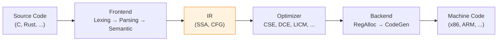
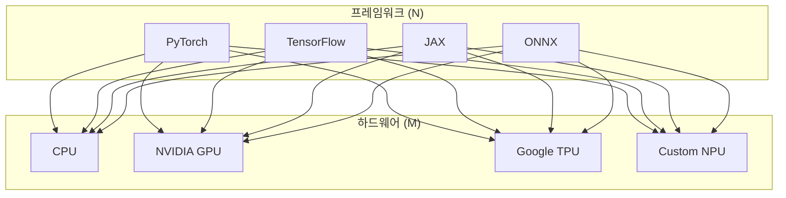
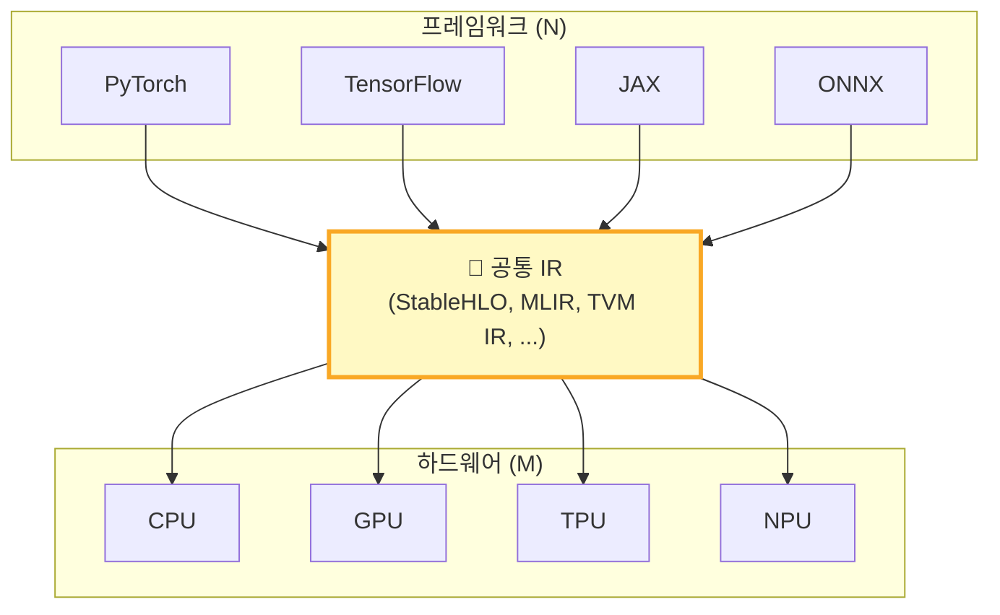

# 1. 컴파일러에서 AI Compiler로

[← 목차](README.md) | [다음 →](02_mlir.md)

---

## 전통 컴파일러 3줄 요약



- **Frontend**: 소스 → 토큰 → AST → 의미 분석
- **IR**: SSA 기반 중간 표현으로 기계 독립 최적화
- **Backend**: 타겟 아키텍처에 맞는 코드 생성, 레지스터 할당

> 여기까지는 다들 아시는 내용 👆

---

## AI 워크로드의 등장

딥러닝은 전통 컴파일러가 만나지 못한 **새로운 특성**을 가진다:

| 특성 | 전통 프로그램 | 딥러닝 워크로드 |
|---|---|---|
| 연산 단위 | 스칼라/벡터 | **텐서** (다차원 배열) |
| 병렬성 | 스레드/SIMD | **대규모 데이터 병렬** |
| 타겟 HW | CPU (+ GPU) | CPU, GPU, **TPU, NPU, ...** |
| 메모리 | 캐시 계층 | SRAM, HBM, **가중치 스트리밍** |
| 최적화 | 루프/분기 중심 | **연산 융합, 타일링, 양자화** |

---

## N × M 문제의 재등장

전통 컴파일러에서 IR로 해결했던 그 문제가 **AI에서 다시 등장**한다.



**N개 프레임워크 × M개 하드웨어 = N×M개 최적화 경로** 😱

---

## 해결: AI Compiler와 공통 IR



**N + M개의 변환만 작성하면 된다!**

---

## 전통 컴파일러(LLVM IR)의 한계

LLVM IR은 훌륭하지만, AI 워크로드에는 부족하다:

```
// PyTorch: torch.matmul(A, B)
// ↓ LLVM IR로 내리면...

for i in 0..M:
  for j in 0..N:
    for k in 0..K:
      C[i][j] += A[i][k] * B[k][j]   ; ← 그냥 스칼라 루프
```

**문제**: "이것이 행렬 곱셈이다"라는 고수준 정보가 완전히 사라짐
- 텐서 구조, 연산 의미, fusion 기회 → 모두 소실
- 도메인 특화 하드웨어가 활용할 수 없음

> 이 문제를 해결하기 위해 **MLIR**이 등장한다.

---

[← 목차](README.md) | [다음: MLIR →](02_mlir.md)
