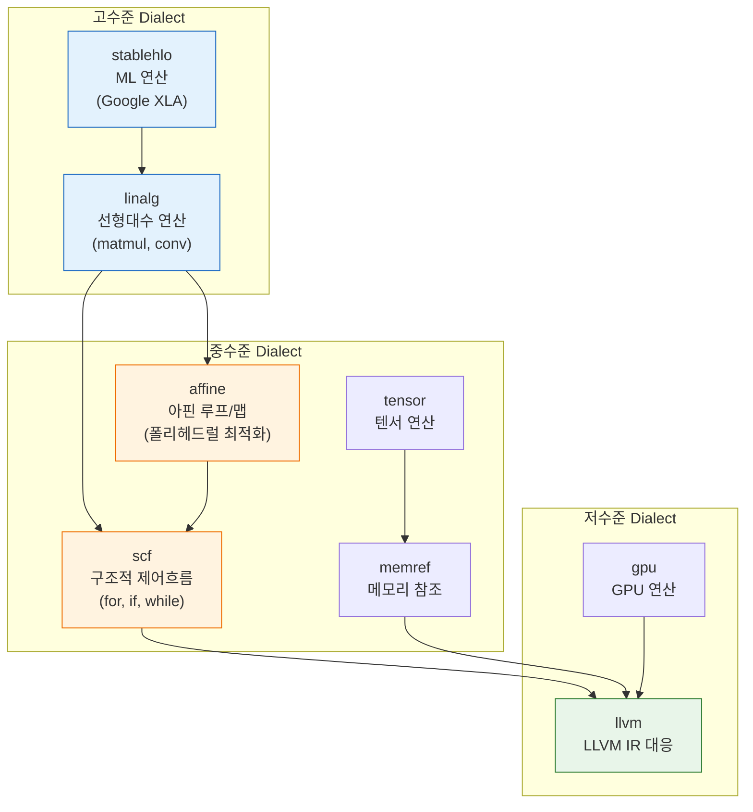
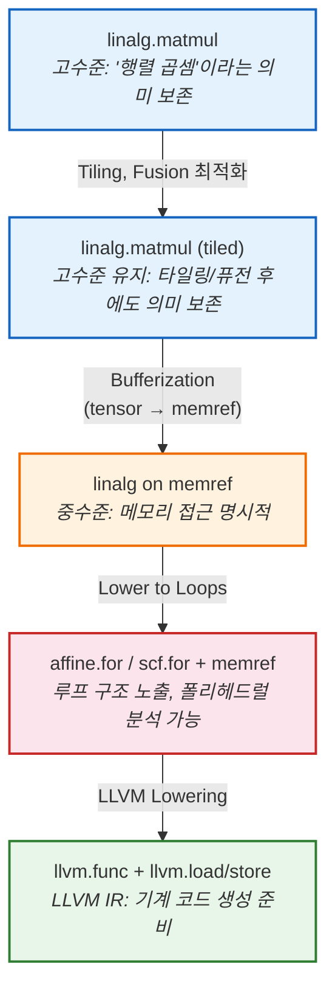
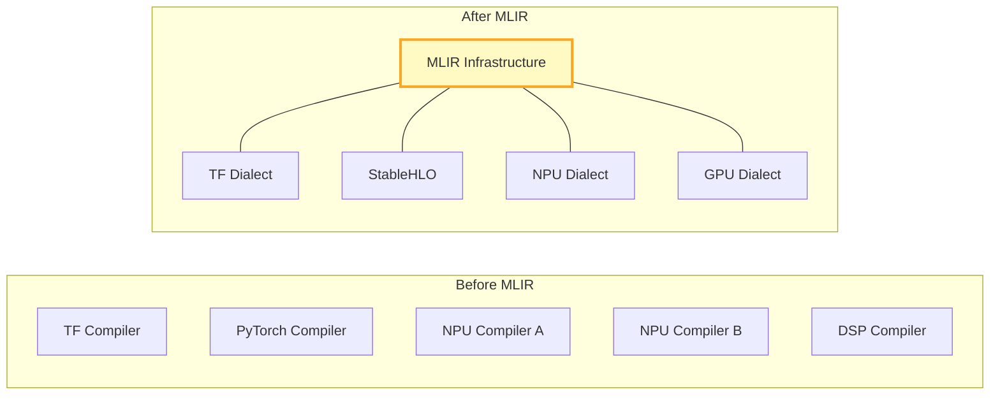

# 2. MLIR — AI Compiler의 게임 체인저

[← 이전](01_from_compiler_to_ai_compiler.md) | [목차](README.md) | [다음 →](03_ai_compiler_tools.md)

---

## MLIR이란?

**Multi-Level Intermediate Representation** — 여러 추상화 수준의 IR을 **하나의 프레임워크**에서 정의하고 변환하는 컴파일러 인프라.

- 2019년 Chris Lattner(LLVM 창시자)가 Google에서 제안
- 현재 LLVM 프로젝트의 일부로 오픈소스

### 핵심 아이디어

> LLVM이 "하나의 IR"로 모든 것을 표현하려 했다면,  
> MLIR은 **"여러 레벨의 IR"을 자유롭게 정의하고 연결**한다.

---

## Dialect 시스템

MLIR의 핵심은 **Dialect** — 도메인별 Operation, Type, Attribute의 네임스페이스.



**누구나 자신의 Dialect을 정의할 수 있다** — NPU, DSP, 커스텀 가속기 모두 가능.

---

## Progressive Lowering

MLIR의 철학: 한 번에 내리지 않고, **단계적으로 추상화를 낮춘다.**



### 각 레벨에서 할 수 있는 최적화

| 레벨 | 할 수 있는 것 | 예시 |
|---|---|---|
| **linalg (tensor)** | 연산 융합, 타일링 전략 | Conv + ReLU 합치기 |
| **linalg (memref)** | 버퍼 재사용, 메모리 계획 | in-place 연산, 할당 최소화 |
| **affine/scf** | 폴리헤드럴 분석, 루프 변환 | 루프 교환, 타일링, Skewing |
| **llvm** | 레지스터 할당, 명령어 선택 | SIMD 명령어 매핑 |

> **"유리잔을 깨면 다시 못 붙인다"**  
> 일단 낮은 레벨로 내리면 고수준 정보를 복원할 수 없다.  
> 각 레벨에서 할 수 있는 최적화를 **내리기 전에** 수행하는 것이 핵심.

---

## 실제 IR 비교

### LLVM IR에서의 행렬 곱셈

```llvm
; "행렬 곱셈"이라는 정보는 이미 사라짐
define void @matmul(ptr %A, ptr %B, ptr %C) {
entry:
  br label %for.i
for.i:
  %i = phi i64 [0, %entry], [%i.next, %for.k.end]
  br label %for.j
for.j:
  %j = phi i64 [0, %for.i], [%j.next, %for.k.end]
  br label %for.k
for.k:              ; ← 그냥 3중 루프
  %k = phi i64 [0, %for.j], [%k.next, %for.k]
  ; load, multiply, add, store ...
```

### MLIR linalg에서의 행렬 곱셈

```mlir
// "행렬 곱셈"이라는 의미가 살아있음!
%C = linalg.matmul 
    ins(%A, %B : tensor<128x256xf32>, tensor<256x64xf32>)
    outs(%C_init : tensor<128x64xf32>) -> tensor<128x64xf32>
```

**한 줄**에 연산의 의미, 텐서 shape, 타입이 모두 담겨있다.

---

## MLIR이 가져온 변화



| Before | After |
|---|---|
| 각 도메인마다 컴파일러를 처음부터 구축 | **공통 인프라** 위에 Dialect만 추가 |
| Pass/분석 도구 중복 개발 | CSE, DCE, Canonicalize 등 **재사용** |
| 프레임워크 간 호환 불가 | Dialect 간 **점진적 변환**으로 연결 |

---

[← 이전](01_from_compiler_to_ai_compiler.md) | [목차](README.md) | [다음: AI Compiler 도구들 →](03_ai_compiler_tools.md)
