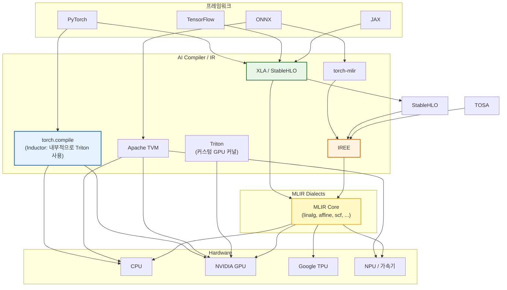
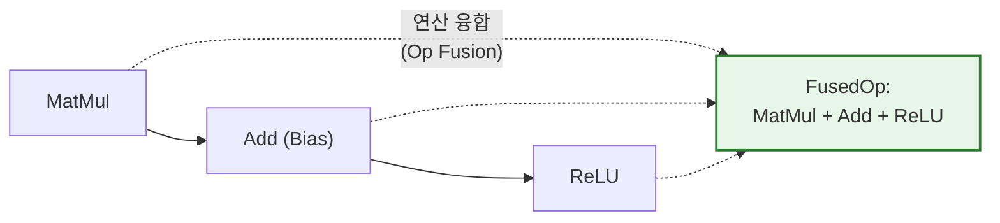

# 3. 주요 AI Compiler 도구들

[← 이전](02_mlir.md) | [목차](README.md) | [다음 →](04_torch_compile_deep_dive.md)

---

## 생태계 전체 그림



---

## 1. JAX — 컴파일러 친화적 ML 프레임워크

**Google의 고성능 수치 계산 라이브러리** — NumPy API + 자동 미분 + XLA 컴파일.

### PyTorch vs JAX 철학

| | PyTorch | JAX |
|---|---|---|
| 패러다임 | 객체 지향 (`nn.Module`) | **함수형** (순수 함수) |
| 그래프 | 동적 (Eager) | **함수 변환** (jit, grad, vmap) |
| 컴파일 | opt-in (`torch.compile`) | **기본 내장** (`jax.jit`) |
| 부작용 | 허용 | **금지** (순수 함수 강제) |
| 강점 | 유연함, 생태계 | **컴파일러 최적화, 자동 병렬화** |

### 핵심: 함수 변환(Function Transformations)

```python
import jax
import jax.numpy as jnp

def f(x):
    return jnp.sin(x) ** 2

jax.grad(f)(3.0)          # 자동 미분
jax.jit(f)(3.0)           # XLA 컴파일
jax.vmap(f)(jnp.ones(10)) # 자동 벡터화 (배치 처리)
jax.pmap(f)(...)          # 자동 다중 디바이스 병렬화
```

- `jit`: 함수를 XLA로 컴파일 → **연산 융합, 메모리 최적화** 자동 적용
- `grad`: 임의 Python 함수에 대한 자동 미분
- `vmap`: for 루프 없이 배치 차원 자동 추가
- `pmap`: 다중 GPU/TPU 자동 분산

### 왜 JAX가 AI Compiler와 잘 맞는가


- 순수 함수 강제 → **Graph Break가 원천적으로 없음** (torch.compile과의 차이)
- 전체 계산 그래프를 XLA에 넘길 수 있어 최적화 기회가 극대화됨
- Google TPU에서 사실상 유일한 1급 지원 프레임워크
- DeepMind(AlphaFold, Gemini)에서 핵심 프레임워크로 사용

---

## 2. XLA / StableHLO

**Google의 ML 컴파일러** — TensorFlow, JAX의 기본 백엔드.

### 핵심 개념
- **HLO (High Level Optimizer)**: Google 내부 IR
- **StableHLO**: HLO를 표준화한 오픈소스 MLIR Dialect

### 주요 최적화



- **연산 융합 (Op Fusion)**: 여러 연산을 하나의 커널로 합쳐 메모리 왕복 제거
- **레이아웃 할당**: 하드웨어에 최적인 텐서 메모리 레이아웃 자동 결정
- **자동 샤딩**: 다중 디바이스 분산 자동화

### 사용 예시

```python
# JAX — XLA가 자동으로 최적화
import jax.numpy as jnp

@jax.jit    # ← XLA 컴파일 트리거
def forward(x, w):
    return jnp.relu(x @ w)
```

---

## 3. torch.compile (PyTorch 2.0+)

**PyTorch의 네이티브 컴파일러** — 동적 그래프의 유연성 + 정적 최적화의 성능.

> 다음 장에서 깊이 다룹니다 → [torch.compile 깊이 보기](04_torch_compile_deep_dive.md)

```python
import torch

model = MyModel()
compiled = torch.compile(model)  # ← 이 한 줄로 컴파일
output = compiled(input)         # 1.5~3x 빨라짐
```

---

## 4. Apache TVM

**자동 최적화 AI 컴파일러** — 다양한 하드웨어에 대한 성능을 **자동 탐색**.

### 핵심: Auto-Tuning


- **스케줄 공간 탐색**: 타일 크기, 루프 순서, 병렬화 전략의 조합을 자동 탐색
- **Hardware-Agnostic**: CPU, GPU, NPU 등 새로운 하드웨어에도 적용 가능
- **장점**: 사람이 수작업으로 최적화하기 어려운 조합을 기계가 찾아줌
- **단점**: 튜닝 시간이 오래 걸릴 수 있음 (수 시간~수일)

---

## 5. Triton

**Python으로 GPU 커널을 작성**하는 언어/컴파일러. OpenAI가 개발.

### CUDA vs Triton

```python
# CUDA (C++) — 수백 줄의 코드가 필요
__global__ void matmul_kernel(float* A, float* B, float* C, 
                               int M, int N, int K) {
    // shared memory 선언
    // 타일 로드
    // 동기화
    // 누적 연산
    // 결과 저장
    // ... 200+ lines
}
```

```python
# Triton (Python) — 핵심만 간결하게
@triton.jit
def matmul_kernel(A, B, C, M, N, K, BLOCK_M: tl.constexpr, ...):
    pid = tl.program_id(0)
    
    # 타일 단위로 로드 & 연산
    a = tl.load(A + offsets_a)
    b = tl.load(B + offsets_b)
    c = tl.dot(a, b)            # ← 타일 단위 행렬 곱
    
    tl.store(C + offsets_c, c)
```

### 왜 Triton인가?

| | CUDA | Triton |
|---|---|---|
| 언어 | C++ | **Python** |
| 추상화 | 스레드 단위 | **타일(블록) 단위** |
| 메모리 관리 | 수동 (shared mem, bank conflict) | **자동** |
| 성능 | 전문가가 튜닝하면 최고 | 자동으로 **CUDA의 90%+** |
| 생산성 | 낮음 | **높음** |

> torch.compile의 Inductor 백엔드가 **Triton 코드를 자동 생성**한다.

---

## 6. IREE

**MLIR 기반 End-to-End 컴파일러** — 모바일/Edge 디바이스에 강점.


- **HAL (Hardware Abstraction Layer)**: 하드웨어별 차이를 추상화
- **경량 런타임**: 모바일/임베디드에서 실행 가능
- **MLIR 기반**: 커스텀 하드웨어 백엔드 추가 용이

---

## 도구 비교 요약

| 도구 | 주요 사용처 | IR 기반 | 핵심 강점 |
|---|---|---|---|
| **JAX** | 연구, TPU | XLA (StableHLO) | 함수 변환, Graph Break 없음 |
| **XLA/StableHLO** | TF, JAX | MLIR (StableHLO) | 연산 융합, 자동 샤딩 |
| **torch.compile** | PyTorch | FX Graph → Triton/C++ | 기존 코드 변경 최소, 범용적 |
| **TVM** | ONNX, 다양한 HW | Relay → TIR | Auto-tuning, HW-agnostic |
| **Triton** | GPU 커스텀 커널 | MLIR 기반 | Python으로 고성능 GPU 커널 |
| **IREE** | Edge/모바일 | MLIR (다중 Dialect) | 경량 런타임, HAL 추상화 |

---

[← 이전](02_mlir.md) | [목차](README.md) | [다음: torch.compile 깊이 보기 →](04_torch_compile_deep_dive.md)
