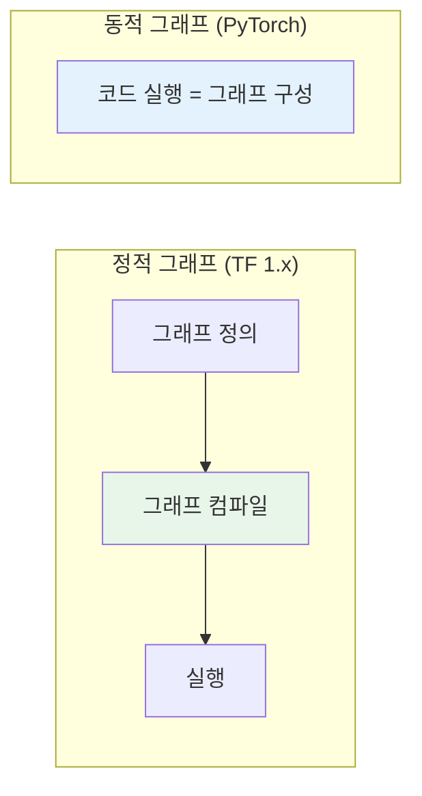
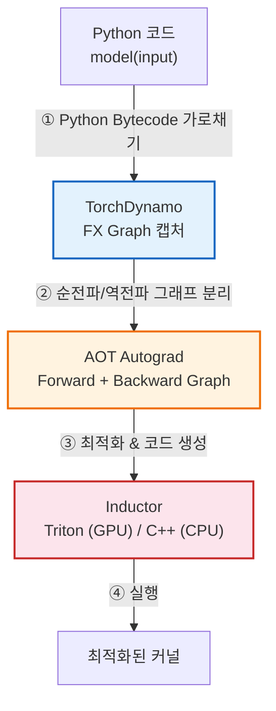
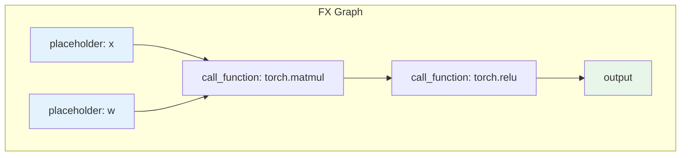
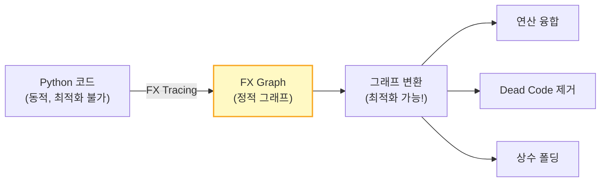
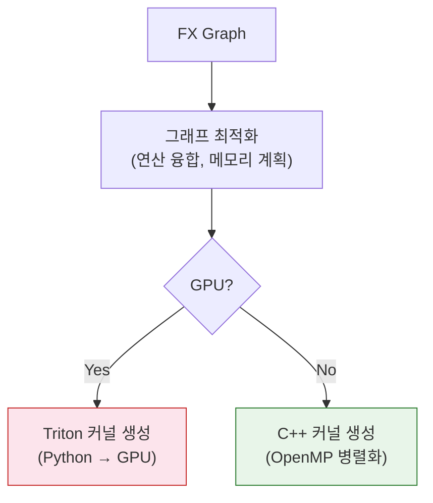

# 4. torch.compile 깊이 보기

[← 이전](03_ai_compiler_tools.md) | [목차](README.md) | [다음 →](05_summary.md)

---

## 배경: 정적 그래프 vs 동적 그래프



| | 정적 그래프 | 동적 그래프 |
|---|---|---|
| 대표 | TensorFlow 1.x | PyTorch |
| 장점 | **전체 최적화** 가능 | **디버깅 쉬움**, Pythonic |
| 단점 | 디버깅 어려움 | 최적화 기회 제한 |

### torch.compile의 목표

> **동적 그래프의 유연성 + 정적 그래프의 성능**  
> "코드 한 줄도 안 바꾸고 1.5~3배 빠르게"

---

## torch.compile 파이프라인



---

### ① TorchDynamo — 그래프 캡처

Python bytecode를 **실행 중에 가로채서** FX Graph를 추출한다.

```python
# 원본 Python 코드
def fn(x, w):
    y = torch.matmul(x, w)
    if y.sum() > 0:      # ← 동적 조건!
        return y.relu()
    return y.sigmoid()
```

```
# TorchDynamo가 캡처한 FX Graph
graph():
    %x = placeholder
    %w = placeholder
    %matmul = call_function[torch.matmul](%x, %w)
    %sum = call_method[sum](%matmul)
    # → 여기서 Graph Break!
```

> **동적 제어흐름(if문)을 만나면 그래프를 분할** (Graph Break)  
> → 각 조각을 독립적으로 컴파일

---

### FX Graph란?

**torch.fx** — PyTorch 모델을 **Python 레벨에서 캡처한 계산 그래프**.



```python
# FX Graph를 직접 확인하는 방법
import torch.fx

def fn(x, w):
    return torch.relu(torch.matmul(x, w))

traced = torch.fx.symbolic_trace(fn)
traced.graph.print_tabular()
```

```
opcode         name    target              args
-------------- ------- ------------------- --------
placeholder    x       x                   ()
placeholder    w       w                   ()
call_function  matmul  torch.matmul        (x, w)
call_function  relu    torch.relu          (matmul,)
output         output  output              (relu,)
```

### FX Graph의 6가지 노드 타입

| 노드 타입 | 역할 | 예시 |
|---|---|---|
| `placeholder` | 입력 파라미터 | 함수 인자 `x`, `w` |
| `get_attr` | 모듈 속성 접근 | `self.weight`, `self.bias` |
| `call_function` | 함수 호출 | `torch.matmul`, `torch.relu` |
| `call_method` | 메서드 호출 | `x.sum()`, `x.view()` |
| `call_module` | 서브모듈 호출 | `self.linear(x)` |
| `output` | 반환값 | 최종 결과 |

### FX Graph가 중요한 이유



- Python 코드를 **분석/변환 가능한 정적 그래프**로 변환
- 컴파일러가 이 그래프 위에서 **패턴 매칭, 연산 융합, 메모리 계획** 등을 수행
- MLIR의 Operation 그래프와 유사한 역할 — torch.compile의 "IR"에 해당
- TorchDynamo는 FX Graph를 캡처하고, Inductor는 FX Graph를 소비하여 코드를 생성

### torch.fx vs torch.export

| | `torch.fx.symbolic_trace` | `torch.export` |
|---|---|---|
| 방식 | Python 수준 symbolic 추적 | TorchDynamo 기반 캡처 |
| 동적 제어흐름 | 지원 불가 | **Graph Break**로 처리 |
| Shape | 정적 shape만 | **동적 shape** 지원 |
| 용도 | 단순 모델 분석/변환 | **프로덕션 배포, 컴파일** |
| torch.compile | 사용 안 함 | **내부적으로 사용** |

> `torch.compile`은 내부적으로 TorchDynamo가 `torch.export` 방식으로 FX Graph를 캡처한다.

---

### ② AOT Autograd — 자동 미분 그래프 생성


- 컴파일 타임에 순전파/역전파 그래프를 **미리 분리**
- 역전파도 컴파일 최적화 대상이 됨 (기존에는 Python 오버헤드)

---

### ③ Inductor — 코드 생성

캡처된 그래프를 실제 **실행 가능한 최적화 코드**로 변환한다.



**Inductor가 하는 일:**
- 연산 융합 (Pointwise ops → 하나의 커널)
- 메모리 레이아웃 최적화
- GPU: **Triton 코드 자동 생성**
- CPU: C++/OpenMP 코드 생성

---

### Graph Break — 핵심 개념


**Graph Break가 발생하는 경우:**
- `print()`, `logging` 등 Python side-effect
- 동적 제어흐름 (`if tensor.item() > 0`)
- 미지원 Python 기능 (`eval`, `exec`)
- 외부 라이브러리 호출

**실전 팁:**
- Graph Break가 적을수록 성능 좋음
- `torch._dynamo.explain(model, input)`으로 Break 지점 진단
- `TORCH_LOGS="graph_breaks"` 환경변수로 로깅

---

## 실전 사용법

```python
import torch

# 1. 기본 사용 — 이것만으로 충분
model = torch.compile(model)

# 2. 모드 선택
model = torch.compile(model, mode="reduce-overhead")  # 작은 모델 최적화
model = torch.compile(model, mode="max-autotune")      # 최대 성능 (느린 컴파일)

# 3. 특정 함수만 컴파일
@torch.compile
def custom_loss(pred, target):
    return F.cross_entropy(pred, target) + 0.1 * pred.norm()
```

### 성능 예시 (일반적인 벤치마크)

| 모델 | Eager (기준) | torch.compile |
|---|---|---|
| ResNet-50 | 1.0x | **~1.5x** |
| BERT | 1.0x | **~1.8x** |
| GPT-2 | 1.0x | **~2.0x** |
| Stable Diffusion | 1.0x | **~2.5x** |

---

[← 이전](03_ai_compiler_tools.md) | [목차](README.md) | [다음: 정리 →](05_summary.md)
