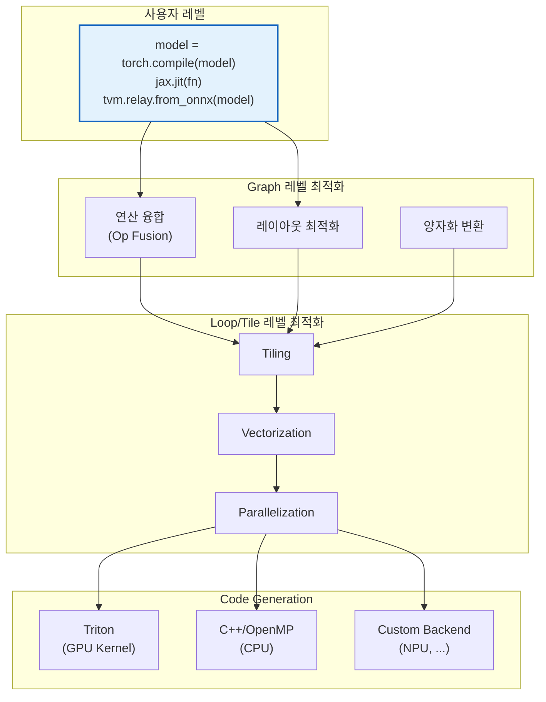

# 5. 정리 및 Q&A

[← 이전](04_torch_compile_deep_dive.md) | [목차](README.md)

---

## AI Compiler 생태계 한눈에 보기



---

## 핵심 요약

### 1. 왜 AI Compiler인가
- N개 프레임워크 × M개 하드웨어 → **공통 IR**로 N+M 문제로 축소
- LLVM IR은 너무 저수준 → **고수준 정보(텐서, 연산 의미) 보존** 필요

### 2. MLIR이 바꾼 것
- **Dialect 시스템**: 도메인별 IR을 자유롭게 정의
- **Progressive Lowering**: 각 추상화 레벨에서 최적의 최적화
- **재사용 가능한 인프라**: Pass, Pattern, 분석 도구 공유

### 3. 실전 도구 선택 가이드

```
PyTorch 사용자라면?
 → torch.compile (가장 쉬움, 코드 변경 없음)

JAX / TensorFlow 사용자라면?
 → XLA가 이미 내장됨 (jax.jit)

다양한 HW에 배포해야 한다면?
 → TVM (Auto-tuning으로 HW별 최적화)

GPU 커스텀 커널이 필요하다면?
 → Triton (Python으로 CUDA급 성능)

Edge/모바일 배포라면?
 → IREE (경량 런타임, MLIR 기반)

커스텀 NPU/가속기라면?
 → MLIR 직접 활용 (커스텀 Dialect 정의)
```

---

## 더 알아보기

| 주제 | 자료 |
|---|---|
| MLIR 공식 | [mlir.llvm.org](https://mlir.llvm.org) |
| torch.compile 튜토리얼 | [pytorch.org/tutorials](https://pytorch.org/tutorials/intermediate/torch_compile_tutorial.html) |
| Triton 공식 | [triton-lang.org](https://triton-lang.org) |
| TVM 공식 | [tvm.apache.org](https://tvm.apache.org) |
| IREE 공식 | [iree.dev](https://iree.dev) |
| StableHLO spec | [openxla/stablehlo](https://github.com/openxla/stablehlo) |

---

## Q&A

---

[← 이전](04_torch_compile_deep_dive.md) | [목차](README.md)
