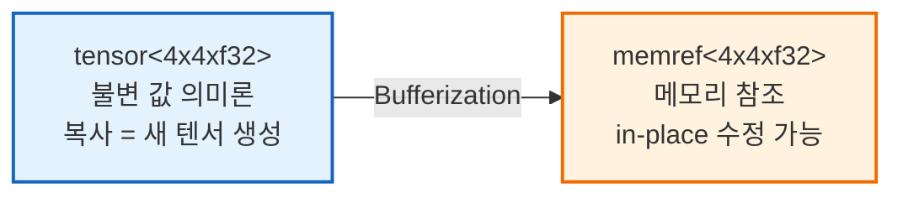
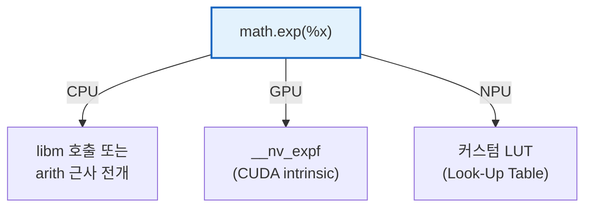

# Appendix A: MLIR 주요 Dialect 소개

[← 정리](05_summary.md) | [목차](README.md) | [다음: Appendix B →](07_appendix_b_mlir_builtin.md)

---

## A.1 Affine Dialect

### 철학

> **루프와 메모리 접근을 수학적으로 표현**하여, 폴리헤드럴 분석/최적화를 가능하게 한다.

- 루프 경계와 인덱스가 **아핀 함수**(선형 + 상수)로 표현되어야 한다는 제약
- 이 제약 덕분에 **컴파일러가 루프 구조를 정확하게 분석**할 수 있음
- 폴리헤드럴 모델의 현대적 MLIR 구현 → [Appendix D](09_appendix_d_polyhedral.md) 참조

```
아핀 함수: f(i, j) = 2*i + j + 3   ← 허용
비아핀:    f(i, j) = i * j          ← 불허 (변수 × 변수)
```

### 주요 Ops

| Op | 설명 | 예시 |
|---|---|---|
| `affine.for` | 아핀 경계를 가진 루프 | `affine.for %i = 0 to 128 step 1` |
| `affine.if` | 아핀 조건 분기 | `affine.if affine_set<(d0) : (d0 - 10 >= 0)>(%i)` |
| `affine.load` | 아핀 인덱스로 메모리 읽기 | `affine.load %buf[%i, %j + 1]` |
| `affine.store` | 아핀 인덱스로 메모리 쓰기 | `affine.store %val, %buf[%i, %j]` |
| `affine.apply` | 아핀 맵 계산 | `affine.apply affine_map<(d0) -> (d0 * 2)>(%i)` |
| `affine.min` / `affine.max` | 아핀 식의 최소/최대 | 타일 경계 처리에 활용 |
| `affine.parallel` | 병렬 아핀 루프 | `affine.parallel (%i) = (0) to (128)` |

### 주요 Pass

| Pass | 설명 |
|---|---|
| `affine-loop-fusion` | 인접한 affine.for 루프를 합쳐 데이터 지역성 향상 |
| `affine-loop-tile` | 루프를 타일 단위로 분할 (캐시 최적화) |
| `affine-loop-unroll` | 루프 본문을 펼쳐 루프 오버헤드 감소 |
| `affine-loop-unroll-and-jam` | 외부 루프 언롤 + 내부 루프 합체 |
| `affine-loop-coalescing` | 다중 중첩 루프를 1차원으로 평탄화 |
| `affine-loop-interchange` | 루프 순서를 교환 (메모리 접근 패턴 최적화) |
| `affine-scalrep` | 반복적으로 로드되는 값을 스칼라 레지스터로 승격 |
| `affine-data-copy-generate` | 데이터를 빠른 메모리로 복사하는 코드 자동 생성 |
| `affine-loop-normalize` | 루프 시작을 0, step을 1로 정규화 |

### 핵심 기능: Affine Map

```mlir
// Affine Map — 인덱스 변환을 선언적으로 표현
#map = affine_map<(d0, d1) -> (d0 * 128 + d1)>  // 2D → 1D 선형화
#tile = affine_map<(d0) -> (d0 floordiv 32)>      // 타일 인덱스 계산
```

- `affine_map`으로 인덱스 변환을 **선언적으로** 표현
- 컴파일러가 맵을 분석하여 의존성, 병렬성, 메모리 접근 패턴을 **자동 추론**

---

## A.2 SCF (Structured Control Flow) Dialect

### 철학

> 일반적인 제어 흐름(for, if, while)을 **구조화된 형태**로 표현한다.  
> affine보다 제약이 적어 범용적이지만, 그만큼 컴파일러 분석 능력도 제한된다.

### affine vs scf

| | `affine.for` | `scf.for` |
|---|---|---|
| 경계 제약 | **아핀 함수만** 허용 | 임의의 값 허용 |
| 분석 가능성 | 폴리헤드럴 분석 가능 | 제한적 |
| 최적화 Pass | 풍부 (tile, fuse, interchange, ...) | 기본적 |
| 사용 시점 | 정적 루프 경계가 알려진 경우 | 동적/비아핀 경계 |

### 주요 Ops

| Op | 설명 | 예시 |
|---|---|---|
| `scf.for` | 범용 for 루프 (iter_args로 값 전달) | `scf.for %i = %lb to %ub step %step` |
| `scf.if` | 범용 조건 분기 (결과값 반환 가능) | `scf.if %cond -> tensor<...>` |
| `scf.while` | while 루프 | `scf.while (%arg) : (i32) -> i32` |
| `scf.forall` | 병렬 for (순서 무관 보장) | `scf.forall (%i) in (128)` |
| `scf.parallel` | 병렬 reduction 지원 루프 | `scf.parallel (%i) = (0) to (N)` |
| `scf.yield` | 루프/분기에서 값 반환 | `scf.yield %result` |
| `scf.execute_region` | 임의 코드 블록 감싸기 | 변환 중간 단계에서 활용 |

### scf.for의 iter_args — 루프 내 값 전달

```mlir
// 합계 계산: sum = 0; for i in 0..N: sum += A[i]
%sum = scf.for %i = %c0 to %N step %c1 
    iter_args(%acc = %c0_f32) -> f32 {
  %val = memref.load %A[%i] : memref<?xf32>
  %new_acc = arith.addf %acc, %val : f32
  scf.yield %new_acc : f32    // 다음 반복으로 전달
}
// %sum 에 최종 합계가 담김
```

- SSA를 유지하면서 루프 내 상태 갱신을 표현하는 방식
- `affine.for`도 동일한 `iter_args` 패턴 지원

---

## A.3 Tensor vs MemRef

### 철학

> **Tensor** = 값 (불변, SSA 친화적)  
> **MemRef** = 메모리 참조 (변경 가능, 하드웨어 매핑)



### 비교

| | `tensor` | `memref` |
|---|---|---|
| 의미 | **값** (immutable) | **메모리 참조** (mutable) |
| SSA | 자연스러움 (새 값 = 새 SSA 변수) | load/store로 부작용 발생 |
| 사용 시점 | 고수준 최적화 (fusion, tiling) | 저수준 (메모리 할당, DMA) |
| 변환 | `tensor.extract`, `tensor.insert` | `memref.load`, `memref.store` |
| 생성 | `tensor.empty`, `tensor.from_elements` | `memref.alloc`, `memref.alloca` |

### Tensor 주요 Ops

| Op | 설명 |
|---|---|
| `tensor.empty` | 빈 텐서 생성 (초기화 안 됨, Destination-Passing Style에서 활용) |
| `tensor.extract` | 텐서에서 스칼라 값 추출 |
| `tensor.insert` | 텐서에 스칼라 값 삽입 (새 텐서 반환) |
| `tensor.extract_slice` | 텐서의 부분 슬라이스 추출 |
| `tensor.insert_slice` | 텐서에 슬라이스 삽입 (새 텐서 반환) |
| `tensor.collapse_shape` | 차원 합치기 (reshape) |
| `tensor.expand_shape` | 차원 쪼개기 (reshape) |
| `tensor.pad` | 텐서 패딩 |
| `tensor.cast` | 텐서 타입 캐스팅 (동적 ↔ 정적 shape) |

### MemRef 주요 Ops

| Op | 설명 |
|---|---|
| `memref.alloc` | 힙 메모리 할당 |
| `memref.alloca` | 스택 메모리 할당 |
| `memref.dealloc` | 메모리 해제 |
| `memref.load` | 메모리에서 값 읽기 |
| `memref.store` | 메모리에 값 쓰기 |
| `memref.subview` | 메모리의 부분 뷰 (zero-copy 슬라이싱) |
| `memref.cast` | 타입 캐스팅 |
| `memref.copy` | 메모리 복사 |
| `memref.reinterpret_cast` | 메모리 레이아웃 재해석 |
| `memref.expand_shape` / `collapse_shape` | 차원 변환 |

### MemRef의 Layout과 Address Space

```mlir
// 기본 row-major
memref<4x8xf32>

// 커스텀 layout (stride 지정)
memref<4x8xf32, strided<[8, 1], offset: 0>>

// Address space — 메모리 계층 표현
memref<4x8xf32, 1>    // address space 1 (예: GPU shared memory)
memref<4x8xf32, 2>    // address space 2 (예: NPU SRAM)
```

- `address space`로 on-chip/off-chip 메모리를 구별
- 커스텀 하드웨어의 메모리 계층을 IR 수준에서 표현 가능

### Bufferization — Tensor에서 MemRef로

```mlir
// Before (tensor)
%result = linalg.matmul 
    ins(%A, %B : tensor<4x8xf32>, tensor<8x4xf32>)
    outs(%C : tensor<4x4xf32>) -> tensor<4x4xf32>

// After (memref) — bufferization 이후
linalg.matmul 
    ins(%A_buf, %B_buf : memref<4x8xf32>, memref<8x4xf32>)
    outs(%C_buf : memref<4x4xf32>)
```

- `one-shot-bufferize`: upstream 제공, 표준 Op 대상 자동 bufferization
- 핵심: **어떤 텐서가 메모리를 공유할 수 있는지** 분석하여 할당 최소화

---

## A.4 Arith Dialect

### 철학

> **정수/실수 산술 연산**의 표준 집합. 거의 모든 MLIR 프로그램에서 사용.

### 주요 Ops

| 분류 | Ops | 설명 |
|---|---|---|
| **정수 산술** | `arith.addi`, `arith.subi`, `arith.muli`, `arith.divsi`, `arith.divui`, `arith.remsi` | 부호 있는/없는 정수 연산 |
| **실수 산술** | `arith.addf`, `arith.subf`, `arith.mulf`, `arith.divf`, `arith.negf` | 부동소수점 연산 |
| **비교** | `arith.cmpi`, `arith.cmpf` | 정수/실수 비교 (eq, ne, lt, gt, ...) |
| **상수** | `arith.constant` | 상수 값 생성 (`arith.constant 42 : i32`) |
| **타입 변환** | `arith.sitofp`, `arith.fptosi`, `arith.extsi`, `arith.trunci`, `arith.extf`, `arith.truncf` | 정수↔실수, 비트폭 변환 |
| **비트 연산** | `arith.andi`, `arith.ori`, `arith.xori`, `arith.shli`, `arith.shrsi`, `arith.shrui` | AND, OR, XOR, shift |
| **특수** | `arith.select` | 조건부 값 선택 (`select %cond, %a, %b`) |
| **오버플로** | `arith.addi_extended` | 오버플로 플래그 반환 |

### 특징
- `arith.constant`는 MLIR에서 **가장 많이 사용되는 Op** 중 하나
- 정수 연산에서 signed/unsigned를 Op 이름으로 구분 (`divsi` vs `divui`)
- `arith.select`는 분기 없이 조건부 값 선택 (벡터화에 유리)

---

## A.5 Math Dialect

### 철학

> arith보다 **고수준의 수학 함수**를 표현. 하드웨어에 따라 다르게 lowering 가능.

### 주요 Ops

| 분류 | Ops |
|---|---|
| **삼각함수** | `math.sin`, `math.cos`, `math.tan`, `math.atan`, `math.atan2` |
| **지수/로그** | `math.exp`, `math.exp2`, `math.log`, `math.log2`, `math.log10`, `math.log1p` |
| **거듭제곱** | `math.powf`, `math.sqrt`, `math.rsqrt` (1/√x), `math.cbrt` |
| **반올림** | `math.ceil`, `math.floor`, `math.round`, `math.roundeven` |
| **기타** | `math.abs`, `math.copysign`, `math.fma` (Fused Multiply-Add), `math.erf`, `math.tanh` |
| **특수** | `math.ctlz` (leading zeros), `math.ctpop` (popcount) |

### 왜 arith와 분리되어 있는가?



- `math.exp`를 **타겟에 따라 다르게 lowering**할 수 있음
- CPU: libm 라이브러리 호출 또는 다항식 근사
- GPU: 하드웨어 내장 함수
- NPU: Look-Up Table 기반 근사
- `arith`는 **어디서나 동일하게** lowering되지만, `math`는 타겟 의존적

---

[← 정리](05_summary.md) | [목차](README.md) | [다음: Appendix B →](07_appendix_b_mlir_builtin.md)
