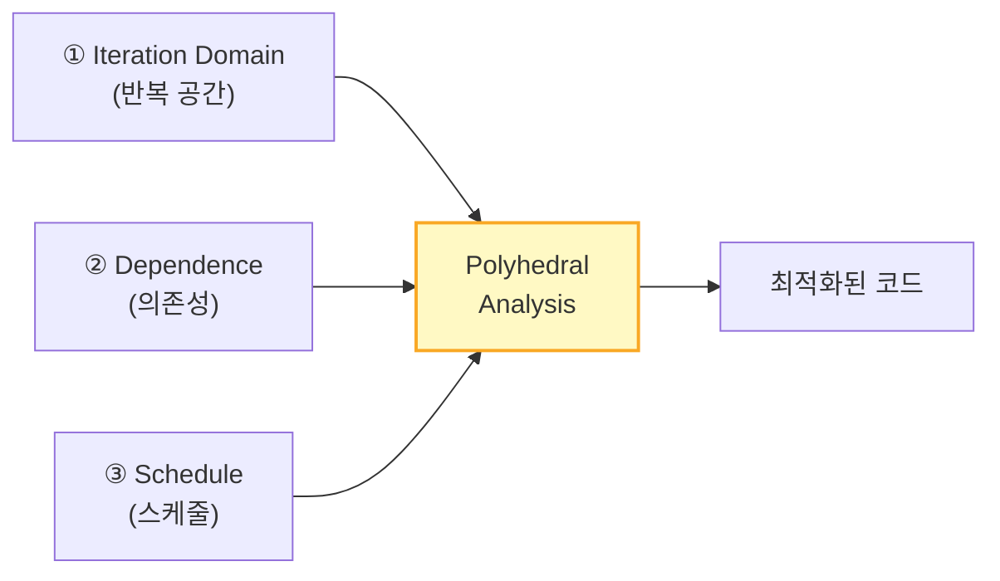
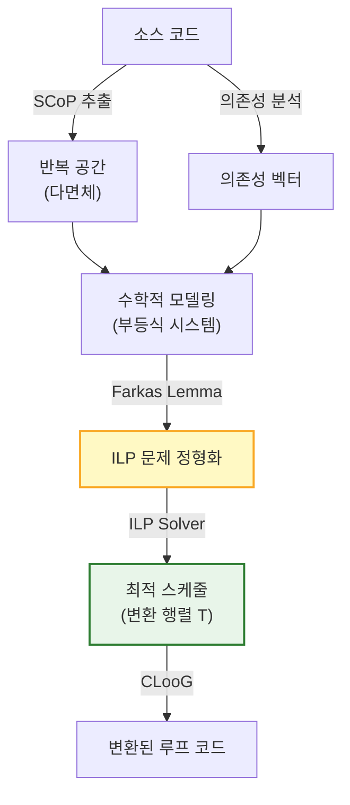
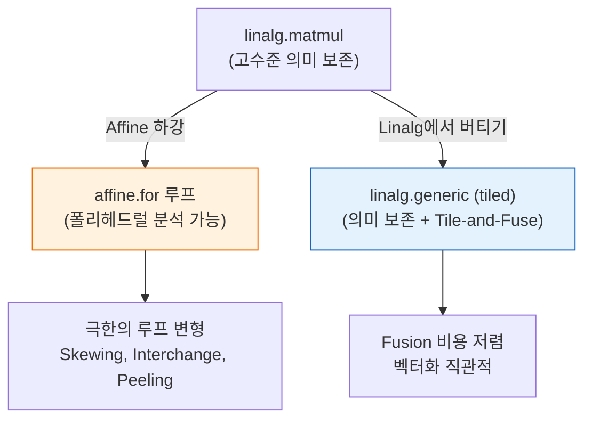

# Appendix D: 폴리헤드럴 모델 (Polyhedral Model)

[← Appendix C](08_appendix_c_mlir_extras.md) | [목차](README.md)

---

# D.1 폴리헤드럴 모델이란?

중첩 루프를 **선형 대수 문제로 변환**하여 최적화하는 수학적 프레임워크.

> 전통 컴파일러가 "이 루프를 타일링해도 될까?"를 **휴리스틱**으로 판단한다면,  
> 폴리헤드럴 모델은 **수학적으로 증명**한다.

### 해결하는 문제

| 전통 AST/CFG 기반 | 폴리헤드럴 모델 |
|---|---|
| 변환을 하나씩 적용, 조합 폭발 | **모든 것을 ILP 문제로 치환** |
| 보수적 의존성 분석 (안전하지만 기회 놓침) | **정확한(Exact) 의존성 분석** |
| 최적 조합 탐색 불가 | **ILP Solver가 최적해 탐색** |
| Tiling → Interchange → Fusion 순서 의존적 | 모든 변환을 **하나의 행렬 연산**으로 통합 |

---

# D.2 3가지 핵심 요소 (Three Pillars)



---

## ① Iteration Domain — 반복 공간

루프의 각 반복 인스턴스를 **다차원 좌표점**으로 표현한다.

### 예시

```c
for (i = 0; i < 4; i++)
    for (j = 0; j < 4; j++)
        A[i][j] = f(i, j);
```

이 루프의 반복 공간:

```
j
3 | •  •  •  •
2 | •  •  •  •
1 | •  •  •  •
0 | •  •  •  •
  +----------→ i
    0  1  2  3
```

- 각 점 `(i, j)`가 하나의 반복 인스턴스
- 루프 경계가 **부등식 시스템**으로 표현됨:

```
0 ≤ i < 4
0 ≤ j < 4
```

- 행렬 형태: **A·x + b ≥ 0** (다면체를 정의하는 부등식)

```
┌  1  0 ┐ ┌ i ┐   ┌  0 ┐       ┌  -1  0 ┐ ┌ i ┐   ┌  3 ┐
│  0  1 │ │ j │ + │  0 │ ≥ 0,  │   0 -1 │ │ j │ + │  3 │ ≥ 0
└       ┘ └   ┘   └    ┘       └        ┘ └   ┘   └    ┘
   (i ≥ 0, j ≥ 0)                 (i ≤ 3, j ≤ 3)
```

> **반복 공간이 다면체(polyhedron)** — 이름의 유래

---

## ② Dependence — 의존성

### 의존성의 수학적 표현

```c
for (i = 1; i < N; i++)
    for (j = 1; j < N; j++)
        A[i][j] = A[i-1][j] + A[i][j-1];
```

의존성 벡터:
- `A[i][j]`는 `A[i-1][j]`에 의존 → 의존성 벡터 `(1, 0)` — 아래에서 위로
- `A[i][j]`는 `A[i][j-1]`에 의존 → 의존성 벡터 `(0, 1)` — 왼쪽에서 오른쪽

```
j
  | ↑  ↑  ↑  ↑
  | •→ •→ •→ •
  | ↑  ↑  ↑  ↑
  | •→ •→ •→ •
  | ↑  ↑  ↑  ↑
  | •→ •→ •→ •
  +----------→ i
  
  ↑ = (1,0) 의존성
  → = (0,1) 의존성
```

### 왜 정확한 의존성 분석이 중요한가

```c
// 전통 컴파일러: A[i]와 A[2*i+1]이 겹칠 수 있으니 병렬화 포기
// 폴리헤드럴: i ≠ 2*i+1을 풀면 i ≠ 1일 때 독립 → 대부분 병렬화 가능!
```

- 폴리헤드럴은 **정수 부등식**으로 정확히 충돌 여부를 판별 (Exact Analysis)
- 전통 방식은 "혹시 겹칠 수 있다" → 보수적으로 포기

---

## ③ Schedule — 스케줄

반복 인스턴스를 **새로운 실행 순서**로 매핑하는 아핀 함수.

### 변환 행렬

기존 좌표 `[i, j]`를 변환 행렬 `T`로 새 좌표 `[t1, t2]`에 매핑:

```
┌ t1 ┐     ┌ a  b ┐ ┌ i ┐   ┌ c ┐
│ t2 │  =  │ d  e │ │ j │ + │ f │
└    ┘     └      ┘ └   ┘   └   ┘
```

### 행렬로 표현하는 루프 변환

**Identity** (변환 없음):
```
T = ┌ 1  0 ┐     →  t1 = i, t2 = j
    └ 0  1 ┘
```

**Loop Interchange** (루프 순서 교환):
```
T = ┌ 0  1 ┐     →  t1 = j, t2 = i
    └ 1  0 ┘
```

**Skewing** (비틀기):
```
T = ┌ 1  1 ┐     →  t1 = i + j, t2 = j
    └ 0  1 ┘
```

**Tiling** (타일링):
```
strip-mining으로 표현:
t1 = ⌊i / B⌋  (타일 인덱스)
t2 = i mod B   (타일 내 인덱스)
```

> **모든 루프 변환이 행렬 계수 조작**으로 통합된다.

### 합법적 스케줄 조건

의존성이 있는 두 인스턴스 A → B에 대해:

```
θ(B) - θ(A) ≥ 1    (사전순 비교에서 B가 A보다 뒤에 실행)
```

이 부등식이 **모든 반복 인스턴스**에서 성립해야 한다.

---

# D.3 Farkas Lemma — 무한을 유한으로

### 문제

> "모든 점 `(i, j)`에서 `θ(B) - θ(A) ≥ 1`이 성립하는가?"  
> → 점이 무한히 많으므로 하나하나 검증할 수 없다.

### Farkas의 핵심 아이디어

> "다면체의 **모든 점**에서 비음수인 아핀 함수는,  
> 그 다면체를 정의하는 **경계 부등식들의 양수 배 합**으로 표현할 수 있다."

```
f(x) ≥ 0  ∀x ∈ P
    ⟺
f(x) = λ₀ + λ₁·g₁(x) + λ₂·g₂(x) + ... + λₖ·gₖ(x)
    (λᵢ ≥ 0, gᵢ는 다면체 P의 경계 부등식)
```

### 효과


- 무한한 점 검증 → **유한한 연립방정식** 풀기
- ILP(정수 선형 계획법) Solver가 최적 행렬 T를 자동으로 찾아줌

---

# D.4 Loop Skewing — Wavefront 병렬화

### 문제: 대각선 의존성으로 병렬화 불가

```c
// DP 패턴 — i 방향, j 방향 모두 의존성이 있어 병렬화 불가
for (i = 1; i < N; i++)
    for (j = 1; j < N; j++)
        A[i][j] = A[i-1][j] + A[i][j-1];
```

```
원본 반복 공간:
j
  | •→ •→ •→ •
  | ↑↗ ↑↗ ↑↗ ↑
  | •→ •→ •→ •
  | ↑↗ ↑↗ ↑↗ ↑
  | •→ •→ •→ •
  +----------→ i
  
내부 루프(j)를 병렬화하고 싶지만, →(0,1) 의존성이 막는다!
```

### 해결: Skewing 변환 (t = i + j)

```
변환 행렬: T = ┌ 1  1 ┐
              └ 0  1 ┘

새 좌표: t1 = i + j  (대각선 방향 = 시간축)
         t2 = j       (대각선 내 위치 = 병렬축)
```

```
Skewing 후:
t2
  |       •
  |     •  •
  |   •  •  •
  | •  •  •  •
  |   •  •  •
  |     •  •
  |       •
  +----------→ t1

같은 t1 값의 점들은 서로 독립 → 내부 루프 완전 병렬화!
```

### 주의사항

- **공간 지역성 파괴**: 대각선 접근 패턴으로 캐시 미스 증가
- **패딩 오버헤드**: 평행사변형 모양으로 경계 처리 필요
- **해결**: **Skewing + Tiling 결합** — 타일 내부에서만 Skewing, SRAM 안에서 처리

---

# D.5 전체 워크플로우



1. **SCoP 추출**: 아핀 함수로 표현 가능한 루프 영역을 식별
2. **수학적 모델링**: 반복 공간 → 다면체, 배열 접근 → 아핀 함수, 의존성 → 벡터
3. **Farkas Lemma**: 합법적 스케줄 조건을 유한한 선형 제약으로 변환
4. **ILP Solver**: 제약을 만족하면서 지역성/병렬성을 극대화하는 스케줄 탐색
5. **코드 생성 (CLooG)**: 변환된 다면체를 스캔하는 루프 코드 생성

---

# D.6 MLIR과 폴리헤드럴

MLIR의 **Affine Dialect**이 폴리헤드럴 모델의 현대적 구현이다.

```mlir
// affine.for — 경계가 아핀 함수 → 폴리헤드럴 분석 가능
affine.for %i = 0 to 128 {
  affine.for %j = 0 to 256 {
    %idx = affine.apply affine_map<(d0, d1) -> (d0 * 256 + d1)>(%i, %j)
    %v = affine.load %buf[%i, %j] : memref<128x256xf32>
    // ...
  }
}
```

### Affine Pass들이 폴리헤드럴 변환을 수행

| Affine Pass | 폴리헤드럴 변환 |
|---|---|
| `affine-loop-tile` | **Tiling** — strip-mining으로 다면체 분할 |
| `affine-loop-interchange` | **Interchange** — 변환 행렬의 행 교환 |
| `affine-loop-fusion` | **Fusion** — 두 다면체를 하나로 합침 |
| `affine-loop-coalescing` | 다중 루프를 1D로 평탄화 |
| `affine-scalrep` | 메모리 접근을 스칼라 레지스터로 승격 |
| `affine-data-copy-generate` | 타일 데이터를 빠른 메모리로 복사 |

### Linalg vs Affine 트레이드오프



- **Linalg에서 버티기**: 고수준 의미론 보존, "유리잔 깨면 다시 못 붙임"
- **Affine 하강**: 극한의 루프 변형, 세밀한 의존성 분석
- **범용 가속기**: Linalg 트렌드 / **커스텀 NPU**: Affine이 필요한 경우 있음

---

# D.7 역사

| 시기 | 이정표 |
|---|---|
| **1967** | Karp, Miller, Winograd — 균일 점화식 분석 |
| **1980s** | 시스톨릭 어레이 연구 — TPU/NPU의 조상 |
| **1990s** | **Feautrier** — Exact 의존성 분석, Farkas Lemma 도입 |
| **2004** | **CLooG** — 폴리헤드럴 코드 생성기 |
| **2008** | **Pluto** — 자동 병렬화/지역성 스케줄러 (PLDI 2008) |
| **2008~** | GCC Graphite, LLVM Polly — 범용 컴파일러에 편입 |
| **2010s~** | Halide, TVM, Tiramisu — AI 도메인 특화 활용 |
| **2019~** | **MLIR Affine Dialect** — 폴리헤드럴의 현대적 구현 |
| **최근** | **PolyMorphous** — 사용자 제어 + 컴파일러 검증 하이브리드 |

> 학부에서는 거의 안 배움. 대학원 Advanced Compilers / HPC 수준.

---

# D.8 주요 도구

| 도구 | 역할 | 비고 |
|---|---|---|
| **ISL** (Integer Set Library) | 정수 집합/맵 연산 | Polly, PolyMorphous 등에서 사용 |
| **CLooG** | 다면체 → 루프 코드 생성 | Cedric Bastoul, 2004 |
| **Pluto** | 자동 스케줄 최적화 | Bondhugula et al., PLDI 2008 |
| **LLVM Polly** | LLVM에서 폴리헤드럴 최적화 | ISL 기반 |
| **GCC Graphite** | GCC에서 폴리헤드럴 최적화 | ISL 기반 |
| **PolyMorphous** | 하이브리드 (사용자 + 자동) | MLIR Transform Dialect 기반 |

---

[← Appendix C](08_appendix_c_mlir_extras.md) | [목차](README.md)
