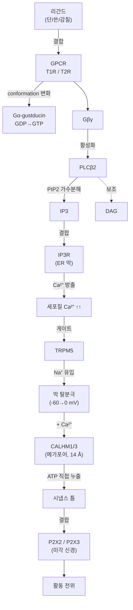
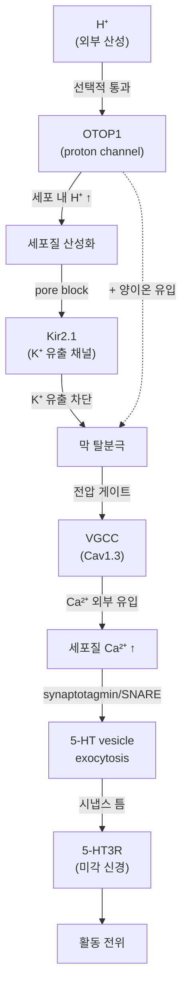

# 2. 혀에서 뇌까지 — 미뢰와 신경 전달 경로

[← 이전: 들어가며](01_introduction.md) · [README](README.md) · [→ 다음: 5대 기본맛](03_five-tastes.md)

---

## 2.1 혀의 풍경 — Papillae 4종

혀 표면에는 작은 돌기들이 빽빽하게 박혀 있다 — **papillae(유두)**. 4종이 모양·위치·기능별로 분화돼 있다.


*Figure 2.1 혀의 papillae 4종 위치 + circumvallate 단면 + 단일 미뢰 확대. 출처: OpenStax *Anatomy and Physiology* fig. 14.3 — "The Tongue" (Wikimedia Commons 미러 [File:1402_The_Tongue.jpg](https://commons.wikimedia.org/wiki/File:1402_The_Tongue.jpg)), CC BY 4.0.*

| Papilla | 모양 | 위치 | 미뢰 수 | 신경 | 기능 |
|---|---|---|---|---|---|
| **Filiform** (사상) | 가는 실 | 혀 표면 대부분 | **0** | 삼차 | **마찰·grip — 음식 잡기** (미각 X) |
| **Fungiform** (버섯) | 둥근 머리 | 앞 2/3에 산재 | 1~5 | CN VII | **첫 식별 — 빠른 평가** |
| **Foliate** (엽상) | 평행 잎 | 옆 후방 | 수십 | VII / IX | **분쇄 중 평가** (어금니 사이) |
| **Circumvallate** (성곽) | dome + 도랑 | 뒤 V자 8~12개 | **250~수천** | CN IX | **삼키기 직전 마지막 검사 — 쓴맛 강함** |

**진화적 통찰** — papillae 분포가 **음식 처리 흐름**과 정합:

```
혀 끝 (앞)            →            혀 가운데·옆            →            혀 뒤
[빠른 첫 인상]                       [분쇄 평가]                          [정밀 마지막 검사]
fungiform                            foliate                              circumvallate
"먹어볼까?"                          "괜찮아?"                            "삼킬까/뱉을까?"
```

→ 삼키기 직전 검사 stations(circumvallate)에 **쓴맛 수용체(T2R) 비중이 가장 높다** = 독 회피의 마지막 방어선.

---

## 2.2 미뢰의 구조 — 양파형 50~150 세포 다발

각 papilla 안 또는 위에 **미뢰(taste bud)**가 박혀 있다.


*Figure 2.2 미뢰의 양파형 구조 단면 — 50~150개 세포가 다발로 모여 있고 정점에 taste pore(미공)로 외부 노출. 출처: NEUROtiker 2007, [Wikimedia Commons File:Taste_bud.svg](https://commons.wikimedia.org/wiki/File:Taste_bud.svg), Public Domain.*

핵심 특징:
- **양파처럼 50~150개의 세포가 다발로 모임**
- 정점에 **taste pore(미공)** — 분자가 들어오는 입구
- 약 **10~14일 주기로 세포가 교체**되는 동적 구조 (자세히는 부록 C)

---

## 2.3 미각세포 3종 — 분업의 정확성

미뢰 안 세포는 4종 (실험적으로 잘 확립):

| Type | 별명 | Marker | 역할 |
|---|---|---|---|
| **Type I** | glia-like | GLAST, NTPDase2 | 지지·이온 항상성 (미각 X 또는 짠맛 부분 후보) |
| **Type II** | **receptor cells** | PLCβ2, gustducin, TRPM5 | **단·쓴·감칠** 검출 (한 세포 = 한 modality) |
| **Type III** | **presynaptic cells** | SNAP25, 5-HT, PKD2L1 | **신맛** 검출 (전통 시냅스로 신경 전달) |
| **Type IV** | basal/stem | Lgr5, Sox2 | 줄기세포 — 새 세포 분화 source |

**핵심 통찰**: Type II 한 세포는 **단/쓴/감칠 중 단 하나만** 검출한다 (labeled-line at cell level). 즉 단맛 세포·쓴맛 세포·감칠 세포가 따로 존재.


*Figure 2.3 미각세포 3종 분업과 modality 매핑. 출처: Ahmad & Dalziel 2020 *Frontiers in Pharmacology*, [PMC7774309](https://pmc.ncbi.nlm.nih.gov/articles/PMC7774309/), CC BY 4.0.*

---

## 2.4 신호 전달 — 분자에서 신경 신호까지

미뢰 안에서 일어나는 일의 핵심은 **외부 분자 정보를 미각 신경의 활동 전위로 바꾸는 것** (sensory transduction)이다. 그런데 5대 기본맛은 **검출 대상 분자의 화학적 성격이 너무 다르기 때문에**, 진화는 한 가지 회로를 모든 곳에 쓰지 않고 **세 가지 서로 다른 회로**를 만들어두었다.

| 검출 분자 | 예 | 1차 수용체 | 회로 형태 | 단계 수 | 출력 분자 |
|---|---|---|---|---|---|
| **다양한 organic 분자** | 단당, 아미노산, 쓴 알칼로이드 | GPCR (T1R / T2R) | 세포 내 cascade + **channel synapse** | **~8단계** | **ATP** |
| **H⁺ (proton)** | 신맛 | OTOP1 (이온 채널) | 세포 내 산성화 + **전통 시냅스** | ~5단계 | **5-HT** (세로토닌) |
| **Na⁺** | 저농도 짠맛 | ENaC (이온 채널) | 직접 탈분극 | ~1~2단계 | (회로 미완) |

> **핵심 직관**: GPCR이 필요한 이유는 단백질의 binding pocket이 **분자별 모양을 구분할 수 있기** 때문이다. 단순한 이온(H⁺, Na⁺)은 모양 정보가 거의 없는 작은 입자라 굳이 단백질 수용체를 거칠 필요가 없다 — 이온 채널 한 종으로 충분히 빠르고 특이적이다. **회로 복잡도를 분자 종류에 맞춰 최적화한 결과**가 세 가지 path이다.

각 회로를 단계별로 본다. 단계마다 "왜 그 단계가 진화했는가"를 함께 묻는다.

### 2.4.1 Type II 회로 — GPCR cascade와 channel synapse

단·쓴·감칠 세포가 쓰는 가장 복잡한 회로. 8단계 cascade는 단순히 길어서가 아니라 **하나의 분자가 만드는 신호를 거대하게 증폭**하기 위해 진화한 것이다. 분자 nM 수준의 미세 농도가 충분한 신경 신호로 변환되려면 ~10³~10⁴배 증폭이 필요하다.


*Figure 2.4 Type II 세포의 transduction. 입력 GPCR(T1R2/3 단, T2R 쓴, T1R1/3 감칠)만 다르고 하류는 모두 같다. 출처: Ahmad & Dalziel 2020, CC BY 4.0.*



> **분자 용어 빠른 정리** (이 절에서 반복 등장)
>
> - **Conformation** = 분자의 **3D "자세(모양)"**. 같은 원자 구성·같은 결합이라도 단일결합 회전으로 여러 자세를 취할 수 있고, 자세마다 결합 가능한 파트너·활성 자리·기능이 달라진다. **단백질은 자기 모양을 바꿔서 일한다** — 신호 전달의 거의 모든 단계는 "한 단백질의 conformation 변화가 옆 단백질에 또 다른 conformation 변화를 유도하는 연쇄"다.
>   - 사람의 자세에 비유 — 같은 사람이 팔 벌리거나 주먹 쥐거나 = conformation 변환. 손가락을 다른 위치에 꿰매면 = configuration 변환(별개 개념, 공유결합 재배치 필요).
>
> - **GDP / GTP** = 핵산 nucleotide. **G**uanine(염기) + ribose(당) + 인산. ATP/ADP와 같은 원리이나 베이스가 다름 (A vs G).
>   - **GDP** (di-phosphate, 인산 **2개**) = G-protein의 **"off" 상태** 명찰
>   - **GTP** (tri-phosphate, 인산 **3개**) = G-protein의 **"on" 상태** 명찰 (인산 하나 더 = 에너지 충전 상태)
>   - Gα가 GDP를 쥐고 있을 땐 off, GPCR 자극으로 **GDP→GTP 교환**되면 on, Gα 자체의 GTPase 활성이 **GTP→GDP 가수분해**해서 자동 off 복귀 — **분자 권총의 안전장치 cycle**.
>   - ATP/ADP와 같은 원리지만 G-protein은 G-nucleotide만 인식 → 신호 시스템 간 cross-talk 차단.
>
> 이 두 용어는 7번 막관통(7TM) 수용체의 모든 cascade를 이해하는 데 반복적으로 필요하다.

#### Step 1. 리간드 → GPCR — 분자 모양의 인식

**GPCR (G-protein coupled receptor)** = 세포막을 **7번 가로지르는** 단일 단백질. 7개의 TM(transmembrane) α-helix가 통(barrel) 모양을 이루고, 그 위·옆의 loop가 ligand-binding pocket을 형성한다.

| modality | 구성 GPCR | 결합 형식 | GPCR Class |
|---|---|---|---|
| **단** | **T1R2 + T1R3** heterodimer | 두 단백질이 결합해야 기능 — Venus flytrap 모양 N-말단이 단당을 끼움 | **Class C** |
| **감칠** | **T1R1 + T1R3** heterodimer | T1R3가 단·감칠에 **공용** | **Class C** |
| **쓴** | **T2R 가족** (사람 ~25종) | 한 cell이 **다수 T2R 동시 발현** → "쓴 분자라면 뭐든" | **Class A** (작은 N-말단) |

- 한 cell은 한 modality만 — T1R2/T1R3 cell, T1R1/T1R3 cell, T2R cell이 서로 배타적.
- T1R3는 두 partner(T1R2 or T1R1) **둘 중 하나와만** 짝을 이룬다. 발달 단계에서 transcription factor 회로가 한쪽만 발현되도록 결정.
- 쓴 cell의 다수 T2R 동시 발현은 **결과적으로 "쓴 분자별 구분이 약함"**으로 이어진다 — 사람이 카페인과 quinine을 잘 구분 못 하는 이유. 반면 "이 cell은 어떤 쓴 분자든 다 잡는다"는 독 회피 안전망 측면에선 유리.

**왜 단백질 수용체인가?** 단당·아미노산·쓴 알칼로이드는 화학 다양성이 거대하다. 이를 식별하려면 단백질 pocket이 conformation을 미세 조정할 수 있어야 한다. 이온 채널로는 분자 모양 인식이 본질적으로 어렵다.

#### Step 2. G protein 활성화 — GDP를 GTP로 교환

GPCR의 세포 내 면에 **heterotrimeric G protein** (Gα + Gβ + Gγ)이 결합해 있다. 평소 Gα는 **GDP**를 쥐고 있다 (off 상태).

- 리간드가 GPCR 결합 → 7TM bundle이 약간 비틀림 → 안쪽 conformation 변화
- 이 변화가 Gα의 nucleotide pocket을 열어 **GDP → GTP 교환** (on 상태)
- 동시에 **Gα-GTP**와 **Gβγ**가 분리되어 **각각 다른 effector**를 활성화 — 병렬 경로의 출발점

미각 cell의 Gα = **gustducin** (포유류 미각 전용 isoform, 시각의 transducin과 sequence ~80% 동일). **Gustducin KO 마우스**는 단·쓴·감칠 응답이 거의 사라진다 — in vivo 핵심 증명.

> **G protein cycle이 첫 amplification**. Gα의 내재 GTPase 활성이 GTP→GDP를 가수분해 (수십 ms~수 초). 그 시간 동안 하나의 GPCR이 여러 G protein을 순차적으로 turn on 가능 (catalytic relationship). 한 리간드 결합 → ~10~100 G protein 활성.

#### Step 3. PLCβ2 활성화 — Gβγ가 효소를 켠다

**Phospholipase Cβ2 (PLCβ2)** = 인지질을 자르는 효소. Gβγ가 직접 결합해 활성화.

- 기질: **PIP2** (phosphatidylinositol 4,5-bisphosphate) — 세포막 안쪽 면의 인지질
- 생성물:
  - **IP3** (inositol trisphosphate) — 가용성 → 세포질로 자유 확산
  - **DAG** (diacylglycerol) — 막에 잔류, PKC 등 활성화 (미각에서 보조 역할)
- 효소 한 분자가 **수백 PIP2** 분해 → **두 번째 amplification 단계**

#### Step 4. IP3 → ER의 Ca²⁺ 방출 — 폭발적 증폭

세포 내 **소포체(ER)** 막에 **IP3R (IP3 receptor) = Ca²⁺ release channel**이 박혀 있다.

- 평소 ER 안 [Ca²⁺] ≈ 0.5 mM, 세포질 [Ca²⁺] ≈ 100 nM — **약 5000배 농축**돼 있음
- IP3가 IP3R에 결합 → 채널 열림 → ER → 세포질로 Ca²⁺ 폭발적 방출
- 세포질 [Ca²⁺]이 ~10~100배 (~수십 ms 내에) 상승

**세 번째 amplification — 가장 큰 단계**. ER이 평소에 농축해둔 Ca²⁺ 저장고를 한순간에 "쏟아붓는" 구조. 외부 Ca²⁺ 유입을 기다리지 않고 내부 저장고를 쓰는 이유 = **속도와 증폭률**.

#### Step 5. Ca²⁺ → TRPM5 → 막 탈분극

**TRPM5** (transient receptor potential melastatin-5) = 비특이 cation channel, **Ca²⁺-activated** (세포질 Ca²⁺ 상승이 게이트).

- TRPM5 열림 → Na⁺ 유입 (Ca²⁺도 일부)
- 막전위가 안정 상태(-60 ~ -70 mV)에서 0 mV 근처로 **탈분극**
- **TRPM5 KO 마우스**: 단·쓴·감칠 응답 거의 소실 — 이 단계가 막전위 변환의 핵심

**왜 TRPM5인가?** 미각 cell은 진정한 neuron이 아니므로 일반 neuron의 voltage-gated Na⁺ channel(Nav)이 약하다. **Ca²⁺ activation**이라는 우회로로 막전위를 만든다 — neuron이 아닌 세포가 신경 신호를 흉내 내기 위한 진화적 해결책.

#### Step 6. 탈분극 + Ca²⁺ → CALHM1/3 게이트 열림

**CALHM1/3** (Calcium Homeostasis Modulator 1 & 3) = **메가포어 채널**. 미각 transduction의 정점.

- pore 직경 **~14 Å** — 일반 이온 채널(~3 Å)의 5배. **작은 분자(ATP, ~500 Da)가 통과 가능**한 크기
- 구조: **8 subunit이 모인 octameric ring**. 막을 가로질러 거대 통로를 형성 (cryo-EM 분해)
- in vivo native channel = **CALHM1 + CALHM3 heteromer**:
  - 단독 CALHM1: 매우 강한 탈분극에서만 열림 (미각 환경에선 부족)
  - heteromer: **약한 탈분극에도 빠르게 열림** — native function의 핵심
- 두 게이트 조건이 모두 필요: **막 탈분극** (voltage-gated) + 세포질 **Ca²⁺ 상승** (Ca²⁺ activated)

#### Step 7. ATP 직접 방출 — Channel Synapse의 발명

여기서 결정적인 일이 일어난다.

- 세포 내 ATP 농도 ≈ **1~5 mM**, 세포 외 << μM — 약 **10⁴배 농도 차**
- CALHM1/3가 열리면 ATP가 **그냥 흘러나간다** (passive diffusion via gradient)
- **시냅스 소포 없음, SNARE 없음, exocytosis 없음** — 전통 신경 시냅스의 release machinery를 모두 우회

이것이 **channel synapse**다. 진화상 새로 정립된 신경전달 형태로, 미각계가 잘 정의된 첫 예 (Taruno et al. 2013).

**왜 channel synapse가 진화했나? — 5가지 이유**

1. **세포 origin이 epithelial** — 미각 cell은 발달학적으로 진정한 neuron이 아니라 혀 상피세포에서 분화한다. neuron 특유의 vesicle release 기계(SNARE, synaptotagmin, vesicle 합성·재충전 회로)가 약하다. **있는 것을 가지고 일하는 진화의 방식**.
2. **속도** — vesicle fusion ~수십 ms vs CALHM 게이트 ~ms 단위. ~10배 빠른 신호.
3. **에너지 효율** — vesicle 재합성·재충전 사이클이 없음. 세포 안에 이미 mM 농도로 있는 ATP를 그대로 쓴다.
4. **graded 신호** — 더 강한 자극 → 더 긴 CALHM 개방 → 더 많은 ATP 누출. 전통 시냅스는 quantal(소포 단위)이라 강도 표현에 불리하다.
5. **연료가 풍부** — ATP는 모든 세포의 universal currency. 따로 합성·packaging 필요 없음.

> 미뢰 안 Type II cell의 channel synapse 영역 옆에는 **atypical mitochondrion** (큰 크기, 변형된 cristae)이 항상 배치돼 있다. **ATP 발전소가 신호 release 지점 바로 옆에 놓인 진화적 디테일** — channel synapse의 효율을 극대화하는 분자 건축.

#### Step 8. ATP → 미각 신경 P2X2/P2X3 → 활동전위

방출된 ATP는 시냅스 틈을 ~수 μm 확산(수십 μs).

- 미각 afferent nerve의 fiber 막에 **P2X2 / P2X3** (purinergic ionotropic receptor) 발현
- ATP 결합 → 채널 열림 → Na⁺·Ca²⁺ 유입 → 신경 막 탈분극 → 활동전위
- **P2X2 KO + P2X3 KO double KO 마우스**: 모든 미각 응답 소실 — in vivo 결정적 증명

#### 8단계 cascade의 총 증폭률

| 단계 | 증폭 | 메커니즘 |
|---|---|---|
| 1. GPCR → G protein | × 10~100 | catalytic GTPase cycle |
| 2. G protein → PLCβ2 | × 1 | 활성화 전이 |
| 3. PLCβ2 → IP3 | × 수백 | 효소 한 분자가 PIP2 다수 분해 |
| 4. IP3 → Ca²⁺ | × 1000+ | ER 농축 Ca²⁺ 폭발 방출 |
| 5. Ca²⁺ → TRPM5 → 막 | × 수십 | 다수 TRPM5 동시 활성화 |
| 6~7. CALHM → ATP | × 수백 | 메가포어 빠른 누출 |

**총 증폭률 ≈ 10³~10⁴배**. 미각 cell이 nM 농도 ligand를 μM 농도 ATP 신호로 변환해 신경에 전달.

### 2.4.2 Type III 회로 — 신맛, 전통 시냅스

신맛은 GPCR이 아니라 **H⁺ proton 자체**가 세포 안으로 들어와 회로를 켠다. 8단계가 5단계로 줄어드는 대신, 막전위를 끌어올리는 데 **두 가지 메커니즘이 동시에 작용**한다.



#### Step 1. H⁺ → OTOP1 — proton-selective channel

**OTOP1 (otopetrin-1)** — Liman lab이 2018년에 발견 (Tu et al. *Science*) [4]. 12-TM 단백질로 **proton-selective ion channel**.

- 외부 H⁺ 농도 증가 (pH 떨어짐) → OTOP1 게이트 열림
- H⁺이 농도 차 따라 세포 안으로 유입
- 다른 양이온은 거의 통과 못 함 (H⁺ 선택성 ~수십~수백 배)

> 2018년 이전엔 신맛 수용체가 무엇인지 오랫동안 알려지지 않았다. 후보로 PKD2L1, ASIC 등이 제시됐으나 in vivo 증명 부족. OTOP1 KO 마우스가 신맛 응답을 잃는 것을 보임으로써 결정됐다 — **불과 ~8년 전 결정된 비교적 새로운 지식**.

#### Step 2. 세포 내 산성화 → Kir2.1 차단

Type III cell의 정지막전위는 **Kir2.1** (inward rectifier K⁺ channel)이 K⁺을 천천히 흘려보내며 유지한다 (K⁺이 새나가면서 막이 hyperpolarize).

- 세포질 H⁺ 증가 → Kir2.1 pore가 H⁺에 의해 **occluded** (직접 물리적 차단)
- K⁺ 유출 차단 → 막이 더 이상 hyperpolarize 못 함

#### Step 3. 두 메커니즘이 합쳐 탈분극

- (a) OTOP1로 들어온 H⁺ 자체가 양이온 유입 → 약한 직접 탈분극
- (b) Kir2.1 차단으로 정상 K⁺ 누출이 끊어짐 → resting potential이 위로 이동
- 둘이 합쳐 막전위가 threshold(-40 mV 근처)를 넘는다

**왜 두 메커니즘인가?** H⁺ 전류만으론 탈분극이 약하다 (H⁺ 농도가 다른 이온보다 낮음). KIR block이 함께 작용해야 신뢰성 있게 임계점 초과 — 진화가 **하나의 자극에 두 효과를 합산**해 sensitivity를 확보한 디자인.

#### Step 4. VGCC → Ca²⁺ 유입 (외부에서)

- 막 탈분극 → 전압 의존성 Ca²⁺ 채널(**VGCC, Cav1.3**) 열림
- **외부 Ca²⁺** ([Ca²⁺]_ext ≈ 2 mM) → 세포 안으로 유입
- (Type II와 결정적 차이: Type II는 **ER에서 내부 방출**, Type III는 **외부 유입**)

#### Step 5. Vesicle exocytosis → 5-HT 방출 → 미각 신경

- Ca²⁺이 시냅스 active zone에서 **synaptotagmin** 결합 → SNARE 융합 트리거
- **Serotonin (5-HT)** 함유 vesicle 융합 → 시냅스 틈에 5-HT 방출
- 미각 nerve의 **5-HT3 receptor** (ligand-gated cation channel) 활성화 → 신경 탈분극 → 활동전위

**전통 시냅스의 모든 단계**: vesicle 준비, SNARE complex 조립, Ca²⁺-triggered exocytosis, recycling — 일반 neuron synapse와 동일.

> 5-HT는 뇌에서 행복·우울·수면을 조절하는 그 신경전달물질. 미뢰 안에선 신맛 메신저로 쓰인다. **분자 부품의 재사용** — 진화는 이미 있는 회로 부품을 다른 곳에서 다른 의미로 가져다 쓰는 데 능숙하다.

### 2.4.3 짠맛 회로 — ENaC 직접 (저농도)

저농도 짠맛(혈장 등장액 부근, ~0.1~0.5%)은 GPCR도, cascade도 없이 **단 한 종의 이온 채널**로 끝난다.


#### ENaC = epithelial sodium channel

- α + β + γ 세 subunit이 각각 2-TM helix로 구성된 **heterotrimer**
- 일부분이 **항상 열려 있음** — 외부 Na⁺ 농도 변화에 즉시 반응 (별도 ligand binding 게이트 없음)
- 외부 [Na⁺] = 140 mM, 내부 [Na⁺] = ~10 mM → 큰 gradient. 음식의 Na⁺이 닿으면 추가로 유입 → 즉시 탈분극

**왜 가장 단순한가?** Na⁺ 자체가 양이온이므로 유입만으로 탈분극이 직접 일어난다. amplification cascade가 본질적으로 필요 없다.

#### 약리학적 식별 — amiloride

**amiloride** = ENaC 특이 차단제. 사람에게 amiloride를 처치하면 **약한 짠맛**이 사라지지만 **강한 짠맛은 남는다** — ENaC가 저농도 짠맛 전담임을 약리학적으로 증명.

#### 강한 짠맛의 두 번째 회로 — 진화의 이중 회로

| 짠 농도 | 회로 | 평가 |
|---|---|---|
| **저농도** (~0.1~0.5% NaCl) | ENaC | "맛있다" — 필요한 미네랄 |
| **고농도** (>1% NaCl) | ENaC + **Type II/III cell 동원** (회로 미완) | "써·시다, 피해야" — 탈수 위험 |

진화적 논리: Na⁺은 항상성에 필수지만 과잉은 탈수·고혈압 유발. **저농도는 appetitive(끌림), 고농도는 aversive(혐오)**로 농도별 회로 분리 — 같은 분자에 대해 두 평가 회로가 농도에 따라 켜진다. 강한 짠맛이 쓴·신맛처럼 느껴지는 주관적 경험과 일치.

### 2.4.4 세 회로를 관통하는 원리 — 진화는 어떻게 회로 복잡도를 골랐나

8단계에서 1단계까지, 같은 신경 신호를 만드는데 왜 이렇게 회로 복잡도가 다른가? 다섯 가지 진화 원리로 묶인다.

1. **분자 종류가 회로 복잡도를 결정**
   - 다양한 organic 분자 → 단백질 pocket의 conformation 정보 필요 → GPCR + 긴 cascade
   - 단순한 이온(H⁺, Na⁺) → 이온 채널만으로 충분 → 짧은 회로
   - **회로 복잡도는 분자의 화학적 복잡도에 맞춰 최적화**된다.

2. **Ca²⁺이 세포 내 신호의 보편 통화**
   - Type II: ER에서 내부 방출
   - Type III: VGCC로 외부 유입
   - 짠: Na⁺ 유입에 묻혀 비주류
   - **모든 회로가 결국 Ca²⁺ 상승을 거친다** — 진화가 한 신호 system을 모든 곳에서 재사용한 결과.

3. **출력 분자가 modality 별로 다르다 — labeled lines의 분자 기반**
   - Type II → ATP (channel synapse)
   - Type III → 5-HT (전통 시냅스)
   - 짠 → ? (회로 미완 — 미해결 영역)
   - **어느 분자가 신경에 닿느냐로 routing이 결정**된다. 신경은 분자 종류를 보고 모달리티를 안다. 같은 fiber 안에서도 ATP/5-HT 수용체 발현이 다르면 다른 modality fiber로 분류.

4. **Channel synapse는 진화의 새 발명**
   - 미각 cell이 진정한 neuron이 아닌 **epithelial origin**이라는 점이 결정적
   - vesicle 기계 없이 ATP를 직접 흘려보내는 회로 — 더 빠르고, 에너지 효율적이고, graded
   - 뇌 안에서도 일부 발견되지만 미각이 잘 정의된 첫 예 (Taruno 2013) [3]
   - "**있는 부품으로 일하는 진화**"의 좋은 예 — Type II cell은 자기가 가진 ATP와 거대 채널만으로 신경전달을 발명해냈다.

5. **분자가 같아도 cell이 다르면 의미가 다르다 (routing이 정보)**
   - 단·쓴·감칠 cell 모두 ATP 방출 — 그러나 어느 cell에서 나왔는지가 modality
   - 뇌가 ATP "내용"을 보는 것이 아니라 **"주소(어느 fiber)"**를 본다
   - 다음 절(2.5)에서 routing의 결과를 본다 — 같은 ATP, 다른 destination.

---

## 2.5 분자→뇌 routing

같은 ATP 신호이지만 **어느 세포에서 나왔는지가 modality**다:

```
[단맛 세포] (T1R2/T1R3) → ATP ─→ 단맛 fiber → NTS 단맛 영역 → insula 단맛 영역
[쓴맛 세포] (T2R)       → ATP ─→ 쓴맛 fiber → NTS 쓴맛 영역 → insula 쓴맛 영역
[감칠 세포] (T1R1/T1R3) → ATP ─→ 감칠 fiber → NTS 감칠 영역 → insula 감칠 영역
[신 세포]   (OTOP1)     → 5-HT ─→ 신 fiber  → NTS 신 영역  → insula 신 영역
[짠 세포]   (ENaC)      → ?    ─→ 짠 fiber  → NTS 짠 영역  → insula 짠 영역
```

**비유 — 택배**:
- 같은 트럭(ATP) — 운송 시스템(backbone)은 같다.
- 발신지(미각세포)가 다르면 수신지(NTS·insula 영역)도 다르다.
- 박스 자체가 아니라 **routing이 정보**.

말초 → NTS(연수) → VPM 시상 → 1차 미각 피질(insula+operculum) → OFC → 보상 회로(NAc/VTA dopamine).

**OFC가 결정적**: 다중모달 신호를 통합해 "맛있다·싫다" 가치 평가가 일어나는 곳. 4장에서 본격 다룬다.

---

## 2.6 핵심 정리

1. 혀 papillae 4종은 음식 처리 흐름과 정합 — 앞은 빠른 첫 인상, 뒤는 정밀 검사.
2. 미뢰는 양파형 50~150 세포, 약 10~14일 주기로 교체.
3. **Type II = 단·쓴·감칠 (GPCR + channel synapse)**, **Type III = 신 (OTOP1 + 전통 시냅스)**, **짠 = ENaC 직접**.
4. 같은 ATP 신호라도 어느 세포에서 나왔는지가 modality — **routing이 정보**.
5. 진화가 음식 처리·항상성·독 회피 회로를 혀에 새긴 결과.

---

## References

[1] Roper SD, Chaudhari N. Taste buds: cells, signals and synapses. *Nat Rev Neurosci* 2017, 18(8), 485–497.

[2] Chandrashekar J, Hoon MA, Ryba NJP, Zuker CS. The receptors and cells for mammalian taste. *Nature* 2006, 444, 288–294.

[3] Taruno A et al. CALHM1 ion channel mediates purinergic neurotransmission of sweet, bitter and umami tastes. *Nature* 2013, 495, 223–226.

[4] Tu YH et al. An evolutionarily conserved gene family encodes proton-selective ion channels. *Science* 2018, 359, 1047–1050.

[5] Witt M. Anatomy and development of the human taste system. *Handb Clin Neurol* 2019, 164, 147–171.


---

[← 이전: 들어가며](01_introduction.md) · [README](README.md) · [→ 다음: 5대 기본맛](03_five-tastes.md)
