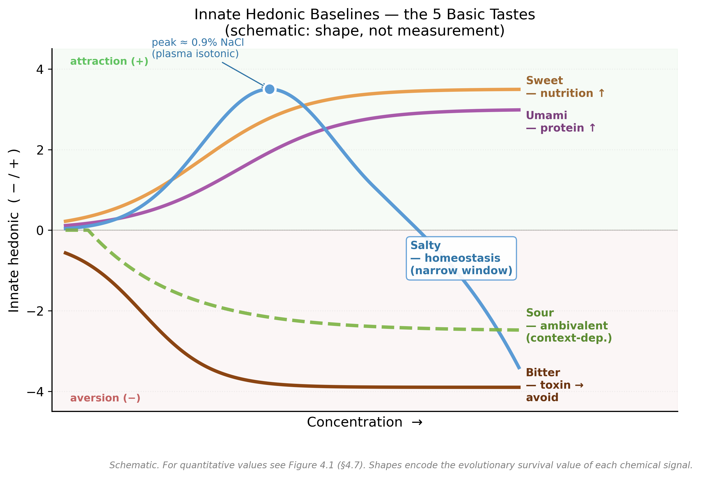
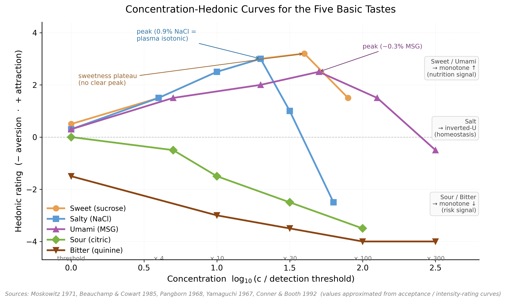
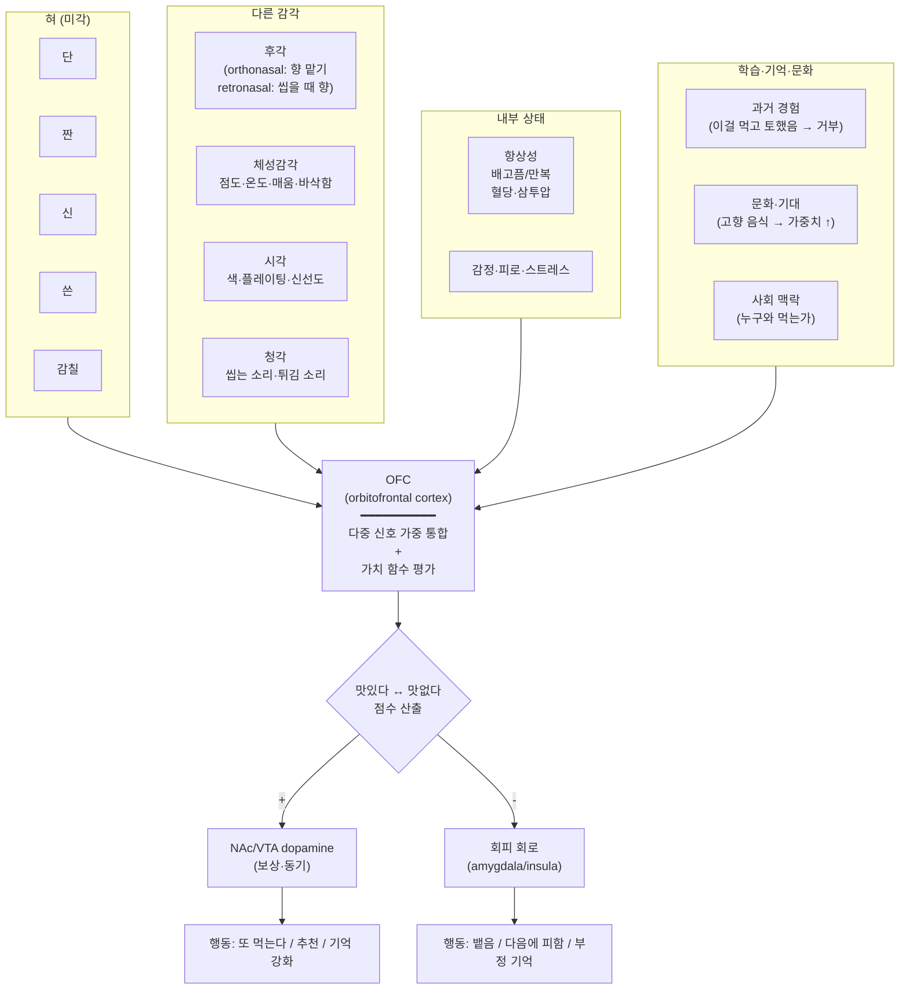

# 4. "맛있다"의 원리 — 조합과 농도

[← 이전: 5대 기본맛](03_five-tastes.md) · [README](README.md) · [→ 다음: 직접 실험](05_experiments.md)

---

## 4.1 "맛있다"는 분자 자체가 아니다

3장에서 5대 기본맛의 분자·수용체·세포를 봤다. 그러나 단맛 분자(sucrose) 자체가 "맛있는 분자"는 아니다 — **분자가 만드는 다중 신호의 가중 평균이 OFC(orbitofrontal cortex)에서 양의 가치 평가를 받을 때 "맛있다"가 만들어진다.**

핵심 정의:

> **맛있다 = 자극 분자의 다중모달 신호 패턴이 OFC에서 평가될 때, 개체의 영양·항상성·번식 가치 함수에 양의 기여를 한다고 진화·학습·맥락이 합쳐져 판정한 결과.**

이 정의의 함축:
1. **맛은 분자가 아니라 신호 패턴**
2. "맛있음"의 절대 기준은 없다 — **상태(배고픔·만복)·학습·문화**에 따라 가중치 변동
3. 단일 분자가 아니라 **조합과 농도**가 결정적

본 장에서 그 메커니즘을 본다.

---

## 4.2 1층 — 본유 hedonic (진화 베이스라인)

각 modality는 진화가 새긴 본유 hedonic 신호:

| Modality | 본유 hedonic | 의미 |
|---|---|---|
| **단** | + (강) | 영양 — 즉시 +. 거의 단조 증가. |
| **감칠** | + (강) | 단백질 — 즉시 +. 단조 증가. |
| **짠** | **+ (농도 의존)** | 0.9% 부근 최대 → 그 이상 빠른 거부 |
| **신** | **양가** | 익은 과일 / 부패. 맥락 의존 |
| **쓴** | − (강) | 식물 독 회피 — 거의 단조 거부 |



*Figure 4.0 5대 기본맛의 본유 hedonic 곡선 형태(schematic). 진화가 새긴 신호 모양 — **단·감칠**은 단조 증가(영양), **짠**은 좁은 inverted-U(항상성, 혈장 등장액 부근 peak), **신**은 양가(맥락 의존, 점선), **쓴**은 단조 감소(독 회피). 정량 곡선은 §4.7 Figure 4.1.*

*도식의 근거 자료:*
- *Cabanac M (1971). Physiological role of pleasure. *Science* 173(4002): 1103–1107. [doi:10.1126/science.173.4002.1103](https://doi.org/10.1126/science.173.4002.1103) — alliesthesia: 항상성 상태가 hedonic을 modulate*
- *Berridge KC (2007). The debate over dopamine's role in reward. *Psychopharmacology* 191(3): 391–431. [doi:10.1007/s00213-006-0578-x](https://doi.org/10.1007/s00213-006-0578-x) — wanting/liking 분리*
- *Rolls ET (2005). Taste, olfactory, and food texture processing in the brain. *Physiol Behav* 85(1): 45–56. [doi:10.1016/j.physbeh.2005.04.012](https://doi.org/10.1016/j.physbeh.2005.04.012) — OFC 다중모달 통합*
- *정량 곡선 출처는 Figure 4.1 caption 참조.*

*재현 스크립트: [`images/_src/innate-hedonic-schematic.py`](images/_src/innate-hedonic-schematic.py)*

이게 출발점 — 그러나 단일 modality 신호만으로는 부족하다. **조합**이 본질.

---

## 4.3 2층 — modality 쌍 시너지·억제 회로

진화가 회로에 새긴 결합 규칙:

| 쌍 | 식품 의미 | 효과 | 식품 예 |
|---|---|---|---|
| **단 + 짠** | 영양 강화 | 단이 더 풍부, 약한 시너지 | 소금 캐러멜, 단팥, 슈크림 |
| **단 + 신** | 익은 과일 | **단이 신을 가림** (mixture suppression) | 레모네이드, 가당 요거트 |
| **단 + 쓴** | 약·차 | **단이 쓴을 강하게 가림** | 다크초콜릿, 약 코팅 |
| **짠 + 감칠** | **단백질·영양** | **강한 시너지** | 간장, 된장, 치즈 |
| **짠 + 신** | 부패·과발효 | 약 억제 | (자연 식품 드뭄) |
| **쓴 + 신** | 자연 독 | 강한 시너지 (둘 다 ↑) | (강한 거부) |
| **감칠 + 신** | 발효식품 | 균형·복합 | 김치, 된장찌개, 토마토 |

**핵심**: 같은 분자라도 다른 modality와 함께 오면 hedonic이 완전히 바뀐다.

---

## 4.4 핵심 조합 1 — 단+짠 (의외의 시너지)

소금 캐러멜이 왜 그냥 캐러멜보다 맛있을까?

```
[단독] 설탕 10% 용액 → 단순한 단맛
[조합] 설탕 10% + 소금 0.1% (~17 mM Na⁺) → 더 풍부한·복합적 단맛
```

메커니즘 (가설):
1. 적은 양의 Na⁺이 미각 세포의 일부 K⁺ 차단 효과 → 단맛 신호 약간 증폭
2. 단·짠이 같은 OFC 영역에서 영양 신호로 통합 → hedonic ↑
3. 단의 단조성을 짠이 분절·강조

응용: 소금 캐러멜, 단팥(소금 약간), 슈크림 빵, 단호박 + 소금, 멸치 + 꿀.

---

## 4.5 핵심 조합 2 — 짠+감칠 (한식의 분자적 핵심)

**짠+감칠은 가장 강한 시너지** — 인간이 가장 일관되게 "맛있다"고 평가.

이유:
- **단백질 + 미네랄 = 영양의 가장 좋은 신호**
- 자연식품 중 단백질·발효식품에 함께 등장하는 패턴
- 진화적으로 "사냥감·발효식품" 카테고리 신호

분자 메커니즘:
- Na⁺이 T1R1/T1R3 결합 affinity를 약간 강화 (allosteric)
- 신경 통합에서 두 modality가 같은 OFC 영역에서 강화

응용 (한식의 거의 전부):
- **간장** (Glu 발효 + Na): 짠+감칠의 분자적 정의 자체
- **된장** (Glu·peptide 발효 + Na)
- **김치** (lactic + Glu + Na): 짠·감칠·신 동시
- **다시 + 소금**: 다시마(Glu) + 멸치(IMP) → Yamaguchi 시너지 + Na 추가
- **치즈** (긴 단백질 분해 → Glu + 소금)

> 한국·일본의 발효식품 문화는 **짠+감칠 시너지를 분자적으로 극대화**한 진화. (자세히는 부록 A)

---

## 4.6 핵심 조합 3 — 단+신 (익은 과일)

레모네이드의 황금비:

```
설탕 : 식초(또는 레몬즙) ≈ 10 : 1 (질량비)
```

| 솔루션 (250 mL 기준) | 식초 | 설탕 | 평가 |
|---|---|---|---|
| A | 1 큰술 (15 mL) | 5 g | 신 우세 — 시큼 |
| B | 1 큰술 | 12 g | 균형 |
| **C** | **1 큰술** | **25 g (10%)** | **★ 황금비** |
| D | 1 큰술 | 50 g | 단 우세, 청량감 약화 |

메커니즘:
- 화학적 중화는 **일어나지 않음** (sucrose는 base 아님, pH 거의 안 변함)
- 진짜 메커니즘: **신경 단계의 mixture suppression**
  - NTS·insula에서 단맛 신호가 신맛 인지를 약화
  - OFC에서 단의 양의 hedonic 신호가 신의 sharpness를 무뎌지게 평가
- 진화적 의미: **익은 과일 식별 회로**
  - 풋과일 = 신 ↑ + 단 ↓ → 회피
  - 익은 과일 = 신 ↓ + 단 ↑ → 추구

**단이 가장 강한 가림 modality**: 약 코팅에 단맛, 다크초콜릿에 설탕, 가당 요거트에 설탕 등.

---

## 4.7 농도의 중요성 — Goldilocks 원리

각 자극은 **너무 약하면 중립, 너무 강하면 거부**의 종 모양 hedonic 곡선을 가진다.

| Modality | 검지역치 | 최대 쾌감 | 거부 시작 |
|---|---|---|---|
| **단** | ~10 mM (sucrose 0.34%) | 단조 증가 | ~20% 이상 (포화 단맛) |
| **짠** | ~10 mM (NaCl 0.058%) | **0.9% (혈장 등장액)** | ~3% 이상 (바닷물 수준) |
| **신** | pH ~4 (citric 5 mM) | 약~중 (맥락 의존) | pH < 2.5 (chemesthesis) |
| **쓴** | ~10 μM (denatonium ~1 nM) | 거의 없음 | 거의 모든 농도에서 거부 |
| **감칠** | ~0.5~3 mM (MSG) | 단조 증가 + IMP/GMP 시너지 | 매우 진한 농도(드물다) |

**0.9%의 비밀** (3장에서 본 그것): 인간이 가장 맛있는 짠 농도 = **혈장 등장액 = 생리식염수**. 우리 몸 체액과 일치하는 농도가 가장 자연스럽게 느껴지도록 진화.

### 정량 측정 — 농도별 쾌감 곡선 (sourced)

추상적인 "Goldilocks"가 아니라 실제 정량 측정 데이터를 본다. 1960~90년대 sensory psychophysics가 농도별 쾌감(hedonic)을 체계적으로 측정한 고전 연구들이 있다 — 본 절의 값은 그 데이터의 근사다.

#### 단 (sucrose) — Moskowitz 1971 [8], Conner & Booth 1992 [10]

| 농도 | hedonic | 비고 |
|---|---|---|
| 0.5% (15 mM) | +0.5 | 검지 부근 |
| 2% (60 mM) | +1.5 | 약한 단맛 |
| 5% (150 mM) | +2.5 | 중간 단맛 |
| 10% (290 mM) | +3.0 | 강한 매력 |
| **15~20%** | **+3.2 ★** | **plateau peak** |
| 30%+ | +2.0 | 시럽 같음, 약간 감소 |

→ 거의 **단조 증가**. 영양(탄수화물) 진화 신호 — "더 많아도 거의 더 좋다".

#### 짠 (NaCl) — Beauchamp & Cowart 1985 [9], Pangborn 1968 [7]

| 농도 | hedonic | 비고 |
|---|---|---|
| 0.05% (8.5 mM) | 0 | 검지 |
| 0.2% (34 mM) | +1.5 | 약한 짠맛 |
| 0.5% (85 mM) | +2.5 | 적당 |
| **0.9% (154 mM)** | **+3.0 ★** | **peak — 혈장 등장액** |
| 1.5% (256 mM) | +1.0 | 너무 짠 영역 시작 |
| 3% (513 mM) | -2.5 | 강한 거부 |
| 5%+ | -3.5 | 바닷물 — 회피 |

→ 명확한 **inverted-U**. 항상성 신호 — "필요량 부근만 좋다, 과잉은 위험".

#### 감칠 (MSG) — Yamaguchi 1967 [6]

| 농도 | hedonic | 비고 |
|---|---|---|
| 0.005% (0.3 mM) | 0 | 검지 |
| 0.05% (3 mM) | +1.0 | 약한 감칠 |
| 0.1% (6 mM) | +2.0 | |
| **0.3% (18 mM)** | **+2.5 ★** | **peak (단독)** |
| 1% | +1.5 | 약간 감소 |
| 3%+ | 0 ~ negative | 강한 짠+감칠 부조화 |

**시너지**: MSG 0.05% + 5'-IMP 0.005% 추가 시 같은 hedonic이 단독 MSG ~10배 농도와 동등 — Yamaguchi 시너지 공식 `y = u + γ·u·v` (γ_IMP = 1218, γ_GMP = 2800).

#### 신 (citric acid) — Pangborn 1968 [7]

| 농도 | hedonic | 비고 |
|---|---|---|
| pH ~5 (1 mM) | 0 | 검지 |
| pH ~4 (5 mM) | -0.5 | 약한 신맛 |
| pH ~3.5 (10 mM) | -1.5 | 분명한 신맛 |
| pH ~3 (30 mM) | -2.5 | 강한 시큼 |
| pH < 2.5 | -3.5 | chemesthesis(자극·통증) 동반 |

→ **단독 신맛은 거의 항상 음**. 단·감칠과 결합 시에만 양으로 전환 (mixture suppression — §4.6).

#### 쓴 (quinine) — Pangborn 1968 [7]

| 농도 | hedonic | 비고 |
|---|---|---|
| 5 μM | -1.5 | 검지 부근 |
| 50 μM | -3.0 | 분명한 쓴맛 |
| 0.5 mM | -3.5 | 강함 |
| 5 mM | -4.0 | 매우 강함 |
| 50 mM | -4.0 | (plateau, 더 나빠지진 않음 — 회피 임계 도달) |

→ 모든 농도에서 단조 감소. 학습된 쓴맛(커피·맥주)도 양으로 전환되진 않고 **거부값 일부 완화 + 단/감칠 동반으로 hedonic 합산 양**.

#### 통합 비교 — 5 modality 한 그래프



*Figure 4.1 5대 미각의 농도-쾌감(hedonic) 곡선. 모든 modality의 검지역치를 x=0으로 정규화해 곡선 모양만 비교. **단·감칠**은 monotonic 증가(영양 신호), **짠**은 inverted-U(0.9% peak = 혈장 등장액에서 항상성 신호), **신·쓴**은 monotonic 감소(위험 신호). 값은 각 출처의 acceptance/intensity rating 곡선 근사.*

*데이터 출처:*
- *단(sucrose): Moskowitz HR (1971). Sweetness and pungency. *Percept Psychophys* 9(1): 1–6. [doi:10.3758/BF03213021](https://doi.org/10.3758/BF03213021) — sucrose intensity-pleasantness*
- *단(sucrose 교호작용): Conner MT, Booth DA (1992). Insipidity from sucrose taste interactions with food's sour or salty taste. *Appetite* 19(3): 271–282. [doi:10.1016/0195-6663(92)90168-6](https://doi.org/10.1016/0195-6663(92)90168-6)*
- *짠(NaCl): Beauchamp GK, Cowart BJ (1985). Congenital and experiential factors in the development of human flavor preferences. *Appetite* 6(4): 357–372. [doi:10.1016/S0195-6663(85)80004-2](https://doi.org/10.1016/S0195-6663(85)80004-2) — NaCl acceptance, inverted-U*
- *감칠(MSG): Yamaguchi S (1967). The synergistic taste effect of monosodium glutamate and disodium 5'-inosinate. *J Food Sci* 32(4): 473–478. [doi:10.1111/j.1365-2621.1967.tb09715.x](https://doi.org/10.1111/j.1365-2621.1967.tb09715.x) — MSG 농도-강도 + IMP 시너지*
- *신/쓴(citric, quinine): Pangborn RM (1968). Affective and acceptance responses. *Am J Clin Nutr* 21(7): 650–655. [PubMed 검색](https://pubmed.ncbi.nlm.nih.gov/?term=Pangborn+1968+affective+acceptance) — acceptance 곡선 일반 (DOI 미확인이라 PubMed 검색 링크)*

*재현 스크립트: [`images/_src/concentration-hedonic.py`](images/_src/concentration-hedonic.py)*

#### 핵심 패턴 한 줄

> 곡선의 **모양 자체가 진화의 우선순위**다. 영양(단·감칠)은 거의 다 좋다 → monotonic increase. 항상성(짠)은 적정 농도만 좋다 → inverted-U. 위험(신·쓴)은 거의 다 나쁘다 → monotonic decrease. 미각은 농도 정보를 통해 영양·항상성·위험을 정량 평가한다.

---

## 4.8 쓴맛 = "없는 것이 좋음"

5대 기본맛 중 쓴맛만 거의 모든 농도에서 거부 신호.

이유:
- **자연의 독 = 쓴 분자**: 식물 alkaloid·glucosinolate·polyphenol 등 secondary metabolites
- 자연 독은 분자 다양성이 매우 큼 → 인간은 **T2R 25종**으로 광범위 검출
- "어떤 독이 와도 같은 경고: 뱉어라"

**예외 — 학습된 쓴맛 수용**:
- 커피, 맥주, 다크초콜릿, 차 → 어른이 단맛 동반 학습으로 수용
- 어린이는 쓴맛 거부가 강함 (T2R 민감도 ↑ + 발달 단계의 보호 신호)

응용:
- 쓴맛 가림 (taste masking): 약 코팅, 단맛 첨가
- "맛있게" 만들려면 **단·감칠로 가리거나 농도를 낮춤**
- 약 50%가 식물 alkaloid 유래라 약은 거의 쓰다 (부록 B)

> 결론: **쓴맛은 "맛있음"에 거의 기여하지 않음** — 진화적으로 그게 정확.

---

## 4.9 OFC — "맛있다"가 만들어지는 곳

### 다중 신호 통합 — "맛있다"가 만들어지는 그림

"맛있다"는 단일 신호가 아니다. **혀의 5대 미각 + 후각 + 체성감각 + 시각·청각 + 내부 상태 + 학습·문화**가 모두 OFC에 도달해서 한 점수로 합산된다. 도식:



→ OFC는 **여러 modality의 가중 합 + 가치 평가**를 동시에 수행. 각 신호의 weight는 사람·맥락마다 다름. 그래서 "맛있다"의 최종 점수는 **개인·상태 의존적 함수**의 값이다.

### Routing — 분자에서 OFC까지

3장에서 본 신경 routing이 OFC에 도달:

```
혀(미뢰) → 미각신경 → NTS → 시상 → 1차 미각피질(insula) → OFC → 보상 회로
                                                              ↑
                                                다중모달 통합 + 가치 평가
```

OFC가 통합하는 각 입력:
- **미각** (5 modality 패턴 — 농도·시너지·억제 회로)
- **후각** (retronasal — 음식을 씹는 동안 향 분자가 비강 후방에서 검출) — flavor의 큰 부분이지만 본 세미나에서 깊게는 다루지 않음
- **체성감각** (점도·온도·매움 — 매운 고추는 미각이 아니라 TRPV1 통증 신호)
- **시각·청각** (색·플레이팅·바삭한 소리 — 다중감각 강화)
- **항상성 신호**: 배고픔 ↑ → 단·감칠 가중치 ↑ (Cabanac alliesthesia [5])
- **학습·기억·문화**: 식중독 1회 → 평생 회피 (Garcia effect); 익숙한 향 → 가중치 ↑

→ "맛있다·싫다" 가치 평가 → NAc/VTA dopamine → 행동.

**Berridge의 wanting/liking** [3]:
- **Liking** = 음식 자체의 즐거움 (hedonic)
- **Wanting** = 얻으려는 동기 (motivational)
- 둘이 분리될 수 있음 — 약물 중독에서 강한 wanting + 약한 liking

---

## 4.10 미각의 역할 — 필요조건이지만 충분조건은 아니다

§4.9에서 본 OFC의 다중 신호 통합을 다시 보면, 흥미로운 **비대칭**이 드러난다:

```
[미각 밸런스 OK]   →  맛있을 수도, 그저 그럴 수도, 별로일 수도
                      → 후각·텍스처·맥락·취향·문화가 갈림
[미각 밸런스 깨짐] →  거의 모두가 "맛없다"고 판정 (취향 차이가 무력화됨)
```

→ **미각은 "맛있음"의 충분조건이 아니라 필요조건이다.** 통과 못 하면 그 자리에서 탈락, 통과해야 비로소 다른 신호가 차별화에 작용한다.

### 비유 — 게이트 통과 모델

미각 = 통과 게이트(gatekeeper). 게이트를 못 넘으면 후속 평가 자체가 일어나지 않는다.

| 시나리오 | 미각 밸런스 | 향·텍스처·맥락 | 결과 |
|---|---|---|---|
| 너무 짠 국 (NaCl 3%+) | ✗ 깨짐 | (관계없음) | "맛없다" 거의 모두 동의 |
| 너무 신 김치 (과발효) | ✗ 깨짐 | (관계없음) | "맛없다" 거의 모두 동의 |
| 너무 쓴 약 | ✗ 깨짐 | (관계없음) | "쓰다, 못 먹음" |
| 단·짠 균형 + 단조로움 | ✓ OK | 약함 | "그저 그렇다" — 호불호 갈림 |
| 단·짠 균형 + 풍부한 향 | ✓ OK | 강함 | "맛있다" — 그러나 사람·문화에 따라 갈림 |

→ **취향 차이는 게이트 통과 이후의 영역에서만 발생**. 게이트 차원에선 거의 모두가 동의.

### 왜 이런 비대칭이 진화했나

- 미각이 **강한 거부권(veto)**을 갖는 이유 — 잘못된 음식의 위험이 크다 (독, 부패, 미네랄 과잉). 한 번의 실수가 치명적일 수 있어서 위험 신호엔 strong filter.
- 미각이 **절대적 긍정권을 갖지 않는** 이유 — 음식의 "최선"을 결정하기엔 미각만으로 정보가 부족. 향(어떤 식물·고기), 텍스처(신선도·조리 상태), 맥락(누구와 어디서)이 추가 정보. 진화는 이 다중 채널을 OFC에서 합치도록 만들었다.

### 응용 — 요리에 주는 함의

| 요리 단계 | 무엇을 해야 하나 | 어떤 역할? |
|---|---|---|
| **1차 — 미각 밸런스** | 짠·단·신·쓴·감칠 농도를 적정 범위 안으로 | "맛없다"를 피함 (필요조건 충족) |
| **2차 — 차별화** | 향(허브·향신료), 텍스처(바삭/부드러움), 플레이팅, 내러티브 | "맛있다"를 만듦 (충분조건은 사람마다 다름) |

→ 셰프 입장: **미각 밸런스를 깔지 못하면 무엇을 해도 실패한다**. 그 위에 후각·텍스처·문화로 차별화. 같은 김치라도 잘 발효된 맛(미각 OK) + 그 위에 사람·지역마다 다른 향·매운 정도(차별화) 조합. **"한식의 균형감"이나 "프렌치 요리의 정교함"은 둘 다 먼저 미각 밸런스를 깔고 그 위에 culture-specific 추가 차원을 쌓은 것**.

### 한 줄 정리

> **미각은 hedonic 평가의 첫 관문(gate)이다. 통과하지 못하면 다른 신호가 아무리 좋아도 "맛없다"고 판정된다. 통과한 후에야 후각·텍스처·맥락이 "맛있다 / 별로다 / 그저 그렇다"를 분기시킨다. 그래서 "맛없는 음식"엔 사람들이 일관되게 동의하지만, "최고로 맛있는 음식"엔 결코 합의가 안 된다.**

---

## 4.11 한 줄 요약

> **"맛있다" = 5대 기본맛의 본유 hedonic × modality 쌍 간 시너지·억제 회로 × 농도 적정성 × 항상성·학습·문화 가중치 → OFC의 양의 가치 평가.**

또는 더 짧게:

> **요리는 modality 가중치 + 다중모달 패턴의 조정 기술.** 짠+감칠 시너지·단+신 가림·향과의 일치 등 진화 회로를 활용한 hedonic 최대화.

---

## 4.12 핵심 정리

1. "맛있다"는 단일 분자가 아니라 **다층 통합 평가의 양의 출력**.
2. **단·감칠 = 항상 +**, **짠 = 0.9% 최대**, **쓴 = 항상 −**, **신 = 양가**.
3. 농도-쾌감 곡선의 **모양 자체가 진화 우선순위** — 영양은 monotonic ↑, 항상성은 inverted-U, 위험은 monotonic ↓ (§4.7 정량 데이터).
4. **단+짠**(소금 캐러멜), **짠+감칠**(한식의 핵심), **단+신**(레모네이드)이 핵심 시너지.
5. 쓴맛은 "없는 것이 좋음" 신호 — 학습으로만 수용 (커피·맥주).
6. 통합은 OFC에서 — 미각 + 후각 + 체성감각 + 시각·청각 + 항상성 + 학습이 가중 합산 (§4.9 다중 신호 통합 그림).
7. **미각은 필요조건이지 충분조건이 아님** — 밸런스를 못 맞추면 거의 모두가 "맛없다"고 하지만, 잘 맞춰도 "맛있다"는 사람마다 다름. 셰프의 출발점이 미각 밸런스이고, 차별화는 그 위에서 일어남 (§4.10).

---

## References

[1] Bartoshuk LM. Taste mixtures: is mixture suppression related to compression? *Physiol Behav* 1975, 14(5), 643–649. [doi:10.1016/0031-9384(75)90197-1](https://doi.org/10.1016/0031-9384(75)90197-1)

[2] Keast RSJ, Breslin PAS. An overview of binary taste–taste interactions. *Food Quality and Preference* 2003, 14(2), 111–124. [doi:10.1016/S0950-3293(02)00110-6](https://doi.org/10.1016/S0950-3293(02)00110-6)

[3] Berridge KC. The debate over dopamine's role in reward. *Psychopharmacology* 2007, 191(3), 391–431. [doi:10.1007/s00213-006-0578-x](https://doi.org/10.1007/s00213-006-0578-x)

[4] Rolls ET. Taste, olfactory, and food texture processing in the brain. *Physiol Behav* 2005, 85(1), 45–56. [doi:10.1016/j.physbeh.2005.04.012](https://doi.org/10.1016/j.physbeh.2005.04.012)

[5] Cabanac M. Physiological role of pleasure. *Science* 1971, 173(4002), 1103–1107. [doi:10.1126/science.173.4002.1103](https://doi.org/10.1126/science.173.4002.1103)

[6] Yamaguchi S. The synergistic taste effect of monosodium glutamate and disodium 5'-inosinate. *J Food Sci* 1967, 32(4), 473–478. [doi:10.1111/j.1365-2621.1967.tb09715.x](https://doi.org/10.1111/j.1365-2621.1967.tb09715.x) (감칠 시너지)

[7] Pangborn RM. Affective and acceptance responses. *Am J Clin Nutr* 1968, 21(7), 650–655. [PubMed 검색](https://pubmed.ncbi.nlm.nih.gov/?term=Pangborn+1968+affective+acceptance+Am+J+Clin+Nutr) (DOI 미확인, PubMed 검색 링크)

[8] Moskowitz HR. Sweetness and pungency. *Percept Psychophys* 1971, 9(1), 1–6. [doi:10.3758/BF03213021](https://doi.org/10.3758/BF03213021)

[9] Beauchamp GK, Cowart BJ. Congenital and experiential factors in the development of human flavor preferences. *Appetite* 1985, 6(4), 357–372. [doi:10.1016/S0195-6663(85)80004-2](https://doi.org/10.1016/S0195-6663(85)80004-2) (NaCl preference)

[10] Conner MT, Booth DA. Insipidity from sucrose taste interactions with food's sour or salty taste. *Appetite* 1992, 19(3), 271–282. [doi:10.1016/0195-6663(92)90168-6](https://doi.org/10.1016/0195-6663(92)90168-6)


---

[← 이전: 5대 기본맛](03_five-tastes.md) · [README](README.md) · [→ 다음: 직접 실험](05_experiments.md)
