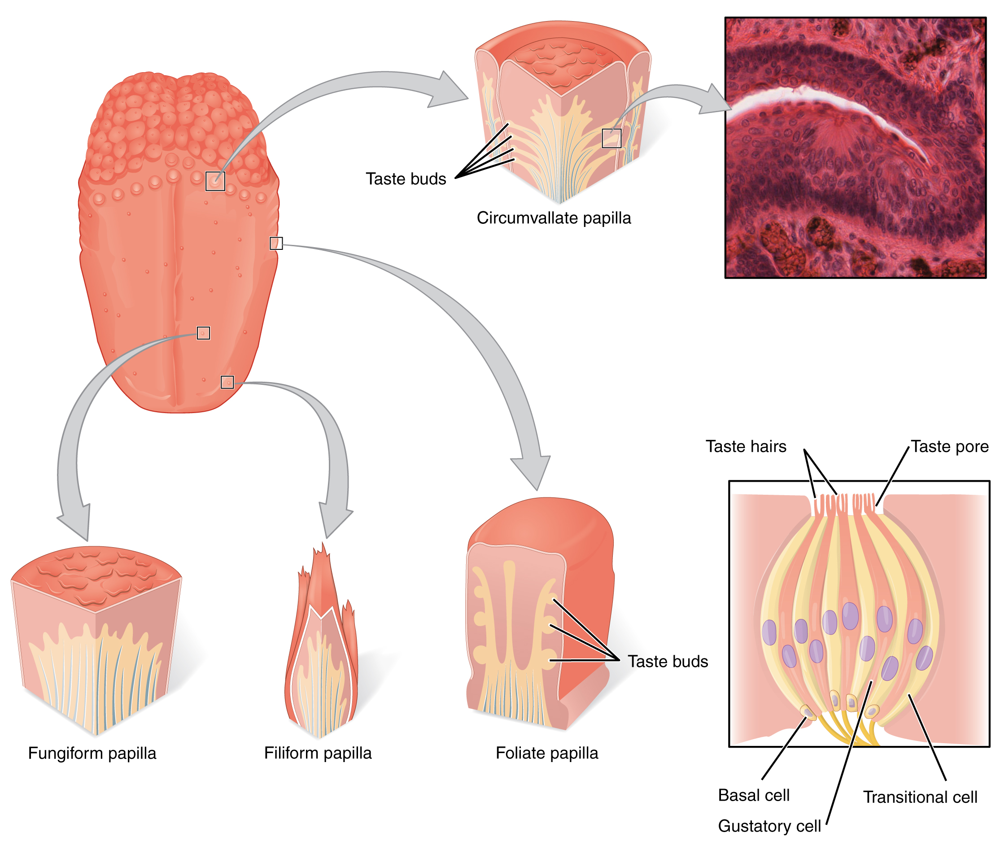
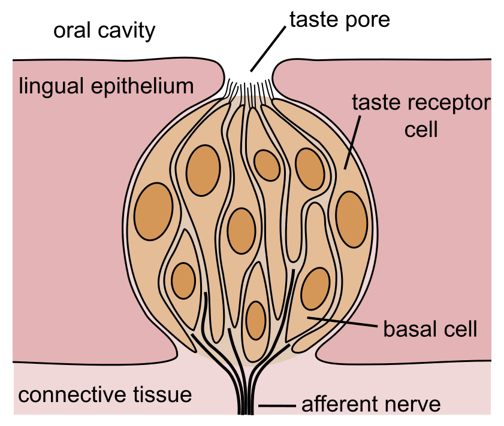
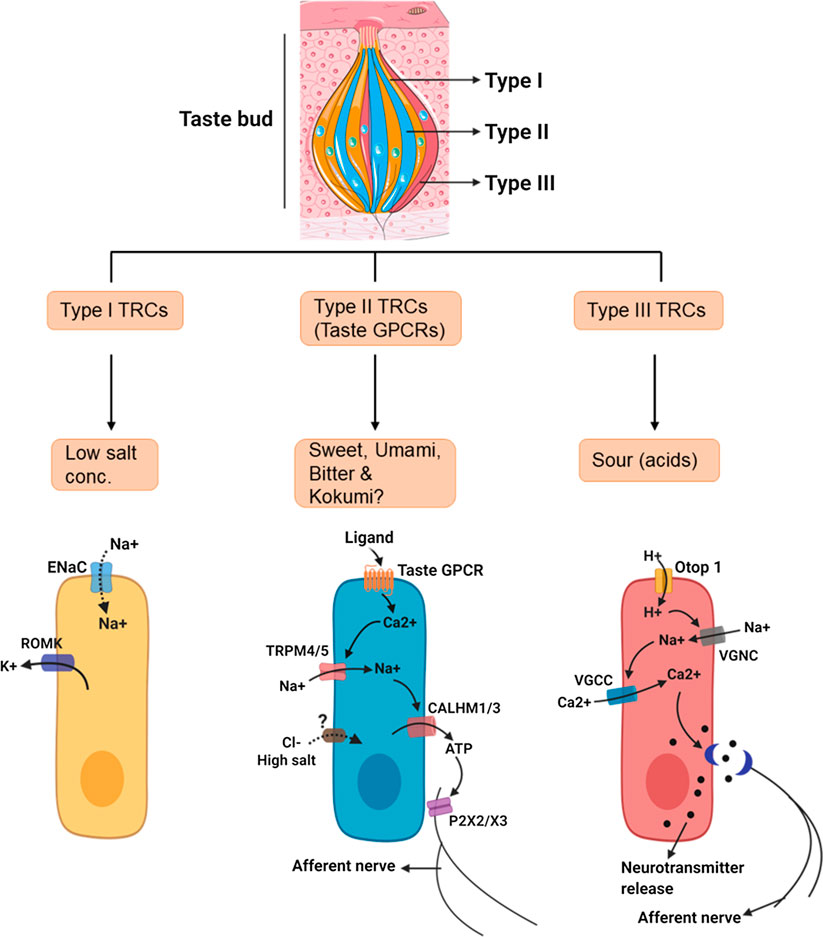
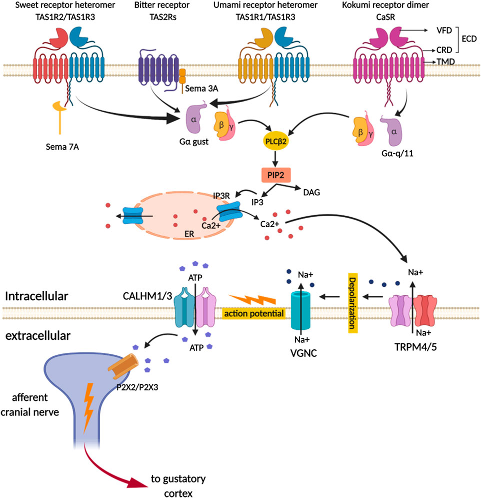
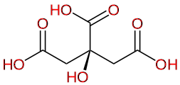
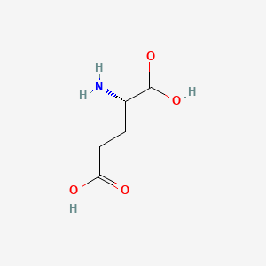

<!-- _class: lead -->

# 맛의 원리
## Principles of Taste

분자에서 "맛있다"까지

**Suhwan** · 2026-05-15 · Probe Lab Seminar

---

## 목차

1. **들어가며** — 맛이란 무엇인가
2. **혀에서 뇌까지** — 미뢰와 신경 경로 + 신호 전달 cascade
3. **5대 기본맛** — 분자·수용체·식품 + 단맛 결합 정밀 + 감칠 분자 생성
4. **"맛있다"의 원리** — hedonic + 시너지 + 농도 + OFC 통합 + gatekeeper
5. **직접 실험해 보자** — 9가지 자가 실험
6. **직접 해 본 결과** — 발표자 실제 측정
7. **마무리** — 그래서 맛이란?

**Appendix** A 한식 시너지 · B 오이·supertaster · C 미뢰 turnover · D 쓴맛 방어 · E Glu acid vs umami

> 후각은 의도적으로 제외 — flavor의 큰 부분이지만 미각 메커니즘에 집중. 약 1시간 ~ 1시간 30분.

---

# 1. 들어가며

## 맛이란 무엇인가?

---

## 1.1 오감과 맛 — flavor의 5층

| 감각 | 기여 |
|---|---|
| **미각** (taste) | 5대 기본맛 — 단·짠·신·쓴·감칠 |
| **후각** (smell) | 휘발성 향 — flavor의 큰 부분 |
| **체성감각** | 점도·온도·매움 (chemesthesis) |
| **시각** | 색·형태·신선도 |
| **청각** | 씹는 소리·바삭함 |

> "**맛있다 / 맛없다**"의 1차 판단은 **미각이 압도적**. 다른 감각은 호불호의 미세 조정·flavor 풍부함에 기여.

---

# 2. 혀에서 뇌까지

## 미뢰와 신경 전달 경로

---

## 2.1 혀의 풍경 — Papillae 4종



<p class="small">OpenStax fig.14.3 "The Tongue" — Wikimedia Commons, CC BY 4.0</p>

---

## 2.1 Papillae 4종 비교

| Papilla | 모양 | 위치 | 미뢰 수 | 신경 | 기능 |
|---|---|---|---|---|---|
| **Filiform** (사상) | 가는 실 | 표면 대부분 | **0** | 삼차 | **마찰·grip** (미각 X) |
| **Fungiform** (버섯) | 둥근 머리 | 앞 2/3 | 1~5 | CN VII | **첫 식별** |
| **Foliate** (엽상) | 평행 잎 | 옆 후방 | 수십 | VII/IX | **분쇄 중 평가** |
| **Circumvallate** (성곽) | dome + 도랑 | 뒤 V자 8~12개 | **250~수천** | CN IX | **삼키기 직전 마지막 검사** |

---

## 2.1 진화의 통찰 — 음식 처리 흐름과 정합

```
혀 끝 (앞)        →        혀 가운데·옆        →        혀 뒤
[빠른 첫 인상]              [분쇄 평가]                    [정밀 마지막 검사]
fungiform                   foliate                        circumvallate
"먹어볼까?"                 "괜찮아?"                      "삼킬까/뱉을까?"
```

→ 삼키기 직전 검사 station(circumvallate)에 **쓴맛 수용체(T2R) 비중 가장 높음** = **독 회피의 마지막 방어선**

---

## 2.2 미뢰의 양파형 구조



<p class="small">NEUROtiker 2007, Wikimedia Commons, Public Domain</p>

---

## 2.2 미뢰 특징 정리

- **양파처럼 50~150개 세포가 다발로 모임**
- 정점에 **taste pore (미공)** — 분자가 들어오는 입구
- 약 **10~14일 주기로 세포 교체** (자세히는 부록 C)

→ 항상 새로 만들어지는 동적 조직. 항암제 등이 분화 회로를 막으면 미각 상실.

---

## 2.3 미각세포 4종 — 분업의 정확성

| Type | 별명 | Marker | 역할 |
|---|---|---|---|
| **Type I** | glia-like | GLAST, NTPDase2 | 지지·이온 항상성 (짠맛 부분 후보) |
| **Type II** | **receptor cells** | PLCβ2, gustducin, TRPM5 | **단·쓴·감칠** (한 세포 = 한 modality) |
| **Type III** | **presynaptic cells** | SNAP25, 5-HT, PKD2L1 | **신맛** (전통 시냅스) |
| **Type IV** | basal/stem | Lgr5, Sox2 | 줄기세포 — 새 세포 분화 |

핵심: Type II 한 세포는 **단/쓴/감칠 중 단 하나만** 검출 (labeled-line at cell level)

---

## 2.3 Type I/II/III 세포 분업



<p class="small">Ahmad & Dalziel 2020, Frontiers in Pharmacology, CC BY 4.0</p>

---

## 2.4 신호 전달 — 세 가지 회로

진화는 **분자 종류에 맞춰** 회로 복잡도를 다르게 설계.

| 검출 분자 | 1차 수용체 | 단계 | 출력 |
|---|---|---|---|
| organic 분자 (단·쓴·감칠) | GPCR (T1R/T2R) | **~8단계** | ATP (channel synapse) |
| H⁺ (신) | OTOP1 | ~5단계 | 5-HT (전통 시냅스) |
| Na⁺ (저농도 짠) | ENaC | ~1~2단계 | (회로 미완) |

> **회로 복잡도가 분자 복잡도에 비례**. 단순한 이온은 단순한 회로.

---

## 2.4.1 Type II 회로 — GPCR cascade 도식



<p class="small">Ahmad & Dalziel 2020, CC BY 4.0</p>

---

## 2.4.1 8단계 cascade 전체 흐름

```
ligand → GPCR → Gα(GDP→GTP) / Gβγ 분리
                    ↓
                PLCβ2 활성화
                    ↓
                PIP2 → IP3 + DAG
                    ↓
                IP3R → ER에서 Ca²⁺ 폭발 방출
                    ↓
                TRPM5 (Ca²⁺ 게이트) → 막 탈분극
                    ↓
                CALHM1/3 메가포어 (전압 + Ca²⁺) → ATP 누출
                    ↓
                미각 신경 P2X2/P2X3 → 활동 전위
```

총 증폭률 ≈ **10³~10⁴배** (nM ligand → μM ATP 신호)

---

## 분자 용어 1 — Conformation

**분자의 3차원 자세(모양)**

- 같은 원자 구성·결합이라도 단일결합 회전으로 여러 자세
- 자세마다 결합 파트너·기능이 달라짐
- **단백질은 자기 모양을 바꿔서 일한다**
- 신호 전달 = "한 단백질 자세 변화 → 옆 단백질 자세 변화"의 연쇄

비유: 사람의 자세 (팔 벌림·주먹 쥠) — 자유로운 변환

---

## 분자 용어 2 — GDP/GTP cycle

G-protein은 손에 쥔 명찰을 갈아끼우며 on/off

- **GDP** (인산 2개) = "off" 명찰
- **GTP** (인산 3개) = "on" 명찰 (에너지 충전)
- Gα는 그대로, **쥔 nucleotide만** 바뀜

```
[Gα·GDP off] → GPCR 자극 → [Gα·GTP on] → effector 활성화
                                            ↓
                                      Gα 자체 GTPase
                                            ↓
[Gα·GDP off] ← 자동 복귀 ← [GTP → GDP 가수분해]
```

분자 권총의 **안전장치 cycle**

---

## Step 1 — GPCR 종류 (T1R · T2R)

7번 막 관통 단백질. binding pocket이 분자 모양 인식.

| modality | 구성 | Class |
|---|---|---|
| **단** | T1R2 + T1R3 heterodimer | Class C |
| **감칠** | T1R1 + T1R3 heterodimer | Class C |
| **쓴** | T2R 가족 (~25종) | Class A |

- 한 cell = 한 modality (T1R2 cell vs T1R1 cell 배타적)
- T1R3는 두 partner 중 **하나와만** 짝
- 쓴 cell은 다수 T2R 동시 발현 → 분자 구분 약, 안전망 우선

---

## Step 2-4 — G-protein → PLCβ2 → IP3 → Ca²⁺

- **Gα-gustducin** = 미각 전용 G-protein (KO 마우스 미각 거의 소실)
- Gα·GTP·Gβγ 분리 → **Gβγ가 PLCβ2 활성화**
- PLCβ2 → 막의 **PIP2를 IP3 + DAG로 가수분해**
- IP3가 **ER 막의 IP3R 결합** → ER → 세포질 Ca²⁺ 방출

**ER 안 [Ca²⁺] ≈ 0.5 mM, 세포질 ≈ 100 nM — 약 5000배 차** → 한순간에 폭발 방출

→ cascade의 **가장 큰 amplification 단계**

---

## Step 5 — TRPM5: Ca²⁺ → 막 탈분극

**TRPM5** = Ca²⁺-activated cation channel

- 세포질 Ca²⁺ 상승이 게이트
- Na⁺ 유입 → 막 탈분극 (-60 → 0 mV)
- TRPM5 KO 마우스: 단·쓴·감칠 응답 거의 소실 (in vivo 핵심 증명)

**왜 TRPM5인가?** 미각 cell은 진정 neuron 아니라 Nav 약함 → **Ca²⁺ activation 우회로**로 막전위 생성

---

## Step 6-7 — CALHM1/3 → ATP 누출

**CALHM1/3** = 메가포어 채널 (직경 ~14 Å)

- **8 subunit** octameric ring (cryo-EM)
- 전압 + Ca²⁺ **이중 게이트**
- ATP(~500 Da) 같은 큰 분자 통과 가능

세포 내 ATP ~1~5 mM, 외부 << μM → **10⁴배 농도 차**
→ CALHM 열림 → **ATP가 passive diffusion으로 누출**

**시냅스 소포 없이!** ← Channel synapse

---

## Channel synapse — 미각의 진화적 발명

전통 시냅스 (vesicle + SNARE + exocytosis)와 완전히 다른 비전통 메커니즘.

진화 이유 5가지:

1. **Epithelial origin** — 진정 neuron 아니라 vesicle 기계 약함
2. **속도** — fusion ~수십 ms vs 채널 게이트 ~ms
3. **에너지 효율** — vesicle 재합성·재충전 없음
4. **graded 신호** — 자극 강도 = 게이트 시간
5. **연료 풍부** — ATP는 모든 세포에 mM 농도

→ 미각이 잘 정의된 첫 예 (Taruno 2013)

---

## Step 8 — P2X2/P2X3 → 활동 전위

방출된 ATP가 시냅스 틈을 ~수 μm 확산 → 미각 신경 fiber 막의 **P2X2 / P2X3** (purinergic ionotropic receptor) 결합

- ATP 결합 → 채널 열림 → Na⁺·Ca²⁺ 유입 → 신경 막 탈분극 → 활동 전위
- **P2X2 KO + P2X3 KO** double 마우스: 모든 미각 응답 소실 (in vivo 결정적 증명)

→ 8단계 cascade 완료. nM ligand → μM ATP 신호 → 신경의 활동 전위.

---

## 2.4.2 Type III 회로 — 신맛 (이중 메커니즘)

```
H⁺ → OTOP1 (proton channel)
         ↓
세포 안 산성화
         ↓
   (a) Kir2.1 channel을 H⁺이 직접 block
   (b) OTOP1으로 들어온 H⁺ 자체 양이온 부하
         ↓
   막 탈분극 (두 효과 합)
         ↓
   VGCC → Ca²⁺ 외부 유입
         ↓
   5-HT vesicle exocytosis (전통 시냅스)
         ↓
   미각 신경 5-HT3R → 활동 전위
```

→ 두 메커니즘이 합쳐야 신뢰성 있게 임계점 초과

---

## 2.4.3 짠맛 — ENaC 직접 (저농도)

```
Na⁺ → ENaC (α/β/γ heterotrimer) → Na⁺ 유입 → 즉시 탈분극
```

- ENaC 항상 부분 개방, gradient로 자동 유입
- **amiloride** = 차단제 → 약한 짠맛 사라지고 강한 짠맛 남음

| 농도 | 회로 | 평가 |
|---|---|---|
| 저농도 (<0.5%) | ENaC | "맛있다" — 미네랄 |
| 고농도 (>1%) | ENaC + Type II/III 동원 | "써·시다, 피해야" |

→ **같은 분자에 농도별 다른 평가 회로**

---

## 2.4 세 회로의 공통 진화 원리

1. **분자 복잡도 = 회로 복잡도** — 다양한 organic → GPCR; 단순 이온 → 채널
2. **Ca²⁺이 보편 통화** — 세 회로 모두 Ca²⁺ 상승을 거침
3. **출력 분자가 modality 결정** — ATP / 5-HT / ? → labeled lines의 분자 기반
4. **Channel synapse는 새 발명** — epithelial origin이 만든 우회로
5. **분자 같아도 cell 다르면 의미 다름** — 뇌가 "주소"를 본다

---

## 2.5 분자 → 뇌 routing

같은 ATP라도 **어느 세포에서 나왔는지가 modality**:

```
[단맛 세포] (T1R2/T1R3) → ATP ─→ 단맛 fiber → NTS 단맛 → insula 단맛
[쓴맛 세포] (T2R)       → ATP ─→ 쓴맛 fiber → NTS 쓴맛 → insula 쓴맛
[감칠 세포] (T1R1/T1R3) → ATP ─→ 감칠 fiber → NTS 감칠 → insula 감칠
[신 세포]   (OTOP1)     → 5-HT ─→ 신 fiber  → NTS 신  → insula 신
[짠 세포]   (ENaC)      → ?    ─→ 짠 fiber  → NTS 짠  → insula 짠
```

**비유 — 택배**: 같은 트럭(ATP), 발신지·수신지가 다르면 routing이 정보.

말초 → NTS(연수) → VPM 시상 → 1차 미각 피질 → **OFC** → 보상 회로

---

# 3. 5대 기본맛

## 4대에서 5대로

---

## 3.1 4대 통설 (200년)

19세기~20세기 중반 교과서:

> **단(sweet) · 짠(salty) · 신(sour) · 쓴(bitter)**

각 맛의 본유 hedonic:
- **단** = 영양 (탄수화물) → 양의 신호
- **짠** = 미네랄·체액 항상성 → 농도 의존
- **신** = 익은 과일 / 부패 → 양가
- **쓴** = 식물 독 회피 → 음의 신호

그러나 한 가지가 빠져 있었다.

---

## 3.2 1908년, 5번째 맛의 발견

**池田菊苗 (Ikeda Kikunae)** — 도쿄제국대학 화학과 교수

다시마 국물에서 **글루탐산 sodium 염 (MSG)**을 분리:

> **"うま味 (umami)"** — 旨い味 = "맛있는 맛"

학계 반응은 차가웠다 → 100년의 검증:

- **2000년** — T1R3 수용체 동정 (Adler et al.)
- **2002년** — T1R1/T1R3 → 글루탐산 응답 (Nelson, *Nature*)
- **2008년** — T1R1 VFT cleft + IMP allosteric (Zhang, *PNAS*)

**5대 기본맛 = 표준** (지각 독립성 + 전용 수용체·신경 + 생물학적 의의)

---

## 3.3 5대 modality 한눈에

| Modality | 본유 hedonic | 분자 | 수용체 | 세포 | 의미 |
|---|---|---|---|---|---|
| **단** | + (강) | sucrose, fructose | T1R2/T1R3 | Type II | 영양 |
| **짠** | + (0.9% 최대) | NaCl | ENaC | (논쟁) | 미네랄 |
| **신** | 양가 | citric, lactic | OTOP1 | Type III | 익은 과일·부패 |
| **쓴** | − (강) | quinine, caffeine 등 | T2R 25종 | Type II | 독 회피 |
| **감칠** | + (강) | glutamate, IMP, GMP | T1R1/T1R3 | Type II | 단백질 |

---

## 3.4 단맛 — 분자


<p class="small">Sucrose C₁₂H₂₂O₁₁ — Wikimedia Commons, PD</p>

- **자연 당류**: sucrose, glucose, fructose, lactose, maltose
- **당알코올**: xylitol, erythritol, sorbitol
- **인공 감미료**: aspartame (×200), saccharin (×300), sucralose (×600)
- **단백질 감미료**: brazzein, thaumatin (×수천)

---

## 3.4 T1R2/T1R3 — 3층 구조 (Class C GPCR)

```
┌──────────────────────────────────────┐
│  ATD/VFT — Venus Flytrap            │ ← sugar 받는 큰 cleft
│  (식충식물 입처럼 여닫힘)            │
├──────────────────────────────────────┤
│  CRD — Cysteine-Rich Domain         │ ← 신호 전달 도관
├──────────────────────────────────────┤
│  TMD — 7개 막 관통 helix             │ ← 일반 GPCR 본체
├──────────────────────────────────────┤
│  C-tail (intracellular)              │ ← G-protein 결합
└──────────────────────────────────────┘
```

T1R2 + T1R3가 **세 층 모두에서** dimer 인터페이스 → 한 단위로 작동

---

## 3.4 단맛 분자 — 5가지 결합 자리

"VFT cleft에 들어간다" 한 마디 안에 다섯 곳이 숨어 있다.

| 단맛 분자 | 결합 부위 |
|---|---|
| 자연 당 (sucrose, glucose) | **T1R2 VFT cleft** (주) |
| 합성 감미료 (aspartame, sucralose) | T1R2 VFT cleft |
| **Cyclamate, NHDC** | **T1R3 TMD pocket** ← 다른 위치 |
| **단백질 감미료 (thaumatin)** | **T1R3 외부 표면** + CRD |
| Lactisole (차단제) | T1R3 TMD allosteric |

→ 인공 감미료 가열 안정성·뒤끝 다른 이유 = **결합 자리 분리**

---

## 3.4 AH-B-X 모델 — 단맛의 화학적 정의

Shallenberger·Acree (1967), Kier (1972)

```
       AH ────── B
        │  ~3 Å  │
        │        │
        └─ ~5 Å ─ X

   AH = H-bond donor (–OH, –NH₂)
   B  = H-bond acceptor (=O, –O–)
   X  = 소수성 그룹 (ring)
```

이 삼각형이 T1R2 VFT cleft 내벽 잔기 3자리에 동시 맞물려야 단맛 신호

**Sucrose 매핑**: glucose C6-OH / glycosidic O / ring 골격

---

## 3.4 Sucrose 결합 잔기 + K_d

cleft에서 sucrose와 결합하는 T1R2 잔기:

- **Ser144, Tyr103, Asp142, Glu302** — H-bond 4개
- **Phe35, Phe186** — 소수성 접촉 2개
- 총 ~4~6 H-bond + 2~3 van der Waals

→ **K_d ≈ 50 mM** (약한 결합)
→ 입에서 단맛 느끼려면 sucrose 농도 ~1.7~17%
→ **일상에서 설탕 한 스푼씩 넣는 분자 이유**

---

## 3.4 인공 감미료 K_d 비교

| 감미료 | 강도 | 결합 자리 | K_d |
|---|---|---|---|
| Sucrose | × 1 | T1R2 VFT | ~50 mM |
| Aspartame | × 200 | T1R2 VFT | ~수 μM |
| Sucralose | × 600 | T1R2 VFT | ~수 μM |
| Saccharin | × 300 | T1R2 VFT | ~10 μM |
| Cyclamate | × 30 | T1R3 TMD | ~수 mM |
| Thaumatin | × 2000~3000 | T1R3 외부 | ~nM |

**강도 ∝ 1/K_d** — 분자가 더 "단" 게 아니라 **더 강하게 들러붙음**

---

## 3.5 짠맛

- **분자**: Na⁺·K⁺·Mg²⁺·Ca²⁺ (소금)
- **수용체**: ENaC (저농도) + 미해결 회로 (고농도)
- **식품**: 소금, 간장, 김치, 햄

**0.9% NaCl의 비밀** — 인간이 가장 맛있는 짠 농도 = **혈장 등장액 = 생리식염수**

→ 우리 몸 체액과 일치하는 농도가 가장 자연스럽게 느껴지도록 진화

(부록 D에서 강한 짠맛의 두 번째 회로)

---

## 3.6 신맛 — TCA cycle의 부산물



<p class="small">Citric acid — Wikimedia Commons, PD</p>

자연 신맛 분자 = 거의 모두 **TCA cycle 중간체**

| 분자 | 식품 |
|---|---|
| citric acid | 감귤·토마토 |
| lactic acid | 김치·요거트 |
| acetic acid | 식초 |
| ascorbic acid (Vit C) | 과일 |

→ 모든 호기성 생명체 핵심 대사 부산물 → **익은 과일·발효식품 식별**

---

## 3.7 쓴맛 — 식물 방어 신호 (대표 분자)


<p class="small">Caffeine — Wikimedia Commons, PD. 식물 alkaloid의 전형적 예.</p>

---

## 3.7 쓴맛 — 분자 클래스

| 분자 클래스 | 예 |
|---|---|
| Alkaloid | caffeine, nicotine, quinine, morphine |
| Glucosinolate | 양배추·브로콜리의 매운 쓴 |
| Polyphenol·tannin | 차·와인의 쓴-떫음 |
| Cardenolide | 디기탈리스 강심배당체 |

→ 식물 secondary metabolite — **약 50%의 약이 쓴맛 이유**

---

## 3.7 T2R 25종 + 어린이 발달

- **T2R = 사람 ~25종** (다른 GPCR family보다 많음)
- 한 cell이 **다수 T2R 동시 발현** → "쓴 분자라면 뭐든 잡음"
- 사람이 카페인과 quinine 구분 못 하는 이유 — **광범위 안전망 우선**

**어린이는 쓴맛 거부가 강함**:
- T2R 민감도 ↑ + 발달 단계의 보호 신호
- 어른은 학습으로 일부 수용 (커피, 맥주, 다크초콜릿) — 단·감칠 동반 학습

(부록 D에서 자세히)

---

## 3.8 감칠맛 — 분자



<p class="small">PubChem CID 33032 — NCBI/NIH, PD</p>

| 분자 | 식품 |
|---|---|
| **L-Glutamic acid** | 다시마, 토마토, 치즈, 모유, 발효식품 |
| **5'-IMP** (이노신산) | 가쓰오부시, 멸치, 고기 |
| **5'-GMP** (구아닐산) | 표고버섯 (말린) |
| **5'-AMP** (아데닐산) | 보조 |

---

## 3.8 감칠 분자 = "한때 생명이었던 것의 화학 흔적"

| 분자 | 무슨 신호 | 어디서 |
|---|---|---|
| Free Glu | 양질의 단백질 + 잘 익은 식물 | 단백질 분해 + 식물 자체 축적 |
| 5'-IMP | 신선한 동물 단백질 | 세포 사후 ATP 분해 |
| 5'-GMP | 버섯·곰팡이성 식품 | 세포 사후 RNA 분해 |

→ 진화가 박은 **식품 품질·안전 센서**. 부패 직전(IMP → hypoxanthine)에는 신호가 음으로 전환.

---

## 3.8 Free Glu — 단백질 분해 5가지 경로

**갇힌 Glu는 감칠맛 안 남** (peptide 결합). **자유 Glu만** T1R1/T1R3 인식.

| 상황 | 일어나는 일 | 예 |
|---|---|---|
| **숙성** | protease 천천히 분해 | 파르메산, 잠봉, 김치 |
| **발효** | 곰팡이·세균 protease | 간장·된장·어간장 |
| **자가소화** | 사후 효소 자기 분해 | 가쓰오부시, 멸치액젓 |
| **느린 가열** | 열 변성 + 가수분해 | 곰탕, 토마토 소스 |
| **외부 효소** | papain, bromelain | 고기 연육 |

→ **"숙성·발효·오래 끓인 것" = 감칠맛 분자 정의**

---

## 3.8 Free Glu — 식물의 자체 축적

| 식품 | Free Glu (mg/100g) | 이유 |
|---|---|---|
| 건다시마 | 2000~3200 | 바닷물 osmoprotectant 축적 |
| 잘 익은 토마토 | ~250 | 성숙 중 free Glu 폭증 |
| 풋 토마토 | ~40 | 미숙 |
| 파르메산 (24개월) | ~1200 | 숙성 분해 |
| 간장 | ~780 | koji 곰팡이 분해 |
| 모유 | ~22 | 영아 단백질 맛 학습용 |

→ **"잘 익은 토마토가 더 맛있는" 분자 이유**

---

## 3.8 5'-IMP — 사후 ATP 분해

**살아 있는 세포엔 IMP 없음**. 모두 ATP (~1~5 mM).

```
ATP → ADP → AMP → IMP → inosine → hypoxanthine
              └─AMP deaminase─┘
              (사후 단계 핵심)
```

| 식품 | IMP (mg/100g) | 비고 |
|---|---|---|
| 가쓰오부시 | ~700 | 어획 + 자가소화 + 건조 농축 |
| 멸치 (말린) | ~280 | 같은 원리 |
| 닭 | ~230 | 도축 후 24~48h IMP peak |
| **신선 활어** | **~0** | ATP 아직 미분해 |
| **24h 숙성 회** | ~150 | "회를 하루 묵히면 더 맛있다" |

---

## 3.8 5'-GMP — RNA 분해 (건버섯의 비밀)

세포 사후 **RNase 활성화** → RNA에서 GMP 풀어냄.

| 식품 | GMP (mg/100g) | 이유 |
|---|---|---|
| **건 표고** | ~150 | 건조 중 세포 lysis + RNase 활성 |
| 건 모렐 | ~40 | |
| 건 포르치니 | ~10 | |
| **생 표고** | ~70 (낮음) | 세포 살아 있어 RNase 작동 X |

→ **"표고는 말려야 진가가 나온다"** — 한식·중식 마른 표고 육수가 핵심인 분자 이유

---

## 3.8 식품별 감칠 분자 매핑

| 식품 | Free Glu | 5'-IMP | 5'-GMP |
|---|---|---|---|
| 건다시마 | ★★★ | — | — |
| 잘 익은 토마토 | ★★ | — | — |
| 숙성 치즈 | ★★★ | — | — |
| 간장·된장 | ★★★ | (소) | — |
| 가쓰오부시 | (소) | ★★★ | — |
| 멸치 (말린) | (소) | ★★ | — |
| **건 표고** | (소) | — | ★★ |
| 활어 회 | (소) | (거의 0) | — |

→ **식물(Glu) + 동물(IMP) + 곰팡이(GMP)** 조합 = 시너지 폭탄

---

## 3.8 Yamaguchi 시너지 (1967)

MSG + IMP / GMP 조합이 **단순 합산보다 8배 이상 강한 감칠**:

```
y = u + γ · u · v
```
- u, v: 각 분자 농도
- γ: 시너지 계수 (IMP γ=1218, GMP γ=2800)

**한식·일식의 분자적 핵심**:
- **다시 = 다시마(Glu) + 가쓰오부시(IMP)** → 감칠 폭탄
- 한식에서 멸치(IMP) + 다시마(Glu), 김치(Glu + lactic)
- (부록 A에서 자세히)

---

## 3.8 T1R1/T1R3 VFT 협동 결합 메커니즘

```
Glu가 cleft에 들어감 → VFT 닫힘 → 7TM 활성 → gustducin → ATP 신호
        ↑
   IMP가 옆에서 "clip"으로 잡아줌
```

→ Glu만 있을 때보다 IMP 함께 있으면 **closed conformation이 안정** = 신호 증폭

Zhang 2008 *PNAS*에서 결정 구조로 확인된 협동 모델.

(왜 글루탐산이 산인데 신맛 아닌 감칠인지는 부록 E)

---

# 4. "맛있다"의 원리

## 조합과 농도

---

## 4.1 "맛있다"는 분자 자체가 아니다

> **맛있다 = 자극 분자의 다중모달 신호 패턴이 OFC에서 평가될 때, 영양·항상성·번식 가치 함수에 양의 기여를 한다고 진화·학습·맥락이 합쳐져 판정한 결과.**

함축:
1. **맛은 분자가 아니라 신호 패턴**
2. "맛있음"의 절대 기준은 없다 — 상태·학습·문화 의존
3. 단일 분자가 아니라 **조합과 농도** 결정적

---

## 4.2 본유 hedonic 베이스라인


<p class="small">단·감칠 단조↑ (영양) / 짠 inverted-U (항상성, 0.9% peak) / 신 양가 / 쓴 단조↓ (독)</p>

→ **곡선 모양 자체가 진화 우선순위**

---

## 4.3 modality 쌍 시너지·억제 회로

| 쌍 | 의미 | 효과 | 예 |
|---|---|---|---|
| **단 + 짠** | 영양 강화 | 약한 시너지 | 소금 캐러멜, 단팥 |
| **단 + 신** | 익은 과일 | **단이 신을 가림** | 레모네이드, 가당 요거트 |
| **단 + 쓴** | 약·차 | **단이 쓴을 강하게 가림** | 다크초콜릿, 약 코팅 |
| **짠 + 감칠** | **단백질·영양** | **강한 시너지** | 간장·된장·치즈 |
| **쓴 + 신** | 자연 독 | 강한 시너지 (둘 다 ↑) | (강한 거부) |
| **감칠 + 신** | 발효식품 | 균형·복합 | 김치, 토마토 |

---

## 4.4 단 + 짠 — 소금 캐러멜의 비밀

```
[단독] 설탕 10% → 단순한 단맛
[조합] 설탕 10% + 소금 0.1% → 더 풍부한·복합적 단맛
```

메커니즘 (가설):
1. 적은 Na⁺이 K⁺ 차단 → 단맛 신호 약간 증폭
2. 단·짠이 같은 OFC 영양 신호로 통합 → hedonic ↑
3. 단의 단조성을 짠이 분절·강조

응용: 소금 캐러멜, 단팥(소금 약간), 슈크림, 멸치+꿀

---

## 4.5 짠 + 감칠 — 한식의 분자적 핵심

**가장 강한 시너지** — 인간이 가장 일관되게 "맛있다"고 평가

이유: **단백질 + 미네랄 = 영양의 가장 좋은 신호** (진화적 사냥감·발효식품)

분자 메커니즘:
- Na⁺이 T1R1/T1R3 결합 affinity 강화 (allosteric)
- 신경 통합에서 같은 OFC 영역에서 강화

응용 (한식의 거의 전부):
- **간장·된장·김치·치즈·다시+소금**

> 한식·일식 발효식품 = 짠+감칠 시너지를 분자적으로 극대화한 진화

---

## 4.6 단 + 신 — 익은 과일

레모네이드 황금비:

```
설탕 : 식초 ≈ 10 : 1 (질량)
```

- 화학적 중화 X (sucrose 안 산성)
- 진짜 메커니즘: **신경 단계 mixture suppression**
  - NTS·insula에서 단맛 신호가 신맛 인지 약화
  - OFC에서 단의 양 신호가 신의 sharpness 완화

진화적 의미: **익은 과일 식별 회로**
- 풋과일 = 신↑ 단↓ → 회피
- 익은 과일 = 신↓ 단↑ → 추구

---

## 4.7 농도 Goldilocks + 0.9% 비밀

| Modality | 검지역치 | 최대 쾌감 | 거부 시작 |
|---|---|---|---|
| **단** | ~10 mM | 단조 ↑ | ~20% (포화) |
| **짠** | ~10 mM | **0.9% (혈장)** | ~3% (바닷물) |
| **신** | pH ~4 | 약~중 (맥락) | pH < 2.5 |
| **쓴** | ~10 μM | 거의 X | 거의 모든 농도 |
| **감칠** | ~3 mM | 단조 ↑ + 시너지 | 진한 농도 드묾 |

**0.9% NaCl = 혈장 등장액 = 생리식염수** — 체액과 일치하는 농도가 가장 맛있게 진화

---

## 4.7 정량 농도-쾌감 곡선 (sourced)


<p class="small">Sources: Moskowitz 1971, Beauchamp & Cowart 1985, Pangborn 1968, Yamaguchi 1967, Conner & Booth 1992</p>

곡선 모양 = 진화 우선순위 → 영양 monotone↑ / 항상성 inverted-U / 위험 monotone↓

---

## 4.8 쓴맛 = "없는 것이 좋음"

5대 기본맛 중 **쓴맛만 거의 모든 농도에서 거부 신호**.

- 자연의 독 = 쓴 분자 (alkaloid, glucosinolate, polyphenol, cardenolide)
- T2R 25종으로 **광범위 검출** → "어떤 독이 와도 같은 경고: 뱉어라"

**학습된 쓴맛 수용**:
- 커피·맥주·다크초콜릿·차 → 단·감칠 동반 학습
- 어린이는 거부 강함 (T2R 민감도 ↑ + 발달 보호)

응용: 약 코팅 단맛, 약 50%가 식물 alkaloid 유래라 약은 거의 쓰다 (부록 D)

---

## 4.9 OFC — 다중 신호 통합

```
[혀 5 미각]
[후각 (orthonasal + retronasal)]
[체성감각 (점도·온도·매움)]       ─→ OFC ─→ "맛있다" 점수
[시각·청각]                                    ↓
[항상성 (배고픔·만복)]                    NAc/VTA dopamine
[학습·기억·문화]                                ↓
[감정·사회 맥락]                              행동
```

OFC가 **가중 합산 + 가치 평가** → **개인·상태 의존 함수**

---

## 4.9 Berridge — wanting vs liking

- **Liking** = 음식 자체의 즐거움 (hedonic)
- **Wanting** = 얻으려는 동기 (motivational)

둘이 **분리될 수 있음** — 약물 중독에서 강한 wanting + 약한 liking

→ "맛있다"는 단순 점수가 아니라 **여러 차원의 평가**의 종합 신호

---

## 4.10 미각의 역할 — 필요조건이지 충분조건 아님

```
[미각 밸런스 OK]   → 맛있을 수도, 그저 그럴 수도 (사람마다 갈림)
[미각 밸런스 깨짐] → 거의 모두 "맛없다" 확정
```

미각 = **gatekeeper**. 통과 못 하면 다른 신호 무력화.

| 단계 | 무엇을 하나 | 역할 |
|---|---|---|
| 1차 — 미각 밸런스 | 짠·단·신·쓴·감칠 농도 적정 | "맛없다" 회피 (필요조건) |
| 2차 — 차별화 | 향·텍스처·맥락 | "맛있다" 만들기 (사람마다 다름) |

> **"맛없는 음식엔 합의, 최고 맛있는 음식엔 합의 안 됨"**

---

## 4.11 한 줄 요약

> **"맛있다" = 5대 기본맛의 본유 hedonic × modality 쌍 간 시너지·억제 × 농도 적정성 × 항상성·학습·문화 가중치 → OFC의 양의 가치 평가.**

또는 짧게:

> **요리 = modality 가중치 + 다중모달 패턴의 조정 기술.** 짠+감칠 시너지·단+신 가림·향과의 일치 등 진화 회로를 활용한 hedonic 최대화.

---

# 5. 직접 실험해 보자

## 250 mL 기준 9가지 실험

---

## 5.1 준비물 — 250 mL 기준

| 재료 | 역할 |
|---|---|
| 물 250 mL | 모든 실험의 base |
| 소금 | NaCl — 짠맛 |
| 설탕 | sucrose — 단맛 |
| 미원 (MSG) | glutamate — 감칠맛 |
| 식초 | acetic acid — 신맛 |
| 육수코인 | 향 추가 (감칠 + 향) |

> 측정 = 자신의 혀. 한 모금씩, 입을 헹구며.

---

## 5.2 실험 디자인 — 단일·이중 조합 (1~5)

| # | 조합 | 목적 |
|---|---|---|
| 1 | 물 만 | base |
| 2 | + 소금 0.225 g (0.09%) | 검지 부근 |
| 3 | + 소금 2.25 g (0.9%) | 혈장 등장액 |
| 4 | + 설탕 25 g (10%) | 단맛 최적 |
| 5 | + 설탕 12 g + 식초 1 큰술 | 단+신 균형 |

---

## 5.2 실험 디자인 — 감칠·시너지·통합 (6~9)

| # | 조합 | 목적 |
|---|---|---|
| 6 | + 미원 0.75 g (0.3%) | 감칠 최적 |
| 7 | + 미원 + 소금 (작) | 짠+감칠 시너지 |
| 8 | + 식초 1 큰술 | 신 단독 |
| 9 | + 미원 + 소금 + 식초 + 육수코인 | 향까지 통합 |

---

# 직접 해 본 결과

## 발표자 실제 측정 (§12)

---

## 발표자 실험 — 핵심 결과 (1)

| # | 평가 | 분자 해석 |
|---|---|---|
| 1. 물만 | 무미 | base |
| 2. 0.09% 소금 | 검지 부근, 거의 무미 | ENaC 약 활성 |
| 3. 0.9% 소금 | **분명히 맛있는 짠** | 혈장 등장액 — 진화의 sweet spot |
| 4. 10% 설탕 | 강한 단맛, 약간 진함 | T1R2/T1R3 포화 부근 |

→ 0.9% 짠맛이 가장 자연스럽다는 정성 확인

---

## 발표자 실험 — 핵심 결과 (2)

| # | 평가 | 분자 해석 |
|---|---|---|
| 5. 설탕 + 식초 | 청량감, 익은 과일맛 | 단+신 mixture suppression |
| 6. 0.3% 미원 | 감칠은 있지만 평면적 | T1R1/T1R3 단독 활성 |
| 7. 미원 + 소금 | **풍성, 깊이감** | 짠+감칠 시너지 (Na⁺의 T1R 강화) |
| 8. 식초 단독 | 시기만 함 | OTOP1 단독 — 부정적 |
| 9. 미원 + 소금 + 식초 + 육수 | **'맛있다' 임계 도달** | 다중 시너지 + 향까지 |

---

## 발표자 실험 — 결론

핵심 발견:
1. **0.9% 짠맛이 단독으로도 충분히 맛있다** — 혈장 등장액 신호
2. **소금 + 감칠**이 가장 강한 시너지 — 한식 분자 핵심
3. **신맛은 다른 modality와 결합해야 맛있다** (단·감칠 동반)
4. **향(육수코인)이 더해지면** 전체 통합이 한 단계 위로 — flavor의 큰 부분 확인

→ **단·감칠·짠 균형 + 신은 미세 조정 + 향 = 풍성한 맛**

---

# 6. 마무리

## 그래서 맛이란?

---

## 6.1 1시간 30분의 여정 정리

```
혀의 papillae 4종 (모양·위치·기능)
    ↓
미뢰의 양파형 구조 + 4종 세포 (Type I/II/III/IV)
    ↓
세포 내 transduction (GPCR cascade vs OTOP1 vs ENaC)
    ↓
미각 신경 → NTS → 시상 → 1차 미각 피질(insula) → OFC
    ↓
다중모달 통합 + 가치 평가 + 보상 회로
    ↓
"맛있다 / 맛없다" 행동
```

각 단계에 진화의 흔적. 모두가 매일 먹고 평가하는 행동의 분자 기반.

---

## 6.2 5대 기본맛 한 페이지 요약

| Modality | 분자 | 수용체 | 세포 | 진화 의미 |
|---|---|---|---|---|
| 단 | sucrose 등 | T1R2/T1R3 | Type II | 영양 |
| 짠 | NaCl | ENaC | (논쟁) | 미네랄 |
| 신 | citric 등 | OTOP1 | Type III | 익은 과일·부패 |
| 쓴 | quinine 등 | T2R 25종 | Type II | 독 회피 |
| 감칠 | Glu/IMP/GMP | T1R1/T1R3 | Type II | 단백질 |

→ 분자가 신호, 신호가 평가, 평가가 행동

---

## 6.3 핵심 메시지 3가지

1. **맛은 분자가 아니라 신호 패턴** — 같은 분자라도 맥락에 따라 다른 의미
2. **미각은 필요조건이지 충분조건 아님** — 밸런스는 통과 게이트, 차별화는 향·텍스처·맥락
3. **곡선의 모양 자체가 진화 우선순위** — 영양 단조↑ / 항상성 inverted-U / 위험 단조↓

---

## 6.4 Q&A

자유롭게 질문 주세요!

준비된 추가 질문 hints:
- 항암제는 왜 미각을 변화시키나? (부록 C)
- 오이를 누가 더 쓰게 느끼나? (부록 B)
- 약이 왜 거의 다 쓴가? (부록 D)
- 글루탐산은 산인데 왜 신이 아닌가? (부록 E)
- 한식의 분자 핵심? (부록 A)

---

# Appendix A

## 한식의 비밀 — 감칠+짠 시너지

---

## A. 한식의 5축 시너지

한식의 거의 모든 발효식품 = **짠 + 감칠 시너지**의 분자적 극대화

| 식품 | Glu source | 짠 source | IMP source |
|---|---|---|---|
| 다시 | **다시마** | (조정) | **가쓰오부시** |
| 멸치 다시 | (작) | (조정) | **멸치** |
| 김치 | **lactic 발효** | 소금 | (작) |
| 간장·된장 | **koji 발효** | 소금 | (작) |
| 표고 육수 | (소) | (조정) | **GMP** (RNA 분해) |

→ **식물 + 동물 + 곰팡이** 3차 시너지 = 다양한 농산물 환경의 진화적 응답

---

# Appendix B

## 오이는 왜 어떤 사람에게만 쓴가?

---

## B. TAS2R polymorphism

오이의 일부 개체는 **cucurbitacin** (강력한 쓴 분자) 함유

사람의 **TAS2R14** 유전자에 SNP 다형성 → cucurbitacin 인식 강도 차이

| genotype | 쓴맛 감각 |
|---|---|
| TT (highly sensitive) | 강한 쓴맛 |
| TC | 중간 |
| CC | 거의 안 느낌 |

**Toxic Squash Syndrome** ⚠️ — 호박류 cucurbitacin 과다는 위장 손상·탈모. 강한 쓴맛이 안전 신호이지만 supertaster만 명확히 감지.

→ "오이 싫어"는 유전형의 표현일 수 있음

---

# Appendix C

## 미뢰는 매주 새로 만들어진다

---

## C. Turnover + 항암제

미뢰 세포 **10~14일 주기 교체**:
- **Type IV stem cell**이 **Shh/Wnt 신호**로 분화 → Type I/II/III
- 항상 새로 만들어지는 동적 조직

**Hedgehog inhibitor (LDE225 등 항암제)**:
- Smoothened (Smo) 차단 → Shh 신호 끊김
- 미뢰 분화 회로 정지
- → **항암 치료 중 미각 상실/변형**

→ 미뢰가 끊임없이 재생되는 이유 = 분자 닳음·손상 빈번한 환경에서 신호 신뢰성 유지

---

# Appendix D

## 쓴맛 = 자연의 독 회피 신호

---

## D. 식물 secondary metabolites 6 클래스

| 클래스 | 예 | 약/독 |
|---|---|---|
| Alkaloid | morphine, atropine, nicotine | 약 ~50%가 alkaloid 유래 |
| Glucosinolate | sinigrin (양배추류) | 위 자극 |
| Cyanogenic | amygdalin (살구씨) | HCN 방출 — 독 |
| Polyphenol | tannin | 단백질 침전, 떫음 |
| Cardenolide | digitoxin | 강심배당체 |
| Terpenoid | quinine | 말라리아 약 |

→ T2R 25종이 광범위 검출 → **"어떤 독이 와도 같은 경고: 뱉어라"**

쓴맛 = 약효 신호 = 위험 신호 (구분 안 됨)

---

# Appendix E

## 글루탐산은 산인데 왜 감칠일까?

---

## E. Carboxylate vs H⁺ — 분자적 분리

글루탐산 = 약산 (α-COOH·γ-COOH·α-NH₃⁺ 세 ionizable)

식품 환경 (중성 pH ~7):
- **Carboxylate (-COO⁻) 형태** 우세
- 자유 H⁺ 농도 낮음 → **OTOP1 자극 X**
- **T1R1/T1R3가 carboxylate 인식 → 감칠 활성**

자유 글루탐산 (산성 환경):
- **-COOH + H⁺** 형태 함께
- OTOP1도 활성 + T1R1/T1R3도 활성 → **신 + 감칠** 함께

→ 같은 분자라도 **이온화 상태가 modality 결정**. 식품 pH가 신경 신호의 modality를 가른다.

---

# 마지막 한 마디

미각의 분자→신경→평가는:

- **다양성** (단·감칠·쓴) → GPCR + 긴 cascade + ATP channel synapse
- **항상성** (짠·신) → 빠른 채널 회로 + 좁은 농도 창
- **위험 회피** (쓴·고농도 신·짠) → 단조 거부
- **통합 평가** ("맛있다") → OFC 다중모달 가중 합산 + 학습·문화

진화가 새긴 **음식 품질 + 안전 + 영양의 분자 평가 system**.

> 정량 곡선의 모양 자체가 진화 우선순위다.

감사합니다.
