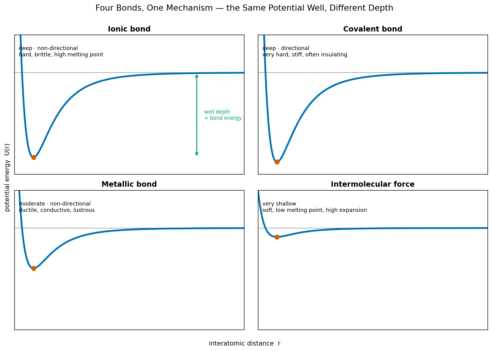

# 1. 들어가며 — 네 질문, 두 원리, 로드맵

[← README](README.md) · [→ 다음: 쿨롱 힘과 퍼텐셜 우물](02_coulomb-force-and-potential-well.md)

---

화학이라고 하면 보통 시험용 옥텟 규칙, 가전자 8개 외우기를 먼저 떠올린다. 이 글은 그런 화학이 아니다. 다이아몬드는 *왜* 지구상에서 가장 단단하고, 소금은 *왜* 망치에 곱게 깨지며, 구리는 *왜* 두드리면 늘어나고, 물은 *왜* 0 °C에서 얼고 100 °C에서 끓는지를, 단 두 가지 원리로 풀어가는 처음 원리(first principles)의 이야기다. 외울 것은 없다. 그래프 하나를 읽는 능력만 손에 쥐면 된다.

## 1.1 일상의 네 가지 질문

먼저 친숙한 질문 네 개를 던진다. 모두 한 번쯤 만나본 재료들이다. 표면적으로는 서로 무관해 보인다. 단단함, 깨짐, 휘어짐, 상전이는 다 다른 물성이고 다 다른 재료다.

| 재료 | 현상 | 질문 |
|---|---|---|
| 다이아몬드 | 극한의 경도 | *왜 지구상에서 가장 단단한가?* |
| 소금(NaCl) | 취성(brittleness) | *왜 망치질에 휘지 않고 곱게 깨지는가?* |
| 구리(Cu) | 연성(ductility) | *왜 두드리면 깨지지 않고 늘어나기만 하는가?* |
| 물(H₂O) | 상전이 | *왜 0 °C에서 얼고 100 °C에서 끓는가?* |

네 번째 질문에는 숨은 가시가 있다. 물보다 무거운 분자들이 오히려 한참 낮은 온도에서 끓는 경우가 많다. 비슷한 크기의 메테인(CH₄)은 −161 °C에서 끓는다. 그런데 더 가벼울 것 같은 물은 +100 °C까지 버틴다. 왜 유독 물만 이렇게 높은가? 이 글의 마지막에서 이 가시까지 같은 그래프로 뽑아낸다.

> **핵심 약속.** 이 네 질문은 서로 다른 네 개의 답을 요구하지 않는다. *하나의 같은 그래프* — 곧 퍼텐셜 우물(potential well) 그래프 — 로 네 답이 한꺼번에 떨어진다. 그래프의 깊이가 답하고, 곡률이 답하고, 비대칭이 답하고, 방향성이 답한다. 화학을 *외우는* 게 아니라 그래프 하나를 *읽는* 것이 목표다.

## 1.2 한 줄 명제 — 네 결합, 하나의 우물

이 글 전체를 한 문장으로 압축하면 다음과 같다.

> **네 종류의 화학 결합 — 이온·공유·금속·분자 간 힘 — 은 별개의 네 가지가 아니라 모양만 다른 같은 퍼텐셜 우물이다.**



*이온은 깊고 대칭, 공유는 깊고 방향성, 금속은 얕고 넓음, 분자 간 힘은 아주 얕음.*
*모두 인력과 반발이 합쳐진 같은 우물 구조이고, 깊이·폭·비대칭의 정도만 다르다.*

위 네 그래프는 모두 같은 구조다. 두 원자(혹은 두 입자)가 가까워질 때, 멀리서는 서로 끌어당기고(인력) 너무 붙으면 밀어낸다(반발). 인력과 반발의 합이 어느 거리에서 가장 낮은 에너지를 만드는데, 그 최저점이 바로 우물의 바닥이다. 이온 결합은 이 우물이 깊고 대칭이고, 공유 결합은 깊되 특정 방향을 고집하고, 금속 결합은 얕고 넓으며, 분자 간 힘은 우물이라 부르기도 민망할 만큼 얕다. 종류가 다른 게 아니라 *모양*이 다를 뿐이다.

그리고 이 우물의 기하학이 곧 거시 물성이다. 결합 종류를 외울 필요가 없다는 말은 과장이 아니다. 우물 하나의 깊이·곡률·비대칭·방향성을 읽으면, 그 재료의 융점·강성·열팽창·연성까지 처음 원리에서 끌어낼 수 있다.

## 1.3 모든 것을 떠받치는 두 원리

이 우물은 어디서 오는가. 놀랍게도 단 두 개의 원리에서 온다.

### 원리 1 — 쿨롱 법칙: 결합을 만드는 힘은 하나뿐

화학 결합에 작용하는 힘은 **쿨롱 힘** 하나다. 두 전하 사이의 힘은

$$ F = k\,\frac{q_1 q_2}{r^2} $$

로 주어진다. 같은 부호면 밀어내고, 다른 부호면 끌어당기며, 거리의 제곱에 반비례한다. 자연의 네 가지 기본 힘 중 나머지 셋은 화학에서 들러리도 못 된다. 중력은 원자 스케일에서 쿨롱 힘보다 약 $10^{36}$배 약해 완전히 무시되고, 강한 핵력과 약한 핵력은 핵 안쪽에만 갇혀 있어 원자 *바깥*의 결합과는 무관하다. 결합은 전적으로 전자기력, 곧 쿨롱 힘의 줄다리기다.

### 원리 2 — 에너지 최소화: 시스템은 우물 바닥을 찾는다

두 번째 원리는 더 단순하다. *시스템은 항상 퍼텐셜 에너지가 가장 낮은 상태로 간다.* 수학으로는 우물 바닥에서 기울기가 0이라는 조건

$$ \frac{dU}{dr}\bigg|_{r_0} = 0 $$

으로 적힌다. 원자 두 개가 만나면 둘은 퍼텐셜 에너지가 최저가 되는 거리 $r_0$에서 멈춘다. 그 멈춘 자리가 우물 바닥이고, 그것이 곧 결합 길이다. 더 깊은 우물은 더 강한 결합이고 더 높은 융점이다. 이게 전부다.

| 원리 | 식 | 한 줄 의미 |
|---|---|---|
| 쿨롱 법칙 | $F = k\,q_1 q_2 / r^2$ | 결합에 작용하는 유일한 힘. 인력과 반발의 출처 |
| 에너지 최소화 | $dU/dr \big|_{r_0} = 0$ | 시스템은 우물 바닥에서 멈춘다. 그 자리가 결합 길이 |

### 옥텟 규칙은 원리가 아니라 결과다

여기서 한 가지를 분명히 해 둔다. 학교에서 외운 옥텟 규칙, 가전자 8개, 원자가는 **원리가 아니라 위 두 원리의 결과**다. 닫힌 껍질이 안정한 것은 그 전자 배치가 마침 에너지 최저점이기 때문이지, 8이라는 숫자에 마법이 있어서가 아니다.

> 인과의 방향을 거꾸로 외우면 화학은 영영 암기 과목으로 남는다. *원자가 옥텟을 채우려고 결합하는 게 아니라, 에너지를 낮추려고 결합한 결과가 우연히 옥텟처럼 보이는 것이다.* 이 글은 옥텟을 한 번도 전제로 쓰지 않고, 쿨롱 법칙·양자역학·에너지 최소화만으로 결합 전체를 다시 세운다.

## 1.4 읽기 흐름 — 원자에서 거시 물성까지

이 글은 작은 것에서 큰 것으로, 미시에서 거시로 올라간다. 흐름은 네 걸음이다.

```text
   원자          전자           결합           분자
    │             │              │             │
 왜 이산        왜 궤도가      왜 결합이      왜 분자 간
 에너지        아니라 확률     네 종류로      힘은 한두
 준위인가?      구름인가?      갈리는가?      자릿수 약한가?
    │             │              │             │
    └─────────────┴──────────────┴─────────────┘
                       │
              모두 같은 퍼텐셜 우물
        (깊이 · 곡률 · 비대칭 · 방향성)
                       │
                  거시 물성
        (융점 · 강성 · 열팽창 · 연성/취성)
```

먼저 **원자**에서 출발한다. 전자가 왜 이산적인 에너지 준위만 갖는지, 그리고 그 덕분에 원자가 왜 1조분의 1초 만에 핵으로 추락하지 않는지를 본다([3장](03_quantization-and-wave-nature.md)). 다음은 **전자**다. 전자가 입자이자 파동이라는 사실, 그 결과 오비탈이 *궤도*가 아니라 *확률 구름*이라는 양자역학의 토대를 다진다([4장](04_atomic-orbital-and-configuration.md)·[5장](05_pauli-exclusion-and-exchange.md)). 그 위에서 본격적인 **결합** — 이온·공유·금속 — 을 우물의 네 가지 모양으로 펼친다([6](06_ionic-bond.md)·[7](07_covalent-bond.md)·[8장](08_metallic-bond.md)). 마지막으로 **분자**와 분자 사이의 약한 힘으로 물의 0 °C·100 °C를 설명한다([9장](09_intermolecular-forces.md)).

그 모든 길의 한복판에 [쿨롱 힘과 퍼텐셜 우물](02_coulomb-force-and-potential-well.md) 장이 놓인다. 우물의 어떤 기하학적 특징이 어떤 거시 물성으로 이어지는지, 그 변환표를 미리 보여 두면 다음과 같다.

| 우물의 특징 | 미시적 의미 | 거시 물성 |
|---|---|---|
| **깊이** | 결합을 끊는 데 드는 에너지 | 결합 에너지, 융점 |
| **곡률** | 진동의 스프링 상수 | 강성(Young's modulus) |
| **비대칭** | 진동 평균 위치의 온도 이동 | 열팽창 계수 |
| **방향성 유무** | 결합이 특정 각도를 고집하는가 | 연성 대 취성, 이방성 |

이 표가 글 전체의 나침반이다. 마지막 장에 이르면 1.1절의 네 질문으로 돌아와, 다이아몬드의 경도·소금의 취성·구리의 연성·물의 상전이가 같은 우물 그래프 한 장에서 한꺼번에 떨어지는 것을 함께 확인한다.

> **이 글을 덮을 때 가져갈 한 가지.** 어떤 재료를 만나도 머릿속에 그 결합의 우물 모양을 그릴 수 있는 능력. 우물 깊이 → 융점, 곡률 → 강성, 비대칭 → 열팽창, 방향성 → 연성과 취성. 그러면 화학은 외우는 과목이 아니라 읽는 그래프가 된다.

---

[← README](README.md) · [→ 다음: 쿨롱 힘과 퍼텐셜 우물](02_coulomb-force-and-potential-well.md)
