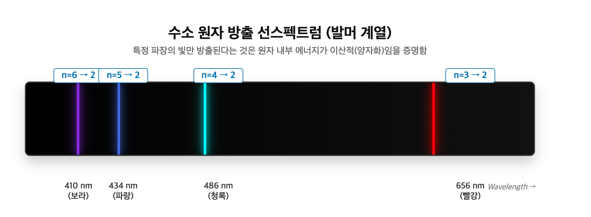
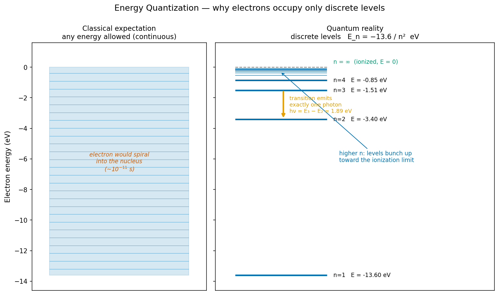
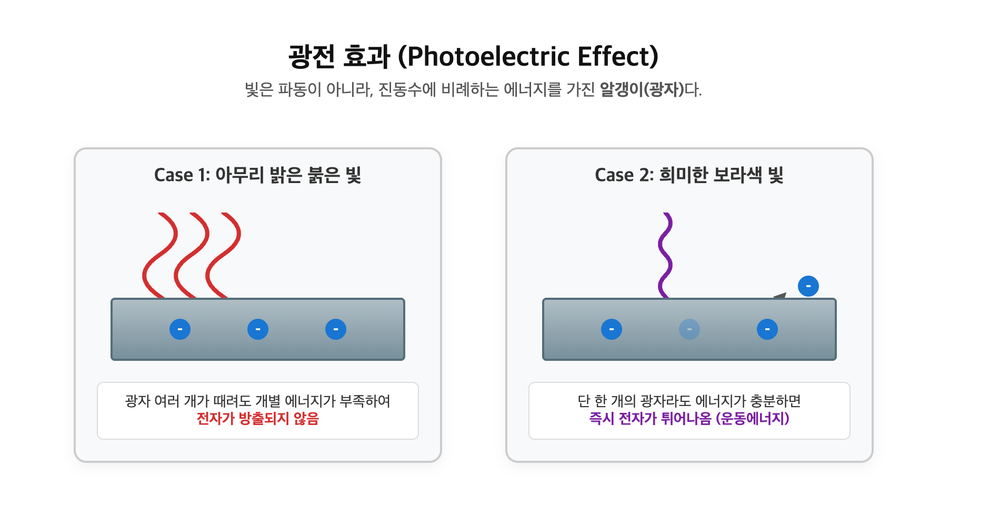
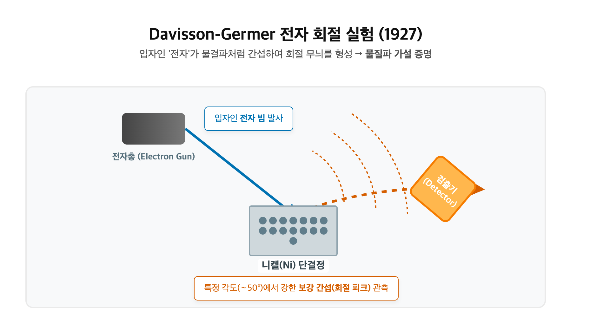
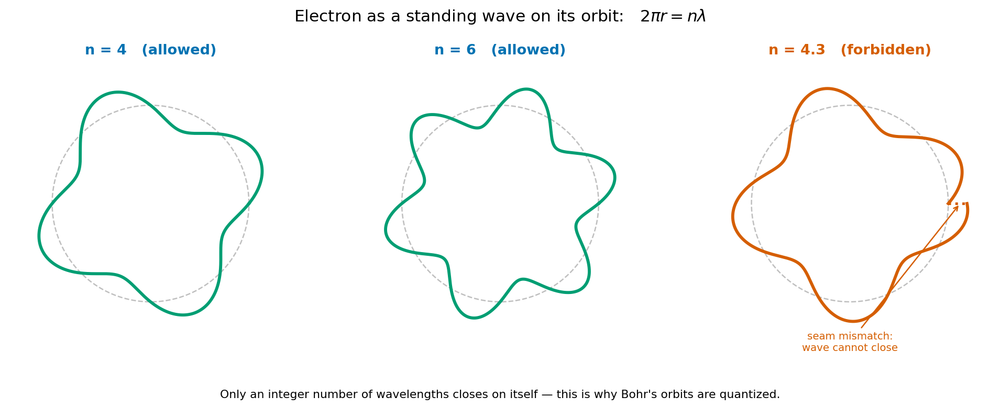

# 3. 양자화와 전자의 파동성

[← 이전: 쿨롱 힘과 퍼텐셜 우물](02_coulomb-force-and-potential-well.md) · [README](README.md) · [→ 다음: 원자 오비탈과 전자 배치](04_atomic-orbital-and-configuration.md)

---

[쿨롱 힘과 퍼텐셜 우물 장](02_coulomb-force-and-potential-well.md)에서 우물 안 진동 에너지가 $E_v = \hbar\omega(v+\tfrac{1}{2})$ 로 **양자화**된다고 했다. 왜 하필 양자화인가? 그리고 더 근본적으로 — 전자는 왜 행성처럼 핵 주위를 도는 궤도가 아니라 "확률 구름"으로 존재하는가? 이 장은 화학 전체가 올라설 양자역학적 토대를 세운다.

## 왜 이 토대가 필요한가 — 고전 물리의 붕괴

20세기 초의 Rutherford 원자모형은 직관적이었다. 양전하 핵을 음전하 전자가 공전한다. 태양계의 축소판이다. 그런데 이 그림은 **치명적 모순**을 안고 있다.

전자기학에 따르면, **가속하는 전하는 전자기파를 방출한다**. 원운동은 끊임없는 가속이다. 따라서 공전하는 전자는 계속 에너지를 잃고, 나선을 그리며 핵으로 추락해야 한다. 계산하면 그 시간은 약 $10^{-11}$ 초. 고전 물리가 옳다면 **원자는 1천억분의 1초(약 10 피코초) 만에 붕괴한다.**

그러나 원자는 존재한다. 당신의 책상도, 당신 자신도. 결론은 하나다. 원자 스케일에서 고전 물리는 틀렸다.

*양전하 핵 주위를 전자가 행성처럼 공전하는 직관적 그림.*
*그러나 가속하는 전자는 EM 복사로 에너지를 잃어 약 10⁻¹¹초 만에 핵으로 추락한다.*
*출처: Bensteele1995, CC BY-SA 3.0 (Wikimedia Commons).*

## 1. 양자화의 증거 — 흑체 복사와 원자 선스펙트럼

양자화가 과학에 처음 들어온 계기는 선스펙트럼이 아니라 **흑체 복사(blackbody radiation)** 였다.

> **[실험: 흑체 복사와 자외선 파탄]**
> - **배경 (자외선 파탄)**: 모든 물체는 온도에 따라 빛을 낸다. 고전 물리학은 빛을 '연속적인 파동'으로 보았고, 파장이 짧아질수록(자외선 쪽으로 갈수록) 에너지가 무한대로 치솟는다고 예측했다. 이 계산대로라면 우리가 켜둔 따뜻한 난로에서 치명적인 무한대의 자외선과 X선이 쏟아져 나와야 한다. 이론과 현실이 완벽하게 붕괴된 이 사건을 **자외선 파탄(Ultraviolet Catastrophe)**이라 부른다.
> - **Planck의 양자 가설(1901)**: Max Planck는 빛 에너지가 물줄기처럼 연속적인 것이 아니라, 진동수에 비례하는 특정 에너지($\varepsilon = h\nu$)를 가진 **'이산적 덩어리(Quanta)'** 단위라고 가정했다.
> - **직관적 이해 (왜 자외선이 나오지 않을까?)**: 에너지를 화폐에 비유해보자. 파장이 긴 붉은 빛은 10원짜리 동전, 파장이 짧은 자외선은 10만 원짜리 수표다. 500도짜리 난로가 가진 총 에너지가 5만 원이라면, 10원짜리 동전(적외선/붉은빛)은 무수히 뿜어낼 수 있다. 하지만 10만 원짜리 수표(자외선)는 단 한 장도 만들어낼 수 없다. 즉, 자외선 광자는 '기본 단가($h\nu$)'가 너무 비싸서 온도가 엄청나게 높지 않은 이상 아예 방출될 수 없는 것이다.
> - **의의**: 에너지는 마음대로 쪼갤 수 없으며, 디지털처럼 '양자화'되어 있다는 우주의 비밀이 처음으로 열린 순간이다.

그 다음에 온 두 번째 단서는 원자가 내는 빛이었다.

> **[실험: 수소 방출 선스펙트럼]**
> - **실험 결과**: 진공관 안에 수소 기체를 넣고 고전압을 걸어 방전시키면 빛이 난다. 이 빛을 슬릿과 프리즘에 통과시키면, 무지개 같은 **연속 스펙트럼**이 아니라 **몇 개의 날카로운 색 선**만 불연속적으로 나타난다. 가시광선 영역에서는 656 nm(빨강), 486 nm(청록), 434 nm(파랑), 410 nm(보라)의 4개 선이 선명하게 관찰된다.
> - **발머 계열(Balmer series)**: J. Balmer(1885)는 이 선들의 파장이 어떤 정수들의 조합으로 된 단순한 수학 공식에 정확히 들어맞음을 경험적으로 발견했다. (이후 Rydberg 공식으로 일반화됨)
>
> $$\frac{1}{\lambda} = R\left(\frac{1}{n_1^2} - \frac{1}{n_2^2}\right), \qquad n_1, n_2 \in \lbrace 1,2,3,\dots \rbrace$$
>
> - **화학적 의미**: 이것이 의미하는 바는 무겁다. 빛의 에너지($E = h\nu = hc/\lambda$)가 특정 값만 방출된다면, 그것을 내뿜는 **원자 내부의 에너지 준위 자체가 이산적**이라는 뜻이다. 전자는 아무 에너지나 가질 수 없고, 정해진 계단 위에만 설 수 있으며, 계단 사이를 건너뛸 때 그 차이만큼의 광자 하나를 방출한다.

## 2. Bohr 모형 — 이산 준위의 첫 정량 예측

Bohr는 대담한 가정 하나를 던졌다. 전자의 각운동량이 $\hbar$ 의 정수배로만 양자화된다($L = n\hbar$). 이 가정 하나에서 수소의 에너지 준위가 정확히 따라 나온다.

$$E_n = -\frac{13.6\ \text{eV}}{n^2}, \qquad n = 1, 2, 3, \dots$$

*고전 물리는 임의의 에너지를 허용하고, 그 결과 전자는 핵으로 추락한다.*
*양자역학에서는 이산 준위만 허용되며, n이 커질수록 준위가 촘촘해진다.*
*두 준위 사이 전이는 정확히 그 차이만큼의 광자 하나를 낸다.*

이 모형의 성공은 눈부셨다. 수소 스펙트럼의 모든 선을 정확히 예측했고, $n=1$ 의 깊이 13.6 eV는 측정된 수소 이온화 에너지와 정확히 일치한다.

그러나 Bohr 모형은 **두 가지 한계**가 있었다. 첫째, 전자 두 개 이상인 원자에는 통하지 않았다. 둘째, 그리고 더 본질적으로 — *왜* 각운동량이 양자화되는지를 설명하지 못했다. 그것은 그냥 가정이었다. 더 깊은 이유가 필요했다.

## 3. 파동-입자 이중성

그 깊은 이유는 "전자란 무엇인가"를 다시 묻는 데서 나왔다.

먼저 빛.

> **[실험: 광전 효과 (Photoelectric Effect)]**
> - **고전 물리의 붕괴**: 금속판에 빛을 쪼이면 전자가 튀어나온다. 고전 파동 이론에 따르면 빛의 '밝기(진폭)'가 강할수록 더 많은 에너지가 전달되므로, 아주 밝은 빛을 오래 비추면 전자가 튀어나와야 한다. 하지만 실제로는 아무리 밝은 붉은 빛을 쪼여도 전자는 나오지 않았고, 매우 희미한 보라색(자외선) 빛을 비추면 그 즉시 전자가 튀어나왔다.
> - **아인슈타인의 광자 가설(1905)**: Einstein은 빛이 파동이 아니라 에너지 덩어리, 즉 **광자(Photon, 입자)**의 흐름이라고 해석했다. 광자 하나의 에너지는 $E = h\nu$로 진동수(색깔)에만 비례한다. 파장이 짧은 보라색 빛은 광자 하나의 에너지가 커서 단 한 방에 전자를 튕겨낼 수 있지만, 파장이 긴 붉은 빛은 광자 하나가 너무 약해서 아무리 밝아도(광자 수가 많아도) 전자를 떼어내지 못하는 것이다. 빛이 **입자**처럼 행동함을 증명한 이 업적으로 그는 노벨상을 받았다.

그러나 동시에 빛은 이중 슬릿 간섭 실험 등에서는 명백히 **파동**처럼 행동한다. 즉, 빛은 입자이자 파동 둘 다이다.

de Broglie의 도약은 이것을 뒤집은 것이었다. **빛이 입자성과 파동성을 모두 가진다면, 물질(전자)도 그래야 한다.** 모든 입자에는 파장이 따라붙는다.

$$\lambda = \frac{h}{p}$$

이 드브로이의 과감한 가설은 얼마 지나지 않아 실험으로 완벽히 증명되었다.

> **[실험: Davisson-Germer 전자 회절 실험 (1927)]**
> - **실험 과정**: 진공 상태에서 니켈(Ni) 단결정에 전자총으로 전자 빔을 발사하고, 표면에서 튕겨져 나오는 전자의 산란 각도를 측정했다. 전자가 단순한 '당구공' 같은 입자라면 결정 표면에서 무작위로 튕겨나가야 한다.
> - **실험 결과**: 특정 각도에서 전자가 집중적으로 산란되어 강한 봉우리(peak)를 나타냈다. 이는 빛이나 X-선 같은 파동이 원자 격자 구조를 만났을 때 보강/상쇄 간섭을 일으켜 만드는 전형적인 **회절 무늬(diffraction pattern)**였다.
> - **물질파 입증**: 질량과 전하를 가진 명백한 입자인 '전자'가 좁은 원자 사이 틈을 지나며 파동처럼 간섭을 일으킨 것이다. 이로써 드브로이의 물질파 가설은 정설이 되었다. 회절은 순수하게 파동만이 일으킬 수 있는 현상이기 때문이다.

**숫자 감각**: 운동 에너지 1 eV인 전자의 de Broglie 파장은

$$\lambda = \frac{h}{\sqrt{2mE}} = \frac{6.626\times10^{-34}}{\sqrt{2(9.109\times10^{-31})(1.602\times10^{-19})}} \approx 1.2\ \text{nm}$$

원자 하나의 크기는 약 0.1–0.3 nm다. 즉 **전자의 파장이 원자 크기와 비슷하다.** 이것이 핵심이다. 원자 안에 갇힌 전자에게 파동성은 미세한 보정이 아니라 지배적인 성질이다. (반대로 시속 144 km 야구공의 파장은 약 $10^{-34}$ m로, 측정 불가능하게 작다. 그래서 거시 세계에서는 파동성이 보이지 않는다.)

## 4. 양자화의 진짜 이유 — 갇힌 파동

이제 Bohr가 *가정*했던 양자화의 **진짜 이유**가 보인다.

엔지니어에게 익숙한 사실 하나. **갇힌 파동은 정상파(standing wave)만 허용한다.** 양 끝이 고정된 기타 줄을 생각하라. 줄은 아무 진동수로나 떨지 못한다. 양 끝에서 진폭이 0이어야 한다는 **경계 조건** 때문에, 기본 진동수와 그 정수배(배음)만 허용된다. 줄의 진동 모드는 이산적이다.

전자도 똑같다. 전자는 원자 안에, 핵의 쿨롱 퍼텐셜에 **갇혀** 있다. 갇힌 파동이므로 정상파 패턴만 허용되고, 각 정상파 모드는 정해진 에너지를 갖는다. 그래서 에너지가 이산적이다.

가장 단순한 모형(상자 속 입자, particle-in-a-box)에서 이것이 수식으로 드러난다.

$$E_n = \frac{n^2 h^2}{8 m L^2}, \qquad n = 1, 2, 3, \dots$$

양자화는 더 이상 신비로운 가정이 아니다. **갇힌 파동에 경계 조건을 걸면 수학적으로 필연적으로 나오는 결과**다. Bohr의 "각운동량 양자화"는 사실 "전자의 정상파가 원궤도 둘레에 정수 개 들어맞아야 한다"는 조건이었던 것이다.

둘레에 정수 파장이 딱 들어맞는 자리만 살아남는다. 둘레가 정수 파장이면 파동은 한 바퀴 돌아 자기 자신과 위상이 맞아 보강되지만($n=4$, $n=6$ 처럼), 어중간한 값($n=4.3$)에서는 한 바퀴 뒤 위상이 어긋나 파동이 자기 자신과 상쇄되어 사라진다. 그래서 정수 $n$ 만 허용된다.

*둘레에 정수 파장이 들어맞으면(왼쪽) 정상파가 보강되어 허용된다.*
*어중간한 둘레(오른쪽)에서는 파동이 자기 자신과 상쇄되어 존재할 수 없다.*

## 5. 파동함수와 확률

전자가 파동이라면, 그 파동을 기술하는 방정식이 필요하다. 그것이 **Schrödinger 방정식**이고, 그 해가 **파동함수(wavefunction)** $\psi$ 다.

$\psi$ 자체는 직접적인 물리량이 아니다. 의미는 Born 해석에서 온다.

$$|\psi(\mathbf{r})|^2 = \text{그 위치에서 전자를 발견할 확률 밀도}$$

이것이 화학의 세계관을 바꾼다. 전자는 "여기 있다"가 아니라 **"여기 있을 확률이 이만큼이다"**로만 말할 수 있다. 정확한 궤적은 원리적으로 존재하지 않는다.

이것을 보장하는 것이 **불확정성 원리(uncertainty principle)** 다.

$$\Delta x \cdot \Delta p \ge \frac{\hbar}{2}$$

위치를 정밀하게 알수록 운동량은 더 불확실해진다. 둘 다 동시에 정확히 아는 것은 불가능하다. 따라서 "핵 주위를 도는 전자의 궤도(orbit)"라는 말은 성립하지 않는다. 남는 것은 **오비탈(orbital)** — 전자가 있을 법한 확률 구름 — 뿐이다. 그 구름의 모양이 바로 [원자 오비탈과 전자 배치 장](04_atomic-orbital-and-configuration.md)의 주제다.

## 5.5 다음 질문 — 3차원 정상파는 어떻게 생겼나

그렇다면 그 확률 구름은 *어떤 모양*인가? 여기서 다시 §4의 "갇힌 파동" 이미지로 돌아가면 길이 보인다. Bohr의 원형 궤도는 사실 1차원적 비유였다. 둘레라는 1차원 경로 위에 파장이 들어맞는 그림이기 때문이다. 그러나 실제 원자는 3차원이고, 전자는 3차원 공간을 울리는 파동이다. 그래서 자연스러운 질문이 따라온다. **3차원에서 정상파는 어떤 모양인가?**

이 질문은 사실 엔지니어에게 익숙하다. 차원을 하나씩 올려보자.

- **1D 정상파** = 기타 줄. 양 끝이 고정된 줄은 기본 모드와 그 배음만 허용한다. Bohr의 원형 궤도가 바로 이 1차원 정상파를 원으로 말아놓은 형태다.
- **2D 정상파** = 북가죽. 평면 막을 두드리면 진동하지 않는 *마디 선(node)*이 생겨 기하학적 패턴을 그린다. 이것을 눈으로 볼 수 있게 한 것이 **클라드니 도형(Chladni figure)**이다. 금속판 위에 모래를 뿌리고 판을 진동시키면, 모래가 진동하는 자리에서 튕겨 나가 마디 선 위에만 쌓이면서 대칭적인 무늬를 만든다.
- **3D 정상파** = **원자 안의 전자**. 핵의 (+) 인력이 경계 조건이 되고, 그 안에서 전자가 3차원으로 진동한다. 그 진동 모드 하나하나가 곧 오비탈이다.

*진동하는 금속판 위의 모래가 마디 선에만 쌓여 2D 정상파의 모드를 드러낸다.*
*출처: Rodrigo Tetsuo Argenton, CC BY-SA 4.0 (Wikimedia Commons).*

한 문장으로 요약하면, **수소 원자는 3차원에서 진동하는 둥근 북(round drum)이다.** Schrödinger 방정식은 이 둥근 북의 운동 방정식이고, 그것을 푸는 일은 둥근 북의 **고유 진동 모드(eigenmode)**를 찾는 일이다. 처음 보면 기괴해 보이는 아령 모양, 클로버 모양의 오비탈 그림들은 자연이 외우라고 시킨 게 아니라, 3차원 둥근 북의 진동 모드가 *수학적으로 그렇게 생길 수밖에 없는* 형태다. 그 모드들이 어떻게 나오는지, 그리고 그 모양이 어떻게 분자와 결정의 기하를 강제하는지가 [원자 오비탈과 전자 배치 장](04_atomic-orbital-and-configuration.md)의 주제다.

## 6. 왜 이것이 화학과 공학에 결정적인가

**화학 쪽으로는**, 이 글이 세운 두 기둥 — 에너지의 이산성과 전자의 확률적 파동성 — 위에 오비탈, 전자 배치, 그리고 모든 화학 결합이 올라선다. 양자역학 없이는 주기율표조차 설명되지 않는다.

**공학 쪽으로는**, 양자화가 추상이 아니라 매일 쓰는 소자의 동작 원리다.

- **LED·레이저**: 두 에너지 준위 사이의 전이가 정확히 한 가지 색의 광자를 낸다. 청색 LED와 적색 LED의 차이는 준위 간격($\Delta E = h\nu$)의 차이다.
- **양자 터널링**: 파동인 전자는 고전적으로 못 넘는 장벽을 "스며들어" 통과한다. 플래시 메모리의 쓰기·지우기와 터널 다이오드가 이 효과로 동작한다.

미시의 양자화가 곧바로 거시 소자의 스펙과 색과 속도가 된다.

## See Also

- [쿨롱 힘과 퍼텐셜 우물](02_coulomb-force-and-potential-well.md) — 우물 안 진동 에너지도 같은 "갇힌 파동" 이유로 양자화된다
- [원자 오비탈과 전자 배치](04_atomic-orbital-and-configuration.md) — Schrödinger 방정식을 수소 원자에 풀면 오비탈이 나온다

## Exercises

**1.** 운동 에너지 10 eV인 전자의 de Broglie 파장을 구하라. 이 값을 원자 크기(약 0.1–0.3 nm)와 비교하면 무엇을 알 수 있는가?

풀이

$\lambda = h/\sqrt{2mE}$. $E = 10\ \text{eV} = 1.602\times10^{-18}$ J.
$p = \sqrt{2(9.109\times10^{-31})(1.602\times10^{-18})} = 1.71\times10^{-24}$ kg·m/s.
$\lambda = 6.626\times10^{-34} / 1.71\times10^{-24} \approx 0.39\ \text{nm}$.
원자 크기와 같은 자릿수다. 전자의 파장이 갇힌 공간의 크기와 비슷하므로, 원자 안에서 전자는 파동으로 다뤄야 한다(정상파 → 이산 준위).

**2.** 수소 원자에서 $n=3 \to n=2$ 전이로 방출되는 광자의 에너지(eV)와 파장(nm)을 구하라. $E_n = -13.6/n^2$ eV, 그리고 $\lambda(\text{nm}) \approx 1240 / E(\text{eV})$ 를 이용하라.

풀이

$E_3 = -13.6/9 = -1.51$ eV, $E_2 = -13.6/4 = -3.40$ eV.
$\Delta E = E_3 - E_2 = -1.51 - (-3.40) = 1.89$ eV.
$\lambda = 1240/1.89 \approx 656\ \text{nm}$ — 빨간색. 이것이 수소 Balmer 계열의 H$\alpha$ 선이다.

**3.** Bohr 모형은 수소 스펙트럼을 정확히 예측했지만 "왜 각운동량이 양자화되는가"는 설명하지 못했다. 파동-입자 이중성은 이 질문에 어떻게 답하는가?

풀이

전자가 파동이라면, 원자에 갇힌 전자는 정상파만 형성할 수 있다(경계 조건). 원궤도 둘레에 전자의 de Broglie 파장이 정수 개 들어맞아야 정상파가 성립하며, 이 조건 $n\lambda = 2\pi r$ 에 $\lambda = h/p$ 를 대입하면 정확히 Bohr의 각운동량 양자화 $L = pr = n\hbar$ 가 나온다. 즉 양자화는 가정이 아니라 "갇힌 파동"의 필연적 결과다.

---

[← 이전: 쿨롱 힘과 퍼텐셜 우물](02_coulomb-force-and-potential-well.md) · [README](README.md) · [→ 다음: 원자 오비탈과 전자 배치](04_atomic-orbital-and-configuration.md)
