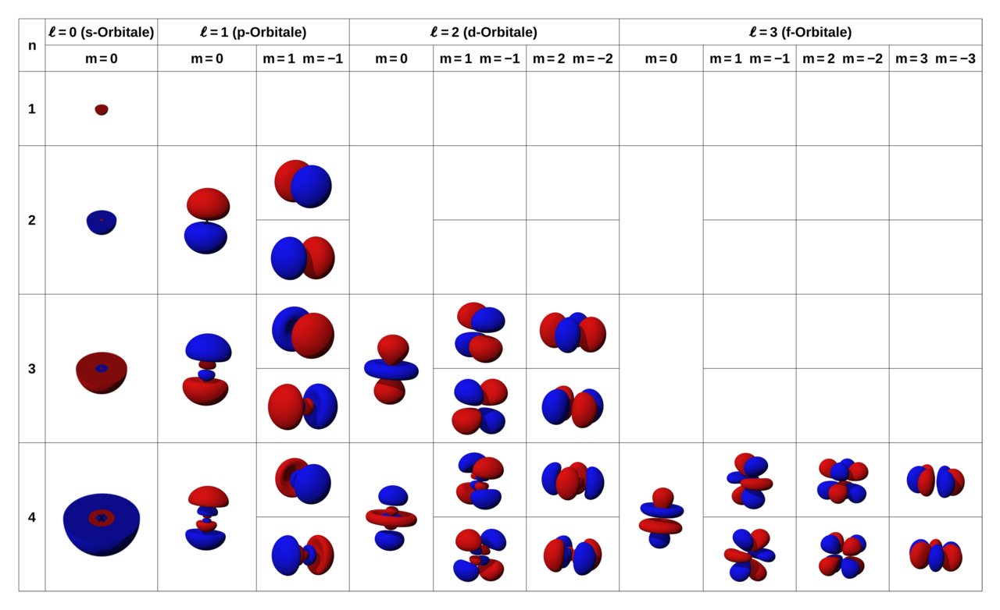
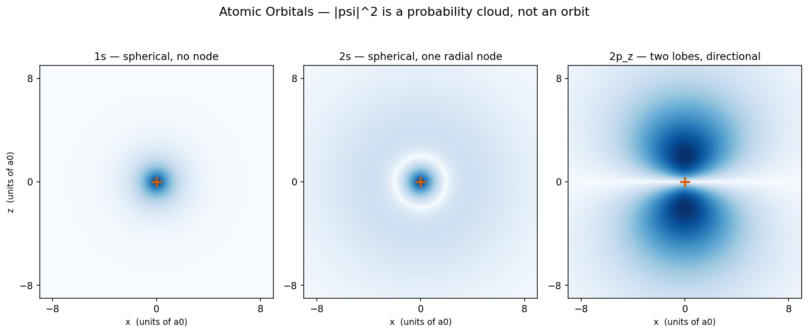

# 4. 원자 오비탈과 전자 배치

[← 이전: 양자화와 전자의 파동성](03_quantization-and-wave-nature.md) · [README](README.md) · [→ 다음: 파울리 배타와 교환 에너지](05_pauli-exclusion-and-exchange.md)

---

[양자화와 전자의 파동성 장](03_quantization-and-wave-nature.md)에서 전자는 확률 파동이고 에너지는 이산적이라는 두 기둥을 세웠다. 이제 Schrödinger 방정식을 실제 원자에 풀면, 그 확률 구름의 구체적인 **모양**이 나온다. 그것이 **오비탈(orbital)** 이다. 그리고 오비탈을 전자로 채우는 단 세 가지 규칙이 주기율표 전체와, 원소의 모든 화학적 성질을 만들어낸다.

## 왜 이 장이 결합의 문턱인가

화학 결합은 원자 전체가 하는 일이 아니다. **가장 바깥쪽 오비탈의 전자들**, 곧 원자가 전자(valence electron)가 하는 일이다. 안쪽 전자는 거의 구경꾼이다. 따라서 "이 원자가 어떻게 결합하는가"는 곧 "이 원자의 valence 오비탈이 어떻게 채워져 있는가"의 문제다. 이 장이 그 채움 상태를 확정하면, [이온 결합](06_ionic-bond.md) · [공유 결합](07_covalent-bond.md) · [금속 결합](08_metallic-bond.md) 이 자연히 따라온다.

## 1. 오비탈은 수소 원자 Schrödinger 방정식의 해다

화학에서 말하는 '오비탈(Orbital)'은 전자의 상태를 나타내는 **파동함수(Wavefunction, $\psi$)** 그 자체를 의미한다. 이 함수는 에르빈 슈뢰딩거가 제안한 파동 방정식(시간에 무관한 형태)을 풀어 얻어낸다.

$$ \hat{H} \psi = E \psi $$

여기서 $\hat{H}$는 에너지 연산자(해밀토니안), $\psi$는 구하려는 파동함수, $E$는 양자화된 에너지 준위다. 직관적으로 **"전자의 파동함수에 에너지를 계산하는 기호를 가하면, 원래 파동함수 모양이 그대로 유지되면서 전자의 에너지 값($E$)이 튀어나온다"**는 뜻이다.

수소 원자(핵 1개 + 전자 1개)의 쿨롱 퍼텐셜($-ke^2/r$)을 대입해 3차원 공간에서 이 방정식을 풀면, 파동함수 $\psi$는 거리($r$) 성분과 각도($\theta, \phi$) 성분의 곱으로 분리되어 나온다.

$$ \psi_{n, l, m_l}(r, \theta, \phi) = R_{n,l}(r) \times Y_{l}^{m_l}(\theta, \phi) $$

*   **$R_{n,l}(r)$ (방사상 함수)**: 원자핵으로부터의 거리에 따른 확률 분포. 오비탈의 **크기**(에너지 껍질)를 결정한다.
*   **$Y_{l}^{m_l}(\theta, \phi)$ (구면 조화 함수)**: 공간상의 방향에 따른 확률 분포. 오비탈의 **모양**(구형, 아령형 등)을 결정한다.

이 수식 아래에 붙은 라벨들이 바로 오비탈의 정체를 규정하는 **세 개의 정수 양자수**다.

| 양자수   | 이름                       | 의미          | 허용값             |
| ----- | ------------------------ | ----------- | --------------- |
| $n$   | principal (주양자수)         | 오비탈의 크기·에너지 | 1, 2, 3, …      |
| $l$   | angular momentum (방위양자수) | 오비탈의 **모양** | 0 이상 $n-1$ 이하   |
| $m_l$ | magnetic (자기양자수)         | 오비탈의 **방향** | $-l$ 부터 $+l$ 까지 |

$l$ 값에는 역사적 문자 이름이 붙는다. $l=0$ 은 s, $l=1$ 은 p, $l=2$ 는 d, $l=3$ 은 f. (s·p·d·f 는 초기 분광학 용어 *sharp, principal, diffuse, fundamental* 의 머리글자다. 의미는 사라졌지만 라벨은 남았다.) 한 가지 더. s 오비탈만 핵까지 **침투(penetration)** 할 수 있다. $l > 0$ 인 p·d 오비탈은 핵에서 파동함수가 0이지만($\psi \propto r^l$), s 오비탈은 핵에서 유한한 확률을 갖는다. 이 침투 차이가 §3에서 4s가 3d보다 먼저 채워지는 가림(shielding) 효과의 물리적 뿌리다.

여기에 전자 자신의 성질인 **스핀 양자수** $m_s = \pm\tfrac{1}{2}$ 가 더해진다. 네 개의 양자수 $(n, l, m_l, m_s)$ 가 원자 안 전자 하나의 **완전한 주소**다. 같은 주소를 가진 전자는 둘일 수 없다(§3의 Pauli 원리).

하나의 $(n, l, m_l)$ 조합이 **하나의 오비탈**이다. 예를 들어 $n=2, l=1$ 이면 $m_l = -1, 0, +1$ 세 가지이므로, 2p 오비탈은 세 개($2p_x, 2p_y, 2p_z$)다.

## 2. 오비탈의 모양 — 확률 구름

$|\psi|^2$ 을 공간에 그리면 전자가 있을 확률 밀도가 보인다. 먼저 오비탈 가족 전체를 한눈에 본 다음, 한 평면을 잘라 단면을 자세히 들여다보자.

*양자수로 정리한 오비탈. 행은 주양자수 n, 열은 ℓ(s/p/d/f)과 m.*
*붉은색·푸른색은 파동함수의 위상. n이 커질수록 노드 구조가 복잡해진다.*
*출처: MikeRun, Wikimedia Commons, CC BY-SA 4.0.*

*수소 파동함수에서 직접 계산한 |psi|^2 단면. 가운데 +는 핵.*
*1s는 노드 없는 구름, 2s는 방사 노드(빈 껍질)가 하나.*
*2p_z는 두 개의 로브로 갈라진 방향성 있는 구름.*

읽어야 할 것 세 가지.

- **s 오비탈은 구형**이다. 방향이 없다. 1s는 노드(node, 확률이 정확히 0인 면)가 없고, 2s는 방사 방향 노드가 하나 있어 그림에서 빈 껍질로 보인다. 일반적으로 오비탈의 노드 수는 $n-1$ 개다.
- **p 오비탈은 아령형**이고, 서로 수직인 세 개($p_x, p_y, p_z$)가 있다. 핵을 지나는 노드 평면이 있어 두 로브로 갈라진다. **이 방향성이 핵심이다.** p 오비탈이 방향을 가지기 때문에 공유 결합이 방향성을 갖고, 그 결과 결정이 이방성(anisotropy)을 띤다.
- **d 오비탈은 다섯 개**로 더 복잡하다. 전이 금속의 색과 자성이 여기서 나온다.

오비탈은 전자의 *궤도*가 아니라 전자가 있을 법한 *확률 구름*임을 다시 강조한다. 전자는 그 구름 어디에든 있을 수 있고, 어느 한 지점에 "찍혀" 있지 않다.

## 3. 오비탈을 채우는 세 가지 규칙

다전자 원자는 오비탈을 에너지가 낮은 것부터 채운다. 규칙은 셋뿐이다. 질소(N, 원자번호 7)의 예시를 통해 세 가지 규칙이 어떻게 적용되는지 시각적으로 먼저 확인해 보자.

*질소(1s² 2s² 2p³)의 전자 채움. 낮은 에너지부터 채우고(아우프바우), 한 오비탈엔 스핀이 반대인 전자 최대 2개(파울리), 에너지가 같은 오비탈엔 먼저 하나씩 흩어진 뒤 같은 방향 스핀으로(훈트) 채운다.*

**(1) Pauli 배타 원리(Pauli exclusion principle)** — 한 오비탈에는 전자가 **최대 둘**, 그것도 스핀이 반대(↑↓)여야 한다. 네 양자수가 모두 같은 전자는 존재할 수 없기 때문이다. 이 규칙이 *왜* 성립하는지(페르미온 파동함수의 반대칭성), 그리고 흔한 "자석이라 반대로"라는 설명이 왜 틀렸는지는 [파울리 배타와 교환 에너지 장](05_pauli-exclusion-and-exchange.md)이 깊이 다룬다.

> 이 원리가 [쿨롱 힘과 퍼텐셜 우물 장](02_coulomb-force-and-potential-well.md)의 반발 항의 정체다. 두 원자가 너무 가까워지면 전자구름이 겹치는데, Pauli 원리상 전자들은 같은 양자 상태를 공유할 수 없으므로 더 높은 에너지 준위로 밀려 올라간다. 이 에너지 상승이 곧 단거리 반발이고, 우주가 한 점으로 붕괴하지 않는 이유다.

**(2) Aufbau 원리** — 낮은 에너지 오비탈부터 채운다. 순서는

$$1s \to 2s \to 2p \to 3s \to 3p \to 4s \to 3d \to 4p \to 5s \to 4d \to \cdots$$

흥미롭게도 K·Ca 에서는 4s가 3d보다 먼저 채워진다. 다전자 원자에서는 안쪽 전자의 가림(shielding) 효과로 에너지 순서가 단순한 $n$ 순서를 벗어나기 때문이다. (전이 금속 구간은 더 미묘하다. Sc 이후로는 3d 궤도 에너지가 오히려 4s보다 낮지만, 더 조밀한 3d에 전자 둘을 넣을 때의 전자–전자 반발까지 더한 *원자 전체*의 에너지를 최소화하면 [Ar]3d¹4s² 같은 배치가 선택된다. 결국 또 에너지 최소화다.)

**(3) Hund 규칙** — 에너지가 같은 오비탈(예: 2p 세 개)이 여럿이면, 전자는 먼저 **하나씩** 평행한 스핀으로 들어간다. 짝을 짓는 것은 그다음이다. 같은 오비탈에 둘이 몰리면 전자–전자 반발이 커지므로, 흩어지는 쪽이 에너지가 낮다. 전자가 *왜 스핀까지 평행하게* 맞추는지는 교환 에너지(exchange energy)라는 더 깊은 이유에서 나온다 — [파울리 배타와 교환 에너지 장](05_pauli-exclusion-and-exchange.md) 참고.

## 4. 전자 배치와 주기율표

세 규칙을 적용한 결과를 **전자 배치(electron configuration)** 로 적는다.

| 원소 | $Z$ | 전자 배치 | 원자가 전자 |
|---|:--:|---|:--:|
| H | 1 | 1s¹ | 1 |
| He | 2 | 1s² | 2 (껍질 꽉 참) |
| C | 6 | 1s² 2s² 2p² | 4 |
| Na | 11 | [Ne] 3s¹ | 1 |
| Si | 14 | [Ne] 3s² 3p² | 4 |
| Cl | 17 | [Ne] 3s² 3p⁵ | 7 |

(`[Ne]` 는 네온의 배치 1s²2s²2p⁶ 를 줄인 것 — 안쪽 core 전자다.)

여기서 놀라운 사실. **주기율표의 구조 자체가 이 채움 순서의 그림이다.** 가로 줄(주기)은 주양자수 $n$ 이고, 세로 블록은 채워지는 오비탈의 종류($l$)다. s-블록 2칸, p-블록 6칸, d-블록 10칸은 각각 오비탈 1·3·5개에 전자가 2개씩 들어가는 수다. 주기율표는 외울 표가 아니라 양자역학의 직접적인 출력물이다.

## 5. 원자가 전자 — 화학의 거의 전부

가장 바깥 껍질의 전자, **원자가 전자**가 결합·반응성·원자가를 결정한다. 위 표의 마지막 열을 결합 행동으로 번역하면 이렇다.

- **Na**: valence 전자 1개. 이 하나를 떼어내면 안정한 [Ne] 배치가 된다. 그래서 Na는 전자를 잘 **잃고** Na⁺ 가 된다 → [이온 결합](06_ionic-bond.md).
- **Cl**: valence 전자 7개. 하나만 더 받으면 안정한 [Ar] 배치가 된다. 그래서 Cl은 전자를 잘 **받아** Cl⁻ 가 된다 → [이온 결합](06_ionic-bond.md).
- **C**: valence 전자 4개. 잃기에도 받기에도 어중간하다. 그래서 C는 전자를 **공유**한다 → [공유 결합](07_covalent-bond.md).

소위 옥텟 규칙("8개를 채우려 한다")은 이 그림의 *결과*이지 원인이 아니다. 진짜 원인은 채워진 껍질이 에너지가 낮아 안정하다는 것 — 다시 에너지 최소화다. 안쪽 core 전자는 핵에 깊이 묶여 있어 결합에 거의 참여하지 않는다.

## See Also

- [양자화와 전자의 파동성](03_quantization-and-wave-nature.md) — 오비탈이 왜 이산적이고 확률적인지의 토대
- [파울리 배타와 교환 에너지](05_pauli-exclusion-and-exchange.md) — 채움 규칙(Pauli·Hund)이 왜 성립하는지의 양자 통계적 기원
- [쿨롱 힘과 퍼텐셜 우물](02_coulomb-force-and-potential-well.md) — Pauli 배타 원리가 퍼텐셜 우물의 반발 항을 만든다
- [이온 결합](06_ionic-bond.md) — valence 전자를 잃거나 받는 결합
- [공유 결합과 오비탈 겹침](07_covalent-bond.md) — valence 오비탈이 겹쳐 전자를 공유하는 결합

## 출처 및 더 읽을거리

- **위키백과, "양자수"** (`ko.wikipedia.org/wiki/양자수`). 네 양자수의 엄밀한 정리. 이 글에서는 생략한 수식, 곧 각운동량 양자화 $L^2 = \hbar^2 l(l+1)$ 과 수소 에너지 준위 공식, 껍질당 $n^2$ 개 오비탈이 정리되어 있다. 스핀-궤도 상호작용을 고려한 총 각운동량 양자수 $j$ 까지 확장된다.
- **jctechbiz 블로그, "양자수"** (`jctechbiz.tistory.com`). 네 양자수를 "물리적 특징"과 "양자화 특징"으로 나눠 정리한 한국어 입문 자료 (CC BY-NC-ND).

## Exercises

**1.** $n=3$ 껍질에는 어떤 종류의 오비탈이 몇 개 있는가? 그리고 이 껍질이 최대 몇 개의 전자를 담을 수 있는가?

풀이

$n=3$ 이면 $l = 0, 1, 2$ 가 허용된다. 즉 3s(1개), 3p(3개), 3d(5개)로 오비탈은 총 9개. 각 오비탈에 Pauli 원리상 전자 2개까지이므로 최대 $9 \times 2 = 18$ 개. (이것이 주기율표에서 d-블록이 등장하는 세 번째 주기 이후 한 주기가 길어지는 이유다.)

**2.** 탄소 C(Z=6)의 2p 전자 2개는 Hund 규칙에 따라 어떻게 배치되는가? 같은 $2p_x$ 오비탈에 둘 다 들어가지 않는 이유는?

풀이

2p 오비탈 세 개($2p_x, 2p_y, 2p_z$) 중 서로 다른 두 개에 전자가 하나씩, 스핀을 평행하게 들어간다(예: $2p_x{\uparrow}\ 2p_y{\uparrow}$). 한 오비탈에 둘을 몰아넣으면 같은 좁은 공간에 갇힌 두 전자 사이 쿨롱 반발 에너지가 커진다. 흩어져 들어가는 쪽이 에너지가 낮으므로 그쪽이 선택된다.

**3.** Na는 전자를 잃어 Na⁺ 가 되려 하고 Cl은 전자를 받아 Cl⁻ 가 되려 한다. 각각의 전자 배치를 근거로 이 경향을 설명하라. "옥텟 규칙"이라는 말을 쓰지 말고 에너지 관점에서 답하라.

풀이

Na는 [Ne]3s¹ 으로 valence 전자가 1개뿐이다. 이 전자는 가려진 핵 인력만 받아 약하게 묶여 있고(1차 이온화 에너지 496 kJ/mol로 낮음), 떼어내면 핵에 깊이 묶인 안정한 [Ne] 닫힌 껍질만 남는다. 따라서 전자를 잃는 쪽이 에너지가 낮다. Cl은 [Ne]3s²3p⁵ 로 3p에 한 자리가 비어 있다. 전자 하나를 받으면 그 자리가 핵의 강한 인력 영역에 채워져 에너지가 크게 내려간다(전자 친화도 349 kJ/mol 방출). "8개"라는 숫자가 목표가 아니라, 닫힌 껍질이 에너지적으로 깊은 우물이라는 것이 본질이다.

---

[← 이전: 양자화와 전자의 파동성](03_quantization-and-wave-nature.md) · [README](README.md) · [→ 다음: 파울리 배타와 교환 에너지](05_pauli-exclusion-and-exchange.md)
