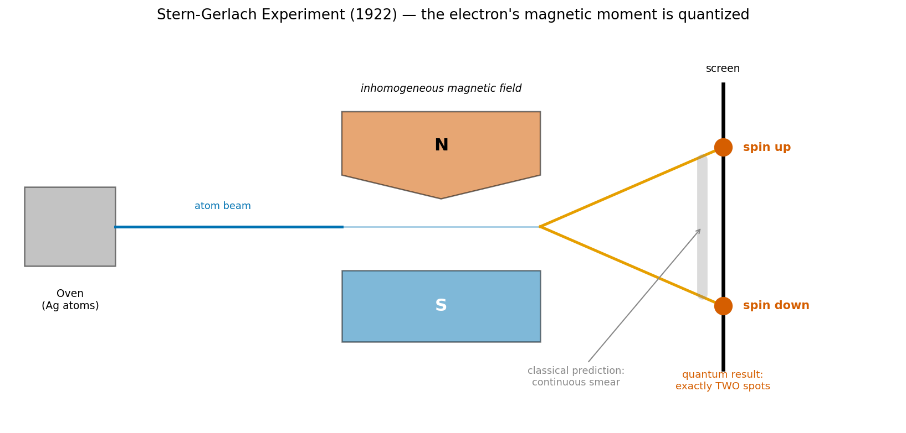
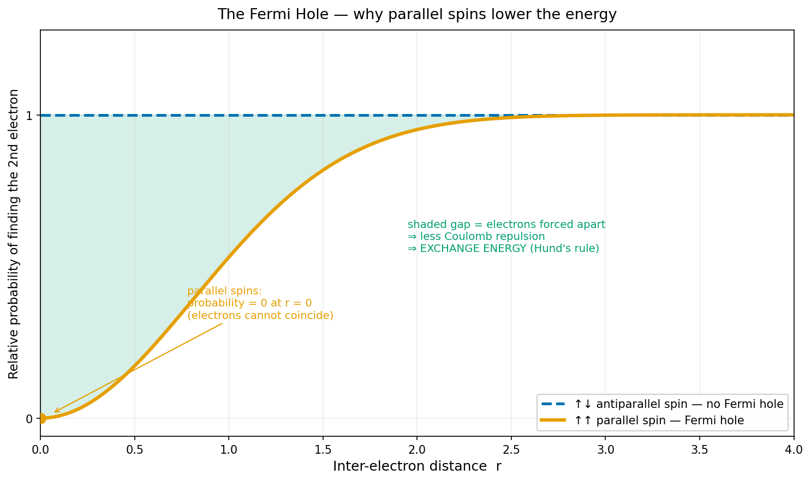

# 5. 파울리 배타와 교환 에너지

[← 이전: 원자 오비탈과 전자 배치](04_atomic-orbital-and-configuration.md) · [README](README.md) · [→ 다음: 이온 결합](06_ionic-bond.md)

---

[원자 오비탈과 전자 배치 장](04_atomic-orbital-and-configuration.md)은 오비탈을 채우는 세 규칙 — Pauli, Aufbau, Hund — 을 *작동법*으로 제시했다. "한 방에 둘, 빈방부터, 화살표는 같은 쪽으로." 그런데 엔지니어는 이런 주입식 규칙을 싫어한다. 마땅히 물어야 한다. **왜?**

이 글은 그 *왜*를 준다. 그리고 답은 놀랍다. 세 규칙처럼 보이는 것이 사실은 **단 하나의 원리** — 전자가 페르미온(fermion)이라는 사실, 곧 파동함수의 반대칭성 — 에서 전부 흘러나온다. 더 중요한 재프레이밍 하나. Pauli 배타 원리는 *힘(force)*이 아니다. 시스템의 *제약 조건(constraint)*이다.

## 왜 이 장이 필요한가

[원자 오비탈과 전자 배치 장](04_atomic-orbital-and-configuration.md)의 채움 규칙이 "무엇(what)"이라면, 이 장은 "왜(why)"다. 그리고 그 why를 알면 [퍼텐셜 우물 장](02_coulomb-force-and-potential-well.md)의 정체불명이던 "반발 항"의 근원, 나아가 원자가 붕괴하지 않고 물질이 부피를 갖는 이유까지 한 번에 닫힌다.

## 1. 스핀 — 회전이 아닌데 왜 자석인가

먼저 깨야 할 고전적 착각. **스핀(spin)** 은 지구가 자전하듯 전자가 빙글빙글 도는 물리적 회전이 아니다.

반례는 간단하다. 전자를 크기가 있는 작은 구로 가정하고, 관측된 스핀 각운동량 $\tfrac{1}{2}\hbar$ 를 고전적인 회전으로 만들어내려면 전자 표면의 속도가 **빛의 속도를 한참 초과**해야 한다. 상대성 이론이 이를 금지한다. 스핀은 공간 속의 회전일 수 없다.

그렇다면 곧바로 날카로운 질문이 따라온다. 회전하지도 않는다면서 왜 '자석'이라는 전자기학적 결과가 튀어나오는가? 스핀을 작은 자석으로 그리는 것은 이해를 돕는 비유가 아니라 **물리적 실체**다. 전자는 실제로 미세한 자기장을 뿜는 자기 쌍극자(magnetic dipole)다.

이유는 엔지니어에게 가장 익숙한 고전 전자기학에 있다. 앙페르 법칙대로 **전하를 가진 것이 각운동량을 가지면 그 회전축을 따라 자기장이 생긴다.** 코일에 전류를 흘리면 전자석이 되는 바로 그 원리다. 전자는 *문자 그대로 돌지는* 않지만, 전하(−)와 **내재 각운동량(스핀)** 을 둘 다 타고났다. 전하와 각운동량이라는 두 재료가 갖춰지면 회전이라는 과정 없이도 같은 메커니즘으로 자기 쌍극자 모멘트가 **필연적으로** 따라 나온다. 전자 하나하나가 우주에서 가장 작은 영구 자석인 셈이다.

이것을 두 눈으로 보여준 것이 **Stern-Gerlach 실험(1922)** 이다.

*은(Ag) 원자 빔을 비균일 자기장에 통과시키면 빔이 정확히 두 갈래로 갈라진다.*
*고전 물리는 연속으로 퍼진 얼룩을 예상했으나 실제 결과는 위·아래 단 두 점.*

> **실험: Stern-Gerlach 실험 (1922)**
> - **실험 과정**: 뜨거운 오븐에서 은(Ag) 원자 빔을 쏘아 N극과 S극 사이의 비균일(inhomogeneous) 자기장을 통과시켜 스크린에 도달하게 한다. 은 원자의 전자 47개 중 안쪽 46개는 스핀이 쌍을 이뤄 자기 모멘트가 상쇄되고, 오직 5s 오비탈에 있는 최외각 홀전자 하나만이 전체 원자의 자기적 성질을 결정한다. 따라서 은 원자 빔의 궤적이 휘어지는 것은 순수하게 이 홀전자의 스핀 때문이다.
> - **고전 물리의 예상**: 만약 전자가 뿜어내는 자기장의 방향이 무작위로 연속적(아날로그)이라면, 자기장을 통과한 원자들은 스크린 위에 길쭉하고 연속적인 얼룩을 남겨야 한다.
> - **실험 결과 및 의미**: 실제 스크린에는 **정확히 두 점**, 즉 위와 아래에만 흔적이 찍혔다. 전자가 뿜는 자석의 방향이 무작위가 아니라 공간상에서 오직 '위(Up)' 아니면 '아래(Down)'라는 두 가지 상태로 **양자화**되어 있음을 실험이 명백하게 못 박은 것이다.

이 모든 것을 수학으로 종결지은 사람이 1928년 Paul Dirac이다. 특수 상대성 이론과 양자역학을 하나의 방정식으로 결합하자, 누구도 넣지 않은 항 — **스핀과 자기 쌍극자 모멘트** — 이 수식에서 필연적으로 튀어나왔다. 스핀이 자석인 것은 우주의 시공간 구조가 그렇게 생겨먹었기 때문이다. 정량적 쐐기 하나. 고전적으로 회전하는 대전 구라면 g-인자(g-factor)가 1인 자기 모멘트를 줄 텐데, 전자의 실측 g-인자는 **약 2**다(Dirac 방정식이 정확히 2를 예측한다). 고전 회전이라면 절반이어야 할 자기력이 두 배라는 뜻이고, 이는 스핀이 고전적 회전이 아니라는 또 하나의 정량적 증거다.

엔지니어의 언어로 정리하면. 스핀은 전자가 무언가를 *해서* 생기는 성질이 아니다. 질량이나 전하량처럼 입자가 태어날 때부터 부여받은 **내재적 속성(intrinsic property)** 이고, 그 속성에는 내재 각운동량과 자기 쌍극자 모멘트가 한 묶음으로 딸려 온다. 스핀 양자수는 $m_s = \pm\tfrac{1}{2}$, 단 두 값뿐이다.

## 2. 페르미온과 반대칭성 — 우주의 절대 규칙

우주의 입자는 두 부족으로 나뉜다.

- **보손(boson)**: 빛의 알갱이인 photon 등. 스핀이 정수(photon은 스핀 1).
- **페르미온(fermion)**: 전자, 양성자, 중성자 등. 스핀이 반정수($\tfrac{1}{2}$, $\tfrac{3}{2}$, …).

전자는 스핀 $\tfrac{1}{2}$ 이므로 페르미온이다. 그리고 페르미온에는 타협 불가능한 수학적 법칙이 하나 붙는다.

$$\Psi(\text{입자}_1, \text{입자}_2) = -\,\Psi(\text{입자}_2, \text{입자}_1)$$

**두 페르미온의 자리를 맞바꾸면 전체 파동함수의 부호가 반드시 반전된다.** 이것을 반대칭성(antisymmetry)이라 한다. (보손은 반대로 부호가 그대로다. 그래서 보손은 같은 상태에 무한히 쌓일 수 있고, 그것이 레이저와 보스–아인슈타인 응축의 원리다. 전자는 그럴 수 없다.)

이 한 줄의 부호 규칙이 다음 두 섹션의 모든 것을 만든다.

## 3. Pauli 배타 원리 — 힘이 아니라 제약 조건

화학 시간에는 흔히 이렇게 얼버무린다. "전자는 자석 같아서 같은 방향이면 밀어내니까 ↑↓ 로 배치된다." **이 설명은 틀렸다.** 두 전자의 자기 쌍극자 사이 상호작용 에너지는 실제로 무시할 만큼 작다. 그것이 이유일 수 없다.

진짜 이유는 §2의 반대칭성에서 두 줄 만에 나온다.

두 전자가 **완전히 똑같은 양자 상태**(같은 공간 상태 + 같은 스핀)에 있다고 하자. §2의 규칙에 따라 둘을 맞바꾸면 $\Psi = -\Psi$ 가 되어야 한다. 그런데 이 식을 만족하는 해는

$$\Psi = -\Psi \quad\Longrightarrow\quad 2\Psi = 0 \quad\Longrightarrow\quad \Psi = 0$$

오직 $\Psi = 0$ 뿐이다. 파동함수가 0이라는 것은 **그런 상태가 존재할 확률이 0** 이라는 뜻이다. 즉 두 전자는 완전히 같은 양자 상태를 가질 수 없다. 이것이 **Pauli 배타 원리(Pauli exclusion principle)** 다.

여기서 오비탈 채움 규칙이 따라 나온다. 하나의 오비탈에 들어간다는 것은 두 전자가 *공간 상태를 이미 공유*했다는 뜻이다. 그렇다면 둘이 $\Psi = 0$ 으로 소멸하지 않고 공존하려면, 남은 마지막 자유도인 **스핀이 반드시 달라야** 한다. 그래서 한 오비탈에는 최대 두 전자, 그것도 $\uparrow\downarrow$ 로만.

엔지니어의 관점에서 이 재프레이밍이 핵심이다. **Pauli 배타 원리는 전자끼리 밀어내는 *힘*이 아니다. 어떤 상태를 수학적으로 *금지*하는 제약 조건(constraint)이다.** "왜 밀어내나"라고 물으면 답이 없다. 옳은 질문은 "그 상태가 왜 금지되나"이고, 답은 "반대칭 파동함수가 0이 되니까"이다.

그리고 이 제약의 결과는 거대하다.

- 이것이 [퍼텐셜 우물 장](02_coulomb-force-and-potential-well.md)에서 정체를 미뤄둔 **퍼텐셜 우물의 반발 항**이다. 두 원자가 가까워져 전자구름이 겹치면, Pauli가 전자들을 더 높은 빈 준위로 밀어 올린다. 그 에너지 상승이 단거리 반발이다.
- 원자가 핵으로 붕괴하지 않는 이유이고, 백색왜성과 중성자별을 중력에 맞서 떠받치는 압력(축퇴압, degeneracy pressure)이며, 결국 **물질이 부피를 갖는 이유**다.

## 4. Hund 규칙 — 쿨롱 회피와 교환 에너지

빈 오비탈이 여럿일 때(p는 3개, d는 5개) 전자는 두 가지 행동을 보인다. (1) 빈 오비탈부터 하나씩 채우고, (2) 스핀을 평행($\uparrow\uparrow\uparrow$)하게 맞춘다. 둘 다 에너지 최소화의 결과다.

### 원리 1 — 빈방부터 채운다 (쿨롱 회피)

전자는 음전하다. 좁은 오비탈 하나에 두 전자를 몰아넣으면 둘 사이 쿨롱 반발 에너지가 급증한다. 빈 오비탈이 남아 있다면 굳이 한 방에 몰려 시스템을 불안정하게 만들 이유가 없다. 단순한 에너지 최소화다. (Oxtoby §5.3도 같은 쿨롱 반발 논리로 이 규칙을 설명한다.)

### 원리 2 — 왜 스핀을 평행하게? (교환 에너지)

이쪽이 미묘하다. 어차피 전자들이 서로 다른 오비탈에 하나씩 들어갔다면, 스핀 방향은 제각각($\uparrow\downarrow\uparrow$)이어도 될 것 같다. 그런데 자연은 굳이 $\uparrow\uparrow\uparrow$ 로 정렬한다. 왜?

다시 §2의 반대칭성이다. 전체 파동함수는 (공간 부분) × (스핀 부분)으로 근사적으로 인수분해할 수 있고(spin-orbit coupling을 무시한 근사 — 경원소에서는 매우 정확하다), 전체가 반대칭이어야 한다. 두 전자의 **스핀이 평행**하면 스핀 부분이 대칭이므로, 공간 부분이 *반대칭*이어야 한다. 그런데 반대칭 공간 함수는 두 전자가 같은 위치에 올 때 0이 된다.

$$\text{평행 스핀} \;\Rightarrow\; \text{공간 파동함수 반대칭} \;\Rightarrow\; \text{두 전자가 같은 지점에 있을 확률} = 0$$

이 "두 전자가 겹치지 못하는 빈 구멍"을 **Fermi hole(페르미 구멍)** 이라 한다.

*평행 스핀 전자는 r=0에서 서로를 발견할 확률이 0이다 (Fermi hole).*
*반평행 스핀에는 이 구멍이 없어 두 전자가 가까이 있을 수 있다.*
*음영 영역만큼 전자가 떨어져 쿨롱 반발이 줄고, 그것이 교환 에너지다.*

결과는 사슬로 이어진다. 평행 스핀 → Fermi hole → 전자들이 기하학적으로 서로를 회피 → 평균 거리 증가 → 음전하 사이 쿨롱 반발 감소 → 시스템 전체 에너지가 더 낮은 상태. 이렇게 평행 스핀이 벌어주는 안정화 에너지를 **교환 에너지(exchange energy)** 라 부른다. Hund 규칙은 외울 규칙이 아니라 이 교환 에너지를 챙기려는 에너지 최소화일 뿐이다.

> **정밀한 캐비엇**: "Fermi hole이 쿨롱 반발을 줄인다"는 위 설명은 표준적이고 1차적으로 옳다. 다만 엄밀한 원자 구조 계산에서는, 평행 스핀 배치가 전자–전자 반발뿐 아니라 전자–핵 인력의 재최적화(전자가 핵 쪽으로 더 수축)에도 기여한다는 미묘함이 알려져 있다. 이 글 수준에서는 Fermi hole에 의한 공간적 회피로 설명하는 것으로 충분하다.

## 5. 종합 — 하나의 원리, 모든 채움 규칙

| 채움 규칙 | 흔한 (불완전한) 설명 | 진짜 기원 |
|---|---|---|
| 한 오비탈에 최대 2개, $\uparrow\downarrow$ | "방에 자리가 2개" | 페르미온 반대칭 → 같은 양자상태 금지, 스핀만 남은 자유도 |
| 빈 오비탈부터 채움 | — | 같은 방의 쿨롱 반발 회피 |
| 평행 스핀 정렬 | "자석이라 정렬" | Fermi hole → 공간적 회피 → 교환 에너지 |

세 줄의 규칙이 사실은 하나다. **전자가 페르미온이라서 파동함수가 반대칭이다** — 이 한 문장에서 Pauli도 Hund도 전부 나온다. 그리고 그것을 작동시키는 두 엔진은 익숙하다. *제약 조건*(Pauli: 금지된 상태)과 *에너지 최소화*(Hund: 교환 에너지를 챙김). 화학의 채움 규칙은 암기 목록이 아니라 양자역학적 제약을 받는 최적화 문제의 해다.

이 장이 [원자 오비탈과 전자 배치 장](04_atomic-orbital-and-configuration.md)의 채움 규칙에 *왜*를 채워 넣었고, [퍼텐셜 우물 장](02_coulomb-force-and-potential-well.md)의 반발 항에 정체를 부여했으며, 곧이어 [공유 결합](07_covalent-bond.md)의 전자쌍이 왜 $\uparrow\downarrow$ 인지까지 같은 원리로 설명한다.

## See Also

- [원자 오비탈과 전자 배치](04_atomic-orbital-and-configuration.md) — 이 장이 깊이를 채워주는 채움 규칙의 본가
- [양자화와 전자의 파동성](03_quantization-and-wave-nature.md) — 파동함수와 확률 해석의 토대
- [쿨롱 힘과 퍼텐셜 우물](02_coulomb-force-and-potential-well.md) — Pauli 배타가 그 퍼텐셜 우물의 반발 항을 만든다
- [공유 결합과 오비탈 겹침](07_covalent-bond.md) — 공유 전자쌍이 $\uparrow\downarrow$ 인 것도 같은 Pauli 원리

## Exercises

**1.** "전자는 작은 자석이라서, 같은 방향이면 자기적으로 밀어내기 때문에 한 오비탈에서 스핀이 반대가 된다." 이 설명이 왜 틀렸는지, 그리고 올바른 이유가 무엇인지 설명하라.

풀이

두 전자의 자기 쌍극자 사이 상호작용 에너지는 실제로 매우 작아서, 오비탈 채움을 좌우할 만한 크기가 못 된다. 올바른 이유는 페르미온 파동함수의 반대칭성이다. 두 전자가 완전히 같은 양자 상태에 있으면 교환 시 $\Psi = -\Psi$ 가 되어 $\Psi = 0$, 즉 그 상태는 존재할 수 없다. 한 오비탈(같은 공간 상태)에 두 전자가 공존하려면 마지막 자유도인 스핀이 달라야 하므로 $\uparrow\downarrow$ 가 된다. Pauli 배타는 자기적 *힘*이 아니라 수학적 *제약 조건*이다.

**2.** photon(보손)은 레이저처럼 수많은 입자가 똑같은 상태에 쌓일 수 있다. 전자는 왜 그럴 수 없는가?

풀이

photon은 스핀이 정수인 보손이라 두 입자 교환 시 파동함수 부호가 그대로다($+$). 따라서 같은 양자 상태를 무한히 공유할 수 있다(레이저, 보스–아인슈타인 응축). 전자는 스핀 $\tfrac{1}{2}$ 인 페르미온이라 교환 시 부호가 반전된다($-$). 같은 상태에 둘이 있으면 $\Psi = -\Psi \Rightarrow \Psi = 0$ 이 되어 금지된다. 보손이냐 페르미온이냐, 곧 스핀이 정수냐 반정수냐가 이 차이를 만든다.

**3.** 질소 원자(N, $2p^3$)의 2p 전자 3개는 어떻게 배치되며, 왜 스핀을 평행하게 맞추는 것이 에너지를 낮추는가?

풀이

3개 전자가 $2p_x, 2p_y, 2p_z$ 에 하나씩 들어가고(쿨롱 반발 회피 = Hund 원리 1), 스핀을 모두 평행하게 정렬한다($\uparrow\uparrow\uparrow$, Hund 원리 2). 평행 스핀이면 공간 파동함수가 반대칭이 되어 두 전자가 같은 위치에 올 확률이 0이다(Fermi hole). 전자들이 공간적으로 서로를 회피하므로 평균 거리가 멀어지고, 음전하 사이 쿨롱 반발이 줄어 시스템 에너지가 낮아진다. 이 안정화 에너지가 교환 에너지다.

---

[← 이전: 원자 오비탈과 전자 배치](04_atomic-orbital-and-configuration.md) · [README](README.md) · [→ 다음: 이온 결합](06_ionic-bond.md)
