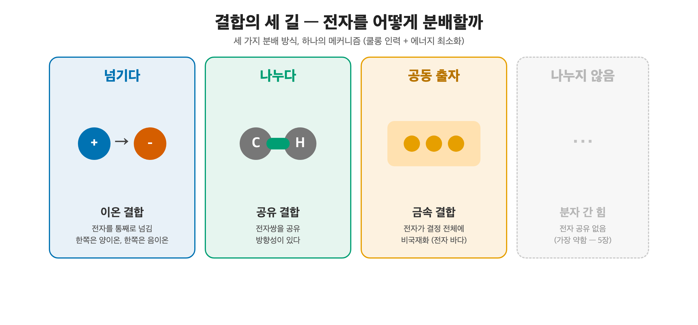

# 6. 이온 결합

[← 이전: 파울리 배타와 교환 에너지](05_pauli-exclusion-and-exchange.md) · [README](README.md) · [→ 다음: 공유 결합과 오비탈 겹침](07_covalent-bond.md)

---

[원자 오비탈과 전자 배치 장](04_atomic-orbital-and-configuration.md)에서 Na는 valence 전자 하나를 잃으려 하고 Cl은 하나를 받으려 한다는 것을 보았다. 두 원자가 만나면 무슨 일이 벌어질까? 전자가 **통째로** 한쪽에서 다른 쪽으로 넘어가고, 남은 두 이온은 순수한 쿨롱 인력으로 묶인다. 이온 결합은 네 가지 결합 중 가장 단순하다. [쿨롱 힘과 퍼텐셜 우물 장](02_coulomb-force-and-potential-well.md)의 퍼텐셜 우물을 거의 날것 그대로 쓴다.

결합이 묻는 질문은 하나로 압축된다. valence 전자를 *어떻게 분배할 것인가*. 답은 세 갈래다. 한쪽이 통째로 **넘기면** 이온 결합, 두 원자가 전자쌍을 **나누면** 공유 결합([공유 결합과 오비탈 겹침 장](07_covalent-bond.md)), 모두가 **공동 출자하면** 금속 결합([금속 결합 장](08_metallic-bond.md))이다. 이온 결합은 이 세 길 중 가장 첫 번째, 전자를 통째로 넘기는 길이다.

*세 가지 분배 방식, 하나의 메커니즘(쿨롱 + 에너지 최소화).*
*넘긴다(이온) · 나눈다(공유) · 공동 출자(금속).*
*네 번째 길(분자 간 힘)은 전자를 나누지 않는다.*

## 1. 전자 이동 — 그리고 곧바로 마주치는 역설

이온 결합의 시작은 전자 한 개의 이동이다.

$$\text{Na} \to \text{Na}^+ + e^- \qquad (\text{이온화 에너지 } +496\ \text{kJ/mol 든다})$$
$$\text{Cl} + e^- \to \text{Cl}^- \qquad (\text{전자 친화도 } 349\ \text{kJ/mol 난다})$$

여기서 독자가 멈춰야 한다. 전자를 떼는 데 496 kJ/mol이 *들고*, 붙이는 데 349 kJ/mol이 *나온다*. 둘을 합치면

$$+496 - 349 = +147\ \text{kJ/mol} \quad(\text{순비용, 에너지 손해})$$

**전자 이동 그 자체는 에너지를 손해 보는 과정이다.** 그렇다면 도대체 왜 소금(NaCl)이 자발적으로 만들어질까? 무언가가 이 147 kJ/mol의 손해를 메우고도 남아야 한다.

사실 이 손해는 예외가 없다. 어떤 원소를 골라도 가장 작은 이온화 에너지(Cs, 376 kJ/mol)가 가장 큰 전자 친화도(Cl, 349 kJ/mol)보다 크다. 그러므로 중성 원자 한 쌍에서 이온 쌍을 만드는 일은 *어떤 조합에서도* 반드시 에너지를 요구한다(Oxtoby §3.8). 이온 결합의 수수께끼는 이 보편적 손해를 무엇이 갚느냐다.

## 2. 쿨롱 격자 — 진짜 에너지 이득

답은 **고립된 이온 한 쌍이 아니라 격자**에 있다.

자연은 Na⁺ 와 Cl⁻ 를 딱 한 쌍씩 짝지어 두지 않는다. 수십억 개의 이온이 3차원 격자로 빼곡히 쌓인다. NaCl 구조에서 Na⁺ 하나는 가장 가까운 Cl⁻ **여섯 개**에 둘러싸이고, 그 Cl⁻ 들도 각각 Na⁺ 여섯 개에 둘러싸인다. 모든 이온이 사방에서 반대 부호 이온의 인력을 받는다.

이 격자가 형성될 때 방출되는 에너지가 **격자 에너지(lattice energy)** 다. NaCl의 경우 약 **787 kJ/mol**이 방출된다. 이제 수지 계산이 맞는다.

*전자 이동은 +147 kJ/mol의 손해지만, 격자 형성 −787 kJ/mol이 이를 압도해 순 −640 kJ/mol의 이득이 된다.*
*이온쌍 형성은 항상 손해이고, 갚는 것은 격자다.*

| 단계 | 에너지 (kJ/mol) |
|---|---:|
| 전자 이동 순비용 (IE − EA) | +147 |
| 격자 형성 (lattice energy) | −787 |
| **전자 이동 + 격자 형성** | **−640** |

격자 형성이 전자 이동의 손해를 압도하고도 한참 남는다. (sublimation, 결합 해리 등 보조 항까지 모두 더하는 정식 회계가 **Born–Haber 사이클**이다. Oxtoby는 이 사이클로 NaCl 격자 에너지를 거꾸로 계산한다. 분해 항 +411 kJ/mol(표준 생성 엔탈피의 부호 반전), 원자화 +229(Na 승화 +108 + ½Cl₂ 해리 +121 = 원자화 +229), 전자 이동 +147 을 더하면 격자 에너지 787 kJ/mol이 나온다. 즉 −411 kJ/mol은 이 사이클의 *입력*이지 출력이 아니다.) 핵심은 이것이다. **이온 결합을 안정하게 만드는 주역은 전자 이동이 아니라 쿨롱 격자다.**

격자 에너지는 [쿨롱 법칙](02_coulomb-force-and-potential-well.md) 그대로 $U \propto q_1 q_2 / r$ 을 따른다. 그래서 MgO는 극적이다. Mg²⁺ 와 O²⁻ 는 전하가 각각 2배라 $q_1 q_2$ 가 NaCl의 4배이고 이온 반지름도 더 작다. 격자 에너지가 약 **3795 kJ/mol** — NaCl의 거의 5배다. 이 한 가지 숫자가 MgO의 융점 2852 °C(NaCl은 801 °C)를 곧장 설명한다.

## 3. 퍼텐셜 우물의 관점

이온 결합을 우물로 보면 두 가지 특징이 두드러진다.

- **깊고 비교적 대칭적인 우물**. 인력 항은 순수한 쿨롱 $-k q_1 q_2 / r$ 이라 계산이 단순하고, 반발 항은 [전자구름의 Born 반발](04_atomic-orbital-and-configuration.md)이다.
- **비방향성(non-directional)**. 쿨롱 힘은 방향을 가리지 않는다. 이온은 사방의 반대 이온을 똑같은 세기로 끌어당긴다. 그래서 이온은 가능한 한 많은 반대 이온을 곁에 두려 하고, 결과적으로 격자는 조밀하게 충전된다. 이 "방향이 없다"는 성질이 다음 섹션 거시 물성의 출발점이다.

## 4. 거시 물성 — 격자 기하에서 곧장

### 취성(brittleness) — 이온 결정의 시그니처

금속을 망치로 치면 휜다. 이온 결정(소금, 세라믹)을 치면 **휘지 않고 쪼개진다**. 왜?

*온전한 격자에서는 모든 이온이 반대 부호 이온에 둘러싸여 안정하다.*
*한 면이 이온 한 칸만큼 미끄러지면 같은 부호 이온이 슬립 면을 가로질러 정렬된다.*
*인력이 반발로 뒤집혀 결정이 그 면을 따라 쪼개진다(cleavage).*

메커니즘은 그림 한 장에 담긴다. 전단력을 받아 한 평면이 이온 **한 칸**만큼 미끄러지는 순간, 격자의 부호 교대가 깨진다. 슬립 면을 사이에 두고 양이온이 양이온과, 음이온이 음이온과 마주 선다. 인력이 한순간에 강한 반발로 뒤집히고, 결정은 그 면을 따라 깨끗하게 쪼개진다. 부호가 교대하는 격자에서 취성은 선택이 아니라 **기하학적 필연**이다. ([금속 결합 장](08_metallic-bond.md)이 왜 정반대로 연성인지를 보면 대비가 선명해진다.)

### 고융점·고경도

강한 쿨롱 격자는 끊기 어렵다. 깊은 우물 = 높은 융점이라는 [쿨롱 힘과 퍼텐셜 우물 장](02_coulomb-force-and-potential-well.md)의 규칙 그대로다. NaCl 801 °C, MgO 2852 °C. 세라믹이 고온 부품과 내화재로 쓰이는 물리적 근거가 여기 있다.

### 전기 절연(고체) 대 전도(용융·용액)

고체 이온 결정에서 모든 전자는 이온에 단단히 묶여 있고 이온 자체도 격자에 고정되어 있다. 움직일 수 있는 전하 운반자가 없으므로 **절연체**다. 그런데 NaCl을 녹이거나 물에 녹이면 이온이 격자에서 풀려나 자유롭게 움직이고, 전류를 운반한다. 단 이때의 전도는 **이온 전도**다. 전자가 흐르는 [금속의 전자 전도](08_metallic-bond.md)와 메커니즘이 다르다.

## 5. 종합 — 우물이 답한다

| 미시 원인                   | 거시 물성                | 수치 anchor                   |
| ----------------------- | -------------------- | --------------------------- |
| 부호 교대 격자 + 비방향성         | **취성** (전단 시 동부호 충돌) | 슬립 1칸에 인력→반발                |
| 강한 쿨롱 격자, 깊은 우물         | 고융점·고경도              | NaCl 801 °C, MgO 2852 °C    |
| 전하 운반자 고정 (고체)          | 전기 절연체               | —                           |
| 이온이 풀려남 (용융·용액)         | 이온 전도                | —                           |
| $U \propto q_1 q_2 / r$ | 전하 2배+거리 감소 → 격자E ~5배 | MgO 3795 vs NaCl 787 kJ/mol |

## 더 읽을거리

- [쿨롱 힘과 퍼텐셜 우물](02_coulomb-force-and-potential-well.md) — 이온 결합은 그 퍼텐셜 우물의 가장 순수한 형태
- [원자 오비탈과 전자 배치](04_atomic-orbital-and-configuration.md) — 왜 Na는 전자를 주고 Cl은 받는가
- [공유 결합과 오비탈 겹침](07_covalent-bond.md) — 전자를 주고받는 대신 공유하면
- [금속 결합](08_metallic-bond.md) — 비방향성은 같지만 결과는 정반대(연성)인 결합
- [분자 간 힘](09_intermolecular-forces.md) — 격자 에너지와 비교되는 약한 분자 간 힘

## 출처 및 더 읽을거리

- **Purdue ChemEd, "Lattice Energy"** (`chemed.chem.purdue.edu/genchem/topicreview/bp/ch7/lattice.php`). 격자 에너지의 정량적 출처. 알칼리 할로젠화물 표(LiF 1036 → CsI 604 kJ/mol, 이온이 작을수록 큼)와 전하 효과 표(NaOH 900 → MgO 3791 → **Al₂O₃ 15,916 kJ/mol**, 전하가 클수록 급증)로 이 글의 $U \propto q_1 q_2 / r$ 을 표로 확인할 수 있다. 또한 격자 에너지와 용해도의 관계를 다룬다. 격자 에너지가 클수록 물에 덜 녹는다 (NaOH 420 g/L 대 Mg(OH)₂ 0.009 g/L).
- **ReAgent, "What is an ionic bond?"** (`reagent.co.uk/blog/what-is-an-ionic-bond`). 이온 결합 입문 글. 네 결합 분류, 일상 속 이온 화합물(소금·베이킹소다·NaOH), NaCl 융점 801 °C가 납보다 높다는 비교를 담았다. 이 글보다 개론적이지만 일상 예시가 풍부하다.

## 연습 문제

**1.** Na에서 Cl로 전자를 옮기는 것만 따지면 147 kJ/mol의 에너지 손해가 난다. 그런데도 NaCl이 자발적으로 형성되는 이유를 한 문장으로 설명하라.

풀이

수십억 개의 이온이 3차원 쿨롱 격자를 이루며 방출하는 격자 에너지(NaCl 약 787 kJ/mol)가 전자 이동의 147 kJ/mol 손해를 압도하기 때문이다. 이온 결합의 안정성은 전자 이동이 아니라 격자 형성에서 나온다.

**2.** MgO의 격자 에너지는 NaCl의 약 5배다. $U \propto q_1 q_2 / r$ 을 근거로 그 이유 두 가지를 들어라.

풀이

(1) 전하: Mg²⁺·O²⁻ 는 전하가 각각 2이므로 $q_1 q_2 = 2 \times 2 = 4$, NaCl의 $1 \times 1 = 1$ 보다 4배다. (2) 거리: Mg²⁺·O²⁻ 는 Na⁺·Cl⁻ 보다 이온 반지름이 작아 $r$ 이 짧고, $U \propto 1/r$ 이므로 에너지가 더 커진다. 두 효과가 곱해져 약 5배가 된다. 이 격자 에너지 차이가 MgO의 높은 융점(2852 °C)으로 직결된다.

**3.** 같은 비방향성 결합인데 이온 결정은 취성이고 금속은 연성이다. 이온 결정이 전단력에 쪼개지는 이유를 격자의 부호 구조로 설명하라.

풀이

이온 격자는 양·음 이온이 교대로 배열된다. 한 평면이 이온 한 칸만큼 미끄러지면 이 부호 교대가 깨져, 슬립 면을 가로질러 같은 부호 이온끼리 마주 서게 된다. 인력이 강한 반발로 뒤집히면서 결정이 그 면을 따라 쪼개진다. 금속은 양이온 격자 전체가 비국재화된 자유 전자 바다에 잠겨 있어, 면이 미끄러져도 전자 바다가 결합을 유지하므로 깨지지 않고 휜다([금속 결합 장](08_metallic-bond.md) 참고).

---

[← 이전: 파울리 배타와 교환 에너지](05_pauli-exclusion-and-exchange.md) · [README](README.md) · [→ 다음: 공유 결합과 오비탈 겹침](07_covalent-bond.md)
