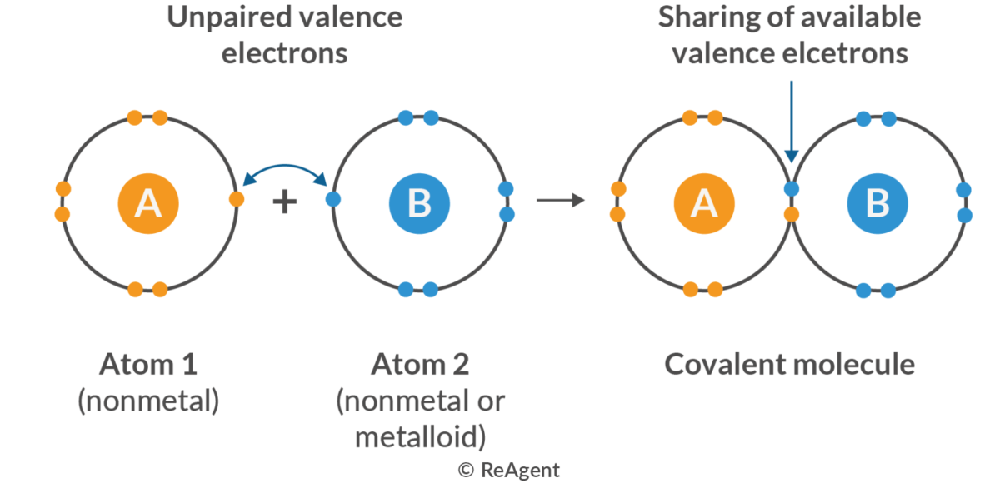

# 7. 공유 결합과 오비탈 겹침

[← 이전: 이온 결합](06_ionic-bond.md) · [README](README.md) · [→ 다음: 금속 결합](08_metallic-bond.md)

---

[이온 결합](06_ionic-bond.md)은 전자를 통째로 넘긴다. Na처럼 valence 전자가 적거나 Cl처럼 거의 다 찬 원자에게는 그게 최선이다. 그런데 탄소처럼 valence 전자가 **4개** — 잃기에도 받기에도 어중간한 — 원자는 어떻게 할까? 답은 타협이다. 전자를 주지도 받지도 않고 **공유한다.** 공유 결합은 네 결합 중 가장 풍부한 구조를 만든다. 다이아몬드의 단단함도, 그래핀의 평면도, 모든 유기 분자도 여기서 나온다.

## 1. 공유 결합의 본질 — 오비탈 겹침

두 원자가 가까워지면 각자의 valence 오비탈이 공간적으로 **겹친다(overlap)**. 겹친 영역, 즉 두 핵 사이에 전자 밀도가 집중된다. 그 음전하 구름이 양쪽 핵을 *동시에* 끌어당기면서 두 원자를 묶는다. 이것이 공유 결합이다.

*두 원자가 짝 없는 valence 전자를 내어 공유하면 공유 결합 분자가 된다.*

가장 단순한 예가 수소 분자 H₂ 다. 두 수소의 1s 오비탈이 겹쳐 전자쌍 하나를 공유하고, 결합 에너지 436 kJ/mol, 결합 길이 74 pm의 우물이 만들어진다.

[전자가 파동](03_quantization-and-wave-nature.md)이라는 사실을 떠올리면 더 깊이 볼 수 있다. 두 오비탈 파동이 만날 때 **보강 간섭**하면 핵 사이 전자 밀도가 높아지고 에너지가 내려간다. 이것이 **bonding orbital**(결합 오비탈)이다. 반대로 **상쇄 간섭**하면 핵 사이에 노드가 생겨 에너지가 올라간다. 이것이 **antibonding orbital**(반결합 오비탈)이다. 전자가 bonding orbital을 채우면 결합이 형성된다. 결합이란 곧 전자 파동의 보강 간섭이다.

## 2. 결합 차수 — 전자쌍을 더 공유하면

두 원자가 전자쌍을 하나가 아니라 둘, 셋씩 공유할 수도 있다. 이것이 **결합 차수(bond order)** 다.

| 결합 | 공유 전자쌍 | 에너지 (kJ/mol) | 길이 (pm) |
|---|:--:|:--:|:--:|
| C–C 단일 | 1 | 346 | 154 |
| C=C 이중 | 2 | 614 | 134 |
| C≡C 삼중 | 3 | 839 | 120 |

차수가 올라갈수록 결합은 강해지고 짧아진다. [퍼텐셜 우물 장](02_coulomb-force-and-potential-well.md)의 우물 규칙 그대로다. 전자쌍을 더 공유하면 핵 사이 인력이 커져 우물이 더 깊고 좁아진다.

## 3. 극성 — 이온 결합과 공유 결합은 한 축의 양 끝

전자쌍을 공유한다고 해서 꼭 *공평하게* 공유하는 것은 아니다. 두 원자의 **전기음성도(electronegativity)** 가 다르면, 공유 전자쌍이 더 강하게 당기는 쪽으로 치우친다. 이것이 **극성 공유 결합(polar covalent bond)** 이다.

전기음성도 차이 $\Delta\chi$ 가 결합의 성격을 연속적으로 결정한다.

- $\Delta\chi$ 작음 (예: C–C, 0) → 무극성 공유 결합
- $\Delta\chi$ 중간 (예: O–H, 1.24) → 극성 공유 결합
- $\Delta\chi$ 큼 (예: Na–Cl, 2.23) → 이온 결합

여기서 중요한 통찰. **이온 결합과 공유 결합은 별개의 범주가 아니다.** 전자를 100% 넘기면 이온, 50:50으로 나누면 무극성 공유, 그 사이는 전부 극성 공유다. 둘은 같은 축의 양 끝일 뿐이다.

## 4. 방향성과 혼성 — 공유 결합의 핵심 차별점

이온 결합의 쿨롱 힘은 비방향성이었다. 공유 결합은 **방향성**을 갖는다. p 오비탈이 공간의 특정 방향을 향하기 때문이다. 그리고 이 방향성이 공유 결합 재료의 모든 것을 좌우한다.

그런데 곧바로 수수께끼가 나온다. 탄소의 바닥 상태 전자 배치는 2s² 2p² 이다. 짝 없는 전자가 2개뿐이므로 공유 결합을 2개만(CH₂) 해야 맞다. 게다가 둥근 s 오비탈 1개와 아령 모양의 p 오비탈 3개는 모양도, 에너지도 다르다. 그런데 실제 메탄(CH₄)을 보면 결합이 4개이고, **네 결합이 완벽하게 똑같으며**, 정확히 정사면체 꼭짓점 방향으로 109.5°씩 벌어져 있다. 왜일까?

> **개념 보강: 혼성(Hybridization)이란?**
> 답은 "원자가 결합할 때는 오비탈을 재조립한다"는 것이다.
> 1. **승위(Promotion)**: 탄소는 에너지를 약간 들여 2s의 전자 하나를 빈 2p 오비탈로 올려보낸다(2s¹ 2p³). 이제 짝 없는 전자가 4개가 된다.
> 2. **혼성(Hybridization)**: 이 4개의 오비탈(s 1개 + p 3개)을 마치 밀가루 반죽처럼 한데 뭉쳐서 수학적으로 섞는다.
> 3. **결과**: 원래의 구형(s)이나 대칭 아령형(p)이 아니라, 한쪽 로브(lobe)가 비대하게 커진 비대칭형 **새 오비탈 4개**가 탄생한다. 이것이 **sp³ 혼성 오비탈**이다. 한쪽이 크기 때문에 상대 원자의 오비탈과 훨씬 더 깊게 **겹칠(overlap)** 수 있어 결합 에너지가 극대화된다.

*sp 혼성은 선형 180도, sp2는 평면 삼각 120도, sp3는 정사면체 109.5도.*
*sp3 패널의 굵은 쐐기는 화면 앞쪽, 점선은 화면 뒤쪽 결합을 뜻한다.*

혼성은 임의의 수학적 장치가 아니라 **에너지 최소화의 결과**다.
섞이지 않고 남겨진 p 오비탈(비혼성 p 오비탈)은 나란히 서서 파이($\pi$) 결합이라는 두 번째 결합을 만든다.

| 혼성 | 섞는 오비탈 | 혼성 오비탈 | 남은 p 오비탈 | 기하 | 각도 | 결합 특성 | 대표 재료 |
|---|---|:--:|:--:|---|:--:|---|---|
| **sp³** | s + p×3 | 4개 | 없음 | 정사면체 | 109.5° | $\sigma$ 결합 4개 (단일 결합) | 다이아몬드, 메탄 |
| **sp²** | s + p×2 | 3개 | 1개 | 평면 삼각 | 120° | $\pi$ 결합 1개 가능 (이중 결합) | 흑연, 그래핀 |
| **sp** | s + p×1 | 2개 | 2개 | 선형 | 180° | $\pi$ 결합 2개 가능 (삼중 결합) | 아세틸렌 |

결론적으로 똑같은 혼성 오비탈을 사방으로 뻗으면 상대 원자와 최대한 겹칠 수 있고(결합 에너지 최대화), 동시에 전자쌍끼리 최대한 멀어진다(반발 최소화). 자연은 늘 퍼텐셜 우물의 바닥을 찾는다. 혼성이 분자의 뼈대(기하 구조)를 결정하고, 그 기하가 재료의 차원성을 정한다.

## 5. 분자 기하 — VSEPR

혼성을 전자쌍의 언어로 다시 말한 것이 **VSEPR**(valence shell electron pair repulsion, 원자가 껍질 전자쌍 반발) 모형이다. 원리는 한 문장이다. **중심 원자 주위의 전자쌍들은 음전하끼리 반발하므로 서로 최대한 멀어진다.**

중심 원자 주위 전자쌍(영역) 수가 기하를 결정한다.

- 2개 → 선형, 180° (sp에 대응)
- 3개 → 평면 삼각, 120° (sp²에 대응)
- 4개 → 정사면체, 109.5° (sp³에 대응)

전자쌍에는 결합에 쓰이는 **결합쌍(bonding pair)** 과 한 원자에만 속한 **고립쌍(lone pair)** 이 있다. 고립쌍은 핵 하나에만 묶여 더 넓게 퍼지므로 이웃 전자쌍을 더 세게 민다. 그 결과 결합각이 줄어든다.

- CH₄: 고립쌍 0개 → 정확히 109.5°
- NH₃: 고립쌍 1개 → 107.3°로 압축
- H₂O: 고립쌍 2개 → 104.5°로 더 압축

혼성과 VSEPR은 같은 현상의 두 언어다. 둘 다 "전자쌍은 서로 멀어지려 한다"는 [쿨롱 반발](02_coulomb-force-and-potential-well.md)의 다른 표현일 뿐이다.

## 6. 거시 물성 — 방향성 강결합이 만드는 것

### 경도와 강도

모든 원자가 강한 방향성 공유 결합으로 묶인 **공유 결합 그물(covalent network)** 은 극도로 단단하다. 다이아몬드는 sp³ 탄소가 3차원으로 무한히 연결된 그물이다. 천연 물질 중 가장 단단하고, Young's modulus가 약 1100 GPa에 이른다. 실리콘과 석영(SiO₂)도 같은 부류다.

### 그러나 취성

방향성 결합은 특정 각도를 "고집한다". 전단력으로 결합각이 틀어지면 결합이 깨지고, 한번 깨진 방향성 결합은 다시 맞춰지지 않는다. 그래서 다이아몬드는 천연 물질 중 가장 단단하면서도 **취성**이다. 망치로 정확한 면을 때리면 쪼개진다. 강하다는 것과 연성은 별개임을 다시 본다.

### 같은 원자, 다른 혼성 — 다이아몬드 대 흑연

가장 놀라운 사례. 다이아몬드와 흑연은 **둘 다 순수한 탄소**다. 차이는 오직 혼성이다.

- **다이아몬드 (sp³)**: 3차원 그물. 모든 방향이 강한 공유 결합. 초경질, 전기 절연체, 투명.
- **흑연 (sp²)**: 2차원 평면 시트(그래핀 층)가 쌓인 구조. 시트 *안*은 강한 공유 결합이지만, 시트 *사이*는 약한 [분자 간 힘](09_intermolecular-forces.md)뿐이다. 그래서 층끼리 쉽게 미끄러진다 — 연필심이 종이에 묻고 흑연이 윤활제로 쓰이는 이유다. 또 sp² 평면에는 비국재화된 π 전자가 있어 면 방향으로 전기가 통한다.

같은 원자가 혼성 하나 때문에 초경질 절연체와 무른 도체로 갈라진다. 미시 구조가 거시 물성을 지배한다는 주장을 이보다 선명하게 보여주는 예는 드물다.

### 전기 전도 — 대개 절연체

공유 결합에서 전자는 결합에 **국재화(localized)** 되어 있어 자유롭게 흐르지 못한다. 그래서 공유 결합 그물은 대개 절연체다(다이아몬드 band gap 5.5 eV). 전자가 강한 방향성 결합에 묶여 있는 한, 외부 전기장이 있어도 끌고 다닐 자유 전자가 없다.

## 7. 종합 — 우물이 답한다

| 미시 원인 | 거시 물성 | 수치 |
|---|---|---|
| 방향성 강결합 3D 그물 | 초경질·고강도 | 다이아 $E$ ≈ 1100 GPa |
| 결합각 고정, 재형성 불가 | 취성 | 다이아 cleavage |
| sp³ 3D 대 sp² 2D 층상 | 다이아 절연 대 흑연 윤활·도전 | 같은 C |
| 전자 국재화, 큰 band gap | 절연체 | 다이아 5.5 eV |
| 결합 차수 ↑ | 강하고 짧은 결합 | C≡C 839 kJ/mol, 120 pm |

## See Also

- [퍼텐셜 우물](02_coulomb-force-and-potential-well.md) — 공유 결합도 우물이며, 차수가 깊이를 정한다
- [원자 오비탈과 전자 배치](04_atomic-orbital-and-configuration.md) — 겹치는 valence 오비탈, 혼성의 재료
- [양자화와 전자의 파동성](03_quantization-and-wave-nature.md) — bonding/antibonding은 전자 파동의 보강·상쇄 간섭
- [이온 결합](06_ionic-bond.md) — 전기음성도 축의 반대쪽 끝
- [금속 결합](08_metallic-bond.md) — 전자를 국재화하지 않고 풀어놓으면
- [분자 간 힘](09_intermolecular-forces.md) — 흑연 층 사이를 잡는 약한 힘

## 연습 문제

**1.** C≡C 삼중 결합은 C–C 단일 결합보다 결합 에너지가 크고 결합 길이는 짧다. 이것을 퍼텐셜 우물의 모양으로 설명하라.

풀이

삼중 결합은 전자쌍 3개를 공유하므로 두 핵 사이 전자 밀도가 단일 결합보다 훨씬 크다. 핵–전자구름 인력이 강해져 퍼텐셜 우물이 더 **깊어지고**(결합 에너지 ↑: 346 → 839 kJ/mol), 평형 거리가 더 **짧아진다**(우물 바닥이 왼쪽으로: 154 → 120 pm). 우물 깊이는 결합 에너지, 우물 바닥 위치는 결합 길이라는 [퍼텐셜 우물 장](02_coulomb-force-and-potential-well.md)의 규칙이 그대로 적용된다.

**2.** H₂O의 결합각은 104.5°로 정사면체 각 109.5°보다 작다. VSEPR로 그 이유를 설명하라.

풀이

산소는 중심에 전자쌍 4개를 가지는데, 그중 2개가 결합쌍(O–H), 2개가 고립쌍이다. 전자쌍 4개이므로 기본 기하는 정사면체(109.5°)다. 그러나 고립쌍은 핵 하나에만 묶여 더 넓게 퍼지므로 이웃 결합쌍을 더 세게 민다. 고립쌍 2개가 O–H 결합쌍들을 압박해 H–O–H 각이 109.5°에서 104.5°로 줄어든다.

**3.** 다이아몬드와 흑연은 둘 다 순수한 탄소인데, 하나는 초경질 절연체이고 다른 하나는 무르고 전기가 통한다. 혼성과 차원성의 관점에서 이 차이를 설명하라.

풀이

다이아몬드는 sp³ 혼성으로, 모든 탄소가 4방향 정사면체 공유 결합을 이뤄 3차원 그물을 만든다. 모든 방향이 강한 결합이라 초경질이고, 전자가 결합에 국재화되어 절연체다. 흑연은 sp² 혼성으로, 탄소가 평면 삼각 결합을 이뤄 2차원 시트(그래핀)를 만든다. 시트 안은 강한 공유 결합이지만 시트 사이는 약한 분자 간 힘뿐이라 층이 쉽게 미끄러져 무르다(윤활성). 또 sp² 평면의 비국재화 π 전자가 면 방향 전기 전도를 만든다. 같은 원자라도 혼성이 결합 기하와 차원성을 바꾸면 거시 물성이 정반대가 된다.

---

[← 이전: 이온 결합](06_ionic-bond.md) · [README](README.md) · [→ 다음: 금속 결합](08_metallic-bond.md)
