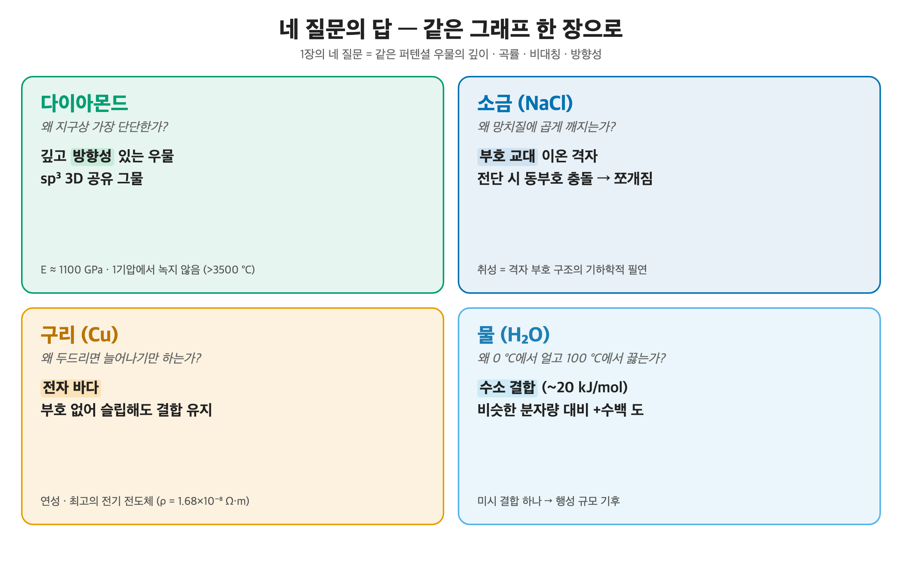

# 10. 마무리 — 네 질문의 답

[← 이전: 분자 간 힘](09_intermolecular-forces.md) · [README](README.md) · [→ 부록: 수치 자료](11_appendix_numerical-anchors.md)

---

이제 처음으로 돌아갈 차례다. [들어가며 장](01_introduction.md)에서 일상의 네 가지 질문을 던지고, 그 답이 모두 같은 우물 그래프 한 장에서 떨어진다고 약속했다. 그동안 우리는 [쿨롱 힘에서 퍼텐셜 우물](02_coulomb-force-and-potential-well.md)을 끌어냈고, [전자의 파동성](03_quantization-and-wave-nature.md)과 [오비탈](04_atomic-orbital-and-configuration.md), [파울리 배타](05_pauli-exclusion-and-exchange.md)로 채움 규칙을 세웠으며, 네 종류의 결합([이온](06_ionic-bond.md)·[공유](07_covalent-bond.md)·[금속](08_metallic-bond.md)·[분자 간 힘](09_intermolecular-forces.md))을 모두 같은 우물의 변주로 읽었다. 처음엔 질문만 있었지만, 이제는 답을 손에 쥐고 있다.

## 1. 네 질문, 네 답

*들어가며 장의 네 질문 그리드를 그대로 다시 띄운다.*
*이제 각 칸에 답이 채워진다 — 모두 같은 우물의 다른 모양일 뿐.*

### 다이아몬드는 왜 가장 단단한가?

**깊고 방향성 있는 우물** 때문이다. 탄소가 sp³로 혼성해 3차원 공유 그물을 이루고, 그 우물이 깊은 동시에 *각도를 고집한다*. [공유 결합 장](07_covalent-bond.md)에서 보았듯 방향성 우물은 전단에 쉽게 양보하지 않는다. 결합을 끊거나 휘려면 그물 전체를 동시에 거슬러야 한다. 그래서 영률이 약 **1100 GPa**에 이르고, 천연 물질 중 가장 단단한 물질이 된다.

### 소금(NaCl)은 왜 곱게 깨지는가?

**부호 교대 이온 격자** 때문이다. [이온 결합 장](06_ionic-bond.md)에서 본 대로, 양이온과 음이온이 교대로 배열된 격자에서 한 면이 이온 *한 칸*만큼 미끄러지면 부호 교대가 깨진다. 슬립 면을 가로질러 같은 부호 이온이 마주 서고, 인력이 순식간에 강한 반발로 뒤집혀 결정이 그 면을 따라 쪼개진다. 부호가 교대하는 격자에서 취성은 선택이 아니라 기하학적 필연이다.

### 구리는 왜 늘어나기만 하는가?

**전자 바다** 때문이다. 금속 결합도 이온처럼 비방향성이지만, 결정적 차이가 있다. [금속 결합 장](08_metallic-bond.md)에서 보았듯 양이온 격자가 비국재화된 음전하 전자 바다에 잠겨 있어 *부호 교대가 없다*. 그래서 한 면이 미끄러져도 같은 부호 충돌이 일어나지 않고, 전자 바다가 결합을 그대로 유지한다. 소금이 쪼개진 바로 그 전단에서 구리는 깨지지 않고 휘고 늘어난다.

### 물은 왜 0도에서 얼고 100도에서 끓는가?

**수소 결합** 때문이다. [분자 간 힘 장](09_intermolecular-forces.md)에서 본 대로, 물의 분자 간 힘은 약 **20 kJ/mol**짜리 아주 얕은 우물이다. 분자 안의 O–H 공유 결합(463 kJ/mol)보다 한 자릿수 이상 약하다. 그런데도 이 얕은 우물 하나가, 비슷한 분자량의 다른 분자보다 끓는점을 *수백 도* 끌어올린다. 끓을 때 끊기는 건 분자 *사이*의 이 힘이지 분자 *안*의 O–H 결합이 아니다. H₂O 분자 자체는 끓어도 멀쩡히 살아남는다.

## 2. 미시 → 거시 마스터 표

네 답이 따로 노는 게 아닌 이유는 모두 같은 표에서 나오기 때문이다. 우물의 *어떤 특징*이 *어떤 거시 물성*을 만드는가.

| 우물의 특징 | 미시적 의미 | 거시 물성 |
|---|---|---|
| 깊이 | 결합을 끊는 에너지 | 결합 에너지, 융점 |
| 곡률 | 진동 스프링 상수 | 강성 (Young's modulus) |
| 비대칭 | 진동 평균 위치 이동 | 열팽창 계수 |
| 방향성 유무 | 결합이 각도를 고집하는가 | 취성 대 연성, 이방성 |

네 결합을 이 틀에 넣으면, 네 질문의 답이 한 줄씩 정렬된다.

| 결합 | 우물 | 방향성 | 대표 거시 물성 | 예 |
|---|---|---|---|---|
| **이온** | 깊고 대칭 | 비방향성 | 취성, 고융점, 절연(고체) | NaCl, MgO |
| **공유** | 깊고 좁음 | 방향성 | 초경질, 고강성, 취성, 절연 | 다이아, Si |
| **금속** | 얕고 넓음 | 비방향성 | 연성, 전기·열 전도, 광택 | Cu, Fe |
| **분자간** | 매우 얕음 | — | 무름, 저융점, 큰 열팽창 | 얼음, 폴리머 |

이 표가 품은 가장 인상적인 대비 두 가지를 기억해 두자.

- **이온과 금속은 둘 다 비방향성인데 결과가 정반대다.** 이온은 취성, 금속은 연성. 차이는 단 하나, 부호 교대 격자냐 부호 없는 전자 바다냐다. 소금과 구리의 운명이 여기서 갈린다.
- **다이아몬드와 흑연은 둘 다 순수 탄소인데 정반대다.** 혼성 하나(sp³ 대 sp²)가 초경질 절연체와 무른 도체로 가른다. 같은 원소라도 우물의 모양이 다르면 물성이 다르다.

## 3. 네 우물, 한 그래프

*이온은 깊고 대칭, 공유는 깊고 방향성, 금속은 얕고 넓음, 분자 간 힘은 아주 얕음.*
*모두 인력과 반발이 합쳐진 같은 퍼텐셜 우물 — 깊이와 모양만 다르다.*

처음엔 전혀 무관해 보이던 네 현상이 — 단단함, 깨짐, 늘어남, 상전이 — 결국 같은 퍼텐셜 우물 그래프 한 장의 깊이와 곡률, 비대칭, 방향성으로 모두 설명된다. 우물이 깊으면 융점이 높고, 곡률이 크면 강성이 높고, 비대칭이 크면 열팽창이 크고, 방향성이 있으면 취성이고 없으면 연성이다. 네 질문은 사실 *하나의 그래프를 읽는 네 가지 방식*이었던 셈이다.

그래서 이 글이 드리고 싶은 도구는 결합 종류의 목록이 아니라 *우물 하나를 읽는 눈*이다. 새로운 재료를 만나거든 그 결합의 우물 모양을 머릿속에 그려 보라. 깊은가 얕은가, 대칭인가 비대칭인가, 방향성이 있는가. 그 한 장의 그래프가 단단함과 융점과 열팽창과 가공성을 한꺼번에 말해 줄 것이다.

화학은 옥텟 규칙을 외우는 게 아니라, **쿨롱 우물 하나를 읽는 일**이다.

---

[← 이전: 분자 간 힘](09_intermolecular-forces.md) · [README](README.md) · [→ 부록: 수치 자료](11_appendix_numerical-anchors.md)
