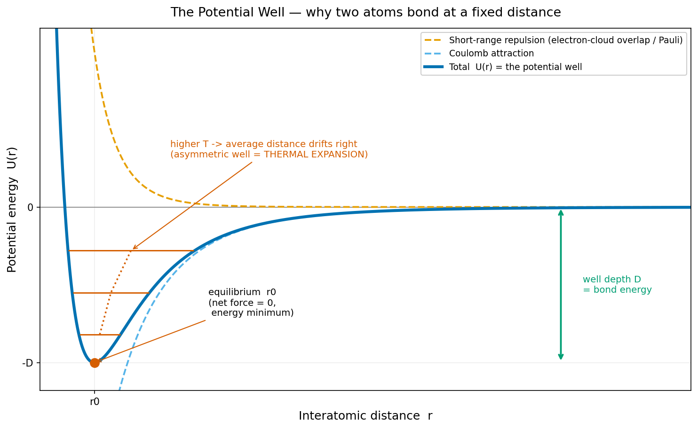
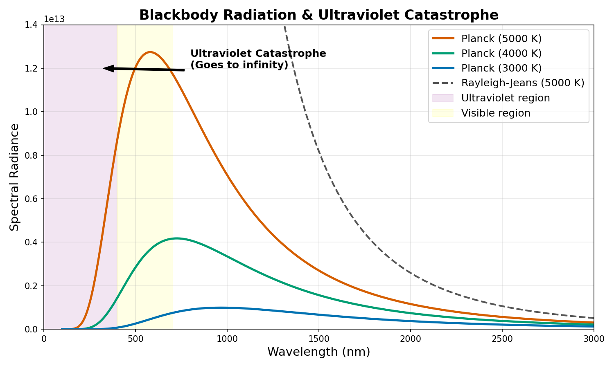
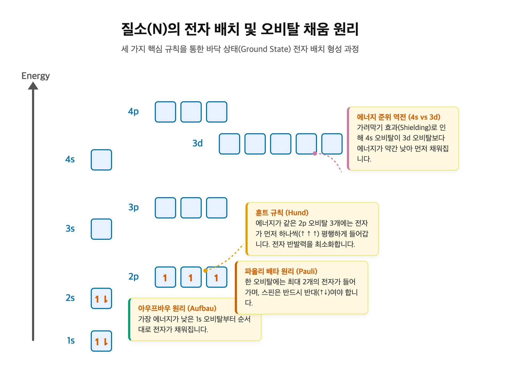
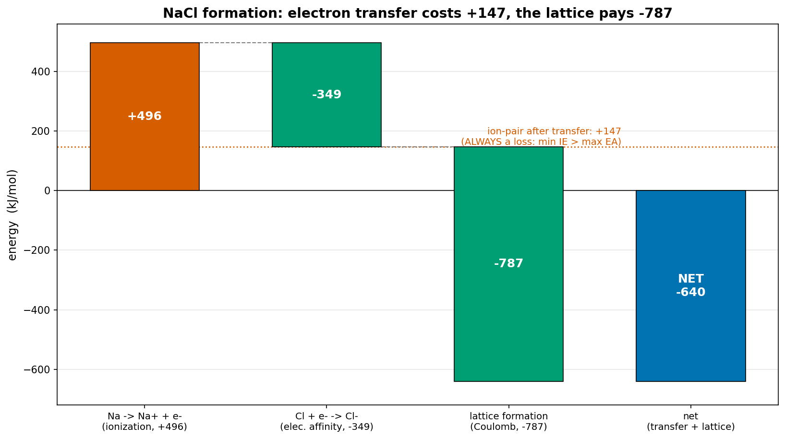
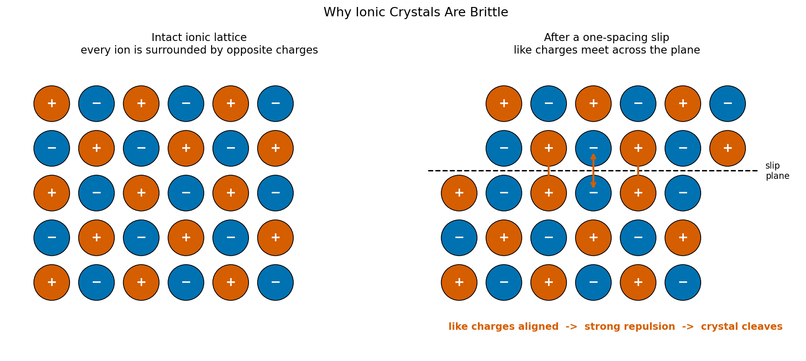
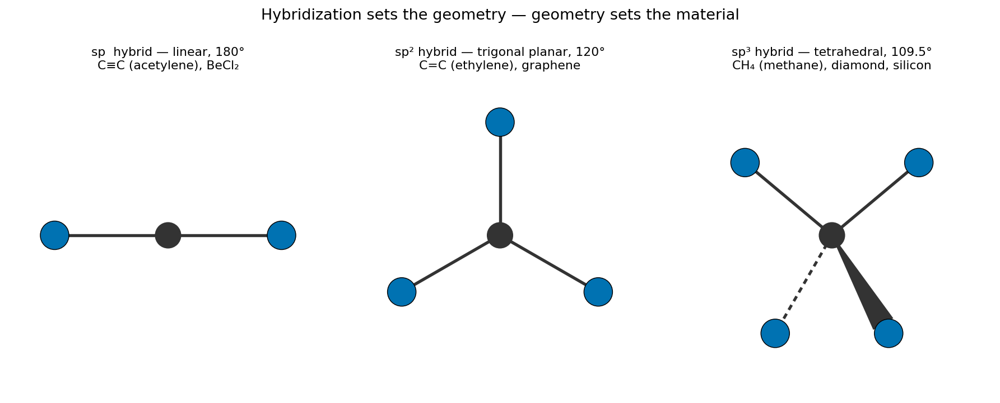
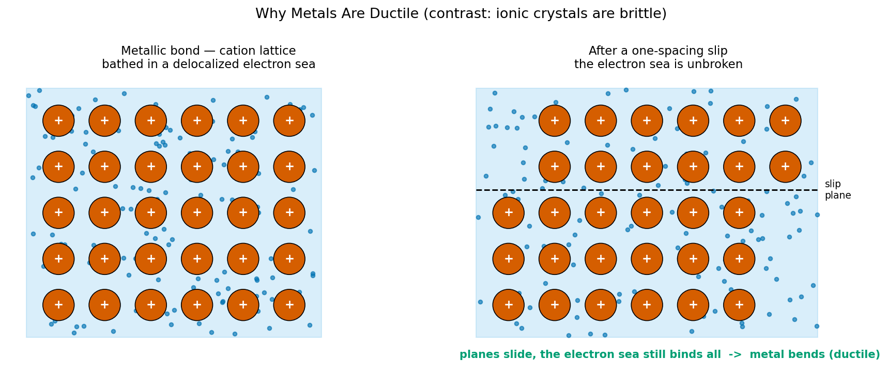
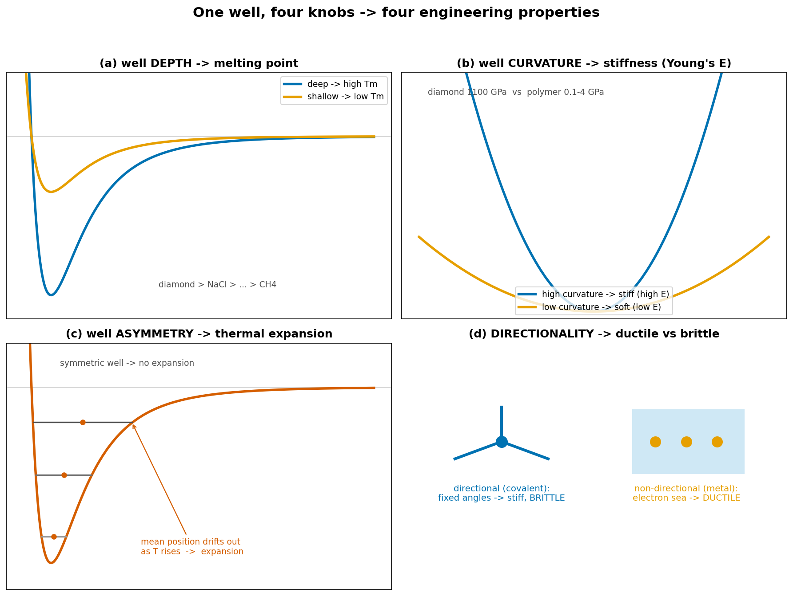
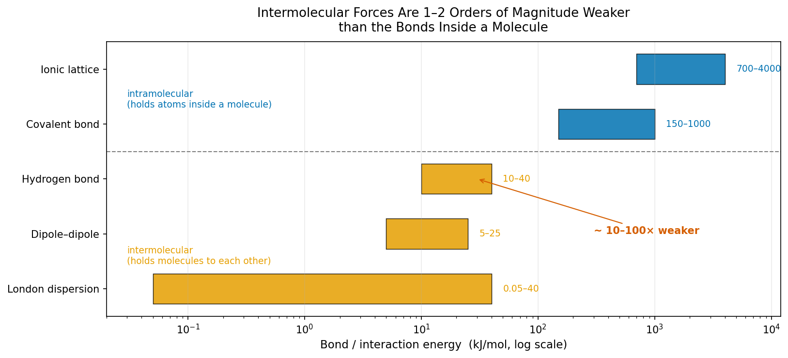
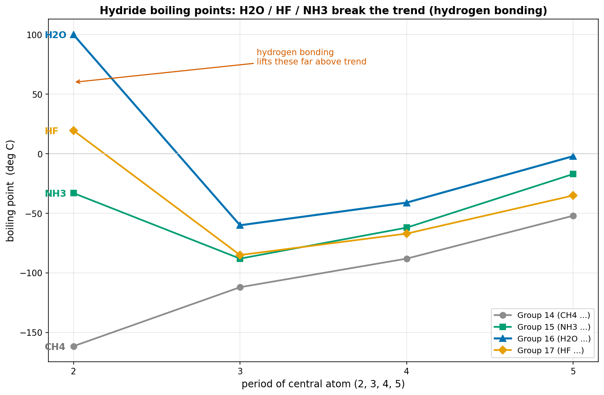

<!-- _class: lead -->

# 원자에서 재료까지

## 하나의 퍼텐셜 우물로 읽는 화학

*옥텟 규칙 없이, 두 원리만으로*

**Jaehoss** · 2026-06-12 · Probe Lab Seminar

<!--
오늘 두 시간 동안 화학을 봅니다. 시험용 옥텟 규칙·가전자 8개 외우기가 아니라, 다이아몬드는 왜 단단하고 소금은 왜 깨지며 구리는 왜 늘어나고 물은 왜 0/100도에서 상전이하는지를 단 두 원리로 푸는 first-principles 세미나입니다. 핵심 약속: 결합 네 종류는 모양만 다른 같은 퍼텐셜 우물 하나다.
-->

---

## 목차

1. **도입** — 두 원리로 보는 화학 (쿨롱 + 에너지 최소화)
2. **원자** — 양자화가 어떻게 원자를 살렸는가
3. **전자** — 3차원 정상파의 모드 = 오비탈
4. **결합** — 네 우물은 모양만 다른 같은 우물
5. **분자** — 가장 얕은 우물과 네 질문의 답

> 핵심 약속 — *"결합 4종 = 모양만 다른 같은 우물 1개."* 마지막에 도입의 네 질문(다이아·소금·구리·물)이 같은 그래프 한 장으로 한꺼번에 풀린다.

<!--
4부 로드맵: 원자에서 출발해 전자, 결합을 거쳐 분자까지. 끝나면 도입에서 던진 네 질문으로 돌아와 같은 우물 그래프 한 장으로 답한다.
-->

---

<!-- _class: lead -->

# 1. 도입

## 두 원리로 보는 화학

*쿨롱 법칙 · 에너지 최소화*

---

## 1.1 근본 원리로 이해하는 화학 기초

- **근본 원리로 이해하는 화학** — 원자 · 전자 · 결합 · 분자
- *옥텟 규칙 없이, 두 원리만으로*
- 오늘의 핵심 그래프는 이것 — **네 결합 = 모양만 다른 같은 우물**

> 화학을 *외우는* 게 아니라, 그래프 하나를 *읽는* 능력을 갖고 돌아간다.

<!--
오늘 다룰 핵심 그래프가 이 네 우물 그림이다. 결합 네 종류가 모양만 다른 같은 퍼텐셜 우물이라는 것을, 다음 슬라이드들에서 차근차근 보여준다.
-->

---

## 1.2 일상의 네 가지 질문

| 재료 | 질문 |
|---|---|
| **다이아몬드** | 왜 천연 물질 중 가장 단단한가? |
| **소금 (NaCl)** | 왜 망치질에 곱게 깨지는가? |
| **구리** | 왜 두드리면 늘어나기만 하는가? |
| **물** | 왜 0도에서 얼고 100도에서 끓는가? |

> **"같은 그래프 하나로 네 답이 다 떨어진다."**
> 단단함(다이아) · 취성(소금) · 연성(구리) · 상전이(물) — 네 현상, 네 결합.

<!--
일상의 친숙한 재료 넷. 표면적으로 무관해 보이는 단단함·깨짐·휘어짐·상전이가 오늘은 모두 하나의 퍼텐셜 우물 그래프로 답한다. 깊이·곡률·비대칭·방향성이 각각 답한다.
-->

---

## 1.3 네 결합 = 모양만 다른 같은 우물

**1개의 그래프, 4개의 모양** — 이온 깊고 대칭 · 공유 깊고 방향성 · 금속 얕고 넓음 · 분자 간 아주 얕음

| 우물 깊이 | 우물 곡률 | 우물 비대칭 | 방향성 유무 |
|---|---|---|---|
| 결합 에너지·융점 | 강성 (Young's $E$) | 열팽창 계수 | 연성 vs 취성 |

<!--
오늘의 한 줄 명제: 네 결합은 별개가 아니라 모양만 다른 같은 퍼텐셜 우물이다. 우물의 기하학적 특징(깊이·곡률·비대칭·방향성)이 곧 거시 물성을 정한다. 결합 종류를 외울 필요 없이 우물 모양을 읽으면 된다.
-->

---

## 1.4 모든 것을 떠받치는 두 원리

1. **쿨롱 법칙**: $F = k\,q_1 q_2 / r^2$ — 결합에 작용하는 힘은 이것 하나
2. **에너지 최소화**: $\dfrac{dU}{dr}\big|_{r_0} = 0$ — 시스템은 우물 바닥을 찾는다

- 중력은 10⁻³⁶배 약함, 핵력은 핵 안에만 → 결합 = 쿨롱 힘의 줄다리기
- 옥텟 규칙·원자가·가전자 수 = 모두 이 두 원리의 ***결과***

<!--
세미나 전체를 떠받치는 원리는 둘. 첫째 화학 결합의 힘은 쿨롱 힘 하나. 둘째 시스템은 항상 에너지를 최소화한다. 원자 둘이 만나면 퍼텐셜 최저 거리에서 멈추고, 그 자리가 결합 길이. 옥텟 규칙은 원리가 아니라 닫힌 껍질이 에너지 최저점이라서 나온 결과일 뿐이다.
-->

---

## 1.5 오늘 가져갈 것

> **원자 → 전자 → 결합 → 분자**

- 원자: "왜 이산 에너지 준위?"  ·  전자: "왜 궤도가 아니라 확률 구름?"
- 결합: "왜 4종?"  ·  분자: "왜 분자 간 힘은 한두 자릿수 약한가?"

| 우물 특징 | 거시 물성 |
|---|---|
| 깊이 | 결합 에너지·융점 |
| 곡률 | 강성 (Young's modulus) |
| 비대칭 | 열팽창 계수 |
| 방향성 유무 | 연성 vs 취성 |

*selling point* — 어떤 재료를 만나도 그 결합의 우물 모양을 읽는 능력.

<!--
4부 로드맵을 제시한다. 끝나면 도입의 네 질문(다이아·소금·구리·물)으로 돌아와 같은 우물 그래프 한 장으로 답한다. 가져갈 한 가지는 우측 표 — 깊이→융점, 곡률→강성, 비대칭→열팽창, 방향성→연성/취성.
-->

---

<!-- _class: lead -->

# 2. 원자

## 양자화가 살린 원자

*고전 물리는 원자가 10⁻¹¹초 만에 죽는다고 했다.
원자는 138억 년째 살아 있다.*

---

## 2.1 원자는 왜 죽지 않았는가

Bensteele1995, CC BY-SA 3.0 (Wikimedia Commons)

- 고전 예측 — 가속하는 전자는 EM 복사 → 에너지 잃음 → **10⁻¹¹ s 만에 핵으로 추락**
- 현실 — 원자는 **138억 년** 안정
- 단서 — 자연이 에너지를 "한꺼번에가 아니라 *덩어리로*"만 주고받는다면?

> **무엇이 원자를 살렸는가? → 양자화(quantization).**

<!--
러더퍼드 행성 모형은 직관적이지만 치명적 문제가 있다. 가속하는 전하는 전자기파를 방출해 에너지를 잃고, 핵을 도는 전자는 약 10⁻¹¹초 만에 나선을 그리며 추락해야 한다. 그런데 원자는 멀쩡하다. 답은 양자화 — 자연이 에너지를 덩어리로만 주고받는다는 발견.
-->

---

## 2.2 첫 단서: 흑체 복사와 Planck

- 고전 물리: 고온 물체가 짧은 파장에서 무한 복사 → **"자외선 파탄"**
- 실측: 짧은 파장에서 복사 0으로 수렴 → 고전 물리 직접 fail
- Planck (1901): $\varepsilon = nh\nu$ 의 **이산적 덩어리**로만 에너지 교환 ($h = 6.626\times10^{-34}$ J·s)

<!--
양자화의 첫 증거는 흑체 복사. 고전 물리는 짧은 파장에서 복사가 무한대로 발산한다고 예측(자외선 파탄)했지만 실측은 0으로 수렴한다. 1901년 플랑크가 진동자는 hν의 정수배로만 에너지를 교환한다고 가정하자 파탄이 사라졌다. 부산물로 등장한 새 상수 h가 양자역학의 토대가 된다. 핵심: 자연은 에너지를 덩어리로 주고받는다.
-->

---

## 2.3 두 번째 단서: 수소가 보낸 메시지

- 가열한 수소 기체 → 연속 무지개가 아닌 **딱 4개의 선** (Balmer series)
- 자연이 "전자는 *허용된 에너지 준위*만 갖는다"고 알린 결정적 증거
- Bohr (1913): 위 준위 → 아래 준위 점프 시 차이가 광자로, $\Delta E = h\nu$

$$\frac{1}{\lambda} = R_H \left(\frac{1}{2^2} - \frac{1}{n^2}\right), \quad n = 3, 4, 5, 6$$

<!--
두 번째 단서는 원자가 직접 보낸 메시지. 수소를 가열하면 연속 무지개가 아니라 또렷한 네 선만 보인다. 발머가 이 파장이 두 정수의 차이로 표현되는 단순한 식에 맞음을 발견. 보어는 전자가 허용된 이산 준위만 갖고, 점프 시 차이가 광자로 나온다고 했다. 이것이 안정성 위기도 푼다 — 최저 준위 아래로 더 떨어질 곳이 없으니 원자는 죽지 않는다. 남은 의문: 왜 그 궤도들만?
-->

---

## 2.4 해결: 전자는 사실 파동이었다

- de Broglie (1924): $\lambda = h/p$ — **운동량 있는 모든 것에 파장**
- 검증 — Davisson-Germer (1927): 전자를 **니켈 단결정**에 쏘자, Bragg 각에서 **날카로운 회절 피크** (반사 회절). 당구공이라면 불가능한 패턴 → 물질파 입증
- 보어의 "허용된 궤도" 정체 = 정수 파장이 둘레에 딱 맞는 **정상파**: $2\pi r = n\lambda$

<!--
보어는 왜 그 궤도들만 허용되는지 답하지 못했다. 1924년 드 브로이가 모든 물질에 파장이 있다(λ=h/p)고 제안. 1927년 데이비슨과 거머가 전자를 니켈 단결정에 쏘아 브래그 각에서 날카로운 회절 피크를 관측 — 결정면에서의 반사 회절로 물질파를 입증했다. (전자 이중 슬릿 간섭은 훗날 Jönsson 1961·Tonomura 1989의 별개 실험.) 그리고 이 발견이 보어의 미스터리를 푼다: 허용된 궤도란 정수 파장이 둘레에 딱 맞는 정상파 조건이다.
-->

---

## 2.5 정상파-궤도 매핑: $2\pi r = n\lambda$

- 둘레가 정수 파장(n=4, n=6 등)이면 파동이 자기 자신과 보강 → **허용**
- 어중간한 값(n=4.3)은 파동이 자기 자신과 **상쇄 → 존재 불가**
- 양자화의 진짜 정체 = **정상파 조건** (기타 줄에 정수 파장이 들어맞는 것과 같은 종류)

<!--
허용된 궤도는 둘레에 정수 파장이 딱 들어맞는 자리다. 1파장이면 n=1, 2파장이면 n=2. 그 사이 어중간한 값은 파동이 자기 자신과 상쇄되어 존재할 수 없다. 신비롭게 들리던 이산 에너지 준위가 알고 보면 기타 줄에 정수 파장이 들어맞는 조건과 같은 종류였다.
-->

---

## 2.6 다음 질문: 3차원 정상파는 어떻게 생겼나?

Rodrigo Tetsuo Argenton, CC BY-SA 4.0 (Wikimedia Commons)

- **1D 정상파**(기타 줄) → 보어의 원형 궤도가 풀린 형태
- **2D 정상파** → 클라드니 도형의 기하 패턴 (모래가 마디선을 그림)
- **3D 정상파** → **원자 안의 전자**. 그 모드들이 곧 다음 챕터의 오비탈

> **"수소 원자는 3차원에서 진동하는 둥근 북이다."**

<!--
양자화의 정체가 정상파 조건임을 알았다. 보어의 원형 궤도는 1차원적 비유. 실제 원자는 3차원이다. 1D 정상파는 기타 줄, 2D는 북가죽(클라드니 도형). 그럼 3D 정상파는? 그것이 다음 챕터의 주제이고, 아령·클로버 모양 오비탈의 정체다 — 외우라는 게 아니라 둥근 북의 진동 모드가 수학적으로 그렇게 생길 수밖에 없는 형태.
-->

---

<!-- _class: lead -->

# 3. 전자

## 3차원 정상파의 모드 = 오비탈

*"3차원 정상파는 어떻게 생겼나?"
이 장 전체가 그 답이다.*

---

## 3.1 3차원 둥근 북 메타포

Chladni 도형 — Rodrigo Tetsuo Argenton, CC BY-SA 4.0

- 1D(기타 줄) — 양끝 고정, 정수 파장의 모드
- 2D(북가죽) — 진동하지 않는 *마디 선*이 기하 패턴(클라드니 도형)
- 3D(원자 안의 전자) — 핵의 (+) 인력이 경계 조건, 그 안에서 진동하는 파동

> **"슈뢰딩거 방정식 = 3차원 둥근 북의 운동 방정식."** 오비탈 = 그 고유 진동 모드(eigenmode).

<!--
전자가 파동이라면 왜 오비탈은 아령·클로버처럼 생겼나? 둥근 북을 두드리면 기본 모드 외에 고차 진동 모드가 있고, 진동하지 않는 선을 마디(node)라 한다. 클라드니 도형이 그 마디선을 모래로 보여준다. 원자도 같다 — 핵이라는 경계 조건 안에서 전자가 3D로 진동한다. 슈뢰딩거를 푸는 건 이 둥근 북의 고유 모드를 찾는 일이고, 그 모드가 오비탈이다.
-->

---

## 3.2 spherical harmonics: 안테나 수학과 동일

$$\hat{H}\psi = E\psi \qquad \psi(r,\theta,\phi) = R(r)\cdot Y_l^m(\theta,\phi)$$

 

좌: 구면 조화 함수 로브 — Hellingspaul, CC BY-SA 3.0 · 우: 다이폴 안테나 방사 패턴 — Kgrr, PD (Wikimedia Commons)

- $R(r)$ → **크기** (방사상 분포)  ·  $Y(\theta,\phi)$ → **모양** (spherical harmonics)
- 오비탈의 $p_z$ 아령 모양도, 다이폴 안테나 도넛 패턴도 — **같은 방정식의 $l=1$ 해 가족**

> **"같은 수학. 다른 응용."**

<!--
슈뢰딩거를 구면 좌표로 풀면 파동함수가 R(r)과 Y(θ,φ)로 분리된다. 크기는 R, 모양은 구면 조화 함수 Y가 정한다. 통신·음향 엔지니어가 환호할 부분 — 이 spherical harmonics는 안테나 방사 패턴이나 구형 방의 소리 공명에 쓰는 바로 그 함수다. 오비탈과 안테나 패턴이 닮은 건 우연이 아니라 같은 방정식의 l=1 해 가족이기 때문이다 — p_z는 cos²θ 아령, 다이폴 방사는 sin²θ 도넛으로 방향만 다르다.
-->

---

## 3.3 $l$ = 칼질 횟수 → s, p, d 모양

haade, CC BY-SA 3.0 (Wikimedia Commons)

| 오비탈 | $l$ | 칼질 (마디 평면) | 모양 |
|:---:|:---:|:---:|:---:|
| **s** | 0 | 0 | 구 (sphere) |
| **p** | 1 | 1 | 아령 → $p_x, p_y, p_z$ 3개 |
| **d** | 2 | 2 (교차) | 클로버 4잎 |

> **"칼질 한 번 = 마디 평면 하나 = 모양 한 차원."** $l$ = 공간을 가르는 angular node 개수.

<!--
마디면이 하나도 없는 기본 진동이 동그란 s 오비탈. 평면 마디를 한 번 그으면 양쪽으로 부푼 아령 모양 p, 두 번 교차하면 클로버 d. l 양자수의 정체가 바로 공간을 가르는 칼질 횟수다. p가 왜 셋이냐 — 칼질을 x/y/z 어느 축으로 하느냐의 세 선택일 뿐. 교과서가 외우라던 모든 오비탈 모양은 둥근 북을 몇 번 어느 방향으로 자르느냐의 게임이다.
-->

---

## 3.4 다전자 원자: 가림과 4s/3d의 미묘함

- 안쪽 전자의 **가림(shielding)** → 에너지 순서가 단순 $n$ 순서에서 벗어남
- s 오비탈만 *핵까지 침투* → 가림 덜 받음 → 같은 $n$에서 s가 더 낮음
- K(19) [Ar]4s¹ · Ca(20) [Ar]4s² — 4s가 3d보다 먼저 (n=4지만 침투로 낮아짐)

> **"오비탈 하나가 아니라 원자 전체 에너지가 채움 순서를 정한다."** (= 또 에너지 최소화)

<!--
오비탈 모양을 알았으니 어디부터 채울지 본다. 수소는 단순하지만 다전자 원자는 안쪽 전자가 핵 전하를 가린다. 그 가림이 오비탈 모양에 따라 다르다 — s는 핵까지 침투해 가림을 덜 받는다. 그래서 K·Ca에서 4s가 3d보다 먼저 채워진다. 핵심: 채움 순서는 오비탈 하나가 아니라 원자 전체의 에너지 최소화로 정해진다. Sc 이후 4s/3d 역전도 같은 원리의 연장이라 본 발표는 생략한다.
-->

---

## 3.5 스핀: 회전하지 않는데 자석인 전자

- 전자는 점 입자(부피 없음) — 그러나 자기 모멘트가 있다 = **intrinsic property**
- Stern-Gerlach (1922): 비균일 자기장에서 빔이 정확히 **두 점**으로 → ±ℏ/2
- Dirac (1928): 상대론 + 양자역학 → spin·$g\approx2$ 가 **방정식에서 자동으로**

> **"전자는 회전하지 않는다. 그러나 자석이다."** 스핀 = 시공간 대칭성의 결과.

<!--
같은 오비탈에 몇 개가 들어가는지를 정하는 양자수가 스핀이다. 이름과 달리 전자는 자전할 부피가 없다 — 모든 실험에서 점 입자다. 그런데도 작은 자석처럼 행동한다. 슈테른-게를라흐: 은 원자 빔이 비균일 자기장에서 연속 분포가 아니라 딱 두 점으로 갈라진다 → spin up/down. 왜 회전 없이 자석인가는 디랙이 풀었다 — 상대론과 양자역학을 합치자 스핀과 g≈2가 방정식에서 저절로 나왔다. 스핀은 시공간 대칭성의 결과다.
-->

---

## 3.6 Pauli: 두 전자는 같은 상태에 없다

$$\psi(1, 2) = -\psi(2, 1) \quad \text{(fermion antisymmetry)}$$

만약 두 전자의 $(n, l, m, s)$가 모두 동일 $\Rightarrow \psi = -\psi \Rightarrow \psi = 0$

- 페르미온의 파동 함수는 두 입자 교환 시 *부호 반전*
- 결과 — 같은 오비탈에 **최대 2개** (반대 스핀). 세 번째는 다음 오비탈로
- Pauli 배제 원리 = 추가 가정이 아니라 antisymmetry의 *수학적 귀결*

> **"같은 양자수 4개 모두 동일 → 파동 함수가 자기 자신을 지운다."** 이 규칙 하나가 주기율표를 만든다.

<!--
가장 강력한 규칙: 두 전자는 같은 양자 상태에 동시에 못 있다. 외울 게 아니라 따라 나온다. 페르미온 파동함수는 두 입자 교환 시 부호가 반전된다(antisymmetry). 만약 네 양자수가 모두 같으면 교환해도 상태가 안 변하는데 antisymmetry는 부호 반전을 요구하니 ψ=−ψ, 즉 ψ=0 — 그런 상태는 존재하지 않는다. 결과: 한 오비탈에 최대 둘(↑↓). 이게 주기율표 행 구조의 정체다. Pauli 없으면 모든 전자가 1s로 떨어져 화학이 없다.
-->

---

## 3.7 Hund: 같은 에너지면 흩어 + 평행 스핀

$$E_{\text{ex}} < 0 \quad \text{(exchange energy: parallel spins only)}$$

- 같은 sub-shell의 오비탈은 에너지 동일(degenerate)
- 전자는 *흩어진다* — 한 오비탈에 몰리면 Coulomb 반발 비용 ↑
- 흩어진 전자의 스핀은 *평행* — **exchange energy**(Fermi hole)가 평행 스핀끼리만 작용해 ↓
- N의 2p³ = **↑↑↑** (세 다른 오비탈, 같은 스핀)

> **"전자는 서로 피한다 — 공간적으로(다른 오비탈), 양자역학적으로(평행 스핀)."**

<!--
Pauli가 "같은 슬롯 둘 금지"라면 Hund는 같은 에너지 슬롯이 여럿일 때 어디로 가는지 정한다. 질소 2p³은 px,py,pz 셋에 하나씩, 스핀 모두 같은 방향(↑↑↑). 이유 둘: 공간적으로 흩어지면 Coulomb 반발을 피하고, 평행 스핀이면 antisymmetry가 만든 Fermi hole로 exchange energy 보너스를 받는다. 강자성도 이 원리의 거시 확장이다.
-->

---

## 3.8 방향성이 분자 기하를 강제한다 (Ch4로의 다리)

 

좌: 물 104.5° — Arcturus10, CC BY-SA 4.0 · 우: 메탄 109.5° — Hbf878, CC0 (Wikimedia Commons)

- s 오비탈은 둥글다 → 방향성 없음  ·  p·d는 *뾰족한 방향* → 결합 각도 **강제**
- 물 104.5°, 메탄 109.5°, 다이아몬드 격자 — 모두 오비탈 모양이 정한 각도

> **"미시 파동 기하 → 거시 구조."** 다음 챕터 — 이 방향성이 네 결합 종류를 만든다.

<!--
오비탈이 왜 중요한가? 방향성 때문이다. s는 둥글어 아무 방향 결합 가능하지만 p·d는 뾰족한 방향으로만 튀어나와 결합 각도를 강제한다. 물 104.5°, 탄소 정사면체, 다이아몬드 격자가 다 오비탈의 3차원 파동 기하가 조립 각도를 강제한 결과다. 미시 파동 기하가 거시 구조를 정하고, 그 구조가 재료의 거시 물성을 정한다. 이 사슬이 다음 장의 무대다.
-->

---

<!-- _class: lead -->

# 4. 결합

## 네 우물은 모양만 다른 같은 우물

*1장의 약속이 vindicated되는 장.
오비탈 방향성이 거시 물성으로 번역된다.*

---

## 4.1 결합의 세 길: 전자를 어떻게 분배할까

- 결합의 본질 질문 — valence 전자를 *어떻게 분배할 것인가*
- **넘긴다** → 이온 결합 (한쪽이 잃고 한쪽이 얻음)
- **나눈다** → 공유 결합 (전자쌍을 두 원자가 공유)
- **공동 출자** → 금속 결합 (전자가 결정 전체에 비국재화)
- 네 번째(분자 간 힘)는 전자를 나누지 *않는다* — 5장에서

> **"세 가지 분배 방식. 하나의 메커니즘(쿨롱 + 에너지 최소화)."**

<!--
질문을 하나로 압축하면: valence 전자를 어떻게 분배하나. 세 길 — 통째로 넘기면 이온, 나눠 가지면 공유, 모두가 공동 출자하면 금속. 1장에서 한 약속("네 결합 = 모양만 다른 같은 우물")을 이번 장에서 갚는다. 세 길은 달라 보여도 바닥의 원리는 쿨롱 인력과 에너지 최소화 둘뿐이다.
-->

---

## 4.2 이온 결합: 보편적 손해를 격자가 갚는다

 

- 전자 이동 자체는 손해: IE − EA = 496 − 349 = **+147 kJ/mol**
- *보편성* — 최소 IE(Cs 376) > 최대 EA(Cl 349) → 어떤 조합도 이온쌍은 순손해
- 격자가 보상: NaCl 격자 에너지 **−787** → 순 **−640 kJ/mol** (Born-Haber)
- $U \propto q_1q_2/r$ → MgO ≈ **3795 kJ/mol** (NaCl ~5배) → 융점 MgO **2852 °C** vs NaCl **801 °C**
- 거시 — **취성**(부호 교대 격자), 고융점, 고체 절연 / 용융·용액 이온 전도

<!--
역설로 시작: NaCl이 만들어지려면 Na가 전자를 떼는 데 496 들고, Cl이 받으면 349 나와 순 147 손해다. 게다가 가장 잘 내놓는 Cs(376)와 가장 잘 받는 Cl(349)을 짝지어도 손해 — 어떤 조합도 이온쌍은 순손해다. 갚는 건 한 쌍이 아니라 격자다. Na⁺ 하나가 Cl⁻ 여섯에 둘러싸인 격자가 787을 방출해 순 640 이득. U∝q₁q₂/r 이라 MgO는 전하 2배·반지름 작아 격자E가 NaCl의 5배, 융점 2852도. 취성은 부호 교대 격자의 기하학적 필연 — 한 칸 미끄러지면 동부호가 마주쳐 쪼개진다.
-->

---

## 4.3 공유 결합: 오비탈이 겹쳐 방향을 부여한다

 

우: 다이아몬드 입방 격자 — Ben Mills, PD (Wikimedia Commons)

- 혼성: C 2s²2p² → 승위 2s¹2p³ → **sp³** 4개 등가 오비탈, 109.5° (다이아·메탄)
- **sp²**(흑연): 평면 120° + 남은 p의 **π 결합** → 층 구조 (면내 전도·층간 무름)
- *같은 탄소, 정반대 재료* — 차이는 혼성(겹침 방향)뿐
- 결합 차수 ↑ → 깊고 좁은 우물: C–C **346** / C=C **614** / C≡C **839** kJ/mol → 다이아 $E$≈**1100 GPa**, α≈**1.0**

<!--
이온이 통째로 넘긴 거라면 공유는 나눠 가진다. 오비탈이 겹쳐 결합하니 방향성이 있다. 탄소 바닥상태는 결합 둘만 가능해 보이지만 실제 메탄은 똑같은 결합 넷이 109.5°다 — 답은 혼성. 약간의 에너지로 2s를 2p로 승위하고 s+p×3을 섞어 sp³ 넷을 만든다. 이것도 에너지 최소화의 결과. 같은 탄소가 sp²면 평면 120° 셋 + 남은 p의 π → 흑연(면내 전도, 층간 무름). 같은 원소 정반대 물성, 차이는 혼성뿐. 결합 차수가 오를수록 우물이 깊고 좁아진다.
-->

---

## 4.4 금속 결합: 전자 바다, 갈린 운명

- 금속 = valence 전자를 *모두에게* 내놓음 → 비국재화된 **전자 바다**
- 결합 = 양이온 격자 $\leftrightarrow$ 음전하 바다의 쿨롱 인력 (이온처럼 **비방향성**)
- Drude 모형 — 직관적이나 전이금속 융점 정점(W·Re)은 밴드(bonding/antibonding)로만 설명
- **연성** — 이온과 *같은* 슬립인데 부호 교대 없어 결합 유지 → 휜다
- 전도: Cu $\rho = 1.68\times10^{-8}\ \Omega\cdot\text{m}$ (다이아보다 최소 19자릿수 ↓), band gap = 0

> **"같은 비방향성 결합. 차이는 단 하나 — 부호 교대 격자냐, 부호 없는 전자 바다냐."**

<!--
세 번째 길 금속. valence 전자를 약하게 잡아 수십억 개 모이면 전자가 풀려나 비국재화된다 — 양이온 격자와 전자 바다. 결합은 둘 사이 쿨롱 인력, 이온처럼 비방향성. Drude는 직관적이나 전이금속 융점 정점은 밴드로만 설명된다(정직하게 짚는다). 핵심: 이온은 슬립 시 동부호가 마주쳐 깨지지만 금속은 부호 교대가 없어 바다가 양이온을 계속 감싸 휜다. 둘 다 비방향성인데 하나는 취성 하나는 연성 — 변수 하나 차이가 거시 가공성을 뒤집는 가장 깨끗한 미시→거시 예시. 전도도 같은 전자 바다에서 나온다.
-->

---

## 4.5 네 우물 통합: 한 그래프, 네 모양

| 이온 | 공유 | 금속 | 분자 간 힘 |
|---|---|---|---|
| 깊음·비방향 | 깊음·방향성 | 중간·비방향 | 아주 얕음 |
| hard, brittle | very hard, stiff | ductile, conductive | soft, low-melting |

> **"1장의 약속 ✓ — 네 결합은 모양만 다른 같은 우물이다."** 다른 건 깊이와 비대칭뿐.

<!--
이 한 장이 세미나 전체의 ✓. 네 칸 모두 완전히 같은 모양의 퍼텐셜 우물이고 다른 건 깊이와 비대칭뿐. 이온·공유 깊고, 금속 중간, 분자 간 힘 아주 얕다. 공유만 방향성, 나머지는 비방향. 다이아 단단함·소금 쪼개짐·구리 휨이 전부 이 그래프 한 장의 깊이와 모양 차이로 환원된다. 1장의 약속이 이 그림으로 닫혔다. 가장 얕은 네 번째 우물이 다음 장 주제다.
-->

---

## 4.6 우물 모양 → 거시 물성 마스터 표

| 우물 특성 | 거시 물성 | 범위 (anchor) |
|---|---|---|
| 깊이 | 융점 | CH₄ −182 → NaCl 801 → W 3422 → 다이아 >3500 °C |
| 곡률 | 강성 ($E$) | 폴리머 0.1–4 → Cu 120 → 다이아 1100 GPa |
| 비대칭 | 열팽창 (α) | 다이아 1.0 → 폴리머 50–200 (×10⁻⁶ K⁻¹, ~200× span) |
| 방향성 | 가공성 | 비방향+부호교대=취성 / 비방향+바다=연성 / 방향성=경질 |

> **"우물의 깊이·곡률·비대칭·방향성 = 우리가 측정하는 모든 물성."**

<!--
모든 걸 한 표로 묶는다. 우물 깊이→융점(메탄 −182, 소금 801, 텅스텐 3422, 다이아 >3500), 바닥 곡률→강성(폴리머 ~1, 다이아 1100 GPa), 비대칭→열팽창(다이아 1, 폴리머 50–200, ~200배), 방향성→가공성. 재료의 거시 물성은 신비로운 별개 성질이 아니라 하나의 퍼텐셜 우물이 가진 네 기하 특성의 그림자다. 지금까진 분자 안의 우물이었고, 다음 장은 분자 사이의 가장 얕은 우물이다.
-->

---

<!-- _class: lead -->

# 5. 분자

## 가장 얕은 우물과 네 질문의 답

*~20 kJ/mol짜리 힘 하나가
행성의 기후를 만든다.*

---

## 5.1 분자 *내* vs 분자 *간*: 끊기는 건 무엇?

물 분자 104.5° — Arcturus10, CC BY-SA 4.0 (Wikimedia Commons)

- **분자 내(intramolecular)**: O–H 공유 결합 **463 kJ/mol** — 강함
- **분자 간(intermolecular)**: 수소 결합 **~20 kJ/mol** — 약함
- 얼음 녹음·물 끓음 = 분자 *간* 힘이 끊김. H₂O 분자는 멀쩡
- O–H 공유 결합을 끊어 분해하려면 **2000 °C 이상**

> **"끓을 때 끊기는 건 분자 *사이*다. 분자 자체는 살아남는다."**

<!--
four_wells의 네 번째 우물, 가장 얕은 분자 간 힘이 이 장이다. 용어부터: 물 분자 안 O–H는 공유 결합 463으로 강하지만, 물 분자들을 묶는 건 훨씬 약한 분자 간 힘이다. 헷갈리기 쉬운데, 얼음이 녹고 물이 끓을 때 끊기는 건 분자 간 힘이지 O–H가 아니다. 수증기도 여전히 H₂O다. O–H를 진짜 끊으려면 2000도 이상 — 100도 끓음과 2000도 분해의 20배 차이가 분자 간/분자 내 세기 차이다.
-->

---

## 5.2 분자 간 힘 3종: 분산력의 보편성

물의 수소 결합 — Benjah-bmm27 / B. Jankuloski, CC0 (Wikimedia Commons)

- **London 분산력** — 가장 보편적. 무극성 분자에도. 순간 쌍극자 → 유도 쌍극자. 클수록 강함
- **쌍극자–쌍극자** — 극성 분자끼리 영구 쌍극자가 마주 당김
- **수소 결합** — 가장 강함. H–(N,O,F)의 발가벗은 양성자가 이웃 고립쌍에 끌림

> ***오해 정정*** — 액체 HCl 인력의 **80%+가 분산력**. 쌍극자–쌍극자가 아니다.

<!--
분자 간 힘은 모두 전기적 인력이지만 세 종류. London 분산력은 가장 보편적 — 무극성에도 작용한다. 전자가 우연히 한쪽에 몰린 순간 쌍극자가 이웃에 유도 쌍극자를 만들고, 분자가 클수록 강하다. 쌍극자–쌍극자는 극성 분자끼리. 수소 결합은 가장 강함 — H가 N·O·F에 결합하면 발가벗은 양성자가 되어 이웃 고립쌍에 끌린다. 오해 정정: 극성이라고 쌍극자 힘이 주역은 아니다. 액체 HCl도 인력의 80% 이상이 분산력이다.
-->

---

## 5.3 한두 자릿수 약하다: 로그 스케일 비교

- 분자 간 힘은 분자 내 결합보다 **대략 한두 자릿수 약함** (공유 대비 10–100배)
- 물 수소 결합 ≈ **20 kJ/mol** vs O–H 공유 **463** → ~23배
- 우물로 보면 **아주 얕은 우물** → 낮은 융점, 큰 열팽창, 낮은 강성
- 흑연 층간도 이 분산력뿐 → 시트가 미끄러져 윤활제·연필심

> **"분자 간 힘 = 아주 얕은 우물. 이 한 사실이 분자성 물질 거시 물성을 다 설명한다."**

<!--
로그 스케일 그림 한 장이 핵심. 분자 내(공유 150–1000, 이온 700–4000)와 분자 간(0.05–40 kJ/mol) 사이에 한두 자릿수 간격이 한눈에 보인다. 물 수소 결합 20 vs O–H 463, 약 23배. 우물로 보면 아주 얕은 우물 — 적은 열에 끊겨 융점 낮고, 얕고 비대칭이라 열팽창 크고, 곡률 작아 강성 낮다. 고무·플라스틱이 금속·세라믹보다 수십 배 더 팽창하는 그 물리가 여기서 나온다. 흑연 층간도 분산력뿐이라 미끄러져 윤활제·연필심이 된다.
-->

---

## 5.4 물의 이상함: ~20 kJ/mol에서 행성 기후까지

- **높은 끓는점** — 수소 결합이 분자를 붙들어 100 °C까지 (비슷한 분자량은 훨씬 낮음)
- **얼음이 물보다 가볍다** — 얼 때 *성긴* 규칙 격자 → 부피 증가 → 호수 표면부터 얼음
- **큰 비열** — 수소 결합 그물을 흔드는 데 에너지 → 해양이 지구 기후 완충

> **"~20 kJ/mol짜리 힘 하나가 행성의 기후를 만든다."** 미시 → 행성 규모.

<!--
물은 분자 간 힘이 거시를 지배하는 최고 사례. 비슷한 분자량 대비 세 가지가 이상하다. 끓는점이 비정상적으로 높고(수소 결합이 100도까지 붙듦), 얼음이 물보다 가볍고(얼 때 성긴 격자로 부피 증가 → 호수가 표면부터 얼어 물고기 생존), 비열이 크다(수소 결합 그물을 흔드는 에너지 → 해양이 기후 완충). 셋 다 약 20 kJ/mol 수소 결합 하나에서 — 미시가 거시를 만든다의 가장 극적인 예.
-->

---

## 5.5 종결: 네 질문의 답

| 재료 | 1장의 질문 | **오늘의 답** |
|---|---|---|
| 다이아 | 왜 가장 단단? | **깊고 방향성 우물** — sp³ 공유 그물, $E$≈1100 GPa |
| 소금 | 왜 곱게 깨짐? | **부호 교대 이온 격자** — 전단 시 동부호 충돌 |
| 구리 | 왜 늘어남? | **전자 바다** — 부호 없어 슬립해도 결합 유지 |
| 물 | 왜 0/100 °C? | **수소 결합** (~20 kJ/mol) — 분자량 대비 +수백 도 |

> **"같은 그래프 한 장. 네 답이 동시에."** 화학 = 쿨롱 우물 하나를 *읽는* 일.

<!--
처음으로 돌아간다. 시작할 때 던진 네 질문에 이제 답이 있다. 다이아 = 깊고 방향성 있는 우물(sp³ 그물, E≈1100 GPa). 소금 = 부호 교대 격자(전단 시 동부호 충돌로 cleavage). 구리 = 전자 바다(부호 없어 슬립해도 결합 유지, 연성). 물 = 수소 결합(가장 얕은 우물이지만 분자량 대비 수백 도 높은 끓는점). 전혀 달라 보이던 네 현상이 같은 퍼텐셜 우물 그래프 한 장의 깊이·곡률·비대칭·방향성으로 모두 설명된다. 화학은 옥텟 규칙 암기가 아니라 쿨롱 우물 하나를 읽는 일이다. 어떤 새 재료를 만나도 그 우물 모양을 그려 보라.
-->

---

<!-- _class: lead -->

# 마무리

## 화학 = 쿨롱 우물 하나를 읽는 일

원자(양자화) → 전자(3D 정상파 = 오비탈)
→ 결합(네 모양의 한 우물) → 분자(가장 얕은 우물)

**깊은가 얕은가 · 대칭인가 비대칭인가 · 방향성이 있는가**
그 한 장의 그래프가 단단함·융점·열팽창·가공성을 한꺼번에 말한다.

*두 시간 동안 감사했습니다.*

<!--
여정 정리: 원자에서 양자화가 안정성을 살리고, 전자에서 3D 정상파 모드가 오비탈이 되고, 결합에서 네 모양의 한 우물로 통합되고, 분자에서 가장 얕은 우물이 일상을 만든다. 어떤 재료를 만나도 그 결합의 우물 모양 — 깊이·대칭성·방향성 — 을 그리면 거시 물성이 한꺼번에 읽힌다. 감사합니다.
-->
