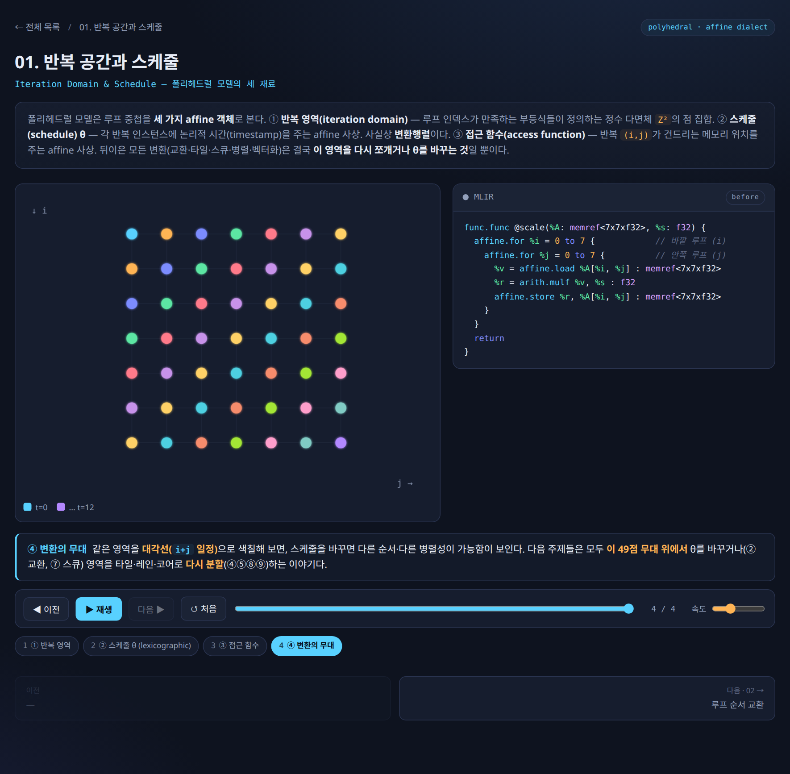
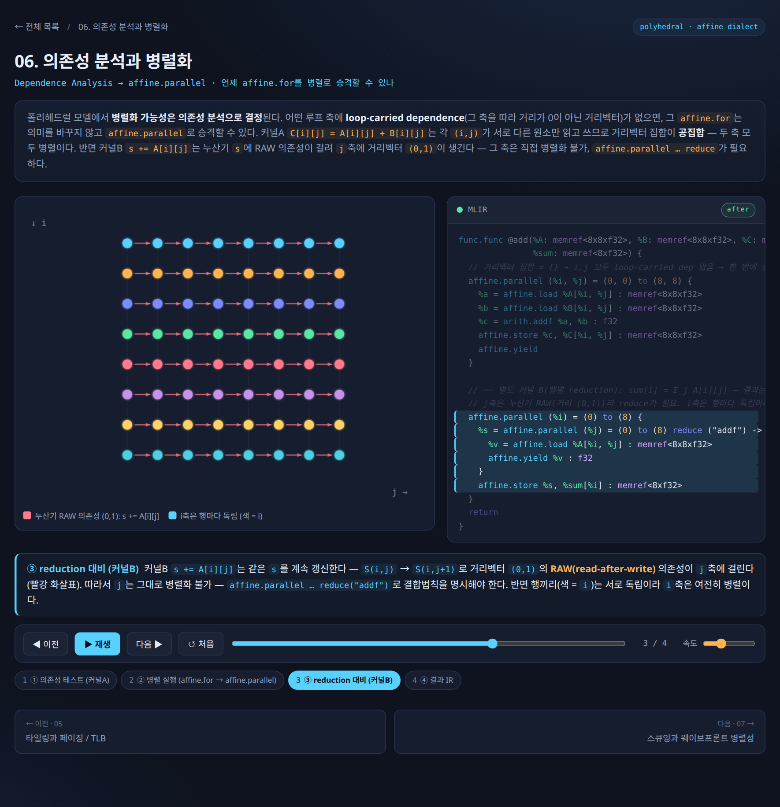

# 6. Polyhedral 모델 심화 — 루프를 수학으로 보다

[← 이전](05_progressive_lowering.md) | [목차](README.md) | [다음 →](07_affine_transforms.md)

---

## 왜 루프를 "수학"으로 보는가

먼저 용어부터 한 줄로 정리한다. **AST(Abstract Syntax Tree)** 는 소스 코드의 문법 구조를 그대로 옮긴 트리이고, **CFG(Control Flow Graph)** 는 기본 블록 사이의 분기·점프 흐름을 그린 그래프다. 전통적인 컴파일러는 이 두 표현 위에서 루프 최적화를 한다.

문제는 이 방식이 **변환을 하나씩 적용**한다는 데 있다. interchange(루프 순서 교환)를 먼저 할지, tiling(루프 쪼개기)을 먼저 할지, fusion(루프 합치기)을 먼저 할지 — 순서에 따라 결과가 달라지고, 가능한 조합의 수가 폭발한다. 게다가 의존성(dependence) 분석이 **보수적(conservative)** 이다. "혹시 두 반복이 같은 메모리를 건드릴 수도 있다"는 의심이 들면, 안전을 위해 최적화를 포기한다. 안전하지만 기회를 놓친다.

폴리헤드럴(polyhedral) 모델은 발상을 뒤집는다. **루프 최적화 전체를 하나의 정수 선형계획(ILP, Integer Linear Programming) 문제로 치환**한다 [4][6]. 그러면 두 가지를 한꺼번에 얻는다.

- **정확한(exact) 의존성 분석**: "혹시"가 아니라 정수 부등식으로 충돌 여부를 정확히 판별한다.
- **최적 변환의 자동 탐색**: 변환을 하나씩 시도하는 대신, ILP solver가 모든 합법적 변환 공간에서 최적해를 한 번에 찾는다.

> 하드웨어 비유: 전통 방식이 "경험 많은 엔지니어가 손으로 회로를 하나씩 배치(place)"하는 것이라면, 폴리헤드럴은 "배치·배선 문제를 수식으로 정의하고 자동 배치 도구(auto-placer)에 던지는 것"에 가깝다.

| 전통 AST/CFG 기반 | 폴리헤드럴 모델 |
|---|---|
| 변환을 하나씩 적용, 조합 폭발 | 모든 것을 ILP 문제로 치환 |
| 보수적 의존성 분석 (기회 놓침) | 정확한(exact) 의존성 분석 |
| 최적 조합 탐색 불가 | ILP solver가 최적해 탐색 |
| 변환 순서에 의존적 | 모든 변환을 하나의 행렬 연산으로 통합 |

---

## 3개의 기둥 (Three Pillars)

폴리헤드럴 모델은 중첩 루프를 세 가지 수학적 재료로 분해한다. 이 세 가지가 모두 affine(아핀) — 즉 $a_1\cdot x_1 + a_2\cdot x_2 + ... + c$ 형태의 1차식 — 으로 표현되면 분석 알고리즘이 작동한다.




▶ **인터랙티브 애니메이션:** [`01-iteration-space`](viz/topics/01-iteration-space.html) — `반복 공간과 스케줄` (브라우저/사이트에서 재생)

*반복 공간(domain) · 스케줄(schedule) · 접근 함수(access function) — 폴리헤드럴이 루프를 분해하는 세 재료를 한 화면에서.*

### ① Iteration Domain — 반복 공간 (이름의 유래)

루프의 **각 반복(iteration)을 다차원 좌표점**으로 본다. 2중 루프 `for i { for j {...} }` 라면 반복 하나하나가 평면 위의 점 $(i, j)$ 다.

루프 경계는 **affine 부등식의 집합**이 된다. 예를 들어 $0 \le i < N$, $0 \le j < N$ 은 행렬 형태로 $A\cdot x + b \ge 0$ 로 적힌다. 이 부등식들이 정의하는 정수 좌표점들의 집합이 바로 **정수 다면체(polyhedron)** 이고, 여기서 "폴리헤드럴"이라는 이름이 나왔다.

```
j
3 | •  •  •  •
2 | •  •  •  •     ← 각 점 (i,j) 가 하나의 반복 인스턴스
1 | •  •  •  •        경계: 0 ≤ i < 4, 0 ≤ j < 4 (affine 부등식)
0 | •  •  •  •
  +----------→ i
    0  1  2  3
```

수학으로는 $D = \{ \mathbf{i} \in \mathbb{Z}^n \mid A\cdot\mathbf{i} \ge \mathbf{b} \}$ 로 쓴다. 직사각형뿐 아니라 삼각형($0 \le j \le i \le N$) 같은 비직사각형 영역도 affine 부등식의 conjunction으로 표현된다.

**루프가 격자를 '그린다' — 코드 ↔ 반복 공간의 1:1 대응.** 위 격자는 추상화가 아니라 루프 코드와 그대로 맞물린다. 본문이 한 번 실행될 때마다 점이 하나 찍히고, 중첩 순서가 곧 점이 찍히는 순서다 — 즉 *루프를 실행하는 것 = 격자를 한 점씩 그려 나가는 것*이다.

```
   for i = 0..2:
     for j = 0..2:
       S(i, j)        ← 본문 S 를 (i,j) 모든 조합에서 1회씩 실행

         j
         2 │  ③   ⑥   ⑨        ① = 첫 실행 … ⑨ = 마지막 실행
         1 │  ②   ⑤   ⑧        i 바깥(느림) · j 안쪽(빠름)
         0 │  ①   ④   ⑦        i=0 열의 j를 0→2 먼저(①②③),
           └──────────────→ i     그다음 i=1 열(④⑤⑥), i=2 열(⑦⑧⑨)
             0    1    2        = 사전식(lexicographic) = 원래 실행 순서
```

- **본문 1회 실행 → 격자점 1개.** 점 $(i,j)$ 는 "$i,j$ 가 그 값일 때 본문이 도는 그 한 번"이다. $3\times 3$ 루프면 점 9개 — 코드의 *동적 실행*이 정적인 *점 집합*으로 굳는다.
- **루프 경계 → 다면체의 변.** `0≤i<3`, `0≤j<3` 이 격자를 두른 부등식 $A\mathbf{i}\ge\mathbf{b}$ 가 된다. 삼각형 `for j = 0..i` 면 빗변 하나가 생긴다.
- **중첩 순서 → 점 방문 순서.** 안쪽 $j$ 가 가장 빨리 변하는 **사전식(lexicographic) 순서**가 곧 격자를 훑는 순서다. 위 애니메이션은 이 훑기를 움직여 보여주고, 스케줄 $\theta$ 를 바꾸면 *같은 점들을 다른 순서로* 훑게 되는 것 — 그것이 바로 루프 변환이다.

### ② Dependence — 의존성 (변환의 안전선)

두 반복이 **같은 메모리 셀을 건드릴 때** 의존성이 생긴다. 이때 두 반복 좌표의 차이가 **의존성 거리 벡터(dependence vector)** 다. 예를 들어 `A[i][j] = A[i-1][j] + A[i][j-1]` 라면:

- `A[i][j]` 가 `A[i-1][j]` 에 의존 → 거리 벡터 $(1, 0)$
- `A[i][j]` 가 `A[i][j-1]` 에 의존 → 거리 벡터 $(0, 1)$

배열 접근을 affine 함수로 모델링하면 "두 반복이 같은 셀에 접근하는가?"를 정수 부등식으로 **정확히** 풀 수 있다. 전통 컴파일러가 "혹시 겹칠 수 있으니 포기"하던 자리를, 폴리헤드럴은 정수해의 존재 여부로 단정한다.

**합법(legal) 변환의 조건**은 직관적이다. *모든 의존성을 시간상 앞으로 유지*해야 한다. 즉 src가 먼저 쓰고 tgt가 나중에 읽는 순서가 변환 후에도 깨지면 안 된다. 수식으로는 새 스케줄 $S'$ 가 모든 의존성 쌍에서 **lexicographically positive(lex+)** 를 유지해야 한다 — 이것이 **Allen-Kennedy criterion** 이다 [7].

$$\forall (i_{src}, i_{tgt}) \in R :  S'(i_{tgt}) \succ S'(i_{src})$$

(직관: 변환을 아무리 해도 "원인이 결과보다 먼저"라는 시간 순서만 안 깨면 안전하다.)

### ③ Schedule — 스케줄 $\theta$ (변환 = 행렬 계수 조작)

스케줄은 각 반복에 **실행 시각(언제 실행될지)을 부여하는 affine 사상**이다. 기존 좌표 $[i, j]$ 를 변환 행렬 $T$ 로 새 좌표 $[t1, t2]$ 에 매핑한다.

$$\begin{bmatrix} t_1 \\ t_2 \end{bmatrix} = \begin{bmatrix} a & b \\ d & e \end{bmatrix} \begin{bmatrix} i \\ j \end{bmatrix} + \begin{bmatrix} c \\ f \end{bmatrix}$$

여기서 핵심은, **서로 달라 보이는 모든 루프 변환이 사실은 행렬 $T$ 의 계수를 바꾸는 한 가지 연산**이라는 점이다.

- **Identity**(변환 없음): $T = \begin{bmatrix} 1 & 0 \\ 0 & 1 \end{bmatrix}$
- **Interchange**(루프 순서 교환): $T = \begin{bmatrix} 0 & 1 \\ 1 & 0 \end{bmatrix}$ → $t_1 = j, t_2 = i$
- **Skewing**(비틀기): $T = \begin{bmatrix} 1 & 1 \\ 0 & 1 \end{bmatrix}$ → $t_1 = i+j, t_2 = j$
- **Tiling**(타일링): strip-mining으로 $t_1 = \lfloor i/B \rfloor$(타일 인덱스), $t_2 = i \bmod B$(타일 내 인덱스)

전통 컴파일러에서는 interchange 패스, tiling 패스, fusion 패스가 따로따로였고 순서에 민감했다. 폴리헤드럴에서는 이 모두가 **하나의 행렬 연산**으로 통합된다. ILP solver는 결국 "Allen-Kennedy 조건을 만족하면서 병렬성·지역성을 극대화하는 행렬 $T$ 의 계수"를 찾는 문제를 푸는 것이다.

---

## Farkas Lemma — 무한을 유한으로

여기서 비전문가가 막히기 쉬운 한 가지 마법을 짚는다. 합법성 조건 $\theta(tgt) - \theta(src) \ge 1$ 은 **반복 공간의 모든 점에서** 성립해야 한다. 그런데 점은 (N에 따라) 무한히 많을 수 있다. 하나하나 검사할 수는 없다.

**Farkas Lemma** 가 이 무한을 유한으로 바꾼다. 직관만 한 줄로:

> "다면체의 *모든 점*에서 비음수인 affine 함수는, 그 다면체를 정의하는 *경계 부등식들의 양수 배 합*으로 표현할 수 있다."

즉 "무한히 많은 점에서 부등식이 성립하는가?"라는 질문이 "유한한 개수의 $\lambda$(람다) 계수가 존재하는가?"라는 질문으로 환원된다. 그리고 유한한 미지수 + 선형 제약 문제는 ILP solver(GLPK, CPLEX, ISL 등)가 **유한 시간 안에 자동으로** 푼다.

> 비유: 울타리 안 모든 위치(무한)에서 고도가 0 이상인지 일일이 측량하는 대신, 울타리 변(유한한 경계식) 몇 개의 가중합으로 지형을 표현해버리는 트릭.

---

## SCoP — 폴리헤드럴이 작동하는 코드 영역

이 모든 수학이 작동하려면 코드가 **SCoP(Static Control Part)** — 폴리헤드럴 분석/변환 알고리즘이 적용 가능한 코드 영역 — 안에 있어야 한다. SCoP의 정의는 깔끔하다: **5개의 핵심 객체가 모두 affine 수학으로 표현 가능**해야 한다.

| 객체 | 의미 | 폴리헤드럴 표현 |
|---|---|---|
| **D** Iteration Domain | 반복 공간 | $\{ \mathbf{i} \in \mathbb{Z}^n \mid A\cdot\mathbf{i} \ge \mathbf{b} \}$ |
| **S** Schedule | 실행 시각 사상 | $T\cdot\mathbf{i} + offset$ |
| **F** Access Function | 반복 → 메모리 셀 | $A_F\cdot\mathbf{i} + b_F$ |
| **R** Dependence Relation | 두 D 간 의존 관계 | 두 도메인 간 affine 관계 |
| **Stmt** Statement | 원자 실행 단위 | 한 scalar op (load/arith/store) |

두 가지 축으로 요약된다. (1) **수학적 선형성** — 모든 수치 표현(루프 경계, step, 배열 인덱스, if 조건)이 affine 형태일 것. (2) **분석 단위 atomicity** — 한 statement = 한 scalar op일 것(matmul·conv 같은 bulk op은 분해 후에만 SCoP). `i*j`, `sqrt(i)`, `A[B[i]]`(간접 인덱싱) 같은 비-affine 표현은 자동 분석 영역 밖이다.

---

## ★ MLIR Affine의 결정적 차별점: SCoP를 문법으로 사전 강제

여기가 이 섹션의 핵심이다. SCoP를 **언제 확보하느냐**가 시스템마다 다르다.

| 시스템 | SCoP 처리 방식 |
|---|---|
| **LLVM Polly** | LLVM IR을 받아 SCoP detector가 영역을 *사후 탐색* (휴리스틱) [5] |
| **Pluto / CLooG** | C source에서 annotation 또는 자동 detect [4] |
| **MLIR Affine** | **IR 문법 자체가 이미 SCoP를 보장 (사전 강제)** ★ [8] |

**LLVM Polly** 는 일반적인 imperative LLVM IR을 받아서, 그 안에서 폴리헤드럴이 적용 가능한 region을 휴리스틱으로 *찾아낸다*. 문제는 — 이미 저수준 IR로 내려오면서 루프의 고수준 구조 정보가 흐려진 뒤라, detection이 *실패*할 수 있다는 점이다. SCoP에 못 들어가는 코드가 많이 생긴다 [5].

**MLIR Affine** 은 정반대다. `affine.for`, `affine.if`, `affine.load`, `affine.store`, `affine.apply`, `affine.parallel` 같은 `affine.*` op만 쓰면 — 파싱/검증(verification) 단계에서 비-affine 표현을 *거부*하기 때문에 — **작성하는 순간 자동으로 SCoP가 보장된다** [8]. SCoP를 따로 탐색할 필요가 없다.

```mlir
affine.for %i = 0 to %N step 1 {                 // 반복 공간 D를 문법이 강제
  affine.for %j = 0 to #map(%i) {                // 경계도 affine_map만 허용
    %v = affine.load %A[%i, %j] : memref<?x?xf32> // 접근 함수 F가 affine임을 강제
  }
}
```
*위 코드는 "affine.* op만 썼으므로 D·S·F·R·Stmt 5객체가 전부 affine임이 문법적으로 보장된다 — 즉 이 블록은 추가 탐색 없이 폴리헤드럴 변환 작업장이 된다."*

이 차이를 한 문장으로 요약하면, MLIR은 **"정보를 잃은 뒤 복원하지 않고, 애초에 보존한다"** 는 것이다. 이는 Chris Lattner가 MLIR 설계에서 강조한 **progressivity(점진성)** 원칙 — 고수준 의미를 한꺼번에 날려버리지 않고 단계적으로 낮춰가며 필요한 정보를 그 단계까지 유지한다 — 과 직결된다 [1][2].

```
linalg   (group op, 고수준 semantic 보존)
   │  --convert-linalg-to-affine-loops   (group op → scalar 분해)
   ▼
affine   ★ SCoP — 폴리헤드럴 분석/변환 작업장 (tile / fuse / parallelize / skew ...)
   │  --lower-affine                      (affine → scf/arith/memref)
   ▼
scf + memref + arith   (imperative, 폴리헤드럴 분석 영역 밖)
   ▼
LLVM / SPIR-V / ...
```

### 정점: 의존성이 없으면 자동 병렬화

폴리헤드럴이 정확한 의존성 분석을 한다는 말의 실제 효과를 보자. 행렬 덧셈 `C[i][j] = A[i][j] + B[i][j]` 는 서로 다른 두 반복이 같은 셀을 건드리지 않는다 — 즉 의존성이 없다. 폴리헤드럴은 이것을 ILP로 *증명*하고, 모든 차원을 안전하게 병렬화한다.




▶ **인터랙티브 애니메이션:** [`06-parallel`](viz/topics/06-parallel.html) — `의존성 분석 → 병렬화` (브라우저/사이트에서 재생)

*의존성이 없음을 ILP가 증명하면 affine.for가 그대로 affine.parallel로 승격된다 — 병렬화가 "추측"이 아니라 "증명"으로 일어난다.*

```mlir
// 의존성 없음을 확인한 뒤: 순차 루프를 병렬 루프로 승격
affine.parallel (%i, %j) = (0, 0) to (%N, %M) {
  %a = affine.load %A[%i, %j] : memref<?x?xf32>
  %b = affine.load %B[%i, %j] : memref<?x?xf32>
  %c = arith.addf %a, %b : f32
  affine.store %c, %C[%i, %j] : memref<?x?xf32>
  affine.yield
}
```
*위 코드는 "모든 (i,j) 반복이 독립이므로 affine.parallel로 표현 — 코어들이 동기화 없이 동시에 실행할 수 있다." (reduction이 없으므로 body는 값 없는 affine.yield로 닫힌다.)*

반대로 1차원 누적합 `a[i] = a[i-1] + b[i]` 는 `i'=i-1` 이라는 의존성이 존재하므로, 폴리헤드럴은 "이 루프는 본질적으로 순차적이며 병렬화 불가"임을 **자동 증명**한다. 컴파일러가 억지 병렬화로 오류를 내는 일을 막아준다. 2D stencil처럼 대각선 의존성으로 단순 병렬화가 막힌 경우엔, ILP가 skewing($t = i+j$)이라는 비자명한 변환을 *스스로 찾아내* 부분 병렬성을 끌어낸다 — 이것이 다음 섹션(실전 변환)으로 이어지는 지점이다.

## affine loop을 수식으로 — 정의에서 변환까지

앞의 세 기둥(반복 공간·의존성·스케줄)을 **하나의 흐름**으로 꿴다: *affine loop의 정의 → 만족 조건 → 수식화 → 변환식 → 변환 결과*. 끝에서 이 전 과정이 그대로 affine dialect로 1:1 내려옴을 본다. 예제는 2D 스텐실 — 바로 아래(그리고 주제 2 뒷부분)의 스큐잉 애니메이션과 같은 대상이다.

### ① 정의 — affine loop이란

루프 인덱스 벡터를 $\mathbf{i} = (i_1, \dots, i_n)^\top \in \mathbb{Z}^n$, 컴파일 타임에 정해지는 심볼릭 파라미터를 $\mathbf{N}$ 이라 하자. 중첩 루프가 **affine**(= 폴리헤드럴 분석 가능, SCoP)이라는 것은 다음 셋이 모두 $\mathbf{i}$ 와 $\mathbf{N}$ 의 **1차(affine) 식** — 계수의 곱·합·상수만 — 이라는 뜻이다 [2][6]:

- 모든 루프 경계(lower/upper bound),
- 모든 배열 첨자(array subscript),
- 모든 분기 조건(if).

> `i*j`, `A[B[i]]`, `sqrt(i)` 처럼 **비선형·간접·비정수**가 끼면 그 영역은 SCoP 밖이다. affine = "1차식만".

### ② 조건 → 반복 공간(iteration domain)

경계 부등식을 모으면 **정수 다면체(polyhedron)** 가 된다. 각 정수격자점 $\mathbf{i}$ 가 루프 본문의 **한 실행 인스턴스**다:

$$D = \{\, \mathbf{i} \in \mathbb{Z}^n \ :\ A\,\mathbf{i} + \mathbf{b} \;\ge\; \mathbf{0} \,\} \qquad (A:\text{정수 행렬},\ \mathbf{b}:\text{정수 벡터})$$

2D 스텐실 `for i = 1..N-1:  for j = 1..N-1` 은 $1 \le i \le N-1,\ \ 1 \le j \le N-1$ 이고, 이를 $A\,\mathbf{i} + \mathbf{b} \ge \mathbf{0}$ 로 적으면:

$$A = \begin{bmatrix} 1 & 0 \\ -1 & 0 \\ 0 & 1 \\ 0 & -1 \end{bmatrix}, \qquad \mathbf{b} = \begin{bmatrix} -1 \\ N-1 \\ -1 \\ N-1 \end{bmatrix}$$

### ③ 수식화 — 접근 함수와 의존성

**접근 함수** $F$: 반복 $\mathbf{i}$ 가 건드리는 메모리 셀을 주는 affine 사상 $F(\mathbf{i}) = A_F\,\mathbf{i} + \mathbf{f}$.

$$\begin{aligned} A[i][j] \;&:\; F = I\,\mathbf{i} + (0,\,0)^\top \\ A[i-1][j] \;&:\; F = I\,\mathbf{i} + (-1,\,0)^\top \\ A[i][j-1] \;&:\; F = I\,\mathbf{i} + (0,\,-1)^\top \end{aligned}$$

**의존성**: 두 인스턴스 $\mathbf{i}, \mathbf{i}'$ 이 같은 셀을 건드리면($F(\mathbf{i}) = F(\mathbf{i}')$) 의존한다. 생산자→소비자의 차이를 **의존성 벡터** $\delta = \mathbf{i}' - \mathbf{i}$ 로 적는다. 스텐실은 두 개: $\delta_1 = (1,\,0)$ ($A[i][j]\!\leftarrow\!A[i-1][j]$), $\delta_2 = (0,\,1)$ ($A[i][j]\!\leftarrow\!A[i][j-1]$).

$D$ 와 $F$ 가 affine이면 의존성도 affine 관계 → **정수해 존재 여부(Presburger feasibility)** 로 *정확히(exact)* 판정된다 [4][5]. "혹시 겹칠지도"라는 보수적 포기가 아니라, **겹치는지 아닌지를 푼다.**

### ④ 변환식 — 스케줄 $\theta$ 와 합법성

**스케줄** $\theta$: 각 반복에 *논리적 실행 시각*을 주는 affine 사상 = 변환행렬 $\Theta$. 격자점을 보존하려면 $\det\Theta = \pm 1$ (unimodular):

$$\mathbf{u} = \theta(\mathbf{i}) = \Theta\,\mathbf{i}$$

interchange·skew·tiling 같은 변환이 모두 $\Theta$ 계수 조작으로 통합된다:

$$\text{interchange: } \Theta = \begin{bmatrix} 0 & 1 \\ 1 & 0 \end{bmatrix}, \qquad \text{skew: } \Theta = \begin{bmatrix} 1 & 1 \\ 0 & 1 \end{bmatrix}\ (u_1 = i+j = t)$$

**합법성 — Allen–Kennedy criterion** [7]: 모든 의존성 $\delta$ 에 대해 변환 뒤에도 시간이 *앞으로* 흘러야 한다.

$$\forall\,\delta : \qquad \theta(\mathbf{i}') - \theta(\mathbf{i}) = \Theta\,\delta \;\;\succ\;\; \mathbf{0} \qquad (\text{lexicographically positive})$$

이 한 줄이 "이 변환이 의미를 보존하는가"의 전부다. 무한히 많은 점 검사는 **Farkas Lemma + ILP** 로 유한한 계수 문제로 환원된다 [6].

### ⑤ 변환 결과 — 역변환과 코드 생성(스큐잉)

스텐실의 $\delta_1=(1,0),\ \delta_2=(0,1)$ 은 $i\cdot j$ 어느 루프도 그대로는 병렬화 못 한다(둘 다 loop-carried). 스큐 $\Theta=\begin{bmatrix}1&1\\0&1\end{bmatrix}$ 을 시도하고 ④의 합법성을 검사하면:

$$\Theta\,\delta_1 = \begin{bmatrix} 1 & 1 \\ 0 & 1 \end{bmatrix}\!\begin{bmatrix} 1 \\ 0 \end{bmatrix} = \begin{bmatrix} 1 \\ 0 \end{bmatrix} \succ \mathbf{0}, \qquad \Theta\,\delta_2 = \begin{bmatrix} 1 \\ 1 \end{bmatrix} \succ \mathbf{0}$$

두 의존성 모두 **첫 성분(시간 $t = i+j$) 이 $\ge 1$** → 서로 다른 시각으로 밀린다. 따라서 **같은 $t$(한 wavefront) 안에서는 의존성이 사라져 병렬**이 된다. 역변환은 unimodular($\det=1$)라 정수 가역:

$$t = i+j,\quad p = j \qquad\Longrightarrow\qquad i = t - p,\quad j = p$$

변환 후 반복 공간($D$ 를 $\Theta$ 로 보낸 상)은 $t \in [\,2,\ 2N-2\,]$, 고정 $t$ 에서 $p \in [\,\max(1,\,t-N+1),\ \min(N-1,\,t-1)\,]$. 코드 생성 결과:

```mlir
// θ(i,j) = (i+j, j) ;  바깥 = 시간(순차), 안쪽 = 공간(병렬)
affine.for %t = 2 to 2*N-1 {
  affine.parallel (%p) = (max(1, %t - N + 1)) to (min(N, %t)) {
    %i = affine.apply affine_map<(t, p) -> (t - p)>(%t, %p)
    %j = %p
    %n = affine.load %A[%i - 1, %j] : memref<NxNxf32>
    %w = affine.load %A[%i, %j - 1] : memref<NxNxf32>
    %s = arith.addf %n, %w : f32
    affine.store %s, %A[%i, %j] : memref<NxNxf32>
  }
}
```

원래 $(N-1)^2$ 의 순차 스텝이 $2N-3$ 개의 wavefront 로 접힌다. 아래 애니메이션은 $6\times 6 = 36$ 개 점이 $11$ 개 wavefront 로 줄어 $\approx 3.3\times$ 병렬을 *합성*하는 과정을 직접 보여준다.


▶ **인터랙티브 애니메이션:** [`07-skewing`](viz/topics/07-skewing.html) — `스큐잉 → 웨이브프론트 병렬성` (브라우저/사이트에서 재생)

스큐잉 $\Theta=[[1,1],[0,1]]$ 하나로 없던 병렬성이 생긴다 — ④의 합법성 검사 $\Theta\delta \succ 0$ 와 ⑤의 결과를 시각으로.

### 한눈에 — 흐름 요약

| 단계 | 수식 | affine dialect 대응 |
|------|------|---------------------|
| ① 정의 | $\mathbf{i} \in \mathbb{Z}^n$, 모든 식이 affine | `affine.for` 중첩 |
| ② 조건 | $D = \{\,\mathbf{i} : A\mathbf{i} + \mathbf{b} \ge \mathbf{0}\,\}$ | 경계 = `affine_map` / `affine.if` |
| ③ 수식화 | $F(\mathbf{i}) = A_F\mathbf{i} + \mathbf{f},\ \ \delta = \mathbf{i}' - \mathbf{i}$ | `affine.load`/`affine.store`, 의존성 분석 |
| ④ 변환식 | $\mathbf{u} = \Theta\mathbf{i},\ \ \Theta\delta \succ \mathbf{0}$ | 변환 pass (skew/tile/fuse …) |
| ⑤ 결과 | $\mathbf{i} = \Theta^{-1}\mathbf{u}$, 새 경계, 병렬 | `affine.parallel` + `affine.apply` |

→ **정의에서 변환 결과까지 모든 칸이 affine 수학**이고, 그 수학이 그대로 affine dialect op 으로 1:1 내려온다. 이것이 폴리헤드럴 모델이 affine MLIR에서 *분석 → 변환 → 코드*로 닫히는 이유다.

---

[← 이전](05_progressive_lowering.md) | [목차](README.md) | [다음 →](07_affine_transforms.md)
