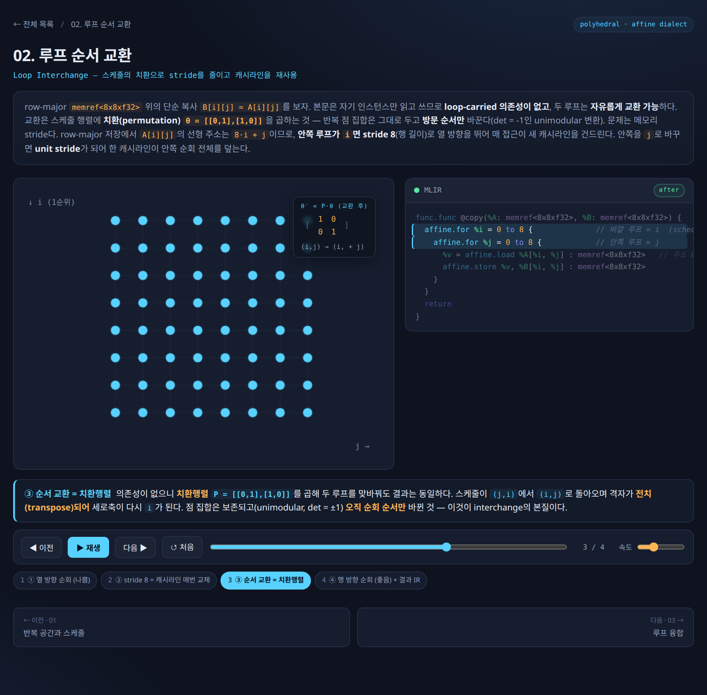
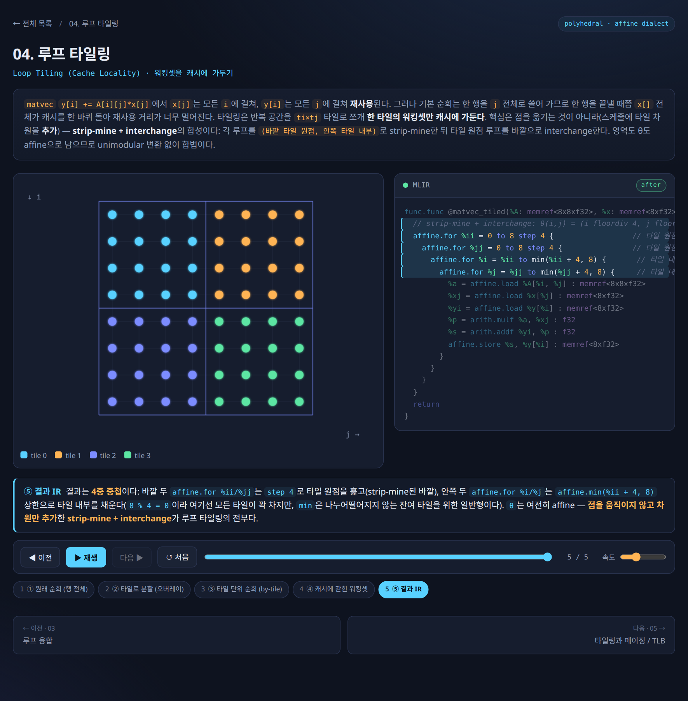
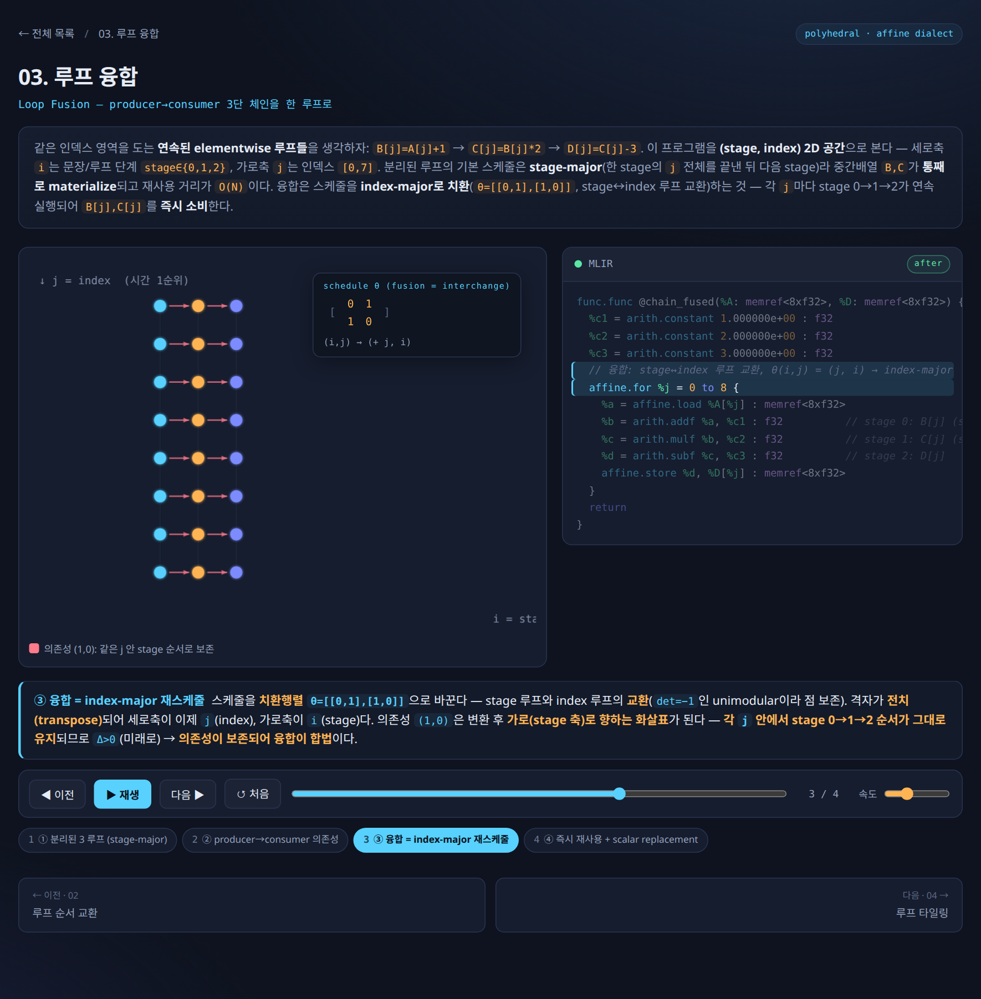
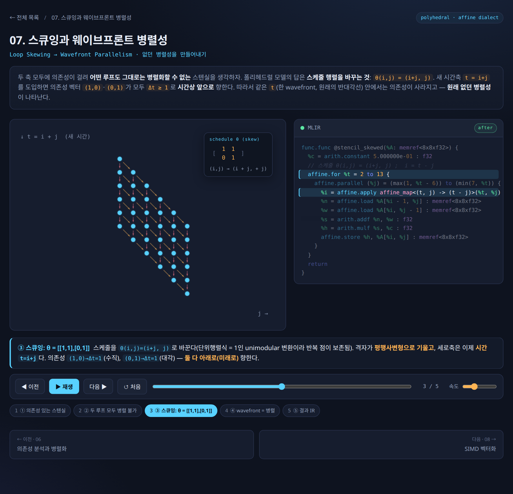
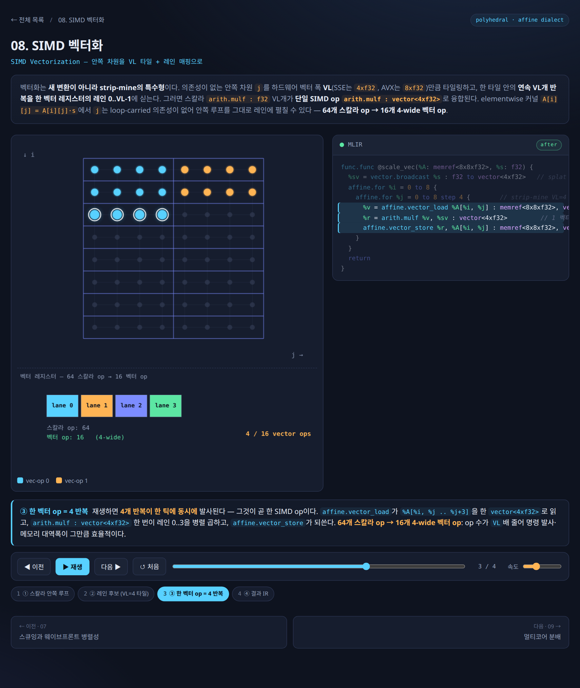
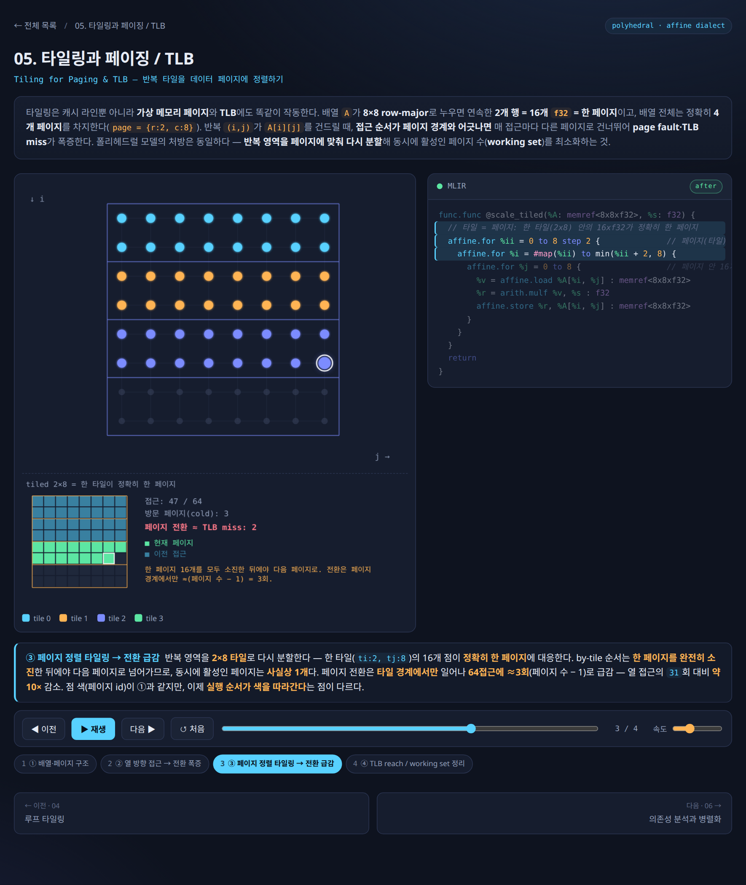
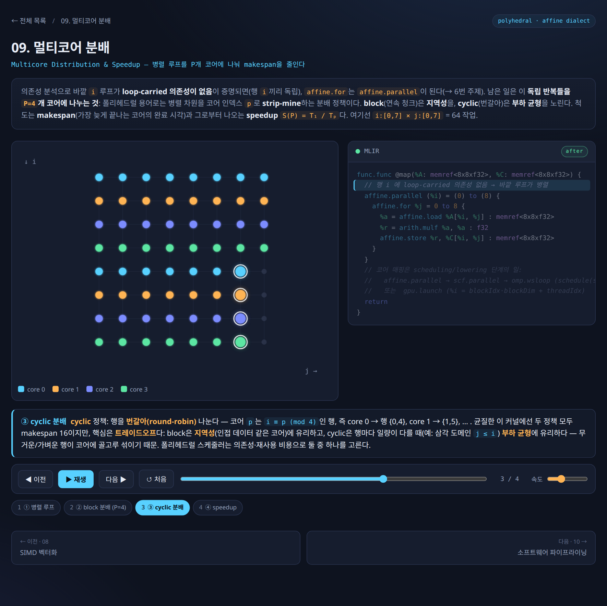
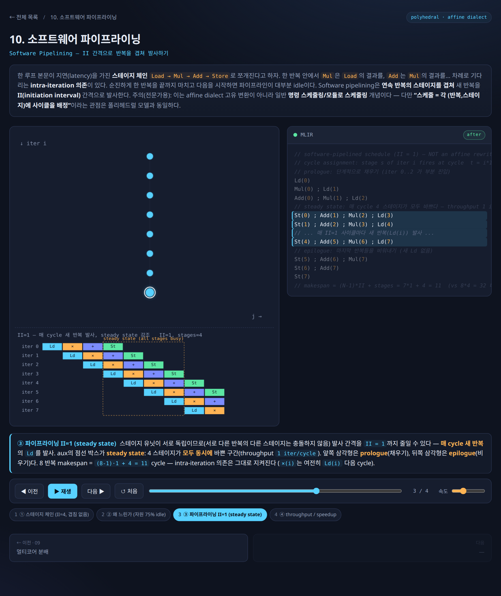

# 7. Affine Dialect 변환 심화 — 스케줄을 바꾸면 병렬성이 생긴다

[← 이전](06_polyhedral_model.md) | [목차](README.md) | [다음 →](08_synthesis.md)

---

앞 섹션에서 폴리헤드럴 모델이 루프를 *다면체(polyhedron)* — 부등식으로 둘러싸인 다차원 공간 — 로 보고, 실행 순서를 행렬(스케줄, schedule)로 바꾼다는 큰 그림을 봤다. 이번 섹션은 그 이론이 MLIR의 **Affine dialect** 위에서 실제로 어떻게 동작하는지를, 대표적인 변환들과 애니메이션으로 따라간다.

> 용어 빠른 정의: **dialect** = MLIR에서 한 추상화 수준의 연산(op) 묶음(하드웨어로 치면 하나의 ISA 레이어). **Affine dialect** = 루프 경계·배열 인덱스가 모두 *아핀식*(변수의 1차식 + 상수)으로 제한된 dialect로, 폴리헤드럴 분석을 IR 문법 차원에서 강제한다. **lowering** = 높은 추상화의 op를 더 낮은 op로 점진적으로 내려보내는 것.

### 1. Affine 문법 60초 요약

Affine dialect는 다섯 개의 연산만 알면 거의 다 읽힌다.

```mlir
affine.for %i = 0 to %N { ... }        // 경계가 아핀식인 카운트 루프
affine.if affine_set<(d0) : (d0 - 1 >= 0)> { ... }   // 조건이 정수집합(integer_set)인 분기
%v = affine.load  %A[%i, %j] : memref<NxMxf32>      // 아핀 인덱스로 메모리 읽기
     affine.store %v, %A[%i, %j] : memref<NxMxf32>  //       〃          쓰기
%t = affine.apply affine_map<(d0,d1)->(d0+d1)>(%i,%j) // 인덱스를 아핀식으로 다시 계산
affine.parallel (%i,%j) = (0,0) to (%N,%M) { ... }  // 반복끼리 의존성 없음을 *선언*
```

한 줄 해설: `affine.for`는 보통의 for 루프, `affine.if`의 조건은 부등식 집합(integer_set)으로만 쓸 수 있고, `affine.load/store`는 `memref`(메모리 버퍼 타입)에 아핀 인덱스로만 접근하며, `affine.apply`는 좌표 변환을 계산하고, `affine.parallel`은 "이 반복들은 동시에 돌려도 안전하다"는 *합법성 보증*을 IR에 박아 넣는다. 폴리헤드럴 모델의 세 기둥(반복공간 $D$, 의존성, 스케줄 $\Theta$)이 각각 `affine.for`의 경계 / 의존성 분석 / `affine.apply`·루프 순서로 대응된다 [1].

핵심은 이 *문법 제약 자체가 분석을 가능하게 한다*는 점이다. 인덱스를 임의의 함수로 못 쓰게 막았기 때문에, 컴파일러는 "이 두 접근이 같은 칸을 건드리나?"를 정수 부등식으로 *정확히(exact)* 풀 수 있다. 보수적으로 "혹시 겹칠지 모르니 포기"하는 일반 컴파일러와 갈리는 지점이다.

### 2. Affine pass ↔ 폴리헤드럴 변환 대응표

MLIR에서 각 폴리헤드럴 변환은 하나의 *pass*(IR을 받아 변형하는 단위)로 제공된다 [1][8].

| Affine pass | 폴리헤드럴 변환 | 한 줄 효과 |
|---|---|---|
| `affine-loop-tile` | Tiling | strip-mining으로 다면체 분할 → 워킹셋을 캐시에 가둠 |
| `affine-loop-fusion` | Fusion | 두 다면체를 하나로 → producer-consumer 지역성↑ |
| `affine-parallelize` | (병렬 스케줄) | 의존성 없는 루프를 `affine.parallel`로 승격 |
| `affine-super-vectorize` | (SIMD) | 병렬 루프를 벡터 op로 묶음 |
| `affine-loop-coalescing` | (1D 평탄화) | N-D nest → 1-D, GPU 1-D thread index 친화 |
| (Interchange) | Interchange | 스케줄 행렬의 행 교환 → stride/지역성 개선 |

LLVM upstream에는 in-tree affine pass가 15종 가까이 있다(`affine-loop-normalize`·`-tile`·`-fusion`·`-coalescing`·`-unroll`·`-unroll-jam`·`affine-parallelize`·`affine-super-vectorize`·`affine-scalrep`·`affine-data-copy-generate`·`affine-pipeline-data-transfer`·`affine-expand-index-ops`·`lower-affine` 등) [8]. **단, Interchange는 예외다 — LLVM에는 standalone `affine-loop-interchange` pass가 없어**, in-tree 유틸리티 `permuteLoops`(와 테스트 pass `-test-loop-permutation`)가 그 역할을 한다 [8]. 이제 표의 변환들을 애니메이션과 함께 본다.

### 3. 루프 순서 교환 (Interchange)

원리: 스케줄 행렬을 치환행렬(permutation matrix)로 곱하면 루프 중첩 순서가 바뀐다. 안쪽 루프가 메모리를 한 칸씩(stride 1, 인접 주소를 차례로) 훑도록 순서를 고르면 캐시 히트가 급증한다.




▶ **인터랙티브 애니메이션:** [`02-interchange`](viz/topics/02-interchange.html) — `루프 순서 교환` (브라우저/사이트에서 재생)

*루프 순서를 바꾸면 메모리 접근 stride가 바뀌어 공간 지역성이 좋아진다.*

행 우선 배열을 열 방향으로 훑던 루프를 뒤집어 행 방향으로 훑게 만드는 고전적 변환으로, 변환 자체는 스케줄 행렬의 행 두 개를 맞바꾸는 것에 불과하다 [1]. (MLIR 측에서는 별도 pass 대신 `permuteLoops` 유틸리티가 이 행 교환을 수행한다 [8].)

### 4. 타일링 (Tiling)

원리: 큰 루프를 strip-mine(작은 블록으로 쪼개기) + interchange의 조합으로 *타일* 단위로 재배열한다. 타일 하나의 워킹셋이 캐시/SRAM 안에 들어가면 DRAM 왕복이 줄어든다.




▶ **인터랙티브 애니메이션:** [`04-tiling`](viz/topics/04-tiling.html) — `루프 타일링` (브라우저/사이트에서 재생)

*타일링 = strip-mine + interchange. 한 타일의 데이터를 캐시에 가둬 재사용한다.*

`affine-loop-tile`의 핵심 한 가지: 옵션 `separate=true`를 주면 컴파일러가 타일 경계를 `affine.if`로 분리해 **full tile(딱 떨어지는 타일)과 partial tile(자투리)을 코드 레벨에서 갈라낸다**. 이것은 폴리헤드럴에서 말하는 *iteration domain peeling*(반복공간을 조각내 자투리를 떼어내는 것)을 MLIR이 first-class 문법(`affine.if` + integer_set)으로 표현한 것이다 [8]. full 경로는 경계가 상수가 되므로 뒤이은 unroll·vectorize의 최적화 진입로가 된다. 즉 "자투리 처리"라는 실무적 골칫거리가, 이론의 peeling과 그대로 맞아떨어진다.

### 5. 융합 (Fusion)

원리: 한 루프가 만든 배열을 다음 루프가 곧장 소비할 때, 두 반복영역을 하나로 합치면 중간 버퍼가 사라지고(producer 결과를 바로 consumer가 씀) 지역성이 올라간다.




▶ **인터랙티브 애니메이션:** [`03-fusion`](viz/topics/03-fusion.html) — `루프 융합` (브라우저/사이트에서 재생)

*융합 = 두 반복영역을 합쳐 중간 버퍼를 없애고 producer-consumer 지역성을 높인다.*

`affine-loop-fusion` 다음에 `affine-scalrep`(스칼라 승격)을 이어 붙이면, 3단계 체인의 중간 배열이 레지스터로 승격되며 완전히 사라진다 — 폴리헤드럴의 *array contraction*(배열 축약) 자동화에 해당한다 [8]. 이 점이 고수준 dialect와 닿는 지점인데, 뒤의 의견 박스에서 다시 다룬다.

### 6. ★ 스큐잉 — 없던 병렬성을 만들어내기

이번 섹션의 하이라이트다. 의존성 벡터가 `(1,0)`과 `(0,1)` 두 개 걸린 2D 스텐실은, `i` 루프도 `j` 루프도 *그대로는 병렬화할 수 없다* — 어느 방향으로 펼쳐도 옆 칸 결과를 기다려야 하기 때문이다.

폴리헤드럴의 답은 **스케줄 행렬을 바꾸는 것** 하나뿐이다. 스큐(skew) 스케줄

$$\theta(i,j) = (i+j,\; j), \qquad \theta = \begin{bmatrix}1&1\\0&1\end{bmatrix}$$

직관 해설: 새 시간축 $t = i+j$(반대각선)를 도입하면, 두 의존성 $(1,0)$·$(0,1)$이 *모두* $\Delta t \ge 1$로 바뀐다(각각 $\Delta t = 1+0 = 1$, $0+1 = 1$). 즉 모든 의존성이 시간상 *앞으로만* 향하게 밀려난다. 그러면 같은 $t$ 값을 가진 점들(한 wavefront, 원래의 반대각선)끼리는 의존성이 *전혀 없으므로* 동시에 실행할 수 있다. 행렬식이 1인 unimodular 변환이라 반복 점은 하나도 손실되지 않는다 [1][8].




▶ **인터랙티브 애니메이션:** [`07-skewing`](viz/topics/07-skewing.html) — `스큐잉 → 웨이브프론트 병렬성` (브라우저/사이트에서 재생)

*$\theta=\begin{bmatrix}1&1\\0&1\end{bmatrix}$로 격자를 기울이면 의존성이 모두 시간축으로 밀려, 같은 wavefront 안에서 병렬성이 솟아난다.*

before / after MLIR (2D 스텐실 예제):

```mlir
// Before — 두 루프 모두 loop-carried 의존성, 병렬 불가
affine.for %i = 1 to 7 {
  affine.for %j = 1 to 7 {
    %n = affine.load %A[%i - 1, %j] : memref<8x8xf32>   // dep (1,0)
    %w = affine.load %A[%i, %j - 1] : memref<8x8xf32>   // dep (0,1)
    %s = arith.addf %n, %w : f32
    %h = arith.mulf %s, %c : f32
    affine.store %h, %A[%i, %j] : memref<8x8xf32>
  }
}
```

```mlir
// After — θ(i,j)=(i+j, j) ; i = t - j. 바깥은 시간(순차), 안쪽은 병렬
affine.for %t = 2 to 13 {
  affine.parallel (%j) = (max(1, %t - 6)) to (min(7, %t)) {
    %i = affine.apply affine_map<(t, j) -> (t - j)>(%t, %j)
    %n = affine.load %A[%i - 1, %j] : memref<8x8xf32>
    %w = affine.load %A[%i, %j - 1] : memref<8x8xf32>
    %s = arith.addf %n, %w : f32
    %h = arith.mulf %s, %c : f32
    affine.store %h, %A[%i, %j] : memref<8x8xf32>
  }
}
```

한 줄 해설: 바깥 `affine.for %t`는 wavefront를 순서대로(시간) 훑고, 안쪽 `affine.parallel (%j)`는 `max/min` 아핀 경계로 그 wavefront의 폭만큼 펼쳐진다. `%i = affine.apply (t - j)`로 원래 인덱스를 복원한다. 의존성은 하나도 깨지 않고 *순서만* 바꿔 병렬성을 합성한 것이 스큐잉의 핵심이다 [1]. 이 $6\times6$ 예제(반복점 36개, $t=2..12$로 wavefront 11개)에서 코어 6개 기준 **36개 순차 스텝이 11개 wavefront로 줄어 약 $3.3\times$ 속도**가 된다(최대 wavefront 폭이 6이라 코어 6개에 딱 맞음) [8].

### 7. SIMD 벡터화

원리: 병렬화된 안쪽 루프의 연속 반복들을 벡터 폭 VL만큼 한 묶음으로 만든다. 벡터 op 한 번 = VL개 반복을 한 번에 처리.




▶ **인터랙티브 애니메이션:** [`08-simd`](viz/topics/08-simd.html) — `SIMD 벡터화` (브라우저/사이트에서 재생)

*병렬 안쪽 루프를 벡터폭 VL로 묶으면 한 벡터 op가 VL개 반복을 동시에 계산한다.*

MLIR `affine-super-vectorize`는 target-independent한 n-D 가상 벡터(virtual vector, 예: `vector<4x4xf32>`)로 표현해 두고, 실제 하드웨어 벡터폭은 나중 lowering에서 결정한다 [8].

### 8. 메모리 정렬 (Paging)

원리: 타일을 페이지 경계에 정렬하면 한 타일을 도는 동안 page fault와 TLB(주소 변환 캐시) miss가 줄어든다(가상메모리 관점의 타일링).




▶ **인터랙티브 애니메이션:** [`05-paging`](viz/topics/05-paging.html) — `타일링과 페이징/TLB` (브라우저/사이트에서 재생)

*타일을 페이지에 정렬하면 page fault·TLB miss가 줄어든다.*

### 9. 멀티코어 분배 (Multicore)

원리: 바깥 병렬 루프(또는 타일들)를 P개 코어에 block 또는 cyclic으로 나눠 주면, 전체 완료 시간(makespan)이 줄고 speedup이 난다.




▶ **인터랙티브 애니메이션:** [`09-multicore`](viz/topics/09-multicore.html) — `멀티코어 분배` (브라우저/사이트에서 재생)

*바깥 병렬 루프/타일을 P코어에 block/cyclic 분배 → makespan 단축.*

### 10. 소프트웨어 파이프라이닝 (Pipelining)

원리: 연속한 반복들의 단계(stage)를 II(initiation interval) 간격으로 겹쳐 발사한다 — 한 반복의 연산이 끝나기 전에 다음 반복을 시작시켜 파이프라인을 채운다(prologue → steady state → epilogue).




▶ **인터랙티브 애니메이션:** [`10-pipeline`](viz/topics/10-pipeline.html) — `소프트웨어 파이프라이닝` (브라우저/사이트에서 재생)

*연속 반복의 스테이지를 II 간격으로 겹쳐 발사 — prologue/steady/epilogue.*

`affine-pipeline-data-transfer`는 DMA 데이터 전송과 계산을 자동으로 겹쳐주는데, 그 핵심이 `affine.apply (d0)->(d0-1)` — 즉 *스케줄을 -1만큼 시프트*하는 한 줄과 double buffer로 표현된다. minimum modulo scheduling의 MLIR 표현인 셈이다 [8].

### 11. MLIR pass의 잘 드러나지 않는 두 성질

이 섹션의 변환들에는, 직접 들여다보지 않으면 놓치기 쉬운 두 가지 깊은 성질이 있다.

첫째, **진입점 불변성(4중 byte-identical)**. 같은 unroll 변환을 (1) wrapper pass, (2) in-tree CLI(`mlir-opt --affine-loop-unroll`), (3) pipeline string, (4) C++ `PassManager`에 직접 `addPass`하는 네 경로 중 어느 것으로 호출해도 *결과 IR이 바이트 단위로 동일*하다 [8]. 호출 경로가 무엇이든 변환 의미가 불변(invariance)이라는 직접적 증거다 — 즉 MLIR pass는 진입점이 아니라 IR 변환 그 자체로 정의된다. (네 경로 모두 결국 같은 `loopUnrollByFactor` 함수를 호출하기 때문이다.)

둘째, **lower-affine의 Euclidean correction**. affine 영역을 떠날 때(`--lower-affine`) affine의 `mod`는 arith dialect의 순진한 나머지로 1:1 번역되지 않는다. affine `mod`는 음수에서도 항상 비음수 결과를 보장하는 *Euclidean* 의미라서, lowering이 `remsi`(부호 있는 나머지) + `cmpi`(음수 검사) + `addi` + `select`의 보정 시퀀스로 풀어낸다 [8]. 같은 `mod`라도 dialect마다 의미가 미묘하게 다르다는 것을, 내려보내기 코드가 드러내 준다.

### 12. 어디까지 내려갈 것인가

마지막으로 실무 판단 하나. 변환을 affine까지 내려서 할지, 더 높은 linalg dialect에 머물지의 트레이드오프다.

고수준 linalg에 머물면 matmul·conv 같은 연산의 *의미*가 보존돼 fusion이 싸고 직관적이다. 반면 affine까지 내려가면 skewing·interchange·peeling 같은 극한 루프 변형이 가능해지지만, 한 번 내려가면 고수준 의미를 되살리기 어렵다. 따라서 어느 레벨에 머물지는 타깃이 정한다 — 범용 가속기(GPU 등)는 의미를 오래 보존하는 linalg 중심이, 루프를 하드웨어 opcode 크기에 맞춰 극한으로 변형해야 하는 커스텀 가속기는 affine까지 내려가는 편이 유리하다.

---

[← 이전](06_polyhedral_model.md) | [목차](README.md) | [다음 →](08_synthesis.md)
