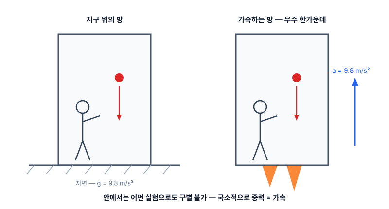
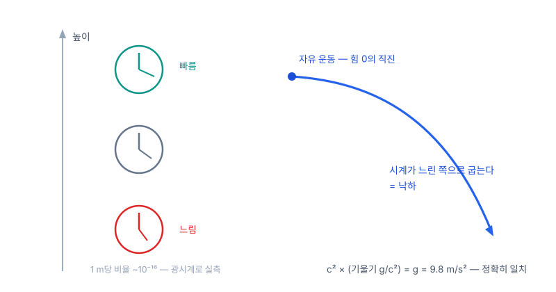
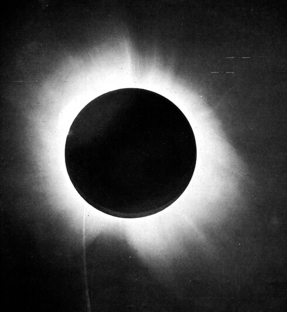

# 5. 일반상대성이론 — 1907–1915, 중력을 힘에서 시공간의 모양으로

[← 이전](04_special_relativity.md) | [목차](README.md) | [다음 →](06_noether.md)

---

## 특수상대성이 남긴 두 개의 의문 (1905 직후)

이론을 완성하자마자 두 가지가 어긋나 있었다 — 하나는 중력, 하나는 이론 자신의 전제.

- **의문 ① 중력이 안 들어온다**: 뉴턴의 만유인력은 거리만의 함수다 — 태양이 지금 사라지면 지구 궤도가 **그 순간** 반응해야 한다. 그러나 방금 세운 이론은 어떤 영향도 $c$를 넘지 못한다고 못박았다. 중력만 상대성 밖에 남았다.
- **의문 ② 왜 관성계만 특별한가**: 등속끼리는 평등하다고 해놓고, 가속은 여전히 절대적인가? '특별한 관점의 클럽'이 남아 있다는 것 자체가 찜찜했다.

두 의문이 한 지점을 가리킨다 — 중력과 가속을 함께 다룰 수 있는 더 큰 틀.

## 가장 행복한 생각 — 떨어지는 사람은 무게가 없다 (1907)

특허국 의자에서의 착상: **지붕에서 떨어지는 사람은 자기 무게를 느끼지 못한다.** 손에서 놓은 물건은 곁에 둥둥 떠 있다.

자유낙하라는 관점을 고르면 중력이 **지워진다**. 반대로, 무중력 우주에서 9.8 m/s²로 가속하는 방 안은 지구의 방과 **구별할 수 없다** — 공을 던지면 포물선을 그리고, 저울은 눌린다. 이것이 **등가원리**다: 국소적으로 중력 = 가속. 중력은 관점 선택으로 만들 수도, 지울 수도 있는 것이었다.

관점 하나로 지워지는 것을 '진짜 힘'이라 부를 수 있는가 — 중력의 힘 자격에 대한 의심이 여기서 시작된다.

*구별 불가능한 두 방 — 지구 위에 선 방과 9.8 m/s²로 가속하는 방*

## 모두가 같은 궤적 — 그렇다면 무대의 성질이다

결정적 단서는 중력의 오래된 특징에 있었다: **중력은 물체가 무엇인지 묻지 않는다.**

진공에서 깃털과 쇠공은 같이 떨어진다 — 아폴로 15호(1971)가 달에서 망치와 깃털로 실연했다. 전기력은 전하/질량 비에 따라 물체마다 다르게 가속시킨다. **중력만이 예외** — 조성·질량과 무관하게 전원 같은 궤적이다.

추론: 궤적이 여행자와 무관하다면, 그 궤적은 물체의 성질이 아니라 **길 — 무대(시공간) — 의 성질**이다. 그리고 자연 상태가 재정의된다: **자유낙하가 힘 0의 상태**다(떨어지는 동안 저울은 0을 가리킨다). 오히려 땅에 서 있는 지금이 발바닥이 밀어 올리는 힘을 받는 상태다.

## 휘는 것의 주역은 공간이 아니라 시간이다

가속 로켓에서 꼬리의 시계는 머리보다 느리게 간다(빛 신호의 도플러로 유도된다). 등가원리로 번역하면 — **낮은 곳의 시계는 느리다.**

지표에서 높이 1 m당 시계 빠르기 차이는 비율로 ~$10^{-16}$ — 현대 광시계는 이 차이를 직접 분해한다. 이 티끌 같은 기울기가 낙하의 주역이다: 시간축의 환산 배율이 $c$라서, $c^2\times(g/c^2) = g = 9.8\,\mathrm{m/s^2}$ — 정확히 맞아떨어진다.

일상 중력에서 공간의 휨은 부차적이다 — '고무판 위의 공' 그림이 놓치는 지점이 바로 이것이다. 여기까지의 그림: 물체는 힘을 받는 게 아니라, **시계·자의 눈금이 장소마다 다른 무대** 위에서 제 갈 길(직진)을 갈 뿐이다.

*높이마다 다른 시계 빠르기 — 낮을수록 느리다. 이 기울기가 곧 중력*

## 무대를 구부리는 수학 — 그리고 두 번의 시도 (1912–1915)

중력이 시계와 자를 바꾼다면, 그것은 힘이 아니라 **기하**다. 그리고 기하를 구부리려면 4장의 민코프스키 언어가 전제였다.

- 1912 취리히: 친구 그로스만이 리만의 휜 공간 기하학(1854)을 소개한다 — 휜 공간을 다루는 수학이 이미 있었다.
- 1913 초안(Entwurf): '모든 좌표계에서 같은 꼴'이라는 요구를 **포기한 절충안** — 이 식으로 수성의 초과 세차를 계산하니 43″가 아니라 18″. 실패.
- 1915년 11월: 요구를 복원한 최종 방정식 — 한 달 사이 네 편의 논문으로 완성된다.

4장의 다리가 여기서 회수된다: 아인슈타인이 처음 무시했던 민코프스키의 기하화가, 구부릴 수 있는 무대의 **전제 조건**이었다.

## 장방정식 — 읽는 법

유도 없이, 각 부분이 무엇인지만 정확히 읽는다.

$$G_{\mu\nu} = \frac{8\pi G}{c^{4}}\,T_{\mu\nu}$$

| 부분 | 정체 | 읽기 |
|---|---|---|
| 좌변 $G_{\mu\nu}$ | 시공간 곡률(기하) | 첨자 $\mu\nu$는 시간·공간 4방향의 짝 — 대칭 4×4, 실은 **식 10개의 묶음** |
| 우변 $T_{\mu\nu}$ | 에너지·운동량 장부(원천) | 질량만이 아니라 **에너지 밀도·흐름·압력**까지 전부 그 지점의 중력원 |
| 상수 $8\pi G/c^4$ | 환율 | 약한 중력에서 뉴턴 법칙으로 복귀하도록 보정 — 분모의 $c^4$: 시공간은 **지독히 뻣뻣**하다(중력파 검출에 $10^{-18}$ m 정밀도가 필요했던 이유 — LIGO 2015) |

한 줄 읽기: **물질·에너지의 분포가 곡률을 정하고, 물체는 그 휜 무대에서 힘 없이 직진한다** — 낙하·궤도는 그 직진의 겉모습이다.

## 피팅이 아니라 제약의 교차점 — 그래서 시험할 수 있었다

이 식은 현상에 맞춰 조정된 것이 아니다. 네 개의 요구가 꼴을 거의 유일하게 못박았고, 관측이 들어간 곳은 상수 하나뿐이다: 모든 좌표계에서 같은 꼴 · 계량의 2계 미분까지 · 보존이 자동으로 성립하는 조합 · 약한 중력에서 뉴턴 복귀(상수 보정 — 유일한 관측 입력). 조정할 손잡이가 없다는 것은 **실패할 수 있다**는 뜻이고, 그래서 검증이 의미를 가진다.

- **수성 43″/세기**: 완성 와중(11월 18일 수성 논문)에 계산해 보니 그대로 나왔다 — 입력이 아니라 **출력**. 심계항진이 왔다고 적었고, 며칠간 기쁨에 넋이 나가 있었다는 회고가 남아 있다.
- **1919 일식(에딩턴)**: 별빛 휨 1.75″ — 뉴턴식 계산의 정확히 2배 쪽이 관측됐다.
- **중력 적색편이**: 높이에 따른 시계 차 — 뫼스바우어 효과로 실측된다. (🔬 [뫼스바우어 효과](http://218.155.221.161:10101/physics-map/experiments/mossbauer-effect/index.html))
- **GPS**: 위성 시계는 하루 38 μs 어긋난다 — 보정 없이는 하루에 km급 오차.

*1919년 5월 29일 개기일식 원판(에딩턴 원정) — 태양 곁 별빛의 이동이 1.75″ 예측과 일치 (Dyson·Eddington·Davidson 1920, PD)*

## 승리의 한복판에서 — 에너지 보존이 이상하다

이론은 완성됐고 검증도 통과했다. 그런데 완성 직후부터, **에너지 보존** 자리에서 이상한 일들이 발견된다.

- 우변 $T$에는 물질·전자기의 에너지가 다 있는데, **중력장 자신의 에너지 칸이 없다** — 그럼 중력파가 나르는 에너지는 어느 장부에 적나?
- 아인슈타인의 보완 장치(의사텐서)는 **좌표를 바꾸면 값이 생기고 사라졌다** — 중력이 전혀 없는 평평한 시공간에서 에너지가 찍히기도 하고(바우어), 별 주위 어디서나 0이 되기도 했다(슈뢰딩거). 좌표 선택에 흔들리는 양은 물리량이 아니다.
- 클라인의 해부: 그 '보존 법칙'을 뜯어 보니 **위반이 불가능하게 짜인 항등식** — 1+1=2처럼 무조건 참이라, 세계에 대해 아무것도 말하지 않는 식이었다.
- 힐베르트의 직감: 이것은 계산 실수가 아니라 **이런 종류의 이론이 갖는 구조적 특징**이다 — 문제는 물리학자의 손을 떠나 수학자의 문제가 된다.

> 법칙은 어겨질 수 있어야 정보를 담는다 — 자동으로 참인 문장은 대체 무엇을 '보존'하고 있는가? 이 질문을 들고 6장으로 간다.

---

[← 이전](04_special_relativity.md) | [목차](README.md) | [다음 →](06_noether.md)
