# 뉴턴에서 뇌터까지 — 세미나 자료 (단일 문서)

> **발표일** 2026-07-24 · **길이** 심층 ~60–90분 · **청중** 물리 비전공 엔지니어
> · 상태: 확정

> 발표용 **덱**(44슬라이드, 키보드 내비·그림 확대·KaTeX)은 `ppt/index.html`. 본 파일은 같은 본문의 단일 문서판이다.
> 수식은 **LaTeX**(`$…$` / `$$…$$`) — GitHub·Obsidian·Pandoc 등 LaTeX 지원 뷰어에서 렌더된다.

---

## 차례

1. **전체 흐름 — 다섯 걸음**
2. **뉴턴 역학 — 세 가지 법칙, 물체의 움직임을 기술하는 첫 번째 방법**
3. **라그랑지안 역학 — 작용량, 같은 운동을 기술하는 두 번째 방법**
4. **특수상대성이론 — 1905, 전자기의 의문에서 시공간까지**
5. **일반상대성이론 — 1907–1915, 중력을 힘에서 시공간의 모양으로**
6. **뇌터의 정리 — 1918, 보존이라는 개념에 대한 판결**
7. **참고문헌**

---


---

# 1. 전체 흐름 — 다섯 걸음

---

이 세미나는 하나의 질문을 다섯 번 다시 푸는 이야기다: **물체의 움직임을 어떻게 기술하는가.** 같은 자연을 두고 기술 방법이 다섯 번 다시 쓰였고, 각 이론은 앞 이론이 남긴 질문에서 출발한다. 이 순서 그대로 간다.

```
뉴턴(힘) → 라그랑주(작용) → 특수상대성(시공간) → 일반상대성(휜 시공간) → 뇌터(대칭)
```

1. **뉴턴 역학** — 힘과 세 법칙. 지금의 상태(위치·속도)에 힘의 법칙을 더하면 미래 전체가 계산된다.
2. **라그랑지안 역학** — 같은 운동을 작용의 극값($\delta S=0$)으로 다시 쓴다. 예측은 동일하지만, 대칭이 눈에 보이는 언어다.
3. **특수상대성** — 전자기학이 하나의 현상에 두 개의 설명을 붙이던 비대칭에서 출발한다. 두 공준이 시간과 공간을 하나의 시공간으로 묶는다.
4. **일반상대성** — 중력을 힘에서 시공간의 모양으로 옮긴다. 장방정식, 그리고 완성 직후 드러난 에너지 보존의 이상한 구석.
5. **뇌터 정리** — 그 이상함에 대한 판결. 보존량은 자연의 공리가 아니라 대칭의 산물이다.

마지막 걸음이 이 여정의 답이자 다음 여정의 입구다 — 대칭을 장소마다 제각각 요구하면 힘이 태어난다는 이야기(게이지)는 다음 세미나의 몫이다.


---

# 2. 뉴턴 역학 — 세 가지 법칙, 물체의 움직임을 기술하는 첫 번째 방법

---

## 패턴은 있는데 원인이 없다 (1609–1687)

뉴턴 이전에도 운동의 **패턴**은 정밀하게 알려져 있었다. 없던 것은 **원인**과, 원인에서 패턴을 계산해내는 방법이다.

케플러(1609·1619)는 관측 데이터에서 세 개의 규칙을 뽑아냈다 — 행성은 타원을 돌고, 같은 시간에 같은 면적을 쓸고, 주기²은 궤도 크기³에 비례한다. 그러나 **왜 그런지는 없었다.** 갈릴레이는 지상에서 낙하가 등가속임을, 힘이 없으면 운동이 유지됨을 실험으로 세웠지만, 이 지상의 규칙들 역시 하늘의 규칙과는 별개로 취급됐다. 당시의 상식은 천상의 운동(원·영원)과 지상의 운동(낙하·마찰)이 **다른 종류**의 현상이라는 것이었다.

뉴턴의 질문은 이 경계를 겨눈다: 사과를 떨어뜨리는 그것이 달도 붙잡고 있는가 — 하늘과 땅에 **같은 원인**을 세울 수 있는가.

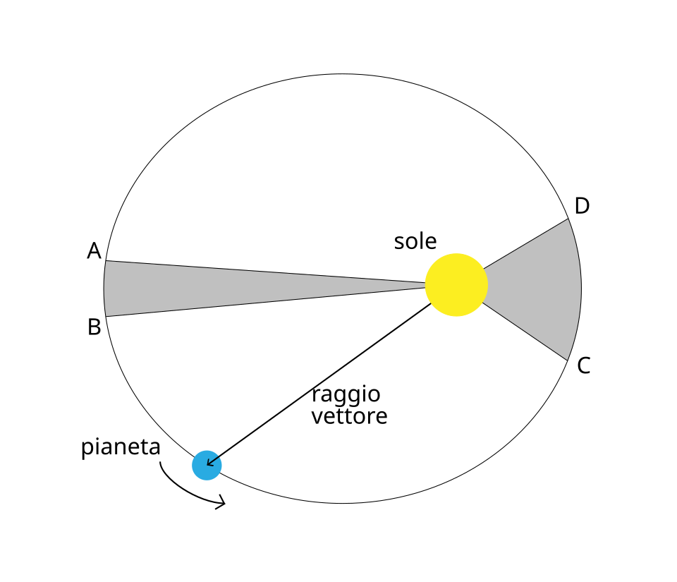

*케플러 2법칙 — 행성(pianeta)이 같은 시간에 쓸고 가는 회색 부채꼴 넓이는 항상 같다. sole=태양 (Wikimedia Commons, CC0)*

## 1687 프린키피아 — 운동의 세 법칙

모든 역학을 떠받치는 세 개의 진술. 각각 일상에서 그대로 확인된다.

| 법칙 | 내용 | 일상 예시 |
|---|---|---|
| 제1법칙 · 관성 | 힘이 없으면 정지는 정지로, 등속은 등속으로 유지된다 | 버스가 급정거하면 몸이 앞으로 쏠린다 — 몸은 하던 운동을 계속하는 중 |
| 제2법칙 · $F=ma$ | 가속도는 힘에 비례하고 질량에 반비례한다 | 같은 힘으로 밀어도 빈 카트는 잘 나가고, 짐을 가득 실은 카트는 굼뜨다 |
| 제3법칙 · 작용–반작용 | A가 B를 밀면, B도 A를 같은 크기로 되민다 | 로켓은 가스를 뒤로 밀고, 가스가 로켓을 앞으로 민다 — 허공에서도 가속하는 이유 |

셋 중 계산의 심장은 제2법칙이다 — 힘을 알면 가속도가, 가속도를 알면 다음 순간의 속도·위치가 나온다.

## 기술 방법의 본질 — 상태 + 법칙 = 미래

뉴턴의 방법은 식 두 개로 완결된다. 읽는 법이 중요하다.

$$\vec F = m\,\vec a, \qquad F = G\,\frac{m_1 m_2}{r^2}$$

$F=ma$ 읽기: 가속도는 힘의 **결과**이고, 질량은 변화에 대한 **저항**이다. 힘이 곧 운동의 원인이라는 선언이다. 만유인력 읽기: 질량 곱에 비례하고 거리 제곱에 반비례한다 — **사과·달·행성이 한 식**에 들어온다. 천상/지상의 구분이 여기서 소멸한다.

방법의 본질은 이것이다: **(지금의 위치·속도) + 힘의 법칙 → 다음 순간이 결정된다.** 이를 반복하면 미래 전체 — 운동이 미분방정식의 해가 된다. 그리고 케플러의 세 규칙(타원·면적·주기²∝크기³)은 이 두 식에서 전부 **계산으로 유도**된다. 패턴의 목록이 원인의 귀결로 다시 나오는 것이다.

## 낙하와 궤도는 같은 운동이다

뉴턴의 사고실험 — 산꼭대기 대포(『세계의 체계』 1728, 프린키피아 3권의 대중판 초고). 던지는 속도를 올려 보면 낙하와 궤도 사이에 경계가 없다.

느리게 쏘면 포물선을 그리며 떨어진다. 더 빠르면 더 멀리 가서 떨어진다. 어느 속도(약 7.9 km/s)부터는 **떨어지는 곡선이 지구가 굽는 정도와 같아져** — 계속 떨어지는데 영원히 땅에 닿지 않는다. 그것이 궤도다. 달도 정확히 이 상태다: 달은 사과처럼 지구를 향해 **떨어지는 중**이고, 옆으로 빠른 것뿐이다. 하나의 힘 법칙이 낙하·포물선·궤도를 전부 담는다 — 통일의 그림.

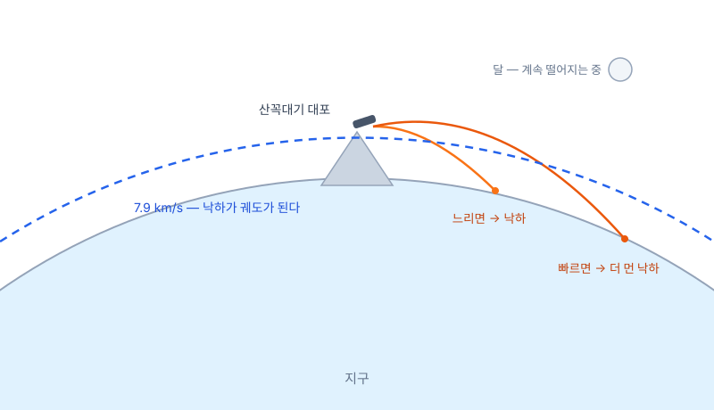

*산꼭대기 대포 — 발사 속도가 커질수록 포물선이 길어지다, 임계 속도에서 낙하가 궤도가 된다*

## 본 적 없는 것을 계산하다 (1758 · 1846)

이 기술 방법의 힘은 설명이 아니라 **예측**에서 드러났다 — 아직 일어나지 않은 일의 시각과 위치를 종이 위에서 내놓는다.

- **핼리 혜성**: 핼리가 1682년 혜성의 궤도를 뉴턴 법칙으로 풀어 "1758년에 돌아온다"고 공표했다. 두 사람 모두 죽은 뒤인 1758년 성탄절 밤, 혜성이 예고대로 나타났다.
- **해왕성**: 천왕성의 궤도가 계산과 미세하게 어긋났다. 르베리에는 오차를 일으킬 **미지 행성의 위치**를 역산해 편지로 보냈고, 베를린 천문대는 그날 밤 그 자리(1° 이내)에서 해왕성을 찾았다(1846).

관측을 따라가는 이론이 아니라, 관측을 **앞지르는** 이론 — 망원경이 아니라 계산이 행성을 발견했다.

> 같은 정밀도가 뒷날 균열도 드러낸다 — 수성 궤도의 미세한 초과 회전(43″/세기)은 이 방법으로 끝내 설명되지 않았다(5장).


---

# 3. 라그랑지안 역학 — 작용량, 같은 운동을 기술하는 두 번째 방법

---

## 빛은 가장 빠른 길을 고른다 — 물체도 그런가 (1662–1788)

출발점은 역학이 아니라 광학이다. 페르마(1662)가 보인 것: 빛이 물에서 꺾이는 각도는, 모든 후보 경로 중 **도착 시간이 가장 짧은 길**을 고른 결과와 정확히 같다. 굴절 법칙(스넬)이 각도 공식이 아니라 **하나의 극값 원리**에서 통째로 나온다 — "각도가 이렇다"에서 "이 양이 최소다"로.

자연스러운 질문이 따라온다: 빛이 무언가를 극값으로 만들며 간다면, **돌멩이의 포물선에도 그런 양이 있는가?** 모페르튀(1744)가 '작용'이라는 양을 제안하고, 오일러가 수학으로 다듬고, 라그랑주가 완성한다. 라그랑주의 『해석역학』(1788)은 서문의 유명한 선언대로 **그림이 한 장도 없는** 역학책이다 — 힘의 화살표 대신 식 하나로 역학 전체를 재구성했다.

## 경로마다 점수를 매긴다 — 작용

출발점과 도착점을 고정하고, 그 사이의 **모든 후보 경로**를 생각한다. 경로 하나마다 숫자 하나 — 작용 $S$ — 를 매긴다.

$$S = \int_{t_1}^{t_2} L\,dt,\qquad L = T - V, \qquad \delta S = 0$$

$L$ 읽기: 매 순간의 (운동에너지 − 위치에너지). $S$는 그것을 여행 내내 누적한 **채점표**다. $\delta S = 0$ 읽기: 실제 경로는 **이웃 경로로 살짝 바꿔도 $S$가 1차로 변하지 않는** 경로 — 극값(정확히는 정류점: 최소 또는 안장)에 있는 경로다.

힘·가속도라는 단어 없이, "자연은 작용이 극값인 경로를 고른다"는 한 문장이 역학의 전부가 된다.

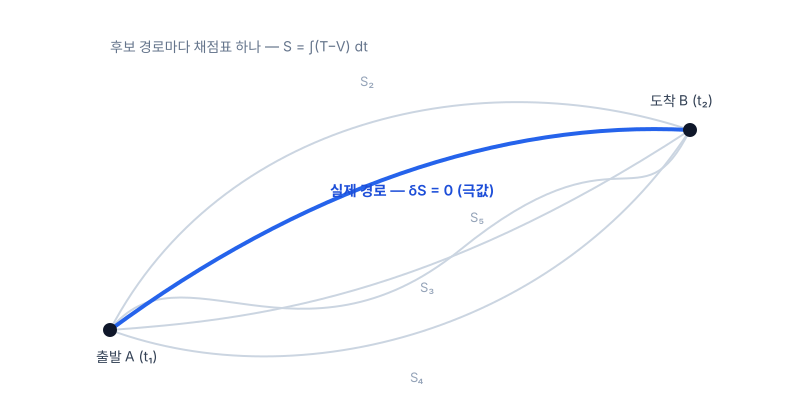

*A→B의 후보 경로들 — 각 경로에 S 하나씩. 실제 운동(굵은 선)은 S의 극값*

## 극값 조건을 식으로 — 그리고 F=ma와의 관계

"$S$가 극값"이라는 조건을 좌표마다 쓰면 방정식이 된다. 유도는 생략하고 읽는 법만.

$$\frac{d}{dt}\!\left(\frac{\partial L}{\partial \dot q}\right) - \frac{\partial L}{\partial q} = 0$$

읽기: 좌표 $q$ 하나마다 이 식이 하나 — 풀면 궤적 $q(t)$가 나온다. 뉴턴의 미분방정식과 같은 역할이다. 핵심 사실: 이 식은 $F=ma$와 **동일한 내용의 다른 언어**다. 같은 문제에 넣으면 같은 궤적이 나온다 — 예측이 다른 새 이론이 아니라, 같은 자연의 새 표기법이다.

그리고 $q$는 **아무 좌표나** 된다 — 직교좌표일 필요가 없고, 각도든 거리비든 문제에 맞는 것을 고르면 된다. 이 자유가 다음 절에서 위력을 보인다.

## 같은 진자, 두 언어

길이 $\ell$의 줄에 매달린 진자 — 두 방법의 차이가 가장 선명하게 갈리는 예제다.

**뉴턴으로 풀면**: 좌표 $x,y$ 두 개 + 줄의 장력 $T$(크기 미지, 방향은 매 순간 변함) + 구속조건 $x^2+y^2=\ell^2$ — 셋을 연립해야 한다. 장력은 **답에 필요 없는데 계산에는 필요한** 미지수다.

**라그랑주로 풀면**: 애초에 각도 $\theta$ 하나만 좌표로 잡는다.

$$L=\tfrac12 m\ell^2\dot\theta^2+mg\ell\cos\theta \;\;\Rightarrow\;\; \ddot\theta = -(g/\ell)\sin\theta$$

한 줄이다. **장력은 아예 등장하지 않는다** — 줄이 하는 일(구속)은 좌표 선택에 이미 녹아 있다. 물체가 많아지고 구속이 얽힐수록(로봇 관절·분자·행성계) 이 차이는 기하급수로 벌어진다.

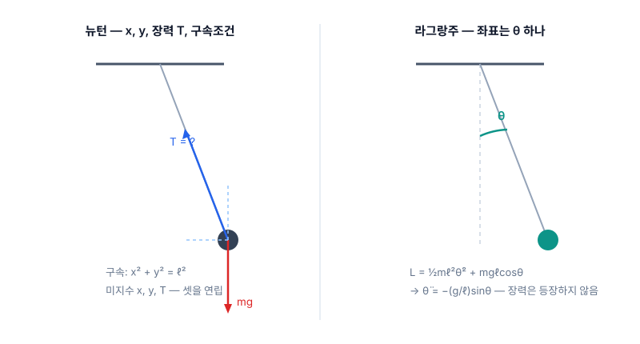

*같은 진자 — 왼쪽: 힘 벡터와 장력 분해(뉴턴), 오른쪽: 각도 θ 하나(라그랑주)*

## 무엇이 잘 보이는 언어인가

예측은 동일하다. 다른 것은 **무엇이 잘 보이는가**다.

| | 뉴턴 — 힘 | 라그랑주 — 작용 |
|---|---|---|
| 입력 | 힘 **벡터** — 방향 분해 필요 | 스칼라 $L=T-V$ **하나** |
| 좌표 | 사실상 직교좌표 중심 | 문제에 맞는 좌표를 **자유 선택** |
| 구속력(장력·수직항력) | 미지수로 함께 풀어야 함 | 좌표 선택에 흡수 — **자동 소거** |
| 대칭 | 식에서 잘 드러나지 않음 | $L$에 어떤 좌표가 **안 나타나면**, 그 짝 운동량이 자동 보존(순환좌표) |

마지막 줄이 이 장의 유산이다 — 작용의 언어에서는 **대칭과 보존의 관계가 눈에 보인다**. 6장에서 뇌터가 정확히 이 무대 위에서 판결한다.


---

# 4. 특수상대성이론 — 1905, 전자기의 의문에서 시공간까지

---

## 에테르, 그리고 아무것도 안 나온 실험 (1865–1887)

맥스웰(1865): 빛은 전자기 파동이고, 속도 $c$가 이론에서 상수로 나온다. 그런데 파동이라면 — **무엇의** 파동인가? 당시의 답은 우주를 채운 매질 **에테르**였고, $c$는 '에테르 기준'의 속도라고 해석됐다.

그렇다면 초속 30 km로 공전하는 지구에는 **에테르 바람**이 불어야 하고, 방향에 따라 빛의 속도가 $c\pm v$로 달라져야 한다. 마이컬슨–몰리(1887)는 직각 두 팔의 빛 왕복 시간차를 간섭무늬로 재는 장치를 만들었다 — 예상 효과의 1/40까지 잴 감도였다. 결과는 **0**. 방향을 돌려도 0 — 이후 수십 년의 반복 실험(계절을 바꿔도)마다 0이었다. (🔬 [간섭계 시뮬레이션](http://218.155.221.161:10101/physics-map/experiments/michelson-morley/index.html) — 발표자 로컬 실험실)

로런츠·피츠제럴드의 수습: "운동 방향 팔이 $\sqrt{1-v^2/c^2}$배로 줄어든다면 0이 설명된다." 수치는 맞지만 **왜 줄어드는지는 없는**, 결과에서 역산한 가설이었다.

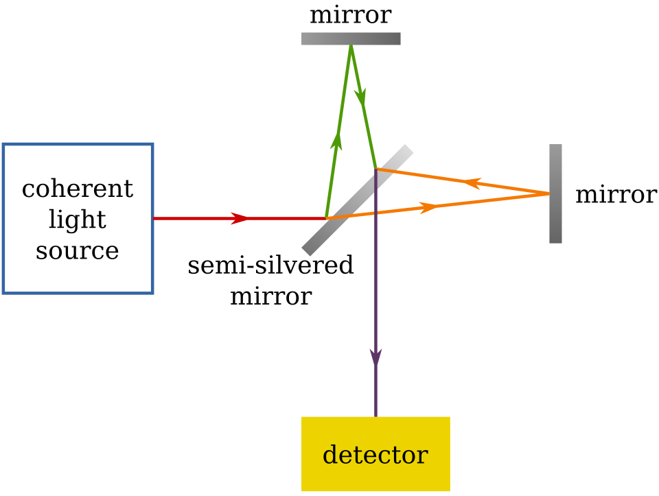

*마이컬슨 간섭계 개략 — 반은거울이 빛을 직각 두 팔로 가르고 다시 합친다; 두 팔의 시간차는 간섭무늬로 나타난다 (Wikimedia Commons, PD)*

## 「움직이는 물체의 전기역학에 관하여」 — 첫 문단의 불편

1905년 논문의 출발점은 실험 위기가 아니라, 전자기학이 하나의 현상에 **두 개의 다른 이야기**를 하고 있다는 불편이다.

| 관점 | 당시 전자기학의 설명 | 전기장의 존재 |
|---|---|---|
| 자석이 움직인다 | 변하는 자기장이 전기장을 **유도**하고, 그 전기장이 도체 속 전하를 민다 | 있다 |
| 도체가 움직인다 | 자기장은 변하지 않는다 — 움직이는 전하가 자기력 $q\vec v\times\vec B$를 받는다 | 없다 |

전류계 눈금은 **상대 속도만으로** 결정된다 — 관측은 하나인데 이론은 '누가 진짜 움직였나'에 따라 설명을 갈아탄다. 심지어 전기장의 존재 여부까지. 관측 불가능한 구분(절대 정지 기준)에 이론이 기대고 있다 — 아인슈타인은 이것을 이론이 잘못 세워진 신호로 읽었다.

> 논문 제목이 '전기역학'인 이유 — 시간·공간의 재정의는 이 전자기 퍼즐을 푸는 과정에서 나온 결과물이다.

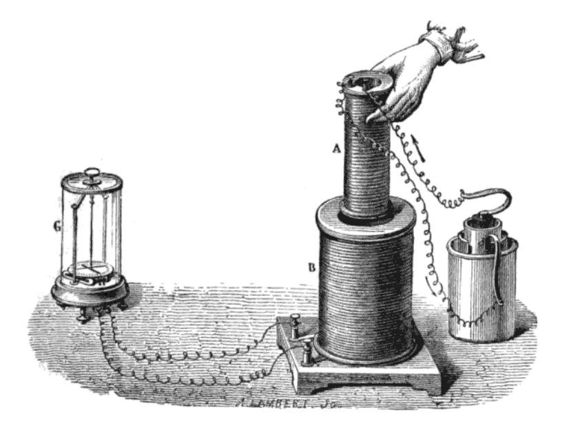

*전자기 유도 실험 판화(19세기) — 코일 A를 코일 B에 넣었다 빼면 검류계 G가 움직인다. 상대운동은 하나인데 설명은 둘이었다 (Wikimedia Commons, PD)*

## 고친 것은 전자기학이 아니라 전제 두 줄

아인슈타인의 처방은 이론 수리가 아니라, 물리 전체가 따라야 할 **공준 두 개**를 앞에 세우는 것이었다.

1. **상대성 원리** — 역학만이 아니라 전자기까지, 모든 물리 법칙은 모든 관성계에서 같은 꼴이다.
2. **광속 불변** — 진공에서 빛의 속도 $c$는 광원의 운동과 무관하게 누구에게나 같다.

공준 ①이 '자석이냐 도체냐'라는 질문 자체를 이론에서 지운다 — 남는 것은 상대 운동뿐이다. 공준 ②는 맥스웰의 상수 $c$를 특정 매질의 속도가 아니라 **모든 관측자의 사실**로 승격시킨다 — 에테르라는 특권 기준계가 불필요해지고, 마이컬슨–몰리의 0은 설명할 것도 없는 당연한 결과가 된다.

대가가 있다: 두 공준을 동시에 지키려면 **시간과 공간의 측정이 관측자마다 달라져야** 한다. 그 정량화가 다음 절들이다. 수축 가설과의 차이가 이 장의 요점이다 — 같은 수식이 나와도, 하나는 결과에 맞춘 보정이고 하나는 원리의 귀결이다.

## 두 공준만으로 시계를 늦추기 — 빛시계

두 거울 사이를 빛이 한 번 왕복하면 1틱 — 두 공준만 쓰는 가장 단순한 시계다.

$$\Delta t' = \gamma\,\Delta t,\qquad \gamma = \frac{1}{\sqrt{1-v^2/c^2}}$$

옆에서 보면 움직이는 시계의 빛은 **지그재그** — 경로가 더 길다. 그런데 속도는 똑같이 $c$(공준 ②)다. 그러므로 1틱이 더 오래 걸린다. **움직이는 시계는 느리게 간다.** 경로의 직각삼각형에 피타고라스 한 번이면 $\gamma$가 나온다 — 시간 지연은 신비가 아니라 기하다.

같은 논리를 진행 방향에 쓰면 **길이 수축** — 마이컬슨–몰리에서 임시 가설이던 그 수축이, 여기서는 공준의 귀결로 다시 나온다. (🔬 [빛시계 시뮬레이션](http://218.155.221.161:10101/physics-map/experiments/light-clock/index.html))

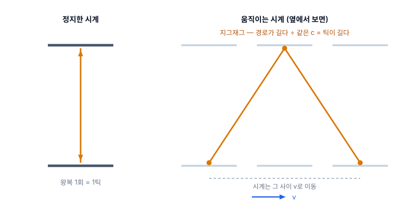

*정지 시계는 상하 왕복, 움직이는 시계는 지그재그 — 더 긴 경로 ÷ 같은 c = 더 긴 틱*

## 관점을 바꾸는 규칙 — 시간에 공간이 섞인다

두 공준과 양립하는 좌표 변환은 하나뿐이다. 읽는 법이 전부다.

$$t' = \gamma\left(t - \frac{v\,x}{c^2}\right),\qquad x' = \gamma\,(x - v\,t), \qquad u = \frac{u' + v}{1 + u'v/c^2}$$

$t'$ 식에 **위치 $x$가 들어 있다** — 새 관점의 시간이 옛 관점의 공간에 의존한다. 갈릴레이($t'=t$, 만인의 시계는 하나)와의 결별점이다. $v\ll c$면 $\gamma\to1$, $vx/c^2\to0$ — 뉴턴·갈릴레이로 복귀한다. 옛 역학은 폐기가 아니라 **저속 근사**로 생존한다.

속도 덧셈($u'$=우주선에서 잰 속도, $u$=지상에서 본 속도): $0.9c$ 우주선에서 $0.9c$로 쏘아도 $0.994c$ — 어떻게 쌓아도 $c$를 넘지 못한다. 확인: 대기 상층에서 생긴 뮤온(수명 2.2 μs)은 제 수명으로는 지표에 못 닿는데, $\gamma$ 덕에 실험실에서 일상적으로 검출된다.

## 자기력 = 전기력의 다른 단면 — 첫 의문이 닫힌다

이 장 두 번째 절의 비대칭이 여기서 해소된다. 전류가 흐르는 도선과, 나란히 달리는 시험전하를 보자.

실험실 관점: 도선은 +격자와 −전자의 밀도가 같아 **중성** — 달리는 전하가 받는 것은 자기력이다. 전하와 같이 달리는 관점: +와 −의 **속도가 서로 다르므로 길이 수축이 다르게** 걸린다 → 밀도가 어긋나 도선이 알짜 전하를 띤다 → 순수한 **전기력**이 민다.

같은 힘, 두 이름 — '전기장이 있는가'가 관점에 따라 갈리던 비대칭은, **전기와 자기가 한 장(field)의 두 단면**이라는 답으로 통일된다. 수축의 밀도 차는 극미하지만 도선 속 전자가 ~$10^{23}$개라 곱하면 손에 느껴지는 힘 — 상대론은 고속 전용이 아니라 **책상 위 자석에서 이미 작동 중**이다. (🔗 [인터랙티브: 속도 슬라이더로 인력↔척력 전환](http://218.155.221.161:10101/physics-map/theories/relativity.html))

## 민코프스키 ① — 시공간, 사건의 지도와 광원뿔 (1908)

민코프스키(1908): 관측자마다 다르게 쪼개지는 시간과 공간을 버리고, **둘을 합친 4차원**을 실체로 삼는다. 지도의 점 하나 = 사건(어디+언제).

$$s^2 = (ct)^2 - x^2$$

세로축을 $ct$로 잡으면 빛은 정확히 45° — 사건마다 **광원뿔**이 선다. 원뿔 안쪽 위는 영향을 줄 수 있는 **미래**, 아래는 영향을 받을 수 있었던 **과거**, 바깥은 인과가 불가능한 **다른곳** — 그 영역의 사건은 시간 순서조차 관측자마다 다르다(동시성의 상대성이 그림 한 장에 담긴다).

$s^2$ 읽기: 피타고라스의 $+$가 $-$로 바뀐 거리 — 이 **마이너스 부호 하나**가 시공간 기하의 전부다. 관측자마다 $t$와 $x$는 다르게 재지만, 조합 $s^2$만은 **모두가 같은 값**을 얻는다(불변량).

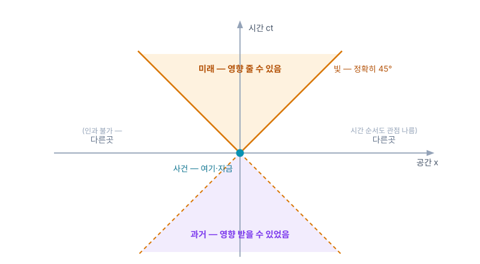

*광원뿔 — 빛(45°)이 모든 사건을 미래·과거·다른곳으로 삼분한다*

## 민코프스키 ② — 불변량으로 생각하기, 그리고 다음 장의 무대

민코프스키가 바꾼 것은 그림이 아니라 **사고방식**이다: 관점마다 달라지는 양이 아니라, 모두가 합의하는 양으로 물리를 쓴다.

| 관점에 따라 달라짐 | 모두가 합의(불변량) |
|---|---|
| 시간 간격 $t$ · 거리 $x$ | 시공간 간격 $s^2$ |
| 동시성(무엇이 '같은 순간'인가) | 광속 $c$ · 인과 순서(원뿔 안) |
| 에너지 $E$ · 운동량 $p$ 각각 | 정지질량 (둘의 조합) |

로런츠 변환의 정체는 $s^2$를 보존하는 시공간의 **'회전'**이다 — 평면 회전이 거리²를 보존하는 것의 시공간판. 아인슈타인은 처음 이 기하화를 불필요한 수학 치장으로 여겼다 — 그러나 **중력을 넣으려는 순간, '휠 수 있는 무대'가 필요해진다**. 기하로 쓰여 있어야 구부릴 수 있다. 5장의 무대가 여기서 준비된다.

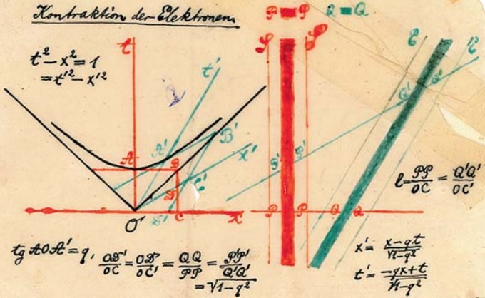

*민코프스키의 1908년 강연 원판 슬라이드 — t²−x²=1 쌍곡선과 두 관성계의 축 (Wikimedia Commons, PD)*

## 부록 — E = mc², 석 달 뒤의 후속 논문 (1905년 9월)

「물체의 관성은 에너지 함량에 의존하는가?」 — 본 논문의 귀결을 밀어붙인 3쪽짜리 부록. 빛을 방출한 물체는 그만큼 가벼워진다는 논증에서 나온다.

$$E = m\,c^2$$

읽기: 질량은 에너지의 한 **형태**이고, $c^2$은 둘 사이의 **환율**이다 — 1 g ↔ $9\times10^{13}$ J.

- 확인 ① 질량 결손: 원자핵의 질량은 구성 핵자 질량의 합보다 **가볍다** — 모자란 만큼이 결합 에너지($\Delta m\,c^2$). 질량분석기로 일상적으로 측정되는 사실.
- 확인 ② 태양은 초당 약 430만 톤을 빛으로 바꿔 방출하며 가벼워지는 중이다.
- 확인 ③ 전자–양전자 쌍소멸은 정확히 $2\times511$ keV의 빛을 낸다 — 질량이 통째로 에너지가 되는 사건.

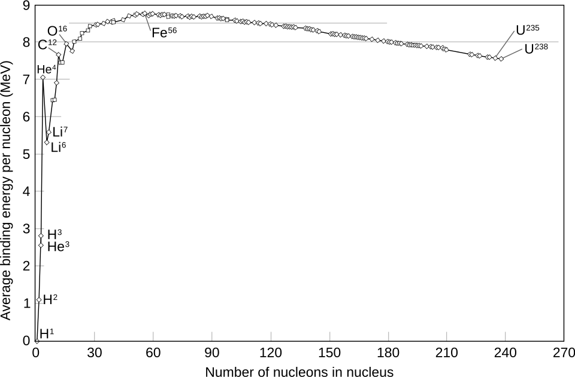

*핵자당 결합에너지 곡선 — 융합·분열에서 사라지는 질량이 E=mc²의 에너지로 나온다 (Wikimedia Commons, PD)*


---

# 5. 일반상대성이론 — 1907–1915, 중력을 힘에서 시공간의 모양으로

---

## 특수상대성이 남긴 두 개의 의문 (1905 직후)

이론을 완성하자마자 두 가지가 어긋나 있었다 — 하나는 중력, 하나는 이론 자신의 전제.

- **의문 ① 중력이 안 들어온다**: 뉴턴의 만유인력은 거리만의 함수다 — 태양이 지금 사라지면 지구 궤도가 **그 순간** 반응해야 한다. 그러나 방금 세운 이론은 어떤 영향도 $c$를 넘지 못한다고 못박았다. 중력만 상대성 밖에 남았다.
- **의문 ② 왜 관성계만 특별한가**: 등속끼리는 평등하다고 해놓고, 가속은 여전히 절대적인가? '특별한 관점의 클럽'이 남아 있다는 것 자체가 찜찜했다.

두 의문이 한 지점을 가리킨다 — 중력과 가속을 함께 다룰 수 있는 더 큰 틀.

## 가장 행복한 생각 — 떨어지는 사람은 무게가 없다 (1907)

특허국 의자에서의 착상: **지붕에서 떨어지는 사람은 자기 무게를 느끼지 못한다.** 손에서 놓은 물건은 곁에 둥둥 떠 있다.

자유낙하라는 관점을 고르면 중력이 **지워진다**. 반대로, 무중력 우주에서 9.8 m/s²로 가속하는 방 안은 지구의 방과 **구별할 수 없다** — 공을 던지면 포물선을 그리고, 저울은 눌린다. 이것이 **등가원리**다: 국소적으로 중력 = 가속. 중력은 관점 선택으로 만들 수도, 지울 수도 있는 것이었다.

관점 하나로 지워지는 것을 '진짜 힘'이라 부를 수 있는가 — 중력의 힘 자격에 대한 의심이 여기서 시작된다.


*구별 불가능한 두 방 — 지구 위에 선 방과 9.8 m/s²로 가속하는 방*

## 모두가 같은 궤적 — 그렇다면 무대의 성질이다

결정적 단서는 중력의 오래된 특징에 있었다: **중력은 물체가 무엇인지 묻지 않는다.**

진공에서 깃털과 쇠공은 같이 떨어진다 — 아폴로 15호(1971)가 달에서 망치와 깃털로 실연했다. 전기력은 전하/질량 비에 따라 물체마다 다르게 가속시킨다. **중력만이 예외** — 조성·질량과 무관하게 전원 같은 궤적이다.

추론: 궤적이 여행자와 무관하다면, 그 궤적은 물체의 성질이 아니라 **길 — 무대(시공간) — 의 성질**이다. 그리고 자연 상태가 재정의된다: **자유낙하가 힘 0의 상태**다(떨어지는 동안 저울은 0을 가리킨다). 오히려 땅에 서 있는 지금이 발바닥이 밀어 올리는 힘을 받는 상태다.

## 휘는 것의 주역은 공간이 아니라 시간이다

가속 로켓에서 꼬리의 시계는 머리보다 느리게 간다(빛 신호의 도플러로 유도된다). 등가원리로 번역하면 — **낮은 곳의 시계는 느리다.**

지표에서 높이 1 m당 시계 빠르기 차이는 비율로 ~$10^{-16}$ — 현대 광시계는 이 차이를 직접 분해한다. 이 티끌 같은 기울기가 낙하의 주역이다: 시간축의 환산 배율이 $c$라서, $c^2\times(g/c^2) = g = 9.8\,\mathrm{m/s^2}$ — 정확히 맞아떨어진다.

일상 중력에서 공간의 휨은 부차적이다 — '고무판 위의 공' 그림이 놓치는 지점이 바로 이것이다. 여기까지의 그림: 물체는 힘을 받는 게 아니라, **시계·자의 눈금이 장소마다 다른 무대** 위에서 제 갈 길(직진)을 갈 뿐이다.


*높이마다 다른 시계 빠르기 — 낮을수록 느리다. 이 기울기가 곧 중력*

## 무대를 구부리는 수학 — 그리고 두 번의 시도 (1912–1915)

중력이 시계와 자를 바꾼다면, 그것은 힘이 아니라 **기하**다. 그리고 기하를 구부리려면 4장의 민코프스키 언어가 전제였다.

- 1912 취리히: 친구 그로스만이 리만의 휜 공간 기하학(1854)을 소개한다 — 휜 공간을 다루는 수학이 이미 있었다.
- 1913 초안(Entwurf): '모든 좌표계에서 같은 꼴'이라는 요구를 **포기한 절충안** — 이 식으로 수성의 초과 세차를 계산하니 43″가 아니라 18″. 실패.
- 1915년 11월: 요구를 복원한 최종 방정식 — 한 달 사이 네 편의 논문으로 완성된다.

4장의 다리가 여기서 회수된다: 아인슈타인이 처음 무시했던 민코프스키의 기하화가, 구부릴 수 있는 무대의 **전제 조건**이었다.

## 장방정식 — 읽는 법

유도 없이, 각 부분이 무엇인지만 정확히 읽는다.

$$G_{\mu\nu} = \frac{8\pi G}{c^{4}}\,T_{\mu\nu}$$

| 부분 | 정체 | 읽기 |
|---|---|---|
| 좌변 $G_{\mu\nu}$ | 시공간 곡률(기하) | 첨자 $\mu\nu$는 시간·공간 4방향의 짝 — 대칭 4×4, 실은 **식 10개의 묶음** |
| 우변 $T_{\mu\nu}$ | 에너지·운동량 장부(원천) | 질량만이 아니라 **에너지 밀도·흐름·압력**까지 전부 그 지점의 중력원 |
| 상수 $8\pi G/c^4$ | 환율 | 약한 중력에서 뉴턴 법칙으로 복귀하도록 보정 — 분모의 $c^4$: 시공간은 **지독히 뻣뻣**하다(중력파 검출에 $10^{-18}$ m 정밀도가 필요했던 이유 — LIGO 2015) |

한 줄 읽기: **물질·에너지의 분포가 곡률을 정하고, 물체는 그 휜 무대에서 힘 없이 직진한다** — 낙하·궤도는 그 직진의 겉모습이다.

## 피팅이 아니라 제약의 교차점 — 그래서 시험할 수 있었다

이 식은 현상에 맞춰 조정된 것이 아니다. 네 개의 요구가 꼴을 거의 유일하게 못박았고, 관측이 들어간 곳은 상수 하나뿐이다: 모든 좌표계에서 같은 꼴 · 계량의 2계 미분까지 · 보존이 자동으로 성립하는 조합 · 약한 중력에서 뉴턴 복귀(상수 보정 — 유일한 관측 입력). 조정할 손잡이가 없다는 것은 **실패할 수 있다**는 뜻이고, 그래서 검증이 의미를 가진다.

- **수성 43″/세기**: 완성 와중(11월 18일 수성 논문)에 계산해 보니 그대로 나왔다 — 입력이 아니라 **출력**. 심계항진이 왔다고 적었고, 며칠간 기쁨에 넋이 나가 있었다는 회고가 남아 있다.
- **1919 일식(에딩턴)**: 별빛 휨 1.75″ — 뉴턴식 계산의 정확히 2배 쪽이 관측됐다.
- **중력 적색편이**: 높이에 따른 시계 차 — 뫼스바우어 효과로 실측된다. (🔬 [뫼스바우어 효과](http://218.155.221.161:10101/physics-map/experiments/mossbauer-effect/index.html))
- **GPS**: 위성 시계는 하루 38 μs 어긋난다 — 보정 없이는 하루에 km급 오차.


*1919년 5월 29일 개기일식 원판(에딩턴 원정) — 태양 곁 별빛의 이동이 1.75″ 예측과 일치 (Dyson·Eddington·Davidson 1920, PD)*

## 승리의 한복판에서 — 에너지 보존이 이상하다

이론은 완성됐고 검증도 통과했다. 그런데 완성 직후부터, **에너지 보존** 자리에서 이상한 일들이 발견된다.

- 우변 $T$에는 물질·전자기의 에너지가 다 있는데, **중력장 자신의 에너지 칸이 없다** — 그럼 중력파가 나르는 에너지는 어느 장부에 적나?
- 아인슈타인의 보완 장치(의사텐서)는 **좌표를 바꾸면 값이 생기고 사라졌다** — 중력이 전혀 없는 평평한 시공간에서 에너지가 찍히기도 하고(바우어), 별 주위 어디서나 0이 되기도 했다(슈뢰딩거). 좌표 선택에 흔들리는 양은 물리량이 아니다.
- 클라인의 해부: 그 '보존 법칙'을 뜯어 보니 **위반이 불가능하게 짜인 항등식** — 1+1=2처럼 무조건 참이라, 세계에 대해 아무것도 말하지 않는 식이었다.
- 힐베르트의 직감: 이것은 계산 실수가 아니라 **이런 종류의 이론이 갖는 구조적 특징**이다 — 문제는 물리학자의 손을 떠나 수학자의 문제가 된다.

> 법칙은 어겨질 수 있어야 정보를 담는다 — 자동으로 참인 문장은 대체 무엇을 '보존'하고 있는가? 이 질문을 들고 6장으로 간다.


---

# 6. 뇌터의 정리 — 1918, 보존이라는 개념에 대한 판결

---

## 수학자를 부르다 (1915 괴팅겐)

5장의 마지막 질문 — 자동으로 참인 보존식은 무엇을 보존하는가 — 은 방정식 풀이가 아니라 **식의 신분 감별** 문제였다. 힐베르트와 클라인은 그 감별의 전문가를 데려온다.

에미 뇌터 — **불변량 이론**(변환해도 변하지 않는 양의 수학) 전문가. 1915년 괴팅겐으로 초빙된다. 당시 프로이센 대학은 여성에게 교수 자격을 주지 않았다 — 수년간 힐베르트 이름으로 공고된 강의를 대신 진행하며 연구했다. 위임된 문제는 일반 공변 이론에서 에너지 보존의 지위였고, 답은 1918년 논문 「Invariante Variationsprobleme」 — **정리 두 개**로 돌아온다.

무대는 3장에서 준비된 그 언어다 — 작용 $S$와 $\delta S=0$. 대칭을 말할 수 있는 언어여야 대칭을 판결할 수 있다.

시간 관계에 주의할 것: 초빙(1915년 초)은 GR 완성(1915년 11월) 전이다 — 불변량 이론 조력이 먼저였고, 에너지 문제 위임은 1916–18년에 구체화됐다.

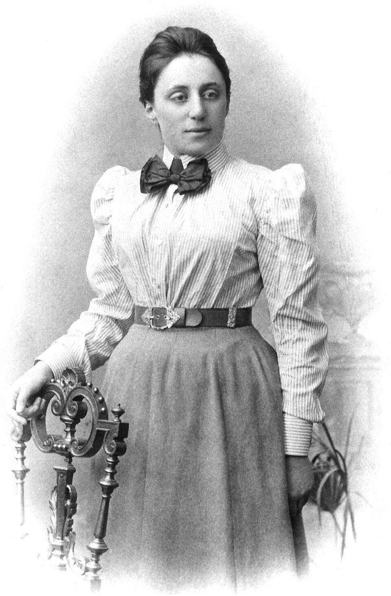

*에미 뇌터(1882–1935) (Wikimedia Commons, PD)*

## 정리 I — 연속 대칭 하나마다 보존량 하나

진술: 작용을 바꾸지 않는 **연속 변환**(대칭)이 하나 있을 때마다, 시간이 흘러도 변하지 않는 양(보존량)이 하나씩 반드시 따라 나온다.

| 대칭 — 무엇을 해도 물리가 같은가 | 따라 나오는 보존량 |
|---|---|
| 시간을 옮겨도 (오늘의 물리 = 내일의 물리) | 에너지 |
| 공간을 옮겨도 (여기 = 저기, 3방향) | 운동량 |
| 방향을 돌려도 (3축) | 각운동량 |
| 등속 관점으로 갈아타도 (부스트, 3방향) | 질량중심의 등속 운동 |

수백 년간 **개별 증명**으로 쌓여 있던 역학의 보존량 목록이, '10개 대칭의 10개 그림자'로 한 번에 정리된다. 처음으로 '**왜** 보존되는가'에 답이 생겼다 — 무대가 그 방향으로 균일하기 때문이다.

(세부: 갈릴레이 부스트는 작용이 전미분만큼 변하는 준대칭이다 — 발산 항을 허용하는 확장은 Bessel-Hagen 1921. 상대론 무대에서는 문제없다.)

## 증명의 뼈대 한 컷 — 대칭 다이얼을 흔들어 본다

대칭을 **일정하게** 돌리는 대신, 시간에 따라 흔들어 본다($\theta(t)$). 두 사실이 충돌하며 보존이 튀어나온다.

1. 대칭의 정의상, 작용은 다이얼의 **값**에는 반응하지 못한다 — 일정량 돌리기는 아무 흔적이 없다.
2. 그러므로 흔들 때 작용이 반응할 수 있는 것은 **돌리는 속도 $\dot\theta$**뿐 — 그 반응의 계수를 $Q$라 부르자: $\delta S = \int Q\,\dot\theta\,dt$.
3. 그런데 실제 경로에서는 어떤 변형에도 $\delta S = 0$이다(3장). 임의의 흔들기에 반응이 0이려면 길은 하나뿐: $\dot Q = 0$. **$Q$는 보존된다.**

3장의 작용 언어가 여기서 필수 부품이 된다 — 힘의 언어에는 이 논증을 놓을 자리가 없다.

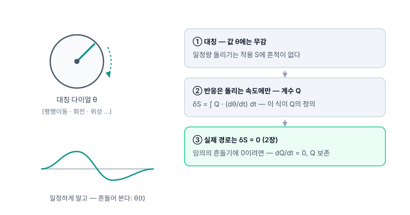

*값에는 무감(대칭) + 속도 반응도 금지(δS=0) → 계수 Q는 상수일 수밖에*

## 정리 II — 5장의 수수께끼에 대한 판결

두 번째 정리는 대칭의 **종류**를 가른다 — 우주 전체를 한꺼번에 돌리는가, 장소마다 제각각 돌릴 수 있는가.

| 대칭의 종류 | 보존법칙의 신분 |
|---|---|
| **대역** — 우주 전체를 한꺼번에 (시간 이동·회전 …) | 진짜 보존법칙 — 어겨질 수 있는데 성립한다 (정보 있음) |
| **국소** — 장소·시각마다 제각각 (일반상대성의 좌표 자유) | 보존식이 **자동 성립하는 항등식**이 된다 (위반 불가 — 내용 없음) |

판결: 5장에서 본 상황 — 보존식이 1+1=2가 되어버린 것 — 은 결함도 실수도 아니고, **국소 대칭을 가진 이론이면 반드시 그렇게 되는 필연**이다.

그리고 에너지 보존이 재정의된다: 에너지 보존은 자연의 공리가 아니라 **시간-이동 대칭이 있는 무대에서만 성립하는 조건부 개념**이다 — 시간에 따라 변하는 무대(팽창하는 우주)에서는 대역 보존량 자체가 정의되지 않는다.

판결의 두 얼굴: 불가능 증명(좌표에 정직한 국소 중력 에너지는 존재할 수 없다 — 찾기를 멈춰라) + 구제(대칭이 살아 있는 무대에서는 보존이 돌아온다).

## 파급 — 다음 이야기의 예고

이 정리의 사정거리는 GR의 한 문제를 훌쩍 넘는다. 상세는 다음 세미나의 몫 — 여기서는 방향만.

- 파동함수의 위상을 **전체적으로** 돌려도 물리는 불변 — 그 대칭이 뇌터 기계를 지나면 **전하 보존**이 나온다.
- 같은 대칭을 **장소마다 제각각** 허용하라고 요구하면, 그것을 가능하게 하는 장이 강제로 등장한다 — 그 장이 **전자기장**이다(게이지 원리).
- 이 요구를 다른 대칭에 반복하면 약력·강력 — **표준모형은 대칭 세 개의 선택**이다.
- 설계 원리의 역전: '보존량을 관찰하고 신성시한다'에서 '**대칭을 고르면 보존과 힘이 따라온다**'로 — 20세기 물리학의 문법이 된다.


---

# 7. 참고문헌 (References)

---

전 챕터 공유. 본문의 사실·수치·연도는 아래 원전과 표준 문헌 기준이며, 게시 전 역사·수치 전수 교차검증(독립 팩트체크)을 거쳤다.

1. I. Newton, *Philosophiæ Naturalis Principia Mathematica* (1687). — 세 법칙·만유인력. 산꼭대기 대포 사고실험 도판은 사후 출간 『세계의 체계(A Treatise of the System of the World)』(1728, 프린키피아 3권의 대중판 초고).
2. J.-L. Lagrange, *Mécanique analytique* (1788). — "그림이 한 장도 없는" 역학.
3. A. Einstein, "Zur Elektrodynamik bewegter Körper" (움직이는 물체의 전기역학에 관하여), *Ann. Phys.* 17, 891 (1905).
4. A. Einstein, "Ist die Trägheit eines Körpers von seinem Energieinhalt abhängig?" (물체의 관성은 에너지 함량에 의존하는가?), *Ann. Phys.* 18, 639 (1905).
5. H. Minkowski, "Raum und Zeit" (공간과 시간), 쾰른 자연과학자·의사 대회(80차) 강연 (1908).
6. A. Einstein, "Die Feldgleichungen der Gravitation" (1915) · "Die Grundlage der allgemeinen Relativitätstheorie", *Ann. Phys.* 49 (1916).
7. E. Noether, "Invariante Variationsprobleme", *Nachr. Ges. Wiss. Göttingen* (1918). — 정리 I·II.
8. C. Misner, K. Thorne, J. A. Wheeler, *Gravitation* (1973). — 장방정식·등가원리 표준 교과서.

## 도판 출처

본문·덱의 외부 도판은 전부 퍼블릭 도메인(PD) 또는 CC0이며, 로컬 파일로 포함되어 있다(`ppt/assets/img/ext/`). 각 도판의 출처·라이선스는 슬라이드·본문 캡션에 개별 표기.

- 케플러 2법칙 면적 도판 — Wikimedia Commons (CC0)
- 핼리 혜성 1986 사진 — W. Liller / NASA (PD)
- 마이컬슨 간섭계 개략도 — Wikimedia Commons (PD)
- 전자기 유도 실험 판화(19세기) — Wikimedia Commons (PD)
- 민코프스키 1908 강연 원판 도면 — Wikimedia Commons (PD)
- 핵자당 결합에너지 곡선 — Wikimedia Commons (PD)
- 1919년 개기일식 원판 — Dyson·Eddington·Davidson (1920) (PD)
- 에미 뇌터 사진 — Wikimedia Commons (PD)
- 그 외 도식(대포·작용 경로·진자·빛시계·광원뿔·엘리베이터·시계 기울기·다이얼) — 자체 제작 SVG

## 실험 시뮬레이션 링크에 관하여

본문의 🔬 링크(마이컬슨–몰리·빛시계·뫼스바우어 등)는 발표자의 로컬 실험실(물리학 지도 허브)로 연결된다 — 외부 네트워크에서는 열리지 않을 수 있다. 발표 덱(`ppt/index.html`)은 그 링크 없이도 자체 완결로 열람 가능하다.

